# Optimal Plan Execution Order

Cross-dependency analysis from subagent extraction. Use for foreground/background subagent orchestration.

---

## 1. Dependency DAG (Mermaid)

```mermaid
%%{init: {"theme":"dark"}}%%
flowchart TD
  subgraph root ["cursor-drive-v1"]
    cd["root"]
  end

  subgraph phase0 ["Phase 0 — Foundation (no deps)"]
    terminology["terminology-sas-overhaul"]
    mcp_apps["mcp-apps-implementation"]
    drive_mode["drive-mode-full-build"]
    repo_health["repo-health-and-cleanup"]
    plan_gov["plan-governance"]
    voice["voice-wake-word"]
    orch["orchestration"]
    adr["adr-prd-audit-and-graph"]
    readme["readme-redesign"]
    cloudflare["cloudflare-setup-phases"]
    push_repo["push-repo-and-develop-branch"]
    remove_push["remove-github-push-code"]
    using["using-cursor-drive"]
    ext_reinstall["extension-reinstall-automation"]
    cursor_impl["cursor-drive-implementation"]
    automation["automation-plugin-strategy"]
    agent_skills["agent-skills-review"]
    cursor_prim["cursor-primitives-complete-bootstrap"]
    pr_merge["pr-merge-workflow-primitives"]
    chat_mem["chat-memory-proceed"]
    security["security-review-structure"]
  end

  subgraph phase1 ["Phase 1 — After terminology + mcp-apps"]
    agent_screen["agent-screen-implementation"]
    s_as["s-as-execution-command-discovery"]
  end

  subgraph phase2 ["Phase 2 — After drive-mode"]
    tangent["tangent-agent-ux-features"]
  end

  subgraph phase3 ["Phase 3 — After cursor-drive-implementation"]
    optimizer["cursor-drive-automation-optimizer"]
  end

  subgraph hierarchy ["Parent-child (internal)"]
    plan_gov --> plans_audit["plans-audit-and-cleanup"]
    voice --> voice_feat["voice-features"]
    orch --> orch_hooks["orchestration-and-hooks"]
  end

  cd --> phase0

  terminology --> agent_screen
  terminology --> tangent
  terminology --> s_as

  mcp_apps --> agent_screen

  drive_mode --> tangent

  cursor_impl --> optimizer
  cursor_impl --> using

  push_repo --> pr_merge

  agent_screen -.->|"conflict: agentScreen.ts"| s_as

  classDef phase0Style fill:#2d5016,stroke:#4ade80
  classDef phase1Style fill:#1e3a5f,stroke:#60a5fa
  classDef phase2Style fill:#4c1d95,stroke:#a78bfa
  classDef conflictStyle stroke:#ef4444,stroke-width:3px
  class agent_screen,s_as conflictStyle
```



---

## 2. Logical Dependencies (A → B)

| A (must complete first) | B (depends on A) | Reason |
|-------------------------|------------------|--------|
| terminology-sas-overhaul | agent-screen-implementation | Config keys `cursorDrive.agentScreen.*` |
| terminology-sas-overhaul | tangent-agent-ux-features | `cursorDrive.operators.namePool` |
| terminology-sas-overhaul | s-as-execution-command-discovery | Command renames (showAgentScreen, focusAgentView) |
| mcp-apps-implementation | agent-screen-implementation | Phase 3B edits `agentScreenApp.ts`; MCP Apps creates it |
| drive-mode-full-build | tangent-agent-ux-features | approvalGates, glossaryExpander |
| cursor-drive-implementation | cursor-drive-automation-optimizer | Optimizer refactors implementation code |
| cursor-drive-implementation | using-cursor-drive | Guide documents the built extension |
| push-repo-and-develop-branch | pr-merge-workflow-primitives | develop branch must exist first |

---

## 3. Conflict Risks (coordinate or sequence)

| Plan A | Plan B | Conflict | Resolution |
|--------|--------|----------|------------|
| agent-screen-implementation | s-as-execution-command-discovery | Both edit `src/agentScreen.ts` | Run one before the other; avoid parallel edits |

---

## 4. Optimal Execution Phases

### Phase 0 — Parallel (no cross-plan deps)

Run in parallel via background subagents:

| Plan | Subagent | Notes |
|------|----------|------|
| terminology-sas-overhaul | A1 | Blocks agent-screen, tangent, s-as |
| mcp-apps-implementation | A2 | Blocks agent-screen Phase 3B |
| drive-mode-full-build | A3 | Blocks tangent |
| repo-health-and-cleanup | A4 | Independent |
| plan-governance | A5 | Child: plans-audit-and-cleanup |
| voice-wake-word | A6 | Child: voice-features |
| orchestration | A7 | Child: orchestration-and-hooks |
| adr-prd-audit-and-graph | A8 | Independent |
| readme-redesign | A9 | Independent |
| cloudflare-setup-phases | A10 | Phases 1–4 internal order |
| push-repo-and-develop-branch | A11 | Blocks pr-merge |
| remove-github-push-code | A12 | Independent |
| security-review-structure | A13 | Independent |
| cursor-drive-implementation | A14 | Blocks optimizer, using-cursor-drive |
| automation-plugin-strategy | A15 | Independent |
| agent-skills-review | A16 | Independent |
| extension-reinstall-automation | A17 | Independent |
| cursor-primitives-complete-bootstrap | A18 | Overlap: verifier.md with automation |
| chat-memory-proceed | A19 | Uses plan-runner, registry |
| using-cursor-drive | — | Wait for cursor-drive-implementation |

**Gate:** All Phase 0 plans complete before Phase 1.

---

### Phase 1 — After terminology + mcp-apps

**Foreground:** terminology-sas-overhaul, mcp-apps-implementation (from Phase 0) must be done.

**Parallel (choose one strategy):**

- **Strategy A (sequential):** agent-screen-implementation → s-as-execution-command-discovery (avoids agentScreen.ts conflict)
- **Strategy B (sequential):** s-as-execution-command-discovery → agent-screen-implementation
- **Strategy C (merge):** Combine agent-screen + s-as into one plan; resolve agentScreen.ts edits in single pass

**Recommendation:** Strategy A — agent-screen first (Phase 3B needs agentScreenApp from mcp-apps; s-as can extend after).

---

### Phase 2 — After drive-mode-full-build

**Foreground:** drive-mode-full-build complete.

**Parallel:**

- tangent-agent-ux-features (uses approvalGates, glossaryExpander from drive-mode)

---

### Phase 3 — After cursor-drive-implementation

**Foreground:** cursor-drive-implementation complete.

**Parallel:**

- cursor-drive-automation-optimizer
- using-cursor-drive (docs/guide)

---

### Phase 4 — After push-repo-and-develop-branch

**Foreground:** push-repo-and-develop-branch complete (develop exists).

**Parallel:**

- pr-merge-workflow-primitives

---

## 5. Foreground vs Background Subagent Strategy

| Role | When | Plans |
|------|------|-------|
| **Foreground** | User-facing; critical path; blocks others | terminology, mcp-apps, drive-mode, cursor-drive-implementation, push-repo |
| **Background** | Can run in parallel; no user wait | repo-health, plan-gov, voice, orchestration, adr, readme, cloudflare, remove-push, security, automation, agent-skills, ext-reinstall, cursor-primitives, chat-memory |
| **Sequential after gate** | agent-screen, s-as (one then other); tangent; optimizer; pr-merge; using-cursor-drive |

---

## 6. File Overlap Matrix (high-risk)

| File | Plans | Risk |
|------|-------|------|
| `src/agentScreen.ts` | agent-screen-implementation, s-as-execution-command-discovery | **High** — sequential or merge |
| `src/agentScreenApp.ts` | mcp-apps-implementation, agent-screen-implementation | **Resolved** — mcp-apps creates; agent-screen extends |
| `src/mcpServer.ts` | agent-screen, mcp-apps, s-as, tangent, terminology | **Medium** — coordinate merges |
| `src/extension.ts` | agent-screen, mcp-apps, terminology | **Medium** — coordinate merges |
| `package.json` | All plans | **Low** — merge config keys |
| `.cursor/agents/verifier.md` | automation-plugin-strategy, cursor-primitives-complete-bootstrap | **Medium** — one defines; other may overwrite |

---

## 7. Missing dependsOn (to add to frontmatter)

Add these to plan frontmatter for plan-runner and graph consistency:

| planId | dependsOn |
|--------|-----------|
| agent-screen-implementation | [terminology-sas-overhaul, mcp-apps-implementation] |
| tangent-agent-ux-features | [terminology-sas-overhaul, drive-mode-full-build] |
| s-as-execution-command-discovery | [terminology-sas-overhaul, agent-screen-implementation] |
| cursor-drive-automation-optimizer | [cursor-drive-implementation] |
| using-cursor-drive | [cursor-drive-implementation] |
| pr-merge-workflow-primitives | [push-repo-and-develop-branch] |

---

## 8. Quick Reference: Run Order

```
Phase 0 (parallel): terminology, mcp-apps, drive-mode, repo-health, plan-gov, voice, orch, adr, readme, cloudflare, push-repo, remove-push, security, cursor-impl, automation, agent-skills, ext-reinstall, cursor-prim, chat-memory

Phase 1a: agent-screen-implementation  (after terminology, mcp-apps)
Phase 1b: s-as-execution-command-discovery  (after agent-screen; dependsOn enforces order)

Phase 2: tangent-agent-ux-features  (after drive-mode)

Phase 3: cursor-drive-automation-optimizer, using-cursor-drive  (after cursor-impl)

Phase 4: pr-merge-workflow-primitives  (after push-repo)
```

---

## 9. Subagent Execution Playbook

### Foreground (user waits; critical path)

1. **terminology-sas-overhaul** — unblocks agent-screen, tangent, s-as
2. **mcp-apps-implementation** — unblocks agent-screen Phase 3B
3. **drive-mode-full-build** — unblocks tangent
4. **agent-screen-implementation** — unblocks s-as (avoids agentScreen.ts conflict)
5. **cursor-drive-implementation** — unblocks optimizer, using-cursor-drive
6. **push-repo-and-develop-branch** — unblocks pr-merge

### Background (parallel; mcp_task run_in_background or separate sessions)

- repo-health-and-cleanup, plan-governance, voice-wake-word, orchestration
- adr-prd-audit-and-graph, readme-redesign, cloudflare-setup-phases
- remove-github-push-code, security-review-structure
- automation-plugin-strategy, agent-skills-review, extension-reinstall-automation
- cursor-primitives-complete-bootstrap, chat-memory-proceed

### Sequential (after gates)

- s-as-execution-command-discovery (after agent-screen)
- tangent-agent-ux-features (after drive-mode)
- cursor-drive-automation-optimizer, using-cursor-drive (after cursor-impl)
- pr-merge-workflow-primitives (after push-repo)

---

## 10. Implementation Todos

Orchestrating agent: use these todos to spawn subagents per phase. Foreground = user waits; background = `mcp_task` with `run_in_background: true`.

### Phase 0 — Foundation (parallel)

| Todo ID | Content | Subagent type |
|---------|---------|---------------|
| `opt-0-fg-1` | Use **foreground subagent** to run terminology-sas-overhaul (blocks agent-screen, tangent, s-as) | Foreground |
| `opt-0-fg-2` | Use **foreground subagent** to run mcp-apps-implementation (blocks agent-screen Phase 3B) | Foreground |
| `opt-0-fg-3` | Use **foreground subagent** to run drive-mode-full-build (blocks tangent) | Foreground |
| `opt-0-fg-4` | Use **foreground subagent** to run cursor-drive-implementation (blocks optimizer, using-cursor-drive) | Foreground |
| `opt-0-fg-5` | Use **foreground subagent** to run push-repo-and-develop-branch (blocks pr-merge) | Foreground |
| `opt-0-bg-1` | Use **background subagent** (`mcp_task` with `run_in_background: true`) to run repo-health-and-cleanup | Background |
| `opt-0-bg-2` | Use **background subagent** (`mcp_task` with `run_in_background: true`) to run plan-governance (child: plans-audit-and-cleanup) | Background |
| `opt-0-bg-3` | Use **background subagent** (`mcp_task` with `run_in_background: true`) to run voice-wake-word (child: voice-features) | Background |
| `opt-0-bg-4` | Use **background subagent** (`mcp_task` with `run_in_background: true`) to run orchestration (child: orchestration-and-hooks) | Background |
| `opt-0-bg-5` | Use **background subagent** (`mcp_task` with `run_in_background: true`) to run adr-prd-audit-and-graph | Background |
| `opt-0-bg-6` | Use **background subagent** (`mcp_task` with `run_in_background: true`) to run readme-redesign | Background |
| `opt-0-bg-7` | Use **background subagent** (`mcp_task` with `run_in_background: true`) to run cloudflare-setup-phases | Background |
| `opt-0-bg-8` | Use **background subagent** (`mcp_task` with `run_in_background: true`) to run remove-github-push-code | Background |
| `opt-0-bg-9` | Use **background subagent** (`mcp_task` with `run_in_background: true`) to run security-review-structure | Background |
| `opt-0-bg-10` | Use **background subagent** (`mcp_task` with `run_in_background: true`) to run automation-plugin-strategy | Background |
| `opt-0-bg-11` | Use **background subagent** (`mcp_task` with `run_in_background: true`) to run agent-skills-review | Background |
| `opt-0-bg-12` | Use **background subagent** (`mcp_task` with `run_in_background: true`) to run extension-reinstall-automation | Background |
| `opt-0-bg-13` | Use **background subagent** (`mcp_task` with `run_in_background: true`) to run cursor-primitives-complete-bootstrap | Background |
| `opt-0-bg-14` | Use **background subagent** (`mcp_task` with `run_in_background: true`) to run chat-memory-proceed | Background |

**Gate:** All Phase 0 plans complete before Phase 1.

### Phase 1 — After terminology + mcp-apps

| Todo ID | Content | Subagent type |
|---------|---------|---------------|
| `opt-1-fg-1` | Use **foreground subagent** to run agent-screen-implementation (after terminology, mcp-apps; unblocks s-as) | Foreground |
| `opt-1-fg-2` | Use **foreground subagent** to run s-as-execution-command-discovery (after agent-screen; avoids agentScreen.ts conflict) | Foreground |

### Phase 2 — After drive-mode-full-build

| Todo ID | Content | Subagent type |
|---------|---------|---------------|
| `opt-2-fg-1` | Use **foreground subagent** to run tangent-agent-ux-features (after drive-mode; uses approvalGates, glossaryExpander) | Foreground |

### Phase 3 — After cursor-drive-implementation

| Todo ID | Content | Subagent type |
|---------|---------|---------------|
| `opt-3-fg-1` | Use **foreground subagent** to run cursor-drive-automation-optimizer (after cursor-drive-implementation) | Foreground |
| `opt-3-fg-2` | Use **foreground subagent** to run using-cursor-drive (docs/guide; after cursor-drive-implementation) | Foreground |

### Phase 4 — After push-repo-and-develop-branch

| Todo ID | Content | Subagent type |
|---------|---------|---------------|
| `opt-4-fg-1` | Use **foreground subagent** to run pr-merge-workflow-primitives (after push-repo; develop branch must exist) | Foreground |
