# ADR and PRD Audit — Feature/Decision Graph and CEO Briefing

## Executive Summary

The audit found **stale cross-references**, **terminology drift** between PRDs and ADRs, **pipeline specification mismatches**, **missing ADR index entries** (0017–0023), **broken links** (deleted `standalone-note.md`), and **validation coverage gaps** (ADR validation map stops at ADR-0006). The graph below maps all features, requirements, and decisions and their relationships.

---

## Part 1: Detailed Feature/Decision Graph

```mermaid
flowchart TB
    subgraph Vision [Vision Invariants - .cursor/rules/vision-invariants.mdc]
        V1[Voice-first multi-operator pair-programming]
        V2[beforeSubmitPrompt primary entry]
        V3[Sub-modes 1:1 with Cursor modes]
        V4[At-drive participant fallback only]
        V5[Mic mute/unmute; wake word optional]
    end

    subgraph PRDs [Product Requirements - docs/prd/]
        PRD1[PRD 1: Voice I/O]
        PRD2[PRD 2: Session + Persona]
        PRD3[PRD 3: Multi-Operator]
        PRD4[PRD 4: Safety + Config]
        PRD5[PRD 5: Cursor Integration]
    end

    subgraph ADRs_Accepted [Accepted ADRs]
        A0002[ADR-0002: Hybrid Extension+Plugin]
        A0003[ADR-0003: MCP Bridge :7891]
        A0004[ADR-0004: AgentRegistry tangent spawn]
        A0005[ADR-0005: Privacy strict default]
        A0006[ADR-0006: Plans in .cursor/plans]
        A0007[ADR-0007: VSIX distribution]
        A0008[ADR-0008: Drive mode wrapper]
        A0009[ADR-0009: beforeSubmitPrompt hook]
        A0010[ADR-0010: Tiered model routing]
        A0011[ADR-0011: Native mode 1:1]
        A0012[ADR-0012: Voice input integration]
        A0013[ADR-0013: Mode state management]
        A0014[ADR-0014: Agent orchestration]
        A0015[ADR-0015: Senior engineer persona]
        A0016[ADR-0016: Operators + Agent Screen S-AS]
        A0022[ADR-0022: Mob cockpit worktrees]
        A0023[ADR-0023: No Copilot SDK; ACP patterns]
        A0024[ADR-0024: Fork merge canonical]
    end

    subgraph ADRs_Proposed [Proposed ADRs]
        P0017[ADR-0017: MCP Apps prototype]
        P0018[ADR-0018: Computer-use defer]
        P0019[ADR-0019: Plugin extension strategy]
        P0020[ADR-0020: Agent steering YAML]
        P0021[ADR-0021: Orchestration enhancement]
    end

    subgraph Design [Design Docs]
        D_voice[voice-mic-vs-wake-word-model]
        D_agent[agent-screen-share-vision]
        D_pipeline[prompt-pipeline-design]
        D_system[cursor-native-system-design]
    end

    subgraph Research [Research Decisions - drive-tech/03_decision]
        R_plugins[plugins-and-mcp-server]
        R_vscode[vscode-extensions]
        R_steering[agent-steering]
        R_teams[agent-teams]
        R_mcp[mcp-apps]
        R_computer[cursor-computer-use]
    end

    V1 --> PRD1
    V1 --> PRD3
    V2 --> A0009
    V3 --> A0011
    V5 --> A0012

    PRD1 --> A0012
    PRD1 --> D_voice
    PRD2 --> A0015
    PRD3 --> A0004
    PRD3 --> A0016
    PRD4 --> A0005
    PRD5 --> A0002
    PRD5 --> A0008
    PRD5 --> A0012

    A0009 --> A0008
    A0016 --> A0004
    A0012 --> A0009
    A0022 --> A0004
    A0022 --> A0016
    A0023 --> A0003
    A0023 --> A0011

    R_plugins --> A0002
    R_mcp --> P0017
    R_steering --> P0020
    R_teams --> P0021
```



---

## Part 2: Audit Findings (Gaps and Misalignments)

### 2.1 Broken and Stale References

| Issue | Location | Fix |
|-------|----------|-----|
| Deleted file linked | [docs/architecture/README.md](docs/architecture/README.md) line 3: `standalone-note.md` | Remove link or restore `docs/architecture/standalone-note.md` |
| PRD cross-refs wrong | [docs/prd/README.md](docs/prd/README.md) lines 36–42: PRD 1, 2, 4, 5 all cite ADR-0001 (superseded) | Replace with ADR-0009 (hook), ADR-0012 (voice), ADR-0005 (privacy), ADR-0002/0008 (integration) |

### 2.2 Terminology Drift

| PRD/Design doc | Uses | ADR-0016 says |
|-----------------|------|----------------|
| [prd-cursor-integration.md](docs/prd/prd-cursor-integration.md) | "Share-screen", "Share-Screen Panel", "Agent switcher" | Agent Screen (S-AS) for panel; operators for workers |
| [agent-screen-share-vision.md](docs/design/ux/agent-screen-share-vision.md) | Title: "Share Screen" | Agent Screen (S-AS) |

### 2.3 Pipeline/Feature Mismatches

| PRD 1 | ADR-0012 |
|-------|----------|
| filler → **glossary** → sanitizer → optimizer | filler-clean → sanitize → optimize |
| **Gap:** ADR-0012 omits glossary expander in pipeline |

### 2.4 ADR Index Gaps

[docs/architecture/adr/README.md](docs/architecture/adr/README.md) index lists ADRs 0001–0016 and 0024 but **omits 0017–0023**:

- ADR-0017: MCP Apps (Proposed)
- ADR-0018: Computer-use (Proposed)
- ADR-0019: Plugin strategy (Proposed)
- ADR-0020: Agent steering (Proposed)
- ADR-0021: Orchestration enhancement (Proposed)
- ADR-0022: Mob cockpit (Accepted)
- ADR-0023: SDK framework (Accepted)

### 2.5 Validation Map Coverage

[docs/plans/adr-validation-map.md](docs/plans/adr-validation-map.md) covers **only ADRs 0001–0006**. ADRs 0007–0024 have no validation criteria.

### 2.6 Implementation Gap (Wake Word)

[.cursor/plans/wake_word_triggers_mic_5ae725f9.plan.md](.cursor/plans/wake_word_triggers_mic_5ae725f9.plan.md): Wake word detected but **does not activate mic** for next turn. Plan proposes fix in `pipeline.ts`.

---

## Part 3: CEO-Level Explanation

### High Level (30-Second Pitch)

**Cursor Drive** is a voice-first extension that wraps Cursor’s modes (Agent, Plan, Ask, Debug) and adds multi-operator pair programming. Users steer via voice and chat; operators share their work on the Agent Screen (S-AS). Drive is a behavioral layer on top of Cursor, not a separate chat participant.

**Core decisions:** (1) `beforeSubmitPrompt` is the single entry point for prompts when Drive is active. (2) Drive workers are called “operators”; they live in an in-memory registry and can be spawned via tangent. (3) A local MCP server on port 7891 connects the AI to the extension. (4) Privacy is strict by default: no raw audio or transcript retention. (5) TTS is optional; mic is mute/unmute; wake word is optional.

**Five PRDs** define the product: Voice I/O, Session + Persona, Multi-Operator, Safety + Config, Cursor Integration. **24 ADRs** capture architecture decisions. **Proposed ADRs** (0017–0021) cover MCP Apps, computer-use, plugin strategy, steering, orchestration. **Accepted ADRs** (0022–0023) add mob cockpit (git worktrees per operator) and SDK framework adoption (no Copilot SDK).

### Low Level (Detailed)

**1. Request flow**

```
User submits prompt → Drive active? → beforeSubmitPrompt hook → fillerCleaner → sanitizer → promptOptimizer
  → approvalGates → router → modelSelector → main model call
  → responseFormatter → TTS (if enabled)
```

**2. Voice pipeline**

- Input: Cursor STT → filler → glossary (PRD) / not in ADR-0012 → sanitizer → optimizer.
- Output: response formatter → TTS engine (Web Speech / Piper / ElevenLabs).
- Mismatch: ADR-0012 does not list glossary expander.

**3. Multi-operator**

- `OperatorRegistry` holds operators (Alpha, Beta, Gamma, …).
- Tangent keyword or `operator_spawn` triggers spawn.
- Comms agent batches background updates.
- ADR-0022: each operator gets a git worktree (`.drive/worktrees/<id>/`).
- ADR-0016: “Share Screen” → “Agent Screen (S-AS)”; MCP tools renamed to `agent_screen_*` and `operator_*`.

**4. UI surfaces**

- Status bar: `Drive > [Mode] | [OperatorName]`
- Agent Screen: `WebviewPanel` with Activity | Files | Decisions | Sync
- MCP: `tts_speak`, `agent_screen_activity`, `operator_spawn`, etc.

**5. Config**

- `cursorDrive.*` in `config-schema.md`.
- `cursorDrive.agent` = Drive persona; `cursorDrive.operators` = pool; `cursorDrive.agents` = tangent, comms, visibility.

**6. Gaps**

- PRD README cross-refs: PRD 1, 2, 4, 5 point to ADR-0001 (superseded).
- Architecture README links to deleted `standalone-note.md`.
- PRD 5 and some design docs still use “Share-screen” instead of “Agent Screen”.
- ADR validation map: only ADRs 0001–0006 have validation criteria.
- ADR index: 0017–0023 missing from ADR README table.
- Wake word: does not turn mic on for next turn (implementation gap).

---

## Recommended Actions

1. **PRD README cross-refs:** Update PRD 1→ADR-0012, PRD 2→ADR-0015, PRD 4→ADR-0005, PRD 5→ADR-0002/0008/0012.
2. **Architecture README:** Remove or restore `standalone-note.md` link.
3. **Terminology:** Replace “Share-screen” with “Agent Screen (S-AS)” in PRD 5 and design docs.
4. **ADR-0012:** Add glossary expander to the pipeline description.
5. **ADR index:** Add ADRs 0017–0023 to [docs/architecture/adr/README.md](docs/architecture/adr/README.md).
6. **ADR validation map:** Extend validation for ADRs 0007–0024 (or at least 0007–0016).
7. **Wake word:** Implement the fix in [wake_word_triggers_mic_5ae725f9.plan.md](.cursor/plans/wake_word_triggers_mic_5ae725f9.plan.md).
