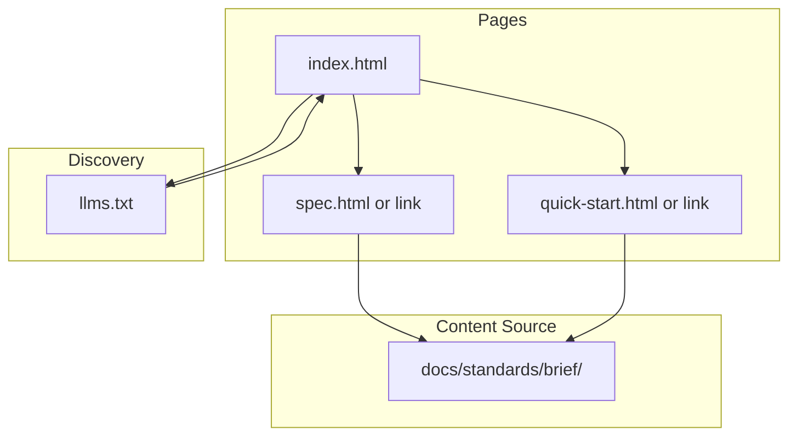

# Agent-Briefs Website Plan

## Design Principles (from reference sites)


| Site            | Pattern                                                              |
| --------------- | -------------------------------------------------------------------- |
| agentskills.io  | Hero + Why + What enables + Adoption + Get started nav + llms.txt    |
| agents.md       | Problem/solution in 2 sentences + 3-step How to use + Examples + FAQ |
| agent-trace.dev | RFC-style: Motivation, Goals, Non-Goals, Core spec, Extensibility    |


**Target:** Single-page or minimal multi-page. No heavy docs. Intuitive. Core primitive first.

---

## Site Structure

### 1. Hero

- **Tagline:** "What agents see, and when they act."
- **Sub:** "An open standard for declarative agent context lifecycle."
- **Stack diagram:** AGENTS.md (behavior) → SKILL.md (capabilities) → BRIEF.md (context lifecycle)

### 2. Why BRIEF.md

- 2–3 sentences: Agents waste tokens on deps, logs, full files. BRIEF.md declares what to load, when, and how (signatures vs full).
- **Zero config:** Built-in conventions work today—no file required.

### 3. Get Started (3 levels, scannable)

- **Level 0:** Install skill. Nothing else. Conventions handle source/deps/logs.
- **Level 1:** Add `BRIEF.md` at root. 5 minutes. Discovery + Context sections.
- **Level 2:** Optional. Add `## Agents` for subagent scoping.

Minimal example (from [quick-start.md](docs/standards/brief/quick-start.md))—one code block, no explanation overload.

### 4. Seven Sections at a Glance

One-line per section (from [brief-spec-v0.1.md](docs/standards/brief/brief-spec-v0.1.md)):

- Brief, Discovery, Context, Agents, Checkpoints, Handoff, Conventions

Link to full spec for details. No in-page spec dump.

### 5. Adoption / Compatible Agents

- Cursor (via brief-context-manager skill)
- Others as they adopt (placeholder list)

### 6. Open Development

- GitHub: [hhalperin/briefs](https://github.com/hhalperin/briefs)
- Spec, schemas, skills, rules live in repo
- Apache 2.0

### 7. Links (nav / footer)

- Specification
- Quick Start
- Dot-agents layout
- Examples (or link to repo examples)
- Reference library (skills, rules)

### 8. FAQ (3–5 questions)

- Do I need BRIEF.md? (No—Level 0 works.)
- How does it relate to AGENTS.md / SKILL.md?
- What about non-Cursor agents?
- Where are schemas?

### 9. Agent Discovery (llms.txt)

- Root `/llms.txt` for agent crawlers (like agentskills.io)
- Links: Overview, Spec, Quick Start, Integrate

---

## Technical Approach

**Stack options:**


| Option           | Pros                           | Cons                   |
| ---------------- | ------------------------------ | ---------------------- |
| Static HTML/CSS  | Zero deps, fast, simple        | Manual updates         |
| Astro            | MDX, components, static export | Adds tooling           |
| Next.js static   | Familiar, MDX                  | Heavier                |
| Single HTML file | Maximum simplicity             | Harder to maintain nav |


**Recommendation:** Astro or static HTML. Astro if you want MDX for spec snippets; otherwise a small set of static HTML files (index, spec, quick-start, llms.txt) is sufficient and matches the "simple" bar.

**Content source:** Pull from existing [docs/standards/brief/](docs/standards/brief/)—README, quick-start, spec. No duplication; site links to or embeds minimal excerpts.

---

## Domain and Hosting

- **Domain:** `agent-briefs.dev` or `agentbriefs.dev` (align with agents.md style)
- **Hosting:** GitHub Pages, Vercel, or Netlify (free tier)
- **Repo:** Either `briefs` repo (e.g. `/website` or `/docs` deploy) or separate `agent-briefs-site` repo

---

## File Layout (proposed)

```
website/
  index.html          # Hero, Why, Get started, Sections, Adoption, FAQ
  spec.html           # Optional: spec excerpt or link to GitHub
  quick-start.html    # Optional: quick-start excerpt
  llms.txt            # Agent discovery
  styles.css
  (or Astro src/ equivalent)
```

---

## Content Checklist

- Hero copy (tagline, sub, stack)
- Why section (2–3 sentences)
- Get started (Level 0/1/2, one example)
- Seven sections one-liner
- Adoption list
- Open dev + GitHub link
- Nav/footer links
- FAQ (3–5)
- llms.txt

---

## Out of Scope (per "lack of incredibly detailed documentation")

- Full in-page spec
- Tutorial series
- Video walkthroughs
- Blog
- Interactive playground (future consideration)

---

## Mermaid: Site Architecture




---

## Next Steps After Plan Approval

1. Choose stack (Astro vs static HTML)
2. Choose domain and hosting
3. Create `website/` (or `docs/` deploy) structure
4. Implement index with hero, Why, Get started, Sections, Adoption, FAQ
5. Add llms.txt
6. Add spec/quick-start pages or deep links to GitHub
7. Deploy and verify
