# Agent Graph

Captures the agent spawning hierarchy during plan execution. Each node is a Cursor agent (orchestrator, plan agent, or TODO subagent). Edges = spawn relationships.

> Updated after each `/execute-plans` run by the `plan-orchestrator` agent.
> Last run: 2026-02-25 (via `/execute-plans` orchestrated by `plan-orchestrator`)

---

## Diagram

```mermaid
%%{init: {"theme":"dark"}}%%
flowchart TD

  subgraph tier0 ["Tier 0 — Orchestrator"]
    orch["plan-orchestrator<br/>model: inherit<br/>reads: execute-plans.md<br/>maintains: .orchestrator-state.json"]
  end

  subgraph tier1_p1 ["Tier 1 — Phase 1 Plan Agents (parallel)"]
    direction LR
    ag_avf["plan-agent<br/>architecture-vision-foundation<br/>9 TODOs"]
    ag_cdc["plan-agent<br/>cursor-docs-cleanup<br/>15 TODOs"]
    ag_bdw["plan-agent<br/>browser-dev-workflow<br/>8 TODOs"]
    ag_tso["plan-agent<br/>terminology-sas-overhaul<br/>12 TODOs"]
  end

  subgraph tier1_p2 ["Tier 1 — Phase 2 Plan Agents (parallel)"]
    direction LR
    ag_hpp["plan-agent<br/>hook-prompt-pipeline<br/>6 TODOs"]
    ag_nma["plan-agent<br/>native-mode-alignment<br/>6 TODOs"]
    ag_seu["plan-agent<br/>senior-engineer-ux<br/>7 TODOs"]
    ag_aof["plan-agent<br/>agent-orchestration-frameworks<br/>11 TODOs"]
  end

  subgraph tier1_p3 ["Tier 1 — Phase 3 Plan Agent"]
    ag_pwm["plan-agent<br/>pipeline-wiring-mvp<br/>8 TODOs"]
  end

  subgraph tier1_p4 ["Tier 1 — Phase 4 Plan Agent"]
    ag_qp["plan-agent<br/>quality-performance<br/>7 TODOs"]
  end

  subgraph tier2_examples ["Tier 2 — Example TODO Subagents (spawned by plan agents)"]
    direction LR
    todo_avf_batch_a["todo-subagent<br/>avf batch-A<br/>avf-01,02,03,04"]
    todo_avf_batch_b["todo-subagent<br/>avf batch-B<br/>avf-05,06,07"]
    todo_aof_batch_a["todo-subagent<br/>aof batch-A<br/>aof-01,02,11 (docs)"]
    todo_aof_batch_b["todo-subagent<br/>aof batch-B<br/>aof-03,07 (code)"]
    todo_tso_impl["todo-subagent<br/>tso impl batch<br/>tso-04,05,06 (renames)"]
  end

  orch --> ag_avf
  orch --> ag_bdw
  orch --> ag_tso
  orch -.->|"after avf"| ag_cdc
  orch -->|"phase 2"| ag_hpp
  orch -->|"phase 2"| ag_nma
  orch -->|"phase 2"| ag_seu
  orch -->|"phase 2"| ag_aof
  orch -->|"phase 3"| ag_pwm
  orch -->|"phase 4"| ag_qp

  ag_avf --> todo_avf_batch_a
  ag_avf --> todo_avf_batch_b
  ag_aof --> todo_aof_batch_a
  ag_aof --> todo_aof_batch_b
  ag_tso --> todo_tso_impl

  classDef orchestrator stroke:#5599ff,stroke-width:3px
  classDef planAgent   stroke:#50c878,stroke-width:2px
  classDef todoAgent   stroke:#f0a030,stroke-width:1px

  class orch orchestrator
  class ag_avf,ag_cdc,ag_bdw,ag_tso,ag_hpp,ag_nma,ag_seu,ag_aof,ag_pwm,ag_qp planAgent
  class todo_avf_batch_a,todo_avf_batch_b,todo_aof_batch_a,todo_aof_batch_b,todo_tso_impl todoAgent
```

---

## Legend

| Color | Agent tier |
|-------|-----------|
| Blue thick | Orchestrator (`plan-orchestrator` Cursor agent) |
| Green | Plan agents (spawned via `mcp_task`, `subagent_type: generalPurpose`) |
| Orange | TODO subagents (spawned by plan agents for complex/multi-file tasks) |
| Dashed arrow | Sequential spawn dependency (cdc waits for avf) |
| Solid arrow | Phase gate spawn |

---

## Spawn rules

1. Orchestrator reads `execute-plans.md` → spawns plan agents per phase in order
2. Plan agents mark TODOs `in_progress` → execute or spawn TODO subagents
3. TODO subagents receive: planPath, todoId, content, attachments
4. On completion: plan agent marks TODO `completed`, adds `## Reconciliation` to plan body
5. Orchestrator runs `sync-registry` after each phase; checks gate before advancing

## Governance agents (non-execution)

| Agent | When used |
|-------|-----------|
| `plan-governor` | After plan edits — runs sync + dep audit; read-only |
| `verifier` | After execution claims — checks evidence files + compile/test |
| `plan-orchestrator` | When running `/execute-plans` — drives the execution loop |
