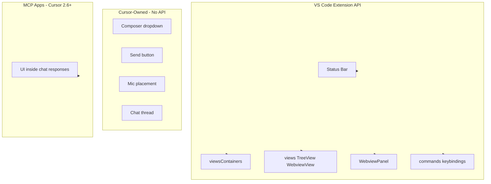

# Composer UI Constraints and Extension Tab Strategy

## 1. Why You Cannot Change the Composer UI

### Architectural Root Cause

Extensions run in a **separate extension host process** and communicate with the workbench via JSON-RPC over IPC. They have **no direct DOM access** to the renderer process. Every `vscode.`* call is a serialized message; extensions cannot inject CSS, manipulate DOM, or style Cursor-owned UI.

```
Extension Host (Node.js)  <--IPC-->  Renderer (DOM)
     vscode.* API only              Composer, chat, workbench
```

### What the VS Code API Exposes vs. What Cursor Owns


| Surface                     | Exposed to extensions? | Notes                                                       |
| --------------------------- | ---------------------- | ----------------------------------------------------------- |
| Status bar                  | Yes                    | `vscode.window.createStatusBarItem()`                       |
| Sidebar / Activity Bar      | Yes                    | `viewsContainers`, `views`                                  |
| Webview (editor tab, panel) | Yes                    | `createWebviewPanel()`, `WebviewViewProvider`               |
| Tree views                  | Yes                    | `TreeDataProvider`, `createTreeView()`                      |
| Commands, keybindings       | Yes                    | `contributes.commands`, `keybindings`                       |
| **Composer mode dropdown**  | No                     | Internal Cursor UI; no `contributes.composer.modes`         |
| **Composer send button**    | No                     | No API for border/class when Drive active                   |
| **Composer mic placement**  | No                     | No extension API for mic visibility                         |
| Chat Participant (`@drive`) | No                     | `vscode.chat.createChatParticipant` not supported in Cursor |


**Source:** [docs/design/ux/composer-mode-dropdown-integration.md](docs/design/ux/composer-mode-dropdown-integration.md), [docs/research/drive-tech/vscode-extensions/00_technology.md](docs/research/drive-tech/vscode-extensions/00_technology.md)

### The Honest Caveat (from your research)

> Cursor does not expose its AI-specific UI surfaces (the chat panel, composer, Agent conversation thread) to the VS Code Extension API. So you can build rich editor UI, but you cannot inject buttons or panels into the chat/composer interface itself.

---

## 2. How Codex and Claude "Edited the UI"

**They did not modify the composer.** They added **their own sidebar panels** using the standard VS Code Extension API.

- **Codex:** Uses `viewsContainers` + `views` to add a sidebar icon in the Activity Bar. Commands like `chatgpt.openSidebar`, `chatgpt.newCodexPanel` open their **custom webview panel**, not Cursor's chat.
- **Claude Code:** Same pattern — a VS Code extension with a custom sidebar/panel containing a webview. Their chat UI lives in that webview, not in Cursor's native composer.

**Key insight:** Codex and Claude built **parallel UI surfaces** — their own tabs/panels — rather than injecting into Cursor's chat. The VS Code API gives you:

- Custom sidebar panels (`viewsContainers`)
- Tree views and webview views (`views` with `WebviewViewProvider`)
- Full HTML/CSS/JS in webviews
- Status bar, commands, keybindings

Drive already uses `createWebviewPanel()` for the Agent Screen (editor tab or bottom panel). The "extension tab" approach is to add a **sidebar container** so Drive has its own Activity Bar icon and collapsible panel, similar to Codex.

---

## 3. Path 1: VS Code Extensions (Open VSX) — Full UI Capabilities


| Capability     | How                                                                        |
| -------------- | -------------------------------------------------------------------------- |
| Custom sidebar | `contributes.viewsContainers` (Activity Bar) + `contributes.views`         |
| Full custom UI | `WebviewViewProvider` for sidebar, or `createWebviewPanel()` for tab/panel |
| Status bar     | `createStatusBarItem()`                                                    |
| Commands       | `contributes.commands`                                                     |
| MCP on top     | `vscode.cursor.mcp.registerServer()`                                       |


**Publish to Open VSX** (not VS Code Marketplace) so Cursor users can install via Extensions panel (Cmd+Shift+X).

---

## 4. Path 2: Cursor Plugins — AI Behavior Only, No UI

Cursor Plugins bundle rules, skills, agents, MCP servers, hooks. They have **no UI contribution** by design. Use for AI behavior; use VS Code extensions for UI.

---

## 5. Path 3: MCP Apps — UI Inside Chat Responses

MCP Apps (Cursor 2.6+) let tool results include `_meta.ui.resourceUri` so the host renders interactive HTML **inside chat responses**. Drive already implements this for `agent_screen_activity`, `agent_screen_file`, `agent_screen_decision`. This is the **only** way to get UI into the chat surface today.

---

## 6. Recommended Strategy: Extension Tab (Codex-Style)

Instead of modifying the composer, add a **Drive sidebar panel**:

1. `**contributes.viewsContainers`** — Add a Drive icon to the Activity Bar:

```json
   "viewsContainers": {
     "activitybar": [{
       "id": "cursorDrive",
       "title": "Drive",
       "icon": "assets/logo.svg"
     }]
   }


```

1. `**contributes.views**` — Add a WebviewView inside that container:

```json
   "views": {
     "cursorDrive": [{
       "id": "cursorDrive.panel",
       "name": "Drive",
       "type": "webview"
     }]
   }


```

1. `**WebviewViewProvider**` — Register a provider that builds HTML (chat-like UI, operator list, Agent Screen summary, etc.). Full control over layout, styling, and behavior.
2. **Coexist with chat** — User keeps Cursor's chat for native Agent/Plan/Ask; Drive panel is a dedicated surface for Drive-specific features (voice status, operators, Agent Screen, etc.).

**Drive today:** Uses `createWebviewPanel()` (editor tab or bottom). Adding `viewsContainers` + `views` would give a **sidebar** presence like Codex, without changing the composer.

---

## 7. Unpacking .vsix to Learn from Extensions

**Yes, you can unpack and inspect .vsix files.**

- **Format:** .vsix is a ZIP archive (Open Packaging Conventions). Rename to `.zip` and extract.
- **Contents:**
  - `extension.vsixmanifest` — metadata, dependencies
  - `[Content_Types].xml` — OPC manifest
  - Extension files (JS, package.json, assets)

**How to inspect Claude Code or Codex:**

1. Download the .vsix (e.g., from [Open VSX](https://open-vsx.org/) or VS Code Marketplace).
2. Rename `extension.vsix` to `extension.zip`.
3. Extract with any ZIP tool.
4. Inspect `package.json` for `contributes.viewsContainers`, `contributes.views`, `contributes.commands`.
5. Read the extension's activation and webview code to see how they build their UI.

**Tools:** [VSIX Package Inspector](https://marketplace.visualstudio.com/items?itemName=MaksHoffman.vsix-viewerx) (VS Code extension to browse .vsix contents).

---

## 8. Summary Diagram




**Bottom line:** Build a VS Code extension with a custom sidebar tab (viewsContainers + WebviewView) for community features. Use MCP Apps for UI inside chat. The composer itself is not extensible today; Cursor would need to add contribution points or APIs for that.

## Reconciliation

Reference doc completed. Clarifies why composer UI cannot be modified, how Codex/Claude use custom sidebar panels, and recommends extension tab (viewsContainers + WebviewView) strategy. MCP Apps noted as path for UI inside chat.