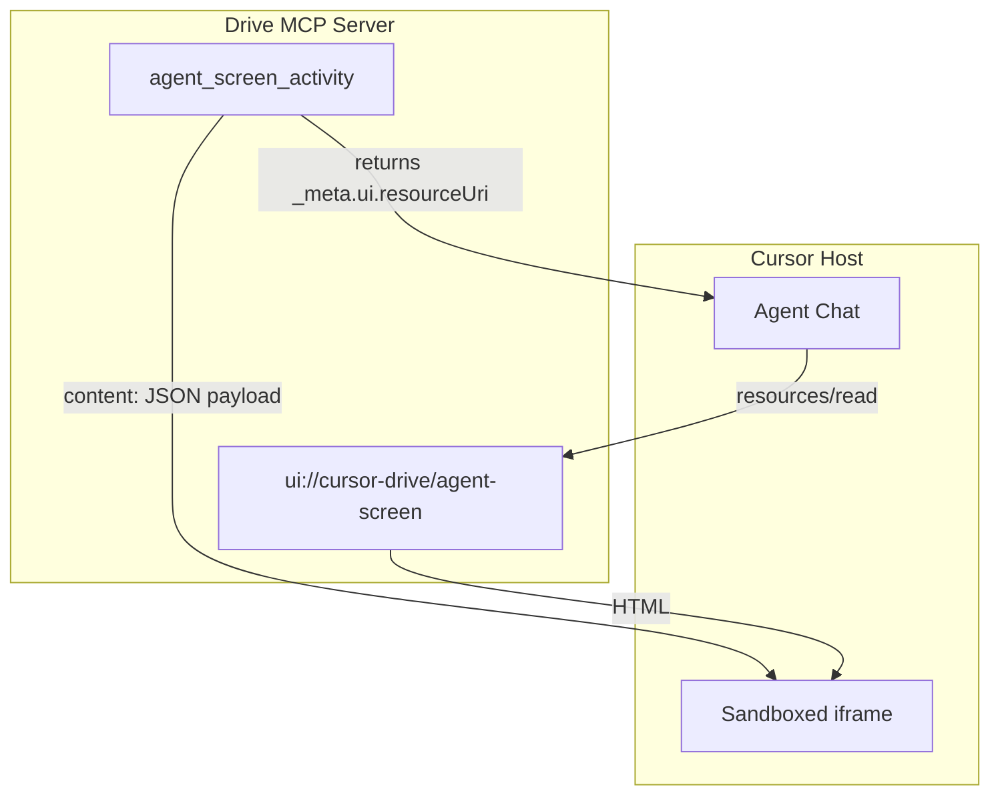

# MCP Apps Implementation Plan

## Goal

Enable Cursor Drive's Agent Screen to render as an MCP App inside Cursor 2.6 chat when `agent_screen_activity`, `agent_screen_file`, or `agent_screen_decision` are called. The host fetches `ui://cursor-drive/agent-screen`, mounts it in a sandboxed iframe, and passes the tool result to the app.

## Architecture




## Key Files


| File                                           | Role                                                    |
| ---------------------------------------------- | ------------------------------------------------------- |
| [src/mcpServer.ts](src/mcpServer.ts)           | Register resource, augment tool results with `_meta.ui` |
| [src/agentScreenApp.ts](src/agentScreenApp.ts) | New: build standalone HTML for MCP App iframe           |
| [src/extension.ts](src/extension.ts)           | Pass `getEnableApps` to DriveMcpServer opts             |
| [package.json](package.json)                   | Add ext-apps dep, `cursorDrive.mcp.enableApps` config   |


## Implementation Approach

**Option A (swap-first):** Keep existing `mcpServer.tool()` calls. Augment return values with `_meta: { ui: { resourceUri } }` when `enableApps` is true. Register UI resource via `registerAppResource` from ext-apps. No migration to `registerAppTool`.

**Rationale:** ext-apps expects `registerResource`; Drive's McpServer supports it. Tool result `_meta` is sufficient for Cursor 2.6. Minimal diff, low regression risk.

## Dependencies

- Add `@modelcontextprotocol/ext-apps`: `^1.1.2` (peer: `@modelcontextprotocol/sdk` ^1.24.0; Drive uses ^1.26.0 — compatible)
- Use `registerAppResource`, `RESOURCE_MIME_TYPE` from `@modelcontextprotocol/ext-apps/server`

## Config

Add under `cursorDrive.mcp`:

```json
"cursorDrive.mcp.enableApps": {
  "type": "boolean",
  "default": false,
  "description": "Enable MCP Apps: agent_screen_* tools return ui:// resource for inline rendering in chat."
}
```

## MCP App HTML Constraints

Per [docs/research/drive-tech/mcp-apps/04_risks-and-mitigations.md](docs/research/drive-tech/mcp-apps/04_risks-and-mitigations.md):

- No `acquireVsCodeApi()` — use `App` from ext-apps
- No `var(--vscode-*)` — use fallbacks: `#1e1e1e`, `#d4d4d4`, `#007acc`
- Self-contained HTML — inline script or single-file bundle; avoid external CDN if host CSP blocks it
- `app.ontoolresult` receives the tool result; parse JSON payload and render activity/file/decision

## Tool Result Payload

When `enableApps` is true, return richer content so the app can render:

```typescript
// agent_screen_activity
content: [{ type: "text", text: JSON.stringify({ op: operator_name, text }) }],
_meta: { ui: { resourceUri: "ui://cursor-drive/agent-screen" } }
```

Same pattern for `agent_screen_file` (`{ op, file_path }`) and `agent_screen_decision` (`{ op, text }`).

## Extension Wiring

[src/extension.ts](src/extension.ts) constructs `DriveMcpServer` opts. Add:

```typescript
getEnableApps: () => vscode.workspace.getConfiguration("cursorDrive.mcp").get<boolean>("enableApps", false),
```

[DriveMcpServerOptions](src/mcpServer.ts) gains `getEnableApps?: () => boolean`. Tools read it at call time.

## Testing Strategy

1. **Unit:** `agentScreenApp.test.ts` — `buildAgentScreenAppHtml()` returns valid HTML, contains `#app` or `#activity-feed`, no `acquireVsCodeApi`
2. **Unit:** `mcpServer.test.ts` — when `getEnableApps` returns true, `agent_screen_activity` response includes `_meta.ui.resourceUri`; resource handler returns HTML with correct MIME type
3. **Manual:** Enable flag, run agent that calls `agent_screen_activity`, verify inline UI in Cursor 2.6 chat

## Rollout

- Phase 1: Feature-flagged prototype (`enableApps` default `false`)
- Phase 2: Validate in Cursor 2.6; document host compatibility
- Phase 3 (future): Enable by default if stable; add `get_agent_screen_state` tool for full feed

## Reconciliation

agentScreenApp.ts with buildAgentScreenAppHtml() created; registerAppResource and ui://cursor-drive/agent-screen wired in mcpServer. Tool results augmented with _meta.ui; extension passes getEnableApps to DriveMcpServer opts.
