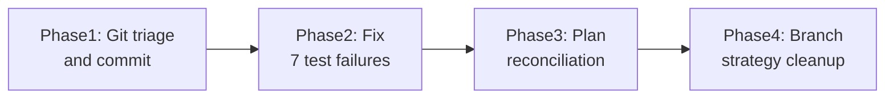

# Project Cleanup and Reset

## Current State

The project compiles clean but has accumulated significant drift:

- **Branch**: `feat/drive-mode` (should be `feature/` per CONTRIBUTING.md convention)
- **Uncommitted changes**: ~80+ files spanning code, plans, agents, hooks, skills, rules, docs
- **Tests**: 7 failures in 2 suites (`pipelineStats`, `mcpServer`) due to TTS mock gaps and port conflicts
- **Plans**: 7 empty-todo plans stuck as "pending"; orchestrator state completely stale; 3 plans with real remaining work
- **No recent commits**: work has piled up without checkpoints

## Phase 1: Git Triage and Commit

The accumulated changes are a mix of concerns. Break them into logical commits on the current branch.

**Commit 1 — Plan governance and agents**

- `.cursor/agents/` (drive-operator, drive-reviewer, plan-governor, plan-orchestrator, verifier)
- `.cursor/hooks/` (dep-auditor.py, drive-preprocessor.py, plan-frontmatter-changed.py, plan-runner.py)
- `.cursor/hooks.json`
- `.cursor-plugin/` agent syncs
- `.cursor/plans/` registry, plan-graph, orchestrator state, new plan files

**Commit 2 — Skills, rules, commands, settings**

- `.cursor/skills/` (all SKILL.md files)
- `.cursor/rules/` (all .mdc files)
- `.cursor/commands/drive-research/` (new commands)
- `.cursor/settings.json`, `.cursor/mcp.json`
- `.cursor/BUGBOT.md`
- `.vscode/` settings

**Commit 3 — Source code changes**

- `src/cursorCliRunner.ts`, `src/mcpServer.ts`
- `src/cursor-sdk/` (new module: errors, index, permissionBroker, sessionAccumulator, toolCallTracker)
- `tests/cursor-sdk.test.ts`, `tests/mcpServer.test.ts`, `tests/persistentMemory.test.ts`, `tests/worktreeManager.test.ts`

**Commit 4 — Docs**

- `docs/design/`, `docs/solutions/`, `docs/plans/`, `docs/research/`
- `.gitignore` updates

**Cleanup**: Remove `.cursor/hooks/__pycache__/` from any future tracking (already gitignored, just verify). Delete removed commands (brainstorm, execute-plan, merge, switch, tangent, write-plan) cleanly.

## Phase 2: Fix Test Failures (7 failures)

Two root causes in `[tests/pipelineStats.test.ts](tests/pipelineStats.test.ts)` and `[tests/mcpServer.test.ts](tests/mcpServer.test.ts)`:

1. **TTS mock incomplete** — `say.stop` and `tts.getSpokenHistory` not mocked. Fix: update the TTS mock in the relevant test files to stub `stop()` and `getSpokenHistory()`.
2. **Port conflict** — `EADDRINUSE` on port 18004 in mcpServer tests. Fix: ensure proper server teardown in `afterEach`/`afterAll`, or use dynamic port assignment.

After fixes: `npm run compile && npm test` must both pass clean.

## Phase 3: Plan System Reconciliation

### Close empty plans

7 plans have zero todos but are still marked "pending". For each, either:

- Mark `status: completed` and add a brief `## Reconciliation` section (if the work is done)
- Or delete the plan if it was never started and is no longer relevant

Plans to triage:

- `cursor_drive_state_sync_95317c89`
- `openclaw_capability_scrape_8fa228d1`
- `wire_and_fix_drive_886a9ffa`
- `drive_ux_polish_and_auto-mcp_deb68d21`
- `voice_user_journey_storyboard_59290404`
- `cursor_native_commands_wire_4b8e2c17`
- `chat_memory_and_proceed_f300d563`

### Fix orchestrator state

`.orchestrator-state.json` shows phase 4 with all phases "pending" despite 29 completed plans. Either reset this to reflect reality or delete it and let the next sync regenerate.

### Run plan-runner sync

```bash
python .cursor/hooks/plan-runner.py sync-registry
```

This updates `registry.yaml` and `plan-graph.yaml` to match actual plan file states.

### Identify real remaining work

Only 3 plans have substantive todos:

- `s_as_screen_capture_impl` — 14 todos (Agent Screen capture)
- `repo_review_and_bugfix_plan_9f907bcf` — 6 todos (architecture review + bugfixes)
- `sdk_and_protocol_research_6c42aa0c` — 6 todos (SDK research)

Decide which of these to prioritize going forward.

## Phase 4: Branch Strategy Cleanup

Per [CONTRIBUTING.md](CONTRIBUTING.md), the branch convention is `feature/<name>`, not `feat/<name>`. Options:

- **Option A**: Rename branch to `feature/drive-mode` and push
- **Option B**: Merge `feat/drive-mode` into `develop` (squash), delete the branch, and continue from `develop`

Either way, get changes integrated into `develop` so the branch doesn't keep growing.

## Recommended Priority Order




Phase 1 is the critical first step — everything else depends on having a clean, committed baseline.