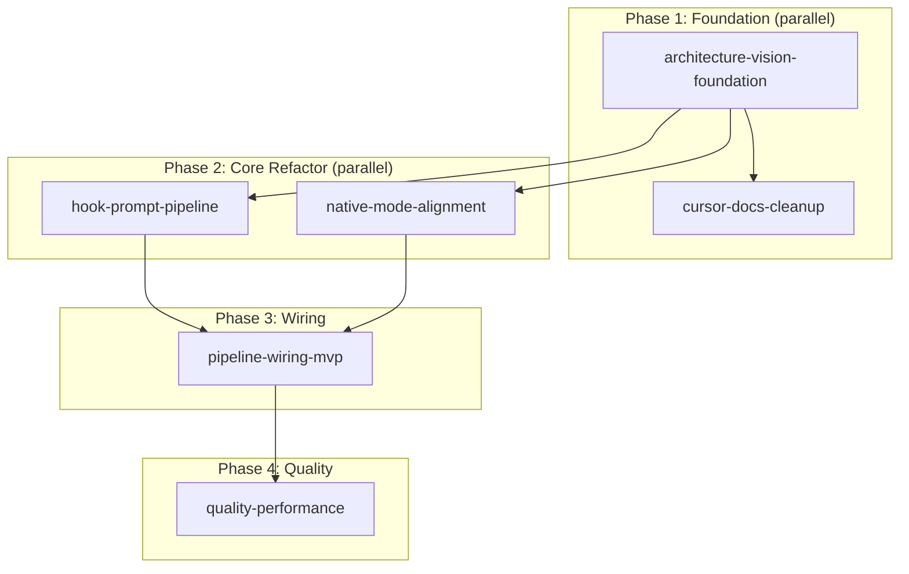

# Cursor Drive Planning System Overhaul

## What was audited

- 7 discovery subagents read 100+ files across `docs/prd/`, `docs/design/`, `docs/architecture/`, `docs/guides/`, `docs/reference/`, `docs/research/`, `src/`, `.cursor/`, and all existing plans
- 4 synthesis subagents produced: vision contradiction map, workstream decomposition, dependency DAG, and `.cursor/` target architecture
- All synthesis outputs were consistent; no reconciliation needed

## Major contradictions vs mode-wrapper vision

18 contradictions found (8 blocking, 8 important, 2 cleanup). The dominant theme:

**The entire documentation layer assumes `@drive` ChatParticipant is the primary UX entry point, but the code has already removed it** (`vscode.chat.createChatParticipant` is not supported in Cursor). The vision says Drive is a behavioral wrapper around Cursor's native modes via `beforeSubmitPrompt` hook.

Key blocking items:

- Architecture README, system design, walkthrough, user journey, naming doc, handoff command all describe `@drive` as primary entry
- Pipeline described as "every message sent to @drive" instead of transparent hook routing
- ADR-0001 has duplicate numbering (two different ADRs)
- `router.ts` uses parallel mode model (`plan/run/direct/collab`) instead of Cursor native modes (`Agent/Plan/Ask/Debug`)
- 9 implemented pipeline modules exist in `src/` but are completely orphaned (not wired into any flow)
- No `beforeSubmitPrompt` pipeline orchestration exists yet

## `.cursor/` audit summary

| Verdict | Count | Action                             |
| ------- | ----- | ---------------------------------- |
| KEEP    | 29    | No change                          |
| REWORK  | 19    | Fix content, merge, or restructure |
| REMOVE  | 8     | Delete dead files                  |
| MISSING | 3     | Create new files                   |

Critical removals: `brief-context.mdc` (dead BRIEF.md reference), `refactor-file-migration.mdc` (dead script reference), 3 commands delegating to nonexistent skills, `doc-reminder.py` (redundant hook), `.plan-state-snapshot.json` (stale)

Critical additions: `vision-invariants.mdc`, consolidated `plan-governance.mdc`, `.gitignore` entries for generated plan artifacts

## Dependency DAG

**Phase gates:**

- Phase 1 gate: ADRs accepted, vision-invariants rule exists, dead `.cursor/` files removed
- Phase 2 gate: Hook contract documented, router aligned to Cursor native modes
- Phase 3 gate: All 9 orphaned modules wired into pipeline, end-to-end flow works
- Phase 4 gate: Tests pass, compile passes, docs reflect current architecture

## Plan catalog

### Root plan: `cursor-drive.plan.md` (UPDATE)

Rewrite scope to reflect mode-wrapper vision. Update `childPlanIds` to the 6 plans below. Preserve the 1 completed TODO. Mark stale TODOs as `cancelled` with reason.

### Plan 1: `architecture-vision-foundation.plan.md` (NEW)

- **planId:** `architecture-vision-foundation`
- **parentPlanId:** `cursor-drive`
- **dependsOn:** `[]`
- **Scope:** ADRs for mode wrapper, hook-based prompt interception, native mode compatibility, voice integration, mode state management. Vision-invariants rule. ADR-0001 renumbering.
- **TODOs (~8):**
  - Write ADR: Mode Wrapper Architecture (Drive wraps Agent/Plan/Ask/Debug; `beforeSubmitPrompt` is primary pipeline)
  - Write ADR: Hook-Based Prompt Interception (hook contract, extension integration, fallback)
  - Write ADR: Native Mode Compatibility (1:1 sub-mode mapping, extension points)
  - Write ADR: Voice Input Integration (TTS, filler cleaning, mic mute/unmute)
  - Write ADR: Mode State Management (driveMode state sync with Cursor mode state)
  - Renumber duplicate ADR-0001 (installable distribution becomes ADR-0007)
  - Create `rules/vision-invariants.mdc`
  - Update existing ADR-0001 (ingress strategy) to document `@drive` removal rationale

### Plan 2: `hook-prompt-pipeline.plan.md` (NEW)

- **planId:** `hook-prompt-pipeline`
- **parentPlanId:** `cursor-drive`
- **dependsOn:** `[architecture-vision-foundation]`
- **Scope:** Design and implement the `beforeSubmitPrompt` pipeline. Determine hook capabilities (modify vs context-only). Define pipeline stages and orchestration point.
- **TODOs (~6):**
  - Document Cursor `beforeSubmitPrompt` hook contract (what can hooks do?)
  - Design pipeline flow: hook entry -> extension stages -> output
  - Implement pipeline orchestration in extension (fillerCleaner -> glossaryExpander -> sanitizer -> approvalGates -> router)
  - Wire Drive-active check: pipeline only runs when Drive is on
  - Define extension/hook boundary (what runs in Python hook vs TypeScript extension)
  - Add pipeline integration tests

### Plan 3: `native-mode-alignment.plan.md` (NEW)

- **planId:** `native-mode-alignment`
- **parentPlanId:** `cursor-drive`
- **dependsOn:** `[architecture-vision-foundation]`
- **Scope:** Align `router.ts` RouteMode and `driveMode.ts` SubMode with Cursor native modes. Wire mode switching.
- **TODOs (~6):**
  - Replace RouteMode (`plan/run/direct/collab`) with Cursor-aligned modes (`Plan/Agent/Ask/Debug`)
  - Map `driveMode.SubMode` to Cursor native mode APIs (resolve "direct" mode)
  - Add Debug to `cursorDrive.setSubMode` QuickPick
  - Update `drive_set_mode` MCP tool to use new mode enum
  - Wire status bar to reflect Cursor native mode when Drive active
  - Update router tests for new mode set

### Plan 4: `pipeline-wiring-mvp.plan.md` (NEW, supersedes `mvp-gaps.plan.md`)

- **planId:** `pipeline-wiring-mvp`
- **parentPlanId:** `cursor-drive`
- **dependsOn:** `[hook-prompt-pipeline, native-mode-alignment]`
- **Scope:** Wire all 9 orphaned modules into the pipeline. Implement remaining MVP features.
- **TODOs (~8):**
  - Wire fillerCleaner, glossaryExpander, sanitizer into pipeline (correct order per ADR)
  - Wire approvalGates pre-routing scan
  - Wire router -> modelSelector into pipeline
  - Wire sessionMemory for context augmentation (inject `buildContextString()` output)
  - Implement `promptOptimizer.ts` (routing-tier model, QuickPick diff UI, autoApprove config)
  - Implement wake/submit word detection with activation logic (not just stripping)
  - Wire tangent keyword -> `agentRegistry.spawn()`; update status bar via `onAgentChange`
  - Register `cursorDrive.installPluginToWorkspace` command in `activate()`; fix statusBar call to pass `agentRegistry`

### Plan 5: `cursor-docs-cleanup.plan.md` (NEW, includes `.cursor/` rebuild)

- **planId:** `cursor-docs-cleanup`
- **parentPlanId:** `cursor-drive`
- **dependsOn:** `[architecture-vision-foundation]`
- **Scope:** Clean `.cursor/` directory (remove/rework/add files). Fix 15+ stale `@drive` references across docs. Update PRDs and design docs for mode-wrapper vision.
- **TODOs (~15):**
  - Remove dead rules: `brief-context.mdc`, `refactor-file-migration.mdc`
  - Create consolidated `plan-governance.mdc` (glob-triggered on `*.plan.md`); remove 4 merged rules
  - Rework `architecture-before-coding.mdc` to glob-trigger on `src/**/*.ts`
  - Remove dead commands: `brainstorm.md`, `execute-plan.md`, `write-plan.md`
  - Remove `doc-reminder.py` hook and its `hooks.json` entry
  - Remove `.plan-state-snapshot.json`, `mcp-env-from-dotenv.py`
  - Rewrite `cursor-drive-handoff.md` for mode-wrapper vision
  - Simplify `plan-audit-deps.md` to avoid overlap with `dep-auditor.py`
  - Trim `plan-system-maintainer` skill; absorb `plan-orchestration-spec.md` and `plan-governance-quickstart.md`
  - Split `drive-persona` skill (persona vs MCP tool reference)
  - Archive completed plans: `hh-migration-followup`, `drive-mode-installable-ui`, `mvp_consolidation_overhaul`
  - Update architecture README, system design, walkthrough for `beforeSubmitPrompt` pipeline
  - Update user journey, naming doc to remove `@drive` as activation method
  - Update PRDs 3 and 5 for mode-wrapper agent messaging model
  - Re-sync `plan-graph.yaml`, regenerate `plan-master.diagram.md`, simplify `registry.yaml`

### Plan 6: `quality-performance.plan.md` (NEW, supersedes `code-optimization.plan.md` and `test-coverage.plan.md`)

- **planId:** `quality-performance`
- **parentPlanId:** `cursor-drive`
- **dependsOn:** `[pipeline-wiring-mvp]`
- **Scope:** Test coverage for all wired modules, code optimization, extension activation fix.
- **TODOs (~7):**
  - Complete extension activation fix (Output Channel diagnostics, root cause fix, verify)
  - Add tests for wired core: `extension.ts`, `mcpServer`, `driveMode`, `statusBar`, `agentRegistry`
  - Add tests for pipeline modules: `fillerCleaner`, `sanitizer`, `glossaryExpander`, `approvalGates`, `router`, `modelSelector`
  - Extract `modelUtils.ts` to deduplicate model selection logic
  - Cache config reads in hot-path modules
  - Precompile regexes in `fillerCleaner`, `glossaryExpander`, `approvalGates`
  - Refactor `AgentRegistry` from array scan to `Map` for O(1) lookups

### Plans to archive (completed work preserved)

| Current Plan                                     | Action  | Reason                |
| ------------------------------------------------ | ------- | --------------------- |
| `docs-overhaul.plan.md`                          | Archive | All TODOs completed   |
| `hh-migration-followup.plan.md`                  | Archive | Completed             |
| `drive-mode-installable-ui.plan.md`              | Archive | All 6 TODOs completed |
| `mvp_consolidation_overhaul_03ed2135.plan.md`    | Archive | Completed             |
| `plan-graph-diagram-automation_05cdb5a9.plan.md` | Archive | Completed             |

### Plans superseded by new plans

| Current Plan                       | Superseded By         | Reason                                  |
| ---------------------------------- | --------------------- | --------------------------------------- |
| `mvp-gaps.plan.md`                 | `pipeline-wiring-mvp` | Scope realigned for hook-based pipeline |
| `code-optimization.plan.md`        | `quality-performance` | Merged with test coverage               |
| `test-coverage.plan.md`            | `quality-performance` | Merged with optimization                |
| `fix_extension_activation.plan.md` | `quality-performance` | Absorbed as first TODO                  |

## Execution strategy for each plan

Every plan body will include an "Execution Strategy" section specifying:

- **Executor role:** orchestrator (spawns subagents per TODO group) vs implementer (executes directly)
- **Subagent fan-out:** which TODOs can be parallelized
- **Phase gates:** what must be true before the next batch
- **Verification:** when to spawn a verification subagent
- **Delegation triggers:** spawn subagent if task spans 2+ modules or 2+ doc files

## Open questions (blocking decisions needed before full implementation)

1. **Cursor `beforeSubmitPrompt` hook capabilities:** Can hooks MODIFY the prompt, or only ADD context? This determines whether the pipeline lives in the hook or the extension. (Plan 2, TODO 1 resolves this.)
2. **"direct" sub-mode fate:** Map to Ask, rename, or remove? (Plan 3, TODO 2 resolves this.)
3. `**registry.yaml` fate:** Keep simplified, auto-generate only when needed, or drop entirely? (Plan 5, TODO 15 resolves this.)
4. `**@drive` participant future:** Keep as dormant fallback code path for if/when Cursor adds participant API, or remove all traces? (Plan 1, ADR resolves this.)

## Implementation sequence

When approved, execution proceeds:

1. **Write all 6 new plans + update root plan** (parallel subagents, 4 at a time)
2. **Archive 5 completed plans** and **supersede 4 stale plans** (mark cancelled with pointer to replacement)
3. **Update `plan-graph.yaml`** with new plan nodes, edges, and removals
4. **Update `registry.yaml`** with new plan entries
5. **Regenerate `plan-master.diagram.md`** via `plan-runner.py sync-all`
6. **Verification subagent** checks consistency across all plans, graph, and registry
7. **Fix any issues** found by verification
