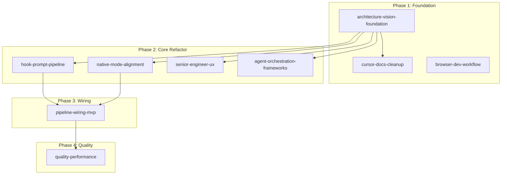

# New Plans for Agent Orchestration, UX Philosophy, and Browser Dev Workflow

## Summary of Discovery

Four subagents audited the codebase and researched external frameworks. Key findings:

- **Agent orchestration**: AgentRegistry supports spawn/switch/merge/dismiss but has NO inter-agent communication, no lead+worker pattern, no A2A/ACP/framework references. CommsAgent exists in `tests/src/` but is missing from `src/`.
- **Senior engineer philosophy**: Partially documented in [.cursor/skills/drive-persona/SKILL.md](.cursor/skills/drive-persona/SKILL.md) ("You are Drive -- a senior software engineer working alongside the user in a live pair-programming session") and [docs/prd/prd-session-persona.md](docs/prd/prd-session-persona.md), but the steering behavior, teaching moments, and pair-programming rhythm are underspecified.
- **cursor serve-web**: Well-researched in [docs/research/cursor-cli/README.md](docs/research/cursor-cli/README.md). Serves full Cursor UI in browser on `:8000`. No browser automation or visual testing setup exists. No "screencast mode" concept found -- the user likely means the serve-web browser view itself.
- **Framework assessment**: A2A (merged with ACP) is the emerging standard alongside MCP. Claude Code Agent Teams are experimental but architecturally relevant. Strands Agents has native MCP support. OpenClaw is a messaging gateway (WhatsApp/Telegram) -- fundamentally different domain, low priority for Cursor IDE integration.

## Framework priority matrix

| Framework               | Priority         | Rationale                                                                |
| ----------------------- | ---------------- | ------------------------------------------------------------------------ |
| A2A (includes ACP)      | High             | Emerging standard for agent-to-agent; HTTP/JSON-RPC alongside MCP        |
| Claude Code Agent Teams | High (watch)     | Lead+teammate pattern is the reference architecture for AgentRegistry v2 |
| MCP                     | Already shipping | Foundation layer; extend tool surface                                    |
| AWS Strands Agents      | Medium-High      | Native MCP, TypeScript preview; evaluate as worker runtime               |
| LangGraph/LangChain     | Medium           | Powerful but heavy; only if AgentRegistry proves insufficient            |
| OpenClaw                | Low              | Messaging gateway, not coding agent framework; different domain          |

## Plan changes

### 1. NEW: `agent-orchestration-frameworks.plan.md`

- **planId**: `agent-orchestration-frameworks`
- **parentPlanId**: `cursor-drive`
- **dependsOn**: `[architecture-vision-foundation]`
- **Scope**: A2A protocol layer, Claude Code Agent Teams bridge, AgentRegistry v2 design (lead+worker, mailbox, shared task list), Strands evaluation, inter-agent communication bus, CommsAgent rescue from tests/ to src/
- **~10 TODOs**:
  - Write ADR: Agent Orchestration Strategy (A2A + MCP layering, Claude Code Agent Teams as reference architecture)
  - Research A2A spec v0.1.0: Agent Card schema, Task lifecycle, message format; document findings
  - Implement A2A Agent Card endpoint on DriveMcpServer (publish Drive capabilities as discoverable agent)
  - Implement A2A Task CRUD endpoints (accept/report task status via HTTP/JSON-RPC)
  - Prototype Claude Code MCP bridge: register Drive's MCP server with `claude mcp add` and validate tool access from agent team sessions
  - Design AgentRegistry v2: shared task list, mailbox messaging between agents, file-lock coordination (informed by Claude Code Agent Teams)
  - Move `CommsAgent` from `tests/src/commsAgent.ts` to `src/commsAgent.ts`; wire into extension.ts
  - Add agent event bus to AgentRegistry (typed EventEmitter for completion/progress/error events)
  - Implement `agent_delegate` MCP tool (agent-to-agent task delegation)
  - Spike Strands Agents TypeScript SDK: connect to Drive MCP as a worker agent; evaluate integration path
  - Add `agent_update_memory` and `agent_set_visibility` MCP tools (PRD-specified but unimplemented)

### 2. NEW: `senior-engineer-ux.plan.md`

- **planId**: `senior-engineer-ux`
- **parentPlanId**: `cursor-drive`
- **dependsOn**: `[architecture-vision-foundation]`
- **Scope**: Codify the senior-engineer pair-programming philosophy, expand persona steering behavior, document interaction rhythm, add teaching moments guidance, refine proactive behavior
- **~7 TODOs**:
  - Write `docs/design/philosophy/senior-engineer-pair-programming.md`: explicit definition of the "senior engineer who steers" model, balance between autonomy and collaboration, when to teach vs execute, when to push back vs defer
  - Expand `.cursor/skills/drive-persona/SKILL.md` steering section: when to suggest alternatives, how to challenge assumptions respectfully, examples of good steering vs passive assistance
  - Document pair-programming rhythm in persona skill: turn-taking patterns, when to pause for feedback, how to signal "thinking" vs "ready for input"
  - Add "teaching moments" guidance: when Drive should explain architecture/patterns vs just execute, how to balance education with velocity
  - Expand proactive behavior beyond idle detection: proactive suggestions during active work, prioritization rules, proactive course correction when user goes down suboptimal path
  - Add response examples to persona skill: good vs bad responses, steering in action, concise-first done well
  - Write ADR: Senior Engineer Interaction Model (formalize the philosophy as an architectural decision with UX invariants)

### 3. NEW: `browser-dev-workflow.plan.md`

- **planId**: `browser-dev-workflow`
- **parentPlanId**: `cursor-drive`
- **dependsOn**: `[]` (can start immediately)
- **Scope**: Set up `cursor serve-web` for iterative UI development, browser automation for testing, visual regression tooling, one-command dev scripts
- **~8 TODOs**:
  - Add "Dev: Drive in browser" launch config to `.vscode/launch.json` with pre-launch tasks (compile, package, install, serve-web)
  - Create `scripts/serve-web-dev.ps1`: one-command setup (compile -> package -> install -> serve-web on :8000)
  - Research `--extensionDevelopmentPath` for serve-web (test if undocumented VS Code server flag works to avoid .vsix packaging cycle)
  - Add serve-web workflow section to `docs/guides/live-testing.md` with browser vs Electron dev-host trade-offs
  - Set up Playwright for browser automation: configure project, write initial smoke test (open browser, verify status bar renders, verify ShareScreen panel opens)
  - Add visual regression test: screenshot comparison for ShareScreen webview in dark/light themes
  - Document MCP server coordination with serve-web: ensure :7891 starts before browser UI, add health check in smoke test
  - Add `scripts/test-browser.ps1`: run Playwright browser-based smoke tests against serve-web instance

### 4. INTEGRATION into existing `architecture-vision-foundation.plan.md`

Add one TODO to the existing plan:

- **avf-09-adr-agent-orchestration-strategy**: Write `docs/architecture/adr/ADR-0014-agent-orchestration-strategy.md`. Decision: A2A for agent-to-agent interop alongside MCP for agent-to-tool; Claude Code Agent Teams as reference architecture for AgentRegistry v2; Strands as evaluation candidate for worker runtime. This ADR gates the agent-orchestration-frameworks plan.

### 5. INTEGRATION into existing `cursor-drive.plan.md` root plan

Add 3 new childPlanIds and workstream TODOs:

- Add `agent-orchestration-frameworks`, `senior-engineer-ux`, `browser-dev-workflow` to `childPlanIds`
- Add workstream tracking TODOs for each

## Dependency DAG (updated)

Notes:

- `browser-dev-workflow` has no dependencies -- it can start immediately (Phase 1)
- `senior-engineer-ux` depends on `architecture-vision-foundation` (needs vision-invariants rule first)
- `agent-orchestration-frameworks` depends on `architecture-vision-foundation` (needs ADR-0014 first)
- Both new Phase 2 plans run in parallel with existing Phase 2 plans
- `pipeline-wiring-mvp` and `quality-performance` are unchanged

## OpenClaw assessment

OpenClaw is a **messaging gateway** (WhatsApp, Telegram, Discord) with 220k+ GitHub stars. It does NOT:

- Support MCP
- Integrate with VS Code/Cursor
- Provide coding-specific tooling

For Cursor Drive, OpenClaw's value is limited to studying its auto-reply pipeline patterns and possibly enabling Drive access via messaging apps in the future. This is a **research TODO** within the agent-orchestration-frameworks plan (low priority), not a standalone integration effort.

## Files to create/modify

| File                                                   | Action                                  |
| ------------------------------------------------------ | --------------------------------------- |
| `.cursor/plans/agent-orchestration-frameworks.plan.md` | CREATE                                  |
| `.cursor/plans/senior-engineer-ux.plan.md`             | CREATE                                  |
| `.cursor/plans/browser-dev-workflow.plan.md`           | CREATE                                  |
| `.cursor/plans/architecture-vision-foundation.plan.md` | ADD TODO avf-09                         |
| `.cursor/plans/cursor-drive.plan.md`                   | ADD 3 childPlanIds + 3 workstream TODOs |
| `.cursor/plans/plan-graph.yaml`                        | ADD 3 new plan nodes + edges            |
| `.cursor/plans/registry.yaml`                          | ADD 3 new plan entries                  |
| `.cursor/plans/plan-master.diagram.md`                 | REGENERATE with new plans               |
