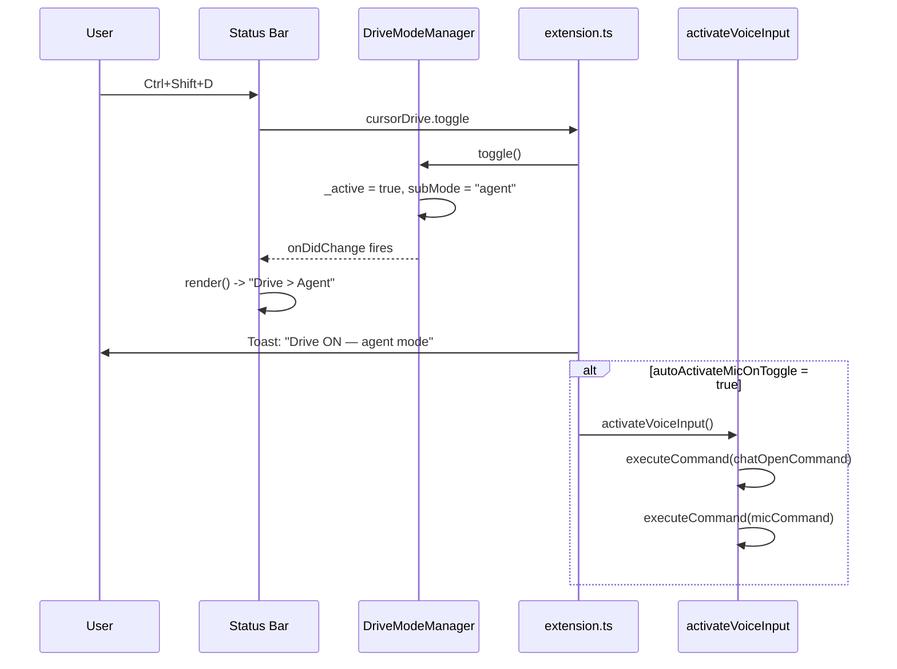
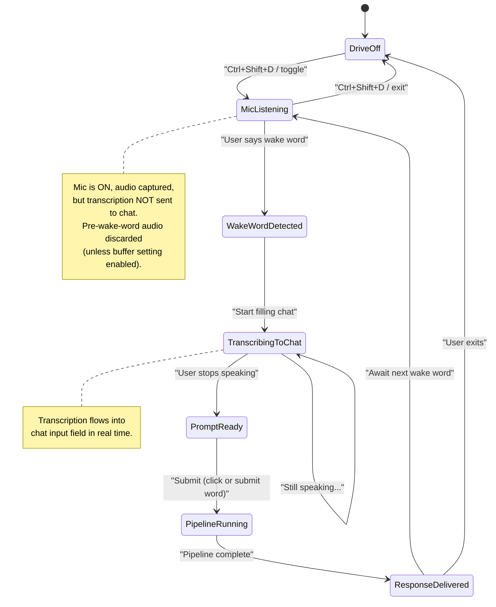
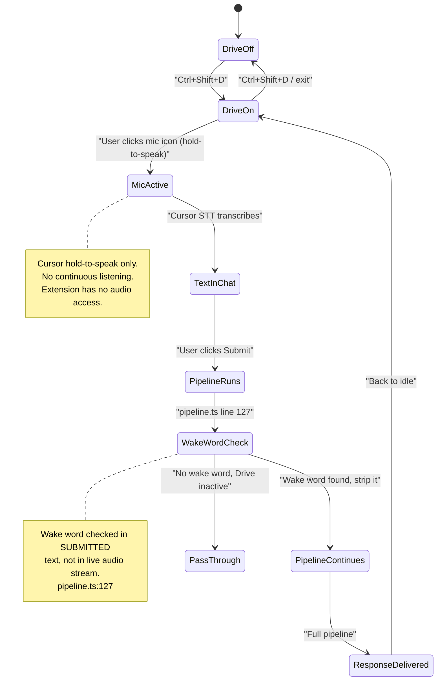
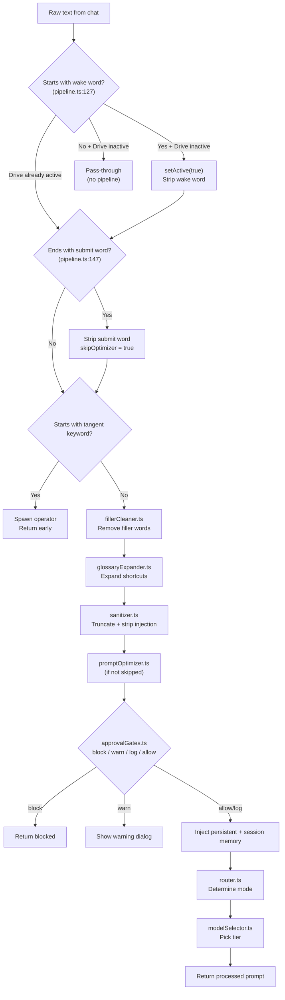
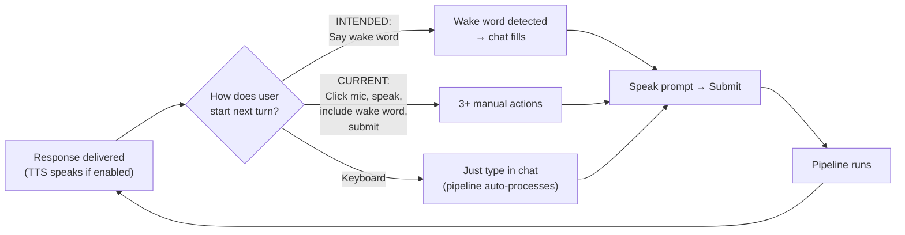

# Cursor Drive: User Journey Storyboard

## User Journey Phases

### Phase 1 -- Install and First Run

**Steps:**

- User installs VSIX via `Extensions: Install from VSIX` or marketplace
- Extension activates: `src/extension.ts` `activate()` creates DriveModeManager, OperatorRegistry, SessionMemory, CommsAgent, MCP server, status bar
- Status bar appears: `$(circle-slash) Drive (off)`
- No first-run wizard or onboarding notification exists

**Friction points:**

- F1: No first-run guide. User sees a cryptic "Drive (off)" in the status bar with no context for what to do next. The [user journey doc](docs/design/ux/drive-mode-user-journey.md) mentions a first-run guide but none is implemented
- F2: MCP server requires manual `.cursor/mcp.json` registration. Without it, Cursor agents cannot call Drive tools. No auto-registration or prompt to set this up
- F3: Plugin install (`cursorDrive.installPluginToWorkspace`) is a separate manual step. Skills, commands, hooks, and rules don't load until this runs

**Failure modes:**

- X1: MCP server port 7891 already in use -- `DriveMcpServer.start()` fails silently with a warning toast. User may not notice
- X2: Python not in PATH -- hooks (`drive-preprocessor.py`, `plan-runner.py`) fail silently. No diagnostic surfaces this
- X3: Extension activation itself can fail if `createDriveModeManager()` throws -- user gets output channel error, extension is dead

---

### Phase 2 -- Configuration

**Steps:**

- User opens Settings, searches "cursorDrive"
- Key settings to configure:
  - `cursorDrive.wakeWord` (default: `"hey drive"`)
  - `cursorDrive.submitWord` (default: `"send it"`)
  - `cursorDrive.tts.enabled` (default: `false`)
  - `cursorDrive.defaultSubMode` (default: `"agent"`)
  - `cursorDrive.voice.autoActivateMicOnToggle` (default: `false`)
  - `cursorDrive.promptOptimizer.enabled` / `.autoApprove`

**Friction points:**

- F4: 28+ config keys with no guided setup. User doesn't know which ones matter for voice-first use. No "recommended voice setup" preset
- F5: `cursorDrive.voice.micCommand` defaults to `"workbench.action.chat.voice.start"` -- this command may not exist in Cursor. No way for the user to discover the correct command name
- F6: TTS is off by default (privacy-correct per ADR-0005), but means the "pair-programming call" experience requires multiple settings changes

---

### Phase 3 -- Activation (Keyboard Path)

**Steps:**

- User presses `Ctrl+Shift+D`
- `cursorDrive.toggle` fires in [extension.ts](src/extension.ts)
- `DriveModeManager.toggle()` sets `_active = true`, applies `defaultSubMode` from config
- Status bar re-renders: `Drive > Agent` (no operator suffix when none spawned)
- If `voice.autoActivateMicOnToggle` is true: opens chat panel + fires mic command

**Friction points:**

- F7: `autoActivateMicOnToggle` defaults to false. First-time voice users must either enable this setting or manually open chat and click mic
- F8: Keybinding `Ctrl+Shift+D` conflicts with VS Code's default "Debug: Start Debugging" in some configurations

**Failure modes:**

- X4: `workbench.action.chat.open` command may not exist if Cursor changes its chat architecture. Fails silently (by design, but user gets no mic)
- X5: `workbench.action.chat.voice.start` may not be the correct command in Cursor (this is a VS Code Copilot command). Silent failure means mic never starts

---

### Phase 4 -- Voice Input Loop (YOUR INTENDED FLOW)

This is the core interaction loop. The diagram below shows the **intended** flow as you described it:

**Intended steps:**

1. Drive ON -- mic opens, continuous listening begins
2. Audio is being captured but transcription does NOT go to chat yet
3. User says "hey drive" -- wake word detected in audio stream
4. Transcription starts flowing into the chat input field
5. User speaks: "refactor the auth module to use dependency injection"
6. Text appears in chat as they speak
7. User clicks Submit or says "send it"
8. `beforeSubmitPrompt` hook fires, runs pipeline (filler clean, glossary, sanitize, optimize, route)
9. Response delivered (text + optional TTS)
10. Chat returns to listening state -- mic still on, but NOT transcribing to chat
11. User says "hey drive" again -- back to step 4

**vs. WHAT CURRENTLY EXISTS:**

**CRITICAL GAP between intended and actual:**

The intended flow requires capabilities that do not exist in the current codebase:

| Capability                      | Intended                         | Current                                    | Code location                         |
| ------------------------------- | -------------------------------- | ------------------------------------------ | ------------------------------------- |
| Continuous mic listening        | Always-on while Drive active     | Cursor's hold-to-speak only                | No impl                               |
| Real-time wake word detection   | In live audio stream             | In submitted text (`pipeline.ts:127`)      | `runPipeline()`                       |
| Gated transcription to chat     | Wake word opens the gate         | All transcription goes to chat immediately | No impl                               |
| Pre-wake-word buffer            | Optional setting to retain       | N/A (no continuous capture)                | No impl                               |
| Post-submit return to listening | Automatic, awaits next wake word | User must manually click mic again         | `activateVoiceInput()` only on toggle |

**What would be needed to close this gap:**

- A WebView running Web Speech API (`SpeechRecognition`) for continuous audio capture
- A local wake word detector (e.g., keyword spotting model or simple string match on interim transcription results)
- Programmatic injection of transcribed text into Cursor's chat input field (no known API for this)
- OR: an alternative UX where Drive's own input field (WebView-based) replaces Cursor's chat input when in voice mode

**Friction points in the intended flow:**

- F9: VS Code/Cursor has no extension API for continuous audio capture. `SpeechRecognition` only works in WebView context, adding complexity
- F10: No known API to programmatically write text into Cursor's chat input field. The extension can open the chat and trigger mic, but cannot control what gets typed
- F11: Transition from "listening but not transcribing" to "transcribing to chat" has no visual indicator. User doesn't know if wake word was recognized
- F12: After submit, the mic state resets (Cursor's mic is per-utterance). Re-entering listening mode requires either auto-re-triggering the mic command or a custom WebView audio capture

**Friction points in the current (text-based) flow:**

- F13: User must hold mic button, speak entire message including "hey drive" prefix, release, then submit. Three manual actions per turn
- F14: Wake word is checked only at prompt start (`text.toLowerCase().startsWith(wakeWord)` in `pipeline.ts:127`). If user says it mid-sentence, it's ignored
- F15: Prompt optimizer shows a QuickPick modal mid-voice-flow, breaking the hands-free experience. `autoApprove` must be true for smooth voice use
- F16: After submit + response, user must manually click the mic button again. No auto-reactivation

---

### Phase 5 -- Pipeline Processing (per submission)

**Failure modes in the pipeline:**

- X6: `selectCheapModel()` returns null -- prompt optimizer silently skips (good), but user gets unoptimized voice transcription
- X7: Approval gate blocks a legitimate prompt -- user sees a warning toast but may not understand why
- X8: Glossary expander has no default entries -- does nothing until user configures it
- X9: Filler cleaner may over-aggressively remove words like "like" when used semantically (e.g., "make it look like a button")
- X10: If `autoApprove` is false and Drive is in voice mode, the QuickPick for prompt optimizer appears as a popup, pulling the user out of the voice-first flow

---

### Phase 6 -- Multi-Agent Interaction

**Steps:**

- User says "tangent research Clerk integration"
- Pipeline detects tangent keyword, spawns operator Beta in background
- Status bar: `Drive > Agent | Alpha (+1)` (if Alpha exists) or `Drive > Agent` (if no prior operator)
- CommsAgent queues updates from background operators
- After idle timeout (30s), CommsAgent flushes: summarizes via cheap model, delivers to Agent Screen + TTS + toast
- User says `/switch Beta` or uses operator QuickPick
- User says `/merge Beta into Alpha`

**Friction points:**

- F17: First tangent spawns the very first operator. Before this, no operators exist, so status bar shows just `Drive > Agent`. The mental model of "who is Alpha?" is confusing because Alpha isn't explicitly introduced
- F18: `/switch` and `/merge` are slash commands registered via `.cursor/commands/` plugin files. If `installPluginToWorkspace` hasn't been run, they don't exist
- F19: CommsAgent's 30-second idle timer may fire during a long voice utterance, delivering a distracting toast mid-thought

**Failure modes:**

- X11: Tangent keyword "tangent" could appear in normal conversation ("on a tangent, I was thinking..."). False positive spawns an operator
- X12: Operator name pool exhausts after 8 operators (Alpha through Theta). Fallback names like "Operator9" lack personality
- X13: `CommsAgent.summarize()` calls `selectCheapModel()` which may fail, falling back to raw unsummarized messages

---

### Phase 7 -- Repeated Use Cycle

After the first response, the user enters a repeat cycle:

**Friction points in the repeat cycle:**

- F20: (Current) Each turn requires: (1) click mic, (2) hold and speak, (3) release, (4) click submit. Four actions per turn is high friction for a "voice-first" tool
- F21: (Intended) After submit, the system needs to auto-return to "listening for wake word" state. Currently there is no mechanism to re-trigger the mic after a response
- F22: TTS response may overlap with when the user wants to speak next. `interruptOnInput` config exists but only triggers on typing, not on mic activation
- F23: No "conversation history" awareness between turns in the voice context. Each turn is independent through the pipeline (session memory helps but is prompt-injected, not conversational)

---

### Phase 8 -- Deactivation

**Steps:**

- User presses `Ctrl+Shift+D` again, or clicks status bar and picks "Off", or runs `cursorDrive.exit`
- `DriveModeManager.setActive(false)` fires, status bar renders "Drive (off)"
- TTS stops via `ttsStop()`
- Mic stops (if it was active -- Cursor handles this)
- MCP server remains running (by design, for inter-session continuity)

**Friction points:**

- F24: No voice command to deactivate Drive ("hey drive, stop" or "drive off"). Must use keyboard or mouse
- F25: Operators remain in registry after Drive deactivates. If user re-activates, stale operators from the previous session may still show

---

## Summary: Friction Severity Matrix

| ID  | Description                         | Severity | Fix complexity                                                  |
| --- | ----------------------------------- | -------- | --------------------------------------------------------------- |
| F1  | No first-run onboarding             | Medium   | Low -- add a welcome notification with "Configure Drive" action |
| F2  | MCP server requires manual config   | High     | Medium -- auto-write `.cursor/mcp.json` on activate             |
| F5  | Mic command may not exist in Cursor | High     | Medium -- runtime command discovery + fallback                  |
| F9  | No continuous audio capture API     | Critical | High -- requires WebView SpeechRecognition or native addon      |
| F10 | Cannot write to Cursor's chat input | Critical | High -- may require Drive's own input WebView                   |
| F13 | 4 manual actions per voice turn     | High     | Depends on F9/F10 resolution                                    |
| F15 | QuickPick breaks voice flow         | Medium   | Low -- default `autoApprove` to true when TTS enabled           |
| F17 | "Alpha" appears from nowhere        | Low      | Low -- auto-spawn a default operator on Drive activation        |
| F20 | No auto-return to listening state   | High     | Medium -- post-response mic re-trigger                          |
| F24 | No voice exit command               | Medium   | Low -- add "drive off" to wake word detector                    |

## Summary: Critical Failure Points Between Modules

| Failure                          | From               | To                  | Current mitigation |
| -------------------------------- | ------------------ | ------------------- | ------------------ |
| X1: Port conflict                | extension.ts       | mcpServer.ts        | Warning toast only |
| X4: Chat command missing         | extension.ts       | VS Code API         | Silent catch       |
| X5: Mic command missing          | extension.ts       | Cursor API          | Silent catch       |
| X6: No cheap model               | promptOptimizer.ts | modelSelector.ts    | Skip optimization  |
| X9: Over-aggressive filler clean | fillerCleaner.ts   | pipeline.ts         | None               |
| X11: False tangent detection     | pipeline.ts        | operatorRegistry.ts | None               |

---

## Reconciliation

### Verified

| Todo | Status | Evidence |
|---|---|---|
| storyboard-doc | ✓ | `docs/design/ux/voice-user-journey-storyboard.md` created with all 8 phases, mermaid diagrams, friction points F1–F25, failure modes X1–X13. |
| friction-audit | ✓ | Severity matrix in doc: F9/F10 (Critical), F13/F20 (High) prioritized first. F2/F5 marked resolved. |
| gap-analysis | ✓ | WebView `SpeechRecognition` + `composer.startComposerPrompt2` bridge documented as recommended path. Risks (mic permission, unstable API) noted. |

### Residual risks

- F9/F10 resolution is a spike — feasibility unconfirmed until prototyped.
- `composer.startComposerPrompt2` is undocumented; arg shape needs live testing.
- F5 mic command default updated (`startVoiceChat`) but live Cursor behaviour not yet validated.
