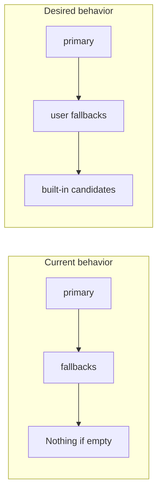

# Auto-fallback voice commands (no user config required)

## Problem

When `cursorDrive.voice.micCommand` is set to its default `workbench.action.chat.startVoiceChat`, and that command doesn't exist in the user's Cursor version, the code only tries that one command plus `micCommandFallbacks` (empty by default). It **never** tries the built-in alternatives like `composer.toggleVoiceDictation`.



## Root cause

In [src/voiceCommands.ts](src/voiceCommands.ts), the execute functions use:

```typescript
const candidates = primary
  ? [primary, ...fallbacks]   // Only primary + user fallbacks
  : [...MIC_START_CANDIDATES, ...fallbacks];
```

When `primary` is set, built-in candidates are never appended.

## Fix

Change all four execute functions (`executeChatOpen`, `executeMicStart`, `executeMicStopSubmit`, `executeMicStopCancel`) to **always** append the built-in candidates after the user's primary and fallbacks, deduplicating:

```typescript
// executeMicStart example
const userCandidates = primary ? [primary, ...fallbacks] : [...fallbacks];
const builtIn = [...MIC_START_CANDIDATES];
const candidates = [...userCandidates, ...builtIn.filter(c => !userCandidates.includes(c))];
return tryFirstExecute(candidates, []);
```

Apply the same pattern to:
- `executeChatOpen` — append `CHAT_OPEN_CANDIDATES`
- `executeMicStart` — append `MIC_START_CANDIDATES`
- `executeMicStopSubmit` — append `MIC_STOP_SUBMIT_CANDIDATES`
- `executeMicStopCancel` — append `MIC_STOP_CANCEL_CANDIDATES`

## Result

- User gets automatic fallback to `composer.toggleVoiceDictation` when `workbench.action.chat.startVoiceChat` doesn't exist
- No settings changes required
- `micCommandFallbacks` / `chatOpenFallbacks` / `stopCommandFallbacks` remain for **additional** user-specified commands (inserted before built-ins)
