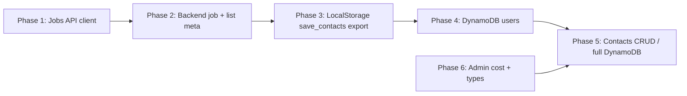

# Backend and frontend integration implementation

## Scope

This plan implements each item from the subagent review synthesis in a logical order: frontend–backend alignment first, then backend API and storage fixes, then cloud (DynamoDB) readiness.

---

## Phase 1: Frontend–backend — Jobs and API client

**Goal:** Jobs list works end-to-end; frontend uses the shared API client and correct path.

### 1.1 Add `getJobs` to api-client and fix use-jobs

- **Backend route:** `GET /api/v1/jobs` already exists ([`roler/src/roler/web/routers/jobs.py`](roler/src/roler/web/routers/jobs.py)); frontend calls wrong path.
- **Frontend:**
  - In [`roler_ui/src/lib/api-client.ts`](roler_ui/src/lib/api-client.ts): Add `getJobs(params?: { companyName?, titleContains?, remoteOnly?, minSalary?, postedAfter?, skills?, limit?, offset? })` that calls `fetchWithAuth(getBaseUrl() + "/jobs?" + new URLSearchParams(...))`, parses JSON, and returns the envelope (data + meta). Reuse existing pattern (e.g. `getProfile`, `getApplications`). Ensure query params match backend (snake_case in URL; backend uses `company_name`, `title_contains`, etc.).
  - Add a `JobPostingItem` or list type to [`roler_ui/src/types/api.ts`](roler_ui/src/types/api.ts) if missing (align with backend `JobPostingItem` / collection response).
  - In [`roler_ui/src/hooks/use-jobs.ts`](roler_ui/src/hooks/use-jobs.ts): Replace `fetch("/api/jobs?...")` with a call to the new `getJobs` from api-client, using `getBaseUrl()`-based URL so it hits `/api/v1/jobs`. Pass through filters (role → titleContains or equivalent, location, remote) to the API client. Handle the response envelope (data, meta, error).

**Acceptance:** Jobs list on the frontend loads from `GET /api/v1/jobs` with auth; no 404.

### 1.2 (Optional) Email/password login UI

- Backend already has `POST /api/v1/auth/login` (email/password). Add a small login form (e.g. on landing or a dedicated route) that calls `login()` from [`roler_ui/src/lib/auth-client.ts`](roler_ui/src/lib/auth-client.ts) and stores tokens. Document in README or API-INTEGRATION.md that OAuth and dev token remain supported.

### 1.3 (Optional) Dashboard route protection

- If dashboard must be auth-only: wrap the dashboard route in `ProtectedRoute` (same pattern as `/admin`) in the router so unauthenticated users are redirected to login/landing.

### 1.4 (Optional) Outreach and tailoring api-client and hooks

- Backend has `GET/POST /api/v1/outreach`, `GET /api/v1/contacts`, `GET/POST /api/v1/jobs/{job_id}/tailored`, `PATCH /api/v1/tailored/{doc_id}`. Add to api-client: `getOutreach`, `createOutreach`, `getContacts`; `getTailoredDoc(jobId)`, `createTailoredDoc(jobId, body)`, `updateTailoredDoc(docId, body)`. Add types to `api.ts` to match backend DTOs. Add hooks `use-outreach.ts`, `use-contacts.ts`, `use-tailored-doc.ts` that use these and React Query. Only required if UI screens for outreach/tailoring are in scope.

---

## Phase 2: Backend API — Job by ID, delete job, list meta

**Goal:** Jobs API supports get-by-id and delete; list endpoints return correct total for pagination.

### 2.1 GET and DELETE job by ID

- **Service:** In [`roler/src/roler/web/services/job_service.py`](roler/src/roler/web/services/job_service.py): Add `get_job(self, job_id: UUID) -> JobPosting | None` and `delete_job(self, job_id: UUID) -> None` that delegate to `self._storage.get_job(job_id)` and `self._storage.delete_job(job_id)`.
- **Router:** In [`roler/src/roler/web/routers/jobs.py`](roler/src/roler/web/routers/jobs.py): Add `GET /jobs/{job_id}` (return single `JobPostingItem` or 404) and `DELETE /jobs/{job_id}` (204 or 404). Use same `job_posting_to_item` and `_get_job_service`; add a `_not_found()` helper if desired.
- **LocalStorage:** Already implements `get_job` and `delete_job`; BaseStorage has default no-op for `delete_job` — LocalStorage overrides it. Confirm [`roler/src/roler/shared/storage/local.py`](roler/src/roler/shared/storage/local.py) implements `delete_job`; if not, implement it (delete row from job_postings and any FTS row).

**Acceptance:** `GET /api/v1/jobs/{id}` and `DELETE /api/v1/jobs/{id}` work with auth; 404 when not found.

### 2.2 List meta: use storage count for jobs and applications

- **Jobs:** In [`roler/src/roler/web/routers/jobs.py`](roler/src/roler/web/routers/jobs.py): Build `JobFilters` the same way as for `list_jobs`. Call `await service.count_jobs(filters)` (add `count_jobs` to JobService that delegates to `storage.count_jobs(filters)`). Set `meta = CollectionMeta(total=total, limit=limit, offset=offset)` instead of `total=len(items)`.
- **JobService:** Add `async def count_jobs(self, filters: JobFilters | None = None) -> int` that calls `self._storage.count_jobs(filters)`.
- **Applications:** In [`roler/src/roler/web/routers/applications.py`](roler/src/roler/web/routers/applications.py): Build `ApplicationFilters` from the same query params (status, limit, offset). Call `await service.count_applications(filters)` (add to ApplicationService). Set `meta = CollectionMeta(total=total, limit=limit, offset=offset)`.
- **ApplicationService:** Add `async def count_applications(self, filters: ApplicationFilters | None = None) -> int` that calls `self._storage.count_applications(filters)`.

**Acceptance:** GET /api/v1/jobs and GET /api/v1/applications return `meta.total` equal to full count (respecting filters), not just the current page length.

---

## Phase 3: Storage — LocalStorage protocol compliance

**Goal:** LocalStorage implements all protocol methods that are currently only on the Protocol (or no-op in BaseStorage).

### 3.1 Implement save_contacts and export_records in LocalStorage

- **save_contacts:** In [`roler/src/roler/shared/storage/local.py`](roler/src/roler/shared/storage/local.py): Implement `async def save_contacts(self, contacts: list[Contact]) -> None` by iterating and calling existing `save_contact(contact)` for each (same pattern as BaseStorage.save_jobs). If Contact serialization already exists for single save_contact, reuse it.
- **export_records:** Implement `async def export_records(self, entity_types: list[str] | None = None) -> AsyncIterator[dict[str, Any]]`. If `entity_types` is None, export in dependency order (e.g. companies → jobs → applications → contacts → outreach_emails → pipeline_runs → tailored_documents → resume_versions; adjust to match schema). For each entity, yield dicts (e.g. from domain model `model_dump` or existing serialization). If `entity_types` is set, only export those types. Use async generator (`yield`) so it is an AsyncIterator. Prefer reusing existing list/get methods to avoid duplicating serialization.

**Acceptance:** No caller currently requires these; acceptance is that LocalStorage no longer has “protocol-only” methods and unit tests (if any) for storage pass. Optional: add a minimal test that save_contacts persists and export_records yields at least one record type.

---

## Phase 4: DynamoDB — User operations for OAuth

**Goal:** Cloud deployment can persist and look up users for OAuth; auth callbacks succeed with DynamoDB backend.

### 4.1 Implement user table and methods in DynamoDBStorage

- **Schema (ADR-0020):** users table with partition key `id`; support get by email and get by provider (GSI or scan with filter; ADR-0020 table list shows users with no sort key and no GSIs — so get_user_by_email and get_user_by_provider may require a GSI on email and a composite on provider+provider_id, or document that they are implemented via scan until a GSI is added).
- **Implementation:** In [`roler/src/roler/shared/storage/dynamodb.py`](roler/src/roler/shared/storage/dynamodb.py): Override `save_user`, `get_user_by_id`, `get_user_by_email`, `get_user_by_provider`. Use aioboto3 DynamoDB resource; table name `_table_name("users")`. Serialize User model to DynamoDB item (UUID → str, datetime → ISO string, password_hash and provider fields as per User model). For get_user_by_id use get_item; for get_user_by_email and get_user_by_provider use query on a GSI if added, or scan with FilterExpression (limit 1) for minimal implementation. Ensure Terraform or migration creates the users table and optional GSIs.
- **Migrations / Terraform:** If roler uses Terraform for DynamoDB tables, add users table (and GSIs) there; otherwise document the table key schema and any one-off creation script. Align with [`roler/docs/adr/0020-cloud-storage-architecture.md`](roler/docs/adr/0020-cloud-storage-architecture.md).

**Acceptance:** With backend configured to use DynamoDB and users table present, OAuth callback (e.g. Google) creates/updates user via save_user and subsequent get_user_by_provider returns the user.

---

## Phase 5 (Optional): Contacts CRUD and full DynamoDB entities

### 5.1 (Optional) Contacts CRUD API

- If product needs standalone contact management: add `POST /api/v1/contacts`, `GET /api/v1/contacts/{contact_id}`, `PATCH /api/v1/contacts/{contact_id}`, `DELETE /api/v1/contacts/{contact_id}`. Wire to ApplicationService or a new ContactService using existing storage methods (`save_contact`, `get_contact`, `list_contacts`). Reuse or add Pydantic request/response schemas.

### 5.2 (Optional) Full DynamoDB implementation

- Per ADR-0020: implement in DynamoDBStorage all remaining entities (jobs, companies, applications, contacts, outreach, pipeline_runs, tailored_documents, resume_versions) and their count/analytics methods. This is a larger body of work (partition/sort keys, GSIs, S3 for large blobs); treat as a separate plan or follow-on phases after user operations and backend API fixes are done.

---

## Phase 6 (Optional): Admin cost metadata and OpenAPI types

- **Admin costs:** Ensure pipeline runner writes `metadata["tokens_used"]` (or the key admin expects) into `PipelineRunRecord.metadata` when saving runs, so GET /api/v1/admin/costs returns meaningful data.
- **Types:** Optionally add a step to generate frontend types (or API client) from FastAPI OpenAPI spec (e.g. `openapi.json`) and document in roler_ui (e.g. in API-INTEGRATION.md) to avoid drift.

---

## Dependency order

- Phases 1 and 2 can be parallelized (frontend vs backend).
- Phase 3 is independent; Phase 4 depends on having a users table (Terraform/migration).
- Phase 5 and 6 are optional and can be scheduled after 1–4.

---

## Summary of deliverables

| Phase | Deliverables |
|-------|--------------|
| 1 | api-client `getJobs`; use-jobs uses it; optional: login form, ProtectedRoute dashboard, outreach/tailoring client + hooks |
| 2 | JobService get_job, delete_job; GET/DELETE /jobs/{id}; JobService.count_jobs, ApplicationService.count_applications; list endpoints use count for meta.total |
| 3 | LocalStorage.save_contacts, LocalStorage.export_records |
| 4 | DynamoDBStorage save_user, get_user_by_id, get_user_by_email, get_user_by_provider; users table (and GSIs if needed) |
| 5 | Optional: contacts CRUD routes; full DynamoDB entity implementation |
| 6 | Optional: pipeline writes tokens_used into run metadata; OpenAPI-based type generation docs |
