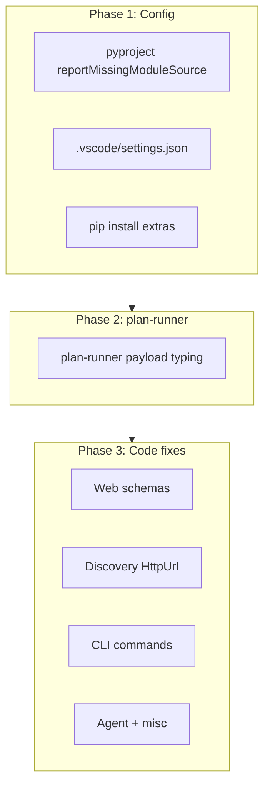

# Basedpyright Root Cause Fixes — Implementation Plan

## Subagent Findings Summary

| Area | Status | Action |
|------|--------|--------|
| **contract_name** | All 27 subclasses already use `str = "X"` | No change |
| **AgentProvider protocol** | Already has `return` + `yield` fix | No change |
| **plan-runner payload** | Needs explicit type | Fix |
| **basedpyright config** | `reportMissingModuleSource = "warning"` | Change to `"none"` |
| **.vscode/settings.json** | Does not exist | Create |
| **reportMissingImports** | Venv/extras | Install + select venv |

---

## Phase 1: Config and Environment (Highest Impact)

### 1.1 Update [pyproject.toml](roler/pyproject.toml) basedpyright config

Change line 219:
```toml
reportMissingModuleSource = "none"
```

Optional: add `exclude = ["docs/**"]` to skip `docs/portable` from type-checking.

### 1.2 Create [.vscode/settings.json](roler/.vscode/settings.json)

```json
{
  "python.defaultInterpreterPath": "${workspaceFolder}/.venv/Scripts/python.exe"
}
```

Note: Use `.venv/bin/python` for Unix/macOS.

### 1.3 Install full extras

```bash
pip install -e ".[dev,web,pdf,agent,browser]"
```

This resolves most `reportMissingImports` (typer, pydantic, fastapi, claude_agent_sdk, playwright, etc.) when the IDE uses the project venv.

---

## Phase 2: plan-runner.py Fix

### 2.1 Fix [docs/portable/cursor/hooks/plan-runner.py](roler/docs/portable/cursor/hooks/plan-runner.py)

In `emit()` (around line 31), add explicit type for `payload`:

```python
def emit(decision: str, reason: str, details: Optional[Dict[str, Any]] = None) -> int:
    payload: dict[str, Any] = {"decision": decision, "reason": reason}
    if details:
        payload["details"] = details
    ...
```

Requires `from typing import Any` if not already imported.

---

## Phase 3: Per-File Type Fixes (Prioritized)

Subagent analysis grouped remaining issues by fix pattern. Apply in this order:

### 3.1 Web schemas (profile, requests, responses)

- **Files:** [src/roler/web/schemas/profile.py](roler/src/roler/web/schemas/profile.py), [requests.py](roler/src/roler/web/schemas/requests.py), [responses.py](roler/src/roler/web/schemas/responses.py)
- **Pattern:** Add `dict[str, Any]` type arguments; fix Pydantic `model_config` / `ConfigDict` usage if needed
- **Count:** ~20 errors across 3 files

### 3.2 Discovery sources and parsers (HttpUrl)

- **Files:** [discovery/parsers/apple.py](roler/src/roler/discovery/parsers/apple.py), [cursor.py](roler/src/roler/discovery/parsers/cursor.py), [sources/greenhouse.py](roler/src/roler/discovery/sources/greenhouse.py), [lever.py](roler/src/roler/discovery/sources/lever.py), [demo.py](roler/src/roler/discovery/sources/demo.py)
- **Pattern:** Use `HttpUrl(str_value)` or `HttpUrl.model_validate(str_value)` for `str` to `HttpUrl` conversions
- **Count:** ~15 errors

### 3.3 CLI commands

- **profile.py (108–109):** Add guards `name or ""`, `email or ""` before `create_profile`
- **resume.py:** Fix Typer `Option` + Path handling (path_type or callback)
- **outreach.py (45), tailor.py (173):** Add proper type for profile storage (avoid `object`)
- **serve.py (30):** Use `HTTPException(status_code=503, detail="...")` with `int` status code

### 3.4 Agent and other

- **cursor_backend.py (91):** Type `result` from `subprocess.run` as `CompletedProcess[str]` or use cast
- **web/middleware/errors.py (74):** Adjust exception handler signature for `RequestValidationError`
- **data_contracts/entities/resume.py:** If `contract_name` uses `Literal`, change to `str = "ResumeDTO"`; add `id or ""` guard if needed

### 3.5 Discovery models and services

- **discovery/models.py, service.py:** Add `dict[str, Any]`, `Task[...]` type arguments where missing
- **web/services/profile_service.py:** Add `dict[str, Any]` where needed

---

## Phase 4: Optional / Lower Priority

- **test_ralph_loop.py:** Fix `reportRedeclaration` — remove or rename duplicate `_make_mock_agent`
- **recon/email_finder.py:** Fix `reportIncompatibleMethodOverride` for `format` method (align signature with `str.format`)
- **ralph_loop.py:** Fix `reportInvalidTypeForm` (variable in type expression)
- **hooks/** (context, intelligence, logger, orchestration): Add guards for `reportOptionalMemberAccess`

---

## Verification

After each phase:

```bash
python -m basedpyright src tests 2>&1 | head -80
```

Or rely on IDE diagnostics after reloading the window.

---

## Dependency Graph



---

## References

- [basedpyright-root-cause-solution-plan.md](roler/docs/status/basedpyright-root-cause-solution-plan.md) — full analysis
- Subagent IDs: explore (318fec73, 6c5ee781, 08456804, d0ca64c1)
