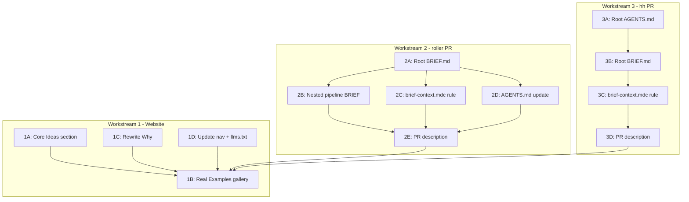

# BRIEF.md Showcase, Website, and Large-Codebase Adoption

## Strategic Frame

BRIEF.md is not an agent-ignore file. The novel contribution is **graduated context control with ordering, scoping, lifecycle, and observability**. The three proof points:

1. **Website** — Articulate the primitives clearly; show real examples
2. **roller** — Rich Python codebase (211 .py, 27 skills, 25 agents, 11 module-local AGENTS.md). Ideal first adoption: complex enough to demonstrate all primitives
3. **hh** — The origin repo (Discord agent, 12 plans, 5 agents, ADRs). Closes the loop

---

## Workstream 1: Website Expansion

**Current state:** Single-page static site (`website/index.html` + `styles.css`), deployed via GitHub Pages. Has: Why, Example, GitHub AW, Get Started, How it fits in, FAQ.

### 1A. Add "Core Ideas" section to index.html

New section between "Why" and "Example" — one card per primitive:

- **Graduated read modes** — Not binary. Full / Signatures / Headings / Exclude. Show token savings (2M -> 400K).
- **Discovery ordering** — Sequence matters. Read AGENTS.md first, then config, then explore.
- **First-match-wins** — Specific before general. Order = intent.
- **Per-agent scoping** — Different agents, different views. Bounded context.
- **Triggers** — File events auto-delegate. Reactive, not passive.
- **Lifecycle** — Compress, checkpoint, handoff. Context management over time.
- **Audit** — Expected vs actual. CI gate for context.
- **Directory overrides** — Nested BRIEF per package. Monorepo-ready.
- **Zero config** — Built-in conventions. Add BRIEF to customize.

**Layout:** CSS grid, 3 columns desktop, 1 column mobile. Each card: title, one-liner, minimal code snippet. Reuse existing `.level` card styling from Get Started section.

**Files to edit:**
- [website/index.html](website/index.html) — Add `<section id="ideas">` with card grid
- [website/styles.css](website/styles.css) — Add `.ideas-grid` CSS (grid, cards)

### 1B. Add "Real Examples" section

Replace the single inline example with a gallery showing roller and hh briefs:

- **roller** — "500-file Python codebase with 27 skills and 25 agents"
- **hh** — "Discord agent with 12 plans and architecture docs"
- Keep existing minimal example as "Simple API" starter

Each example: project description, full BRIEF.md in a copy-able block, annotation of which primitives it uses.

**Files to edit:**
- [website/index.html](website/index.html) — Expand `<section id="example">` into gallery

### 1C. Rewrite "Why" with reframed narrative

Current "Why" still references "information asymmetry" framing (already partially reframed). Tighten to:
- Problem: Without centralized policy, agents waste tokens and miss files
- Solution: Graduated guardrails (not binary), ordered discovery, per-agent scoping
- Differentiator: "Not an ignore file — a query plan for agent context"

### 1D. Update sidebar nav

Add entries for new sections: "Core ideas", update "Example" to "Examples".

### 1E. Update llms.txt

Add new sections and real example links.

---

## Workstream 2: roller BRIEF.md (PR Plan)

**Repo:** `c:\Users\harri\Documents\Coding Projects\fun\roller`
**Profile:** Python 3.14+, 211 .py files, 439 .md files, 27 skills, 25 agents, 11 module-local AGENTS.md, 4 plans, 9 rules, langgraph orchestration, Terraform

### 2A. Root BRIEF.md

```markdown
---
version: "0.1"
scope: global
---

# Brief

AI-powered job application automation. Discover roles, tailor resumes,
apply, and reach recruiters. Python 3.14+, langgraph orchestration,
Cursor agent integration.

## Discovery

AGENTS.md
BRIEF.md
docs/guides/architecture/architecture-overview.md
docs/adr/INDEX.md
src/roller/core/
src/roller/pipeline/
src/roller/models/
pyproject.toml

## Context

### Read full
AGENTS.md
BRIEF.md
src/roller/**/AGENTS.md
.cursor/rules/*.mdc
.cursor/skills/**/SKILL.md
.cursor/agents/*.md
.cursor/plans/*.plan.md
docs/adr/*.md
pyproject.toml
src/roller/core/**

### Signatures only
src/**/*.py
tests/**/*.py

### Headings only
README.md
docs/**/*.md

### Exclude
.git/**
.venv/**
__pycache__/**
node_modules/**
*.log
.env
data/packets/**
data/resumes/**
terraform/.terraform/**
*.pyc

## Agents

### test-runner
tests/**
src/roller/**

### code-reviewer (readonly)
src/roller/**
.cursor/rules/*.mdc
docs/adr/*.md

### documentation-writer
docs/**
README.md
src/roller/**/AGENTS.md

### plan-governor (readonly)
.cursor/plans/**
docs/plans/**

## Triggers

src/**/*.py : modified → test-runner
docs/adr/** : modified → code-reviewer

## Lifecycle

compress_at: 0.80
stale_after: 50
checkpoint_on: session_end
privacy: internal

## Audit

### Always expect
AGENTS.md
BRIEF.md
pyproject.toml

### Log unexpected
true
```

**Key design decisions:**
- `src/roller/core/**` as Read full — these are the core interfaces everything depends on
- All module-local `AGENTS.md` as Read full — they contain invariants and contracts
- `data/packets/**` and `data/resumes/**` excluded — user data, not code context
- `terraform/.terraform/**` excluded — provider cache
- Agents mapped to existing roller agent definitions (25 agents, pick the 4 most common)
- Discovery starts with AGENTS.md, architecture overview, ADR index, then core source

### 2B. Nested BRIEF.md overrides (demonstrates Primitive #10)

Add `src/roller/pipeline/BRIEF.md`:

```markdown
# Brief

Pipeline orchestration module. Stage ordering is data:
discovery → analysis → tailoring → application → recon → outreach.

## Discovery

AGENTS.md
src/roller/pipeline/stages.py
src/roller/pipeline/orchestrator.py
src/roller/pipeline/hooks.py

## Context

### Read full
src/roller/pipeline/AGENTS.md
src/roller/pipeline/stages.py
src/roller/pipeline/orchestrator.py

### Signatures only
src/roller/pipeline/**/*.py

### Exclude
src/roller/pipeline/__pycache__/**
```

### 2C. Cursor rule + skill integration

Add `.cursor/rules/brief-context.mdc` (copy from briefs repo, adapt paths).

### 2D. AGENTS.md update

Add one line to roller's root AGENTS.md:

```markdown
**Context lifecycle:** This project uses [BRIEF.md](BRIEF.md) for agent context management. Read BRIEF.md at session start.
```

### 2E. PR description (draft)

**Title:** `Add BRIEF.md for agent context lifecycle`

**Body:**
- Adds declarative context policy via BRIEF.md (spec: https://github.com/hhalperin/briefs)
- Graduated read modes: Signatures for 211 .py files (~70% token savings), Headings for 439 .md files (~80%), Read full for core interfaces and agent contracts
- Discovery ordering: AGENTS.md -> architecture overview -> ADR index -> core source
- Subagent scoping: test-runner, code-reviewer, documentation-writer, plan-governor
- Nested override: `src/roller/pipeline/BRIEF.md` for stage-specific context
- Excludes: user data (packets, resumes), deps, logs, terraform cache
- No code changes — context policy only

**Files in PR:**
- `BRIEF.md` (root)
- `src/roller/pipeline/BRIEF.md` (nested override)
- `.cursor/rules/brief-context.mdc` (enforcement rule)
- `AGENTS.md` (one-line addition)

---

## Workstream 3: hh BRIEF.md (PR Plan)

**Repo:** `c:\Users\harri\Documents\Coding Projects\fun\hh`
**Profile:** Python 3.11+, TypeScript extension, Discord-native team agent, 5 agents, 7 rules, 6 skills, 12 plans, ADRs, planning-before-execution philosophy

**Note:** hh has no AGENTS.md. The PR should add both AGENTS.md and BRIEF.md.

### 3A. Root AGENTS.md (new)

hh currently has agent behavior spread across `.cursor/agents/*.md` and rules. Consolidate into root AGENTS.md:

```markdown
# hh Agent Instructions

Discord-native team agent for planning and execution orchestration.
Voice-first activation, planning-before-execution, hybrid Cursor/GitHub orchestration.

## Core Principles

**Plans first:** All implementation is driven by plans. Map work to plan TODOs.
See `.cursor/rules/plan-before-implementation.mdc`.

**Architecture first:** Major features require ADR alignment.
See `docs/architecture/` and `.cursor/rules/architecture-before-coding.mdc`.

**Privacy:** Strict defaults (ADR-0004). No PII in logs or responses without explicit consent.

**Context lifecycle:** This project uses [BRIEF.md](BRIEF.md) for agent context management.
Read BRIEF.md at session start.

## Quick Reference

| Need | Location |
|------|----------|
| Architecture docs | `docs/architecture/` |
| ADRs | `docs/architecture/adr/` |
| Active plans | `.cursor/plans/*.plan.md` |
| Agent definitions | `.cursor/agents/*.md` |
| Rules | `.cursor/rules/*.mdc` |
| Skills | `.cursor/skills/*/SKILL.md` |
```

### 3B. Root BRIEF.md

```markdown
---
version: "0.1"
scope: global
---

# Brief

Discord-native team agent. Voice-first activation, planning-before-execution,
hybrid Cursor/GitHub orchestration. Python 3.11+ backend, TypeScript extension.

## Discovery

AGENTS.md
BRIEF.md
docs/architecture/system-architecture.md
docs/architecture/data-flow.md
.cursor/plans/hh-project_root.plan.md
src/hh/
pyproject.toml

## Context

### Read full
AGENTS.md
BRIEF.md
.cursor/rules/*.mdc
.cursor/skills/**/SKILL.md
.cursor/agents/*.md
.cursor/plans/*.plan.md
docs/architecture/adr/*.md
pyproject.toml

### Signatures only
src/**/*.py
extension/src/**/*.ts
tests/**/*.py

### Headings only
README.md
docs/**/*.md

### Exclude
.git/**
.venv/**
__pycache__/**
node_modules/**
*.log
.env
dist/**
build/**
*.pyc
extension/out/**

## Agents

### plan-governor (readonly)
.cursor/plans/**
docs/architecture/adr/*.md

### architecture-guardian (readonly)
docs/architecture/**
src/hh/**

### test-runner
tests/**
src/hh/**

### verifier (readonly)
src/hh/**
tests/**
.cursor/plans/**

### integration-builder
src/hh/adapters/**
extension/src/**

## Triggers

src/**/*.py : modified → test-runner
docs/architecture/** : modified → architecture-guardian
.cursor/plans/** : todo_changed → plan-governor

## Lifecycle

compress_at: 0.80
stale_after: 50
checkpoint_on: session_end
privacy: strict

## Audit

### Always expect
AGENTS.md
BRIEF.md
docs/architecture/system-architecture.md

### Log unexpected
true
```

**Key design decisions:**
- `privacy: strict` — matches ADR-0004 (privacy strict default)
- Agents map 1:1 to existing `.cursor/agents/` definitions
- Discovery starts with architecture docs — aligns with planning-before-execution philosophy
- TypeScript extension source included as Signatures
- Plans as Read full — critical for plan-driven development
- Triggers use `todo_changed` for plan-governor — aligns with TODO-driven completion rule

### 3C. Cursor rule

Add `.cursor/rules/brief-context.mdc` (same as roller).

### 3D. PR description (draft)

**Title:** `Add AGENTS.md and BRIEF.md for agent context lifecycle`

**Body:**
- Adds root AGENTS.md consolidating agent behavior (was only in .cursor/agents/)
- Adds BRIEF.md with declarative context policy (spec: https://github.com/hhalperin/briefs)
- Graduated read modes: Signatures for Python/TypeScript, Headings for docs, Read full for plans/rules/ADRs
- Discovery: architecture docs first (aligns with planning-before-execution)
- Subagent scoping: plan-governor, architecture-guardian, test-runner, verifier, integration-builder (matches existing .cursor/agents/)
- Triggers: test-runner on code changes, architecture-guardian on doc changes, plan-governor on TODO changes
- Privacy: strict (ADR-0004)

**Files in PR:**
- `AGENTS.md` (new)
- `BRIEF.md` (new)
- `.cursor/rules/brief-context.mdc` (new)

---

## Execution Order



**Parallelism:** Workstreams 2 and 3 can run in parallel. Website examples (1B) depend on roller/hh BRIEF.md content being finalized. Core Ideas (1A) and Why rewrite (1C) can start immediately.

---

## What each PR demonstrates (primitive coverage)

| Primitive | roller PR | hh PR |
|-----------|-----------|-------|
| Centralized config | Root BRIEF.md | Root BRIEF.md + AGENTS.md |
| Graduated read modes | Signatures for 211 .py, Headings for 439 .md | Signatures for .py + .ts, Headings for docs |
| Discovery ordering | AGENTS -> architecture -> ADR -> core | AGENTS -> architecture -> plans -> src |
| Rule precedence | core/** Read full before src/**/*.py Signatures | plans Read full before docs Headings |
| Dot-agents layout | Not used (simple root BRIEF) | Not used (simple root BRIEF) |
| Subagent scoping | 4 agents scoped | 5 agents scoped (maps to existing) |
| Triggers | modified -> test-runner | modified + todo_changed |
| Lifecycle | compress_at, checkpoint_on | compress_at, privacy: strict |
| Audit | Always expect AGENTS.md, BRIEF.md | Always expect + system-architecture |
| Directory override | pipeline/ nested BRIEF | Not used |
| Zero config | N/A (explicit BRIEF) | N/A (explicit BRIEF) |
| Three-standard stack | AGENTS.md + BRIEF.md (skills via .cursor/) | AGENTS.md + BRIEF.md (skills via .cursor/) |
