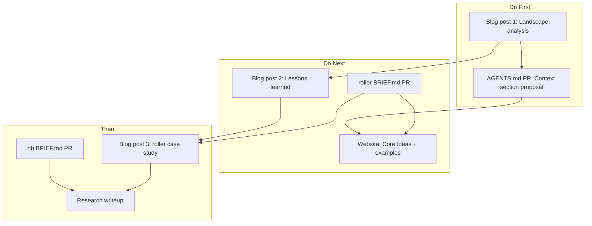

# BRIEF.md Visibility and Career Strategy

## Your edge

You have practical, cross-platform experience with agent orchestration that most people writing about this space don't. You've built two non-trivial agent systems (roller: 211 .py files, 27 skills, 25 agents; hh: Discord agent, 12 plans, 5 agents). You've identified a real gap (declarative context lifecycle) and done competitive analysis across Claude Code, Cursor, and Copilot. That combination — practitioner + systems thinker + standards awareness — is rare.

---

## Track 1: Blog Posts (Lead with this)

### Post 1: "How Claude Code, Cursor, and Copilot Handle Agent Context"

**Content:** The competitive analysis from this conversation. What each platform does, what none of them do, where they're converging.

**Structure:**

- The problem: agents waste tokens because context is ad hoc
- Platform-by-platform breakdown (CLAUDE.md, .cursor/rules, .instructions.md)
- The gap: no declarative read modes, no discovery ordering, no subagent scoping, no audit
- What a solution looks like (introduce BRIEF.md as one approach)

**Why it works:** Neutral analysis first, your proposal second. People share landscape analyses. It positions you as someone who understands the full ecosystem, not just one tool.

**Publish to:** Personal blog (GitHub Pages — you already have the infra), cross-post to dev.to, submit to HackerNews.

### Post 2: "What I Learned Building a Context Lifecycle Standard"

**Content:** Lessons from designing BRIEF.md. What's actually novel (graduated reading, discovery ordering), what isn't (exclude is table stakes), what scope-creep looks like, why platforms will eventually build this natively.

**Structure:**

- What I tried to build and why
- The primitives that survived (and the ones I cut)
- Honest assessment: what platforms already do, what's left
- Why the real moat is tooling/artifacts, not config
- What I'd do differently

**Why it works:** Honesty and self-awareness signal seniority. AI labs want people who can critically evaluate their own ideas.

### Post 3: "Building AI That Uses AI: Lessons from roller.ai"

**Content:** The roller codebase as a case study. 27 skills, 25 agents, module-local AGENTS.md contracts, pipeline orchestration. What worked, what broke, how agent-assisted development actually plays out at scale.

**Why it works:** Original practitioner content. Nobody else has "I built a 1000-file agent-orchestrated Python app and here's what happened." Relevant to every AI lab's developer tools team.

---

## Track 2: AGENTS.md PR (Highest signal-to-effort)

**Target:** [openai/agents.md](https://github.com/openai/agents.md) (17K stars)

**Proposal:** Open an issue or PR proposing a `## Context` section for the AGENTS.md spec. Not "adopt BRIEF.md" — rather, "here's a gap in the spec and here's a minimal proposal to address it."

**Proposed addition to AGENTS.md spec:**

```markdown
## Context (optional)

Declare which files agents should prioritize and how much to load.

### Discovery
Files to read first, in order, at session start.

### Read modes
- `Read full` — load entire content
- `Signatures only` — function names, types, docstrings
- `Headings only` — markdown structure
- `Exclude` — never load
```

**Why this works:**

- Your name on a PR in OpenAI's repo, visible to thousands
- Even if not merged, the discussion shows you identified a real gap
- The PR description IS the portfolio piece — link it everywhere
- If it IS merged, you literally shaped an adopted standard

**PR body should include:**

- The competitive analysis (Claude/Cursor/Copilot all have partial solutions, none have this)
- A minimal example
- Link to BRIEF.md as reference implementation
- Acknowledgment that this is optional/additive

---

## Track 3: Portfolio PRs (Interview depth)

### roller BRIEF.md PR

Already planned in detail (see [previous plan](c:\Users\harri.cursor\plans\brief_showcase_and_adoption_17c9dab7.plan.md)). The key talking points for interviews:

- "500-file Python codebase with 27 skills and 25 agents — here's the context policy I designed"
- "Signatures-only for 211 Python files saves ~70% tokens"
- "Nested BRIEF.md for the pipeline module demonstrates directory-level overrides"
- "Module-local AGENTS.md with invariants/contracts + BRIEF.md for context = complete agent governance"

### hh BRIEF.md + AGENTS.md PR

Also planned. The talking point:

- "Discord agent with 12 plans, 5 subagents, architecture docs — BRIEF.md integrates with existing planning-before-execution philosophy"
- "privacy: strict aligns with ADR-0004"

### External repo PR (optional, high visibility)

If a well-known OSS repo uses Cursor or has AGENTS.md, a PR adding BRIEF.md is a conversation starter. Candidates:

- MCP servers repo (modelcontextprotocol)
- Any repo from the Awesome AGENTS.md list with active maintenance

---

## Track 4: Research Writeup

**Title:** "Declarative Agent Context Management: A Survey and Proposal"

**Structure:**

1. Problem statement: finite context, token waste, ad hoc heuristics
2. Landscape survey: CLAUDE.md, .cursor/rules, .instructions.md, AGENTS.md
3. Gap analysis: what none of them do (graduated reading, ordering, scoping, audit)
4. BRIEF.md as proposal: spec summary, primitives, examples
5. Implementation: Cursor skill, built-in conventions, dot-agents layout
6. Evaluation: token savings estimates, qualitative assessment on roller/hh
7. Limitations and future work

**Format:** Not an academic paper (wrong venue). A structured technical report, ~10-15 pages, hosted on your site as PDF + web version. Link from GitHub, blog posts, social.

**Why it works for AI labs:** Applied research teams value structured analysis. This shows you can survey a space, identify gaps, propose solutions, and evaluate them. That's literally what applied researchers do.

---

## Track 5: Website as Hub

[hhalperin.github.io/briefs](https://hhalperin.github.io/briefs/) becomes the central hub linking everything:

- Blog posts (or links to them)
- The spec and examples
- Real-world examples (roller, hh)
- The competitive landscape analysis
- Link to the AGENTS.md PR
- The research writeup

Keep the current clean design. Add the "Core Ideas" section from the previous plan to explain primitives at a glance.

---

## Track 6: Social Distribution

Each deliverable gets a social push:

- **Blog post 1** (landscape analysis): Twitter thread summarizing key findings, link to full post. Tag Cursor, Anthropic, GitHub accounts.
- **AGENTS.md PR**: Tweet about it, tag OpenAI devrel. "I proposed a Context section for AGENTS.md — here's why agents need declarative context management."
- **Blog post 2** (lessons learned): More personal, shows self-awareness.
- **Blog post 3** (roller case study): "I built a 1000-file agent-orchestrated app. Here's what happened."

---

## Execution Order




**Rationale for order:**

- Blog post 1 is fastest (content exists from this conversation)
- AGENTS.md PR uses blog post 1 as supporting evidence
- roller PR creates the real example for blog post 3
- Research writeup comes last (highest effort, uses all other outputs as evidence)

---

## What each deliverable signals to different targets


| Deliverable              | AI lab devtools | AI lab research | AI tooling startup | Senior eng role |
| ------------------------ | --------------- | --------------- | ------------------ | --------------- |
| Blog post 1 (landscape)  | Strong          | Moderate        | Strong             | Moderate        |
| AGENTS.md PR             | Strong          | Strong          | Strong             | Moderate        |
| Blog post 2 (lessons)    | Moderate        | Strong          | Moderate           | Strong          |
| roller/hh PRs            | Moderate        | Weak            | Strong             | Strong          |
| Blog post 3 (case study) | Strong          | Moderate        | Strong             | Strong          |
| Research writeup         | Strong          | Strong          | Moderate           | Moderate        |
| Website                  | Moderate        | Moderate        | Strong             | Moderate        |
