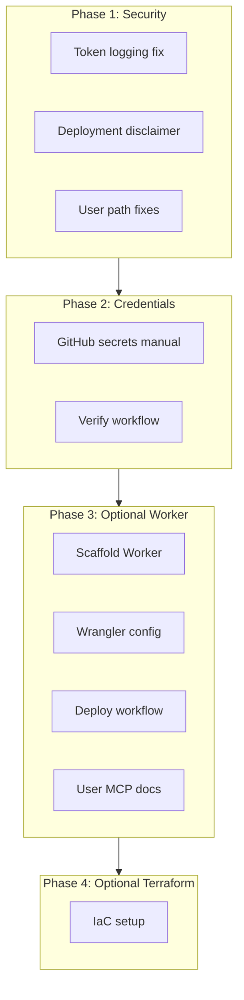

# Cloudflare Setup — All Phases

## Context

The codebase has Cloudflare docs, token scripts, and example configs but no deployed Worker. The plan closes gaps in security, credentials, and optional deployment.

---

## Phase 1: Security Fixes

**Goal:** Remove secret exposure and add deployment disclaimers.

### 1.1 Token logging fix ([scripts/create-cloudflare-token.mjs](scripts/create-cloudflare-token.mjs))

**Problem:** Lines 143–144 log the raw token to stdout:
```javascript
console.log("Created token. Add to CLOUDFLARE_API_TOKEN (shown once):");
console.log(secret);
```

**Fix options (choose one):**
- **A — readline noEcho:** Use Node `readline.createInterface` with `input: process.stdin` and prompt user to paste token into a secure field; write to clipboard via `clipboardy` or similar (add dep).
- **B — Instructions only:** Print instructions: "Token created. Copy from Cloudflare dashboard (token shown once there) or re-run with API_FIXER to create another." Do not output the secret at all — but the API returns it only in the create response, so user must capture it. **Simplest:** Use `readline` to show a one-time prompt: "Press Enter to copy token to clipboard (requires clipboardy)" or "Token created. It was copied to clipboard." — actually we need to either copy to clipboard (no stdout) or use a pty/secure prompt.
- **C — Clipboard + stderr message:** If `clipboardy` (or `npx clipboardy`) available: copy to clipboard, then `console.error("Token copied to clipboard. Add to CLOUDFLARE_API_TOKEN.")`. Never `console.log(secret)`.

**Recommended:** C — copy to clipboard when available; otherwise print instructions to manually create token via dashboard. Fallback: `console.error("Token created. Run with --copy flag or check script for clipboard support.")` and never log the value.

**Implementation:**
- Add optional `clipboardy` (or use `child_process` + `clip` / `xclip` for zero deps on some platforms).
- If clipboard fails, print: "Token created. Store it now — it will not be shown again. Add to CLOUDFLARE_API_TOKEN in .env or GitHub secrets."
- Audit [scripts/](scripts/) for other `console.log` of secrets (verify-cloudflare-token.mjs, trigger-cloudflare-test.mjs).

### 1.2 Deployment disclaimer ([docs/guides/cloudflare-workers-mcp-cicd.md](docs/guides/cloudflare-workers-mcp-cicd.md))

Add after the Overview table (around line 17):

```markdown
> **Deployment is opt-in.** This guide documents how to deploy; no deployment occurs automatically. Contributors must explicitly configure secrets and run deploy workflows. Do not add deploy workflows that trigger on push unless intended.
```

### 1.3 User-specific paths ([docs/reference/mcp-user-setup.md](docs/reference/mcp-user-setup.md))

Replace `C:\Users\harri\.env\` with platform-agnostic placeholders:
- Windows: `%USERPROFILE%\.env\` or `$env:USERPROFILE\.env\`
- Unix: `$HOME/.env/`

---

## Phase 2: Credentials and Verification

**Goal:** Ensure GitHub secrets and local env are correctly set and verified.

### 2.1 GitHub repository secrets

**Manual step (not automatable):** In repo Settings → Secrets and variables → Actions → Repository secrets, add:

| Secret | Value | Source |
|--------|-------|--------|
| `CLOUDFLARE_API_TOKEN` | Deploy token | Dashboard → Account API Tokens → Edit Cloudflare Workers, or `npm run cloudflare:create-token` |
| `CLOUDFLARE_ACCOUNT_ID` | Account ID | Workers & Pages → Account details |

### 2.2 Local .env

Ensure [.env.example](.env.example) documents:
- `CLOUDFLARE_API_TOKEN` — for verify script and local wrangler
- `CLOUDFLARE_ACCOUNT_ID` — for create-token and verify
- `API_FIXER` — optional; for create-token bootstrap

`.env` is already in [.gitignore](.gitignore).

### 2.3 Verification

- Run `npm run cloudflare:verify` locally (requires .env with token + account ID).
- Run Cloudflare Token Test workflow: Actions → Cloudflare Token Test → Run workflow.
- Or `npm run cloudflare:trigger` to trigger via API (requires `GITHUB_PERSONAL_ACCESS_TOKEN`).

---

## Phase 3: Optional Remote MCP Worker

**Goal:** Deploy a remote MCP server to Cloudflare Workers so users can connect via URL without running the extension.

### 3.1 Scaffold Worker project

**Option A — In-repo package:** Create `packages/worker/` or `worker/` with:

```
worker/
├── src/
│   └── index.ts    # MCP server entry
├── wrangler.toml
├── package.json
└── tsconfig.json
```

**Option B — Cloudflare template:** Run outside repo or in a subdir:
```bash
npm create cloudflare@latest -- cursor-drive-mcp --template=cloudflare/ai/demos/remote-mcp-authless
```
Then move/copy into repo (e.g. `packages/worker/`).

### 3.2 Wrangler config

Update [docs/guides/cloudflare-workers-mcp-cicd/wrangler.toml](docs/guides/cloudflare-workers-mcp-cicd/wrangler.toml) or create `worker/wrangler.toml`:

- `name` — e.g. `cursor-drive-mcp`
- `main` — actual entry (e.g. `src/index.ts`)
- `compatibility_date` — `2026-03-04` (current)
- `observability = { enabled = true }` — optional

### 3.3 Build and deploy workflow

Create `.github/workflows/deploy-cloudflare-worker.yml` (or similar), based on [docs/guides/cloudflare-workers-mcp-cicd/deploy-worker.yml](docs/guides/cloudflare-workers-mcp-cicd/deploy-worker.yml):

- Trigger: `workflow_dispatch` and optionally `push: branches: [main]` if deploy-on-push is desired.
- Steps: checkout → setup-node → `npm ci` → build Worker (`npm run build` in worker dir) → `cloudflare/wrangler-action@v3`.
- Set `workingDirectory: "packages/worker"` (or `worker/`) if Worker lives in a subdir.

### 3.4 User MCP config

After deployment, users add to `.cursor/mcp.json`:

```json
"cursor-drive-mcp": {
  "url": "https://cursor-drive-mcp.<subdomain>.workers.dev/mcp"
}
```

Subdomain from Cloudflare dashboard (Workers & Pages → workers.dev).

### 3.5 Documentation

- Add "Deploying the remote MCP" section to [docs/guides/cloudflare-workers-mcp-cicd.md](docs/guides/cloudflare-workers-mcp-cicd.md) or a dedicated `docs/guides/deploy-remote-mcp.md`.
- Document the Worker URL format and how to obtain it.

---

## Phase 4: Terraform IaC (Optional)

**Goal:** Manage Worker + related resources (KV, D1, DNS) as code.

- Use [docs/guides/cloudflare-workers-mcp-cicd/main.tf](docs/guides/cloudflare-workers-mcp-cicd/main.tf) as reference.
- Create `infra/` or `terraform/` with provider, variables, and Worker resources.
- Ensure `content_file` in `cloudflare_worker_version` points to built output (e.g. `dist/index.mjs`).
- Document: `terraform init`, `terraform plan -var="account_id=..."`, `terraform apply`.

---

## Execution Order



---

## Dependencies

| Phase | Depends on |
|-------|------------|
| 1 | None |
| 2 | Phase 1 (token fix before create-token is safe to use) |
| 3 | Phase 2 (secrets must exist to deploy) |
| 4 | Phase 3 (Worker must exist to manage via Terraform) |

---

## Out of Scope

- Cloudflare plugin/MCP for Cursor — already configured; OAuth on first connect.
- Drive extension MCP server (localhost:7891) — separate; runs in extension.
- Changing cloudflare-token-test.yml — already correct.
