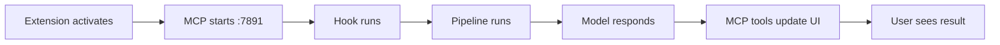
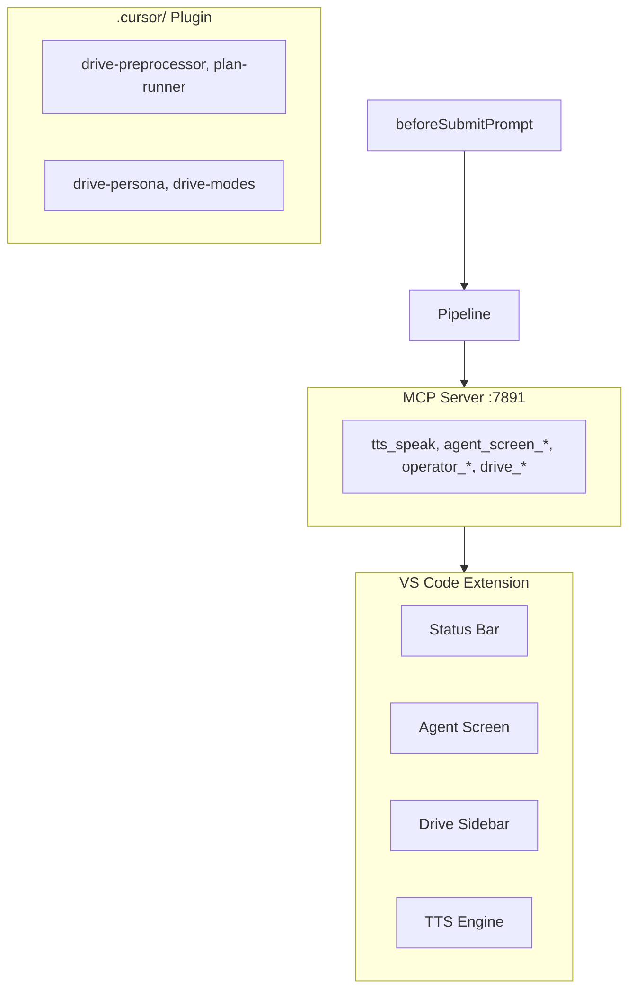
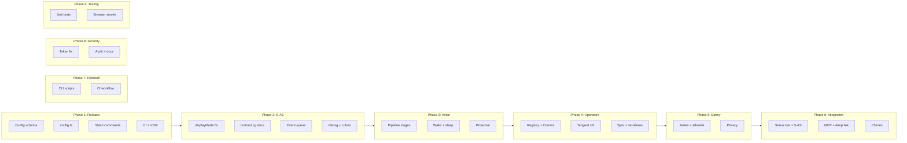
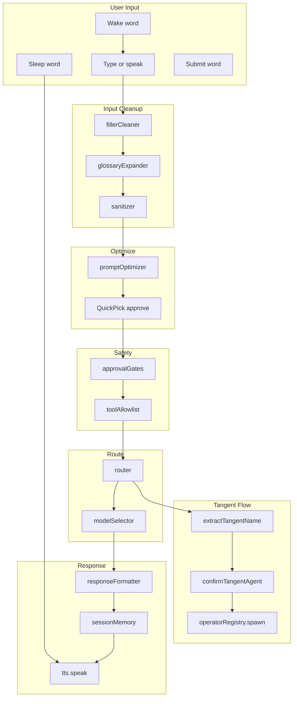
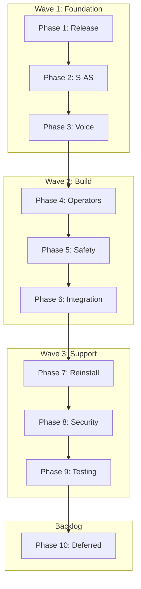
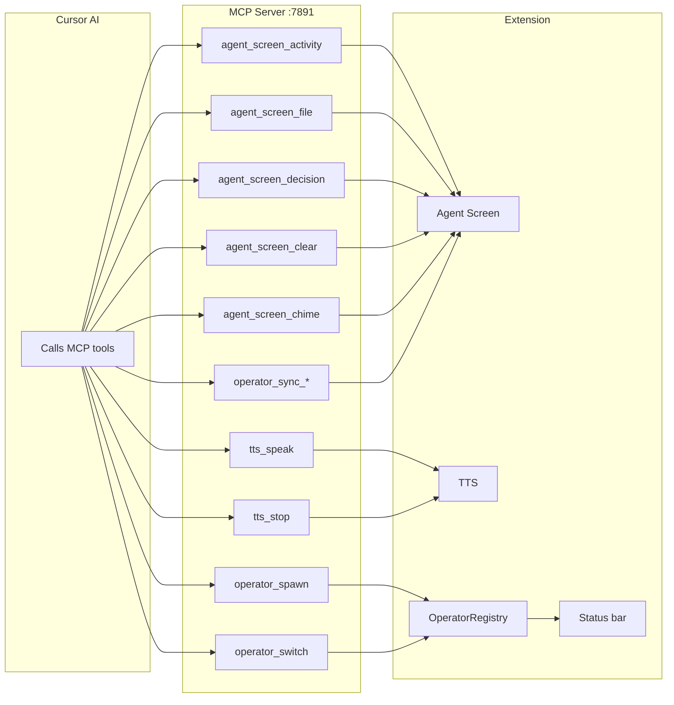
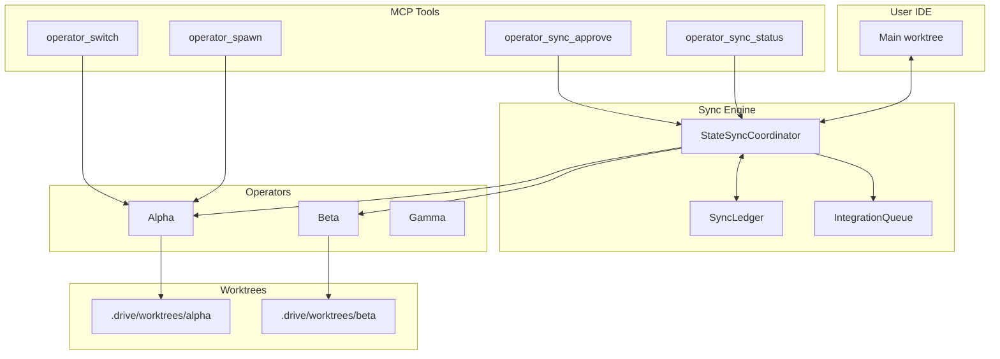
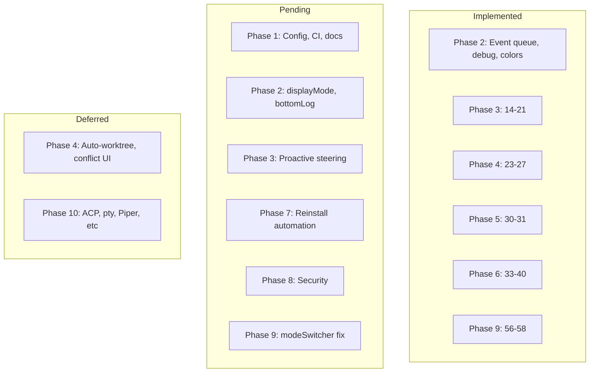
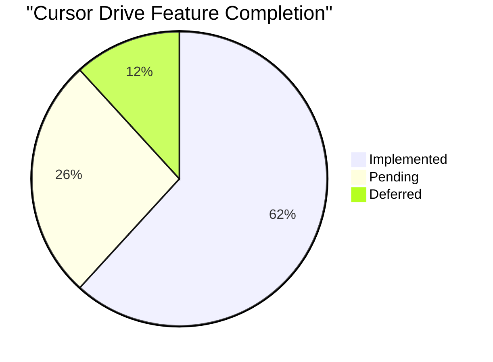
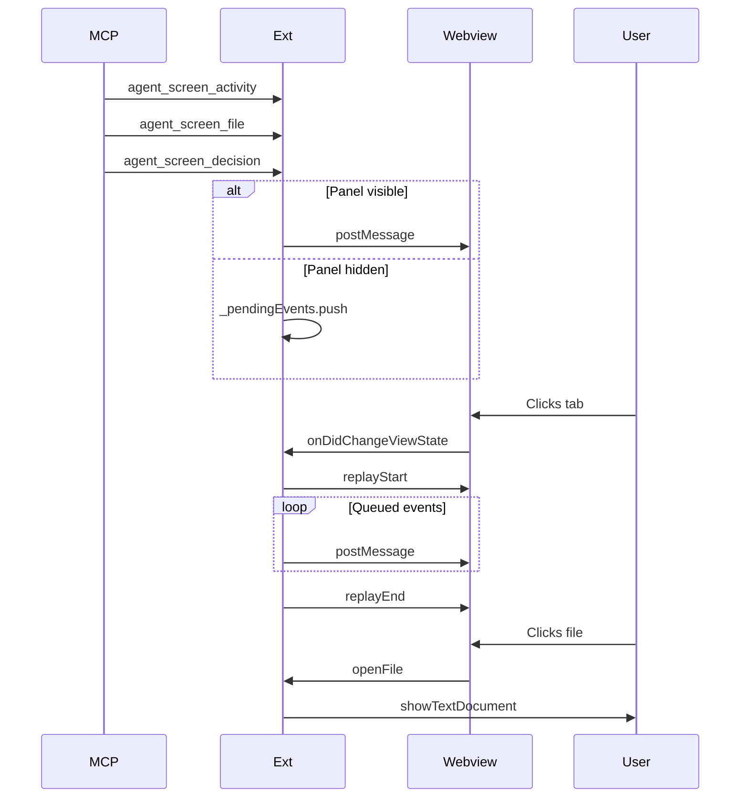

## Reconciliation (Orchestration Run)

**Date:** 2026-03-09

**Delegated:** 4 discovery subagents (vscode mock, agentScreen, glossary, config) → 4 execution subagents by file ownership → 1 verifier.

**Changed:**

- `tests/modeSwitcher.test.ts` — Added `onDidChangeConfiguration` to inline jest.mock
- `src/agentScreen.ts` — Fixed Unicode mojibake (†→ —, â†' → →)
- `package.json` — Added config schema keys (approvalGates, agents.permissions, sanitizer.maxLength, glossary, agent.sessionMemory, agent.proactiveSteering, agents.commsAgent, cloudAgents.apiBaseUrl)
- `src/glossaryExpander.ts` — Added `ensureRegex()` so customGlossary entries without regex compile correctly

**Verification:** `npm run compile` ok; `npm test` 552 passed, 1 skipped. All MVP blockers #1 (tests) and #2 (config schema) cleared.

**Open blockers:** None for MVP. Slash commands deferred. Smoke test (F5 → toggle → submit) remains manual.

---

### Run 2 (2026-03-09)

**Delegated:** 4 discovery subagents (config.ts, README/getting-started, displayMode/bottomLog, token fix) → 4 execution subagents by file ownership → 1 verifier.

**Changed:**

- `README.md` — Status section updated: removed mvp-gaps reference, added tests/config schema status
- `docs/guides/getting-started.md` — Node.js ≥18 → ≥20
- `package.json` — displayMode "panel" enumDescription "Same as tab (legacy)"; bottomLog "terminal-first/CLI recommended"
- `docs/reference/config-schema.md` — Source of truth clarified; bottomLog terminal-first note; panel legacy alias
- `src/config.ts` — New: readConfig(), DriveConfig, zod validation (mcp.port, agentScreen.displayMode, defaultSubMode)
- `tests/config.test.ts` — New: config shape tests (cursorDrive, agentScreen keys and defaults)

**Verification:** `npm run compile` ok; `npm test` 555 passed, 1 skipped.

**Open blockers:** None. Token fix (p8) already done; no code changes.

# Cursor Drive Master Plan

One consolidated plan for the full Cursor Drive extension. Aggregates features from:

- [.cursor/plans/](.cursor/plans/) (4 active plans)
- [.cursor/plans/archive/](.cursor/plans/archive/) (475+ archived plans; Drive-relevant subset)
- [docs/plans/cursor-drive-v1-release-plan.md](docs/plans/cursor-drive-v1-release-plan.md)
- [docs/plans/traceability-matrix.md](docs/plans/traceability-matrix.md)
- [docs/plans/mob-programming-cockpit-mvp.md](docs/plans/mob-programming-cockpit-mvp.md)
- PRDs 1–5, ADRs

**Excluded:** PR merge workflow (dev tooling), plan-orchestration-spec (governance only).

---

## MVP Plan: Build, Debug, Ship ASAP

### MVP Definition

**Core loop that must work:** User installs extension → toggles Drive (Ctrl+Shift+D) → submits prompt (type or voice) → pipeline processes it → model responds → Agent Screen shows activity. Optional: spawn operator via "tangent X — task".

**Out of scope for MVP:** Proactive steering, Piper/ElevenLabs TTS, Cloudflare Worker, reinstall CI automation, displayMode panel fix.

### Critical Path (What Can Block)




| Step | Blocker risk        | Verify how                                                                 |
| ---- | ------------------- | -------------------------------------------------------------------------- |
| A    | Activation throws   | F5 → check "Cursor Drive" output channel for `[Drive] activate() complete` |
| B    | Port in use         | Output shows `MCP server: listening on port 7891`                          |
| C    | Hook not registered | Drive: Install Plugin to Workspace; check `.cursor/hooks.json`             |
| D    | Pipeline throws     | Submit prompt with Drive ON; no crash = pipeline ran                       |
| E    | Model call fails    | Cursor handles; check chat for response                                    |
| F    | MCP tools fail      | Agent Screen shows activity when model calls `agent_screen_*`              |


### Minimal Blockers to Clear First


| #   | Blocker                      | Effort | Why                                                                                                                                                 |
| --- | ---------------------------- | ------ | --------------------------------------------------------------------------------------------------------------------------------------------------- |
| 1   | **Tests failing** (16 tests) | Low    | CI gate; masks regressions. Fix: modeSwitcher mock (`onDidChangeConfiguration`), agentScreen Unicode (→ vs —), glossaryExpander test/impl alignment |
| 2   | **Config schema gaps**       | Low    | Missing keys cause undefined config reads. Add to `package.json` contributes.configuration; no `config.ts` needed for MVP                           |
| 3   | **Slash commands**           | Defer  | Composer may not expose `command`; keyword routing works without                                                                                    |


### Debug-as-You-Go Strategy


| When                      | Action                                                                   |
| ------------------------- | ------------------------------------------------------------------------ |
| **After every change**    | `npm run compile` → `npm test` → fix or revert                           |
| **Before claiming done**  | F5 → toggle Drive → submit "hello" → confirm response + Agent Screen     |
| **When pipeline breaks**  | Output channel "Cursor Drive"; add `out.appendLine` at pipeline stages   |
| **When hook doesn't run** | Check Cursor Plugins output; verify `drive-preprocessor` in hooks.json   |
| **When MCP tools fail**   | `curl http://127.0.0.1:7891/health`; `cursorDrive.diagnose`              |
| **When tests fail**       | Read failure; fix mock or implementation; avoid "skip" unless documented |


### ASAP Execution Order

1. **Fix test failures** — modeSwitcher mock, agentScreen encoding, glossaryExpander
2. **Add config schema keys** — minimal set from v1-release-plan
3. **Smoke test** — `npm run reinstall:dev-sandbox` (or F5) → toggle → submit
4. **CI green** — `npm ci && npm run compile && npm test`
5. **VSIX** — `npx vsce package` → manual install in clean Cursor

### Files to Touch (MVP)


| File                                                          | Change                                               |
| ------------------------------------------------------------- | ---------------------------------------------------- |
| `tests/__mocks__/vscode.ts`                                   | Add `workspace.onDidChangeConfiguration`             |
| `tests/agentScreen.test.ts`                                   | Use ASCII or fix Unicode expectations                |
| `tests/glossaryExpander.test.ts` or `src/glossaryExpander.ts` | Align test expectations with implementation          |
| `package.json`                                                | Add missing config keys to contributes.configuration |


### Success Criteria

- `npm test` passes
- `npm run compile` passes
- F5 → Drive toggle → submit prompt → model responds
- Agent Screen shows activity when model uses `agent_screen_`*
- `npx vsce package` produces `.vsix`

### Dev Loop Cheat Sheet

```powershell
# One-time
npm ci
.\sandbox\setup-drive-dev.ps1   # junction for plugin in dev-host

# Iterate
npm run watch                   # leave running
# F5 -> Dev: Drive in sandbox
# Edit -> wait for watch -> Ctrl+Shift+P "Reload Window" in dev-host

# Verify
npm test
npm run compile
cursorDrive.diagnose            # in dev-host Command Palette

# Clean install
npm run reinstall:dev-sandbox
```

---

**Archive access:** `.cursor/plans/archive/` is in `.gitignore`. It is excluded from Cursor indexing via `.cursorignore` (line 15: `# .cursor/plans/archive/` — when commented, archive is accessible). To re-aggregate: ensure archive is readable (uncomment if needed), run aggregation via terminal (`Get-Content` or similar), then restore `.cursorignore` if desired.

---

## Architecture Wisdom

Deep software engineering principles applied to Cursor Drive. Use as a lens for design decisions, refactors, and debugging.

### 1. Layering & Dependency Direction

**Principle:** Dependencies flow inward. Outer layers depend on inner; inner layers know nothing of outer.

```
┌─────────────────────────────────────────────────────────────────┐
│  Host (Cursor IDE, VS Code API)                                  │
├─────────────────────────────────────────────────────────────────┤
│  Extension Host (extension.ts, commands, webviews)               │
├─────────────────────────────────────────────────────────────────┤
│  Services (pipeline, mcpServer, operatorRegistry, agentScreen)   │
├─────────────────────────────────────────────────────────────────┤
│  Domain (driveMode, router, modelSelector, approvalGates)        │
├─────────────────────────────────────────────────────────────────┤
│  Primitives (fillerCleaner, sanitizer, glossaryExpander)         │
└─────────────────────────────────────────────────────────────────┘
```

**Current reality:** `pipeline.ts` imports `AgentScreenPanel`, `speak`, `operatorRegistry` — it reaches into UI/IO. That's acceptable for a pipeline that orchestrates side effects, but the *logic* of each stage (filler, glossary, sanitizer) should be pure. **Refactor target:** Extract pure functions; inject side-effect handlers.

**Plugin layer (.cursor/):** Hooks and skills are *consumed* by Cursor; they don't import extension code. Clean boundary. Keep it.

---

### 2. Failure Modes & Resilience

**Principle:** Fail fast at boundaries; degrade gracefully in the middle.


| Boundary                  | Fail-fast behavior                                                                     | Graceful degradation                       |
| ------------------------- | -------------------------------------------------------------------------------------- | ------------------------------------------ |
| Extension activate        | If driveMode or operatorRegistry throws → log, show output, return (no half-extension) | —                                          |
| MCP server start          | If port in use → try next 15 ports; if all fail → warn, continue without MCP           | Extension works; AI can't call Drive tools |
| Hook (drive-preprocessor) | If Python missing or script errors → Cursor may skip; prompt goes through unprocessed  | User gets raw prompt; Drive layer bypassed |
| Pipeline stage            | If optimizer/model fails → fall back to unoptimized prompt                             | Never block the user                       |
| Agent Screen              | If webview fails → bottomLog or OutputChannel fallback                                 | User still sees activity                   |


**Gap:** No circuit breaker for MCP tool calls. If the model spams `agent_screen_activity` and the extension is slow, we could queue unbounded. **Mitigation:** `_pendingEvents` is capped (MAX_QUEUE 200); CommsAgent has bounded queue. Good.

**Recommendation:** Add a "pipeline degraded" indicator when hooks fail or MCP is unreachable — status bar hint or diagnose output.

---

### 3. Configuration & 12-Factor

**Principle:** Config over code. Environment-specific over hardcoded. Validate at the edge.

**Current:** `vscode.workspace.getConfiguration("cursorDrive.*")` scattered across 20+ modules. No single validation layer. Missing keys return `undefined` or default — silent misconfiguration.

**Fix:** Add `src/config.ts` with zod schemas. One place that reads all `cursorDrive.`* keys, validates, and exports typed config. Modules depend on config, not vscode directly. **For MVP:** At minimum, add schema to `package.json` so Settings UI shows keys; defer full config.ts.

**Secrets:** `context.secrets` for API keys — correct. Never log. Never in config schema.

---

### 4. Testing Strategy

**Principle:** Test behavior, not implementation. Prefer integration over unit for critical paths. Mocks are a liability — keep them minimal and accurate.

**Current gaps:**

- **modeSwitcher:** Mock lacks `onDidChangeConfiguration` — tests fail. **Fix:** Extend vscode mock; don't mock at a higher level than the code under test.
- **glossaryExpander:** Tests expect behavior (wake/submit strip, expansion) that may live in pipeline, not glossary. **Fix:** Clarify contract — does glossary expand only, or also strip? If strip is pipeline's job, tests are wrong.
- **agentScreen:** Unicode `→` vs `â†'` — encoding mismatch. **Fix:** Use ASCII in tests (`->`) or ensure file encoding is UTF-8 and Jest reads it correctly.

**Pyramid:** Many unit tests (536 pass); few integration. The critical path (hook → pipeline → MCP → UI) has no automated integration test. **Recommendation:** One smoke test that mocks Cursor's hook invocation and asserts pipeline output shape. Manual F5 remains the integration gate.

---

### 5. Observability

**Principle:** Logs, metrics, and traces answer "what happened?" when things break.

**Current:**

- **Logs:** Output channel "Cursor Drive" with `appendLine`. Good for activation, MCP port, errors. Pipeline has `PipelineStats` (run count, latency) — not yet exposed to logs.
- **Diagnostics:** `cursorDrive.diagnose` — vscode.lm, TTS, MCP port, operators. Excellent.
- **Traces:** None. No correlation IDs across hook → pipeline → MCP.

**Recommendations:**

- Emit `PipelineStats` to output channel on each run (or on demand via command) when log level is Debug.
- Add a `runId` to pipeline context; pass to MCP tool handlers; include in Agent Screen activity. Enables "show me everything for this run."
- For hooks: ensure drive-preprocessor logs to a visible channel when it invokes the pipeline endpoint.

---

### 6. State & Concurrency

**Principle:** State is the root of bugs. Minimize it. Make it explicit. Prefer event-driven over polling.

**Stateful components:**

- `driveMode` — active, subMode. Persisted to workspaceState. Single source of truth.
- `operatorRegistry` — Map of operators. In-memory. Lost on reload — acceptable.
- `sessionMemory` — turns, tasks. workspaceState.
- `_pendingEvents` — queue when Agent Screen hidden. Bounded. Good.
- `CommsAgent` — queue of background updates. Bounded. Good.

**Concurrency:** Extension host is single-threaded. MCP server handles HTTP on Node's event loop. No explicit locks. **Risk:** Rapid MCP tool calls could interleave with pipeline runs. Mitigated by Cursor's turn-based model — one prompt at a time.

**Recommendation:** Document the "single foreground turn" invariant. If Cursor ever allows concurrent agent turns, we'll need a concurrency model.

---

### 7. Security

**Principle:** Defense in depth. Least privilege. Never log secrets.

**Layers:**

- **Approval gates:** Scan prompt/response for dangerous ops. Block or warn. Good.
- **Tool allowlist:** Operators have presets (readonly, standard, full). Capability checks before tool execution. Good.
- **Privacy:** No transcript persistence by default. Redact in logs. ADR-0005.

**Gaps:**

- `create-cloudflare-token.mjs` logs raw token — HIGH. Fix: clipboard or instructions only.
- File audit of src/, scripts/, hooks for any `console.log` of secrets.
- `.cursorignore` for sensitive paths (tokens, .env).

---

### 8. API Contracts

**Principle:** Contracts should be explicit, versioned, and documented. Breaking changes require migration.

**MCP tools:** Zod schemas for params. Return values are ad-hoc. **Recommendation:** Add a `docs/reference/mcp-tools.md` section for each tool's return shape. Consider OpenAPI or JSON Schema for the HTTP MCP surface.

**Pipeline:** `PipelineResult` is a discriminated union. Good. `DriveContext` is passed in — ensure callers provide all required fields or we get runtime errors.

**Hook contract:** drive-preprocessor receives prompt, returns modified prompt or delegates. Contract: Cursor expects a string. If we return JSON or error, Cursor may break. **Document:** Hook must always return a valid prompt string.

---

### 9. Evolution & Extensibility

**Principle:** Open for extension, closed for modification. Prefer composition over inheritance.

**Extension points:**

- **Pipeline stages:** Currently a single function. To add a stage, edit pipeline.ts. **Future:** Stage registry; stages register by name; config enables/disables. Enables "add a custom pre-optimizer" without forking.
- **MCP tools:** New tools = new handler in mcpServer. No plugin mechanism. Acceptable for now.
- **TTS backends:** Web Speech, Piper, ElevenLabs — pluggable. Good.

**Backwards compatibility:** Config keys — adding new keys is safe. Removing or renaming breaks users. Use deprecation period.

---

### 10. Complexity & Technical Debt

**Principle:** Essential complexity (domain) vs accidental (tooling, legacy). Reduce accidental; accept essential.

**Accidental:**

- 475 archived plans — knowledge scattered. Master plan consolidates. Good.
- Glossary vs pipeline responsibility for wake/submit — unclear. Clarify and document.
- displayMode "panel" identical to "tab" — dead code. Remove or fix.

**Essential:**

- Pipeline has many stages — each serves a purpose. Don't collapse; ensure each is testable in isolation.
- Multi-operator + sync + worktrees — complex domain. Well-modularized (operatorRegistry, stateSyncCoordinator, integrationQueue). Keep boundaries clear.

**Debt register:** Maintain a "Tech Debt" section in the plan. Items: config.ts extraction, pipeline stage registry, hook contract doc, displayMode cleanup.

---

### 11. Deployment & Release

**Principle:** Build once, deploy many. Reproducible. Rollback possible.

**Current:** `npx vsce package` → `.vsix`. Manual install. No CI gate on packaging.

**Recommendations:**

- CI: `npm ci && npm run compile && npm test && npx vsce package`. Fail if any step fails.
- Version: Semantic. Bump on release. Changelog.
- Rollback: User uninstalls, installs older VSIX. No server-side state to migrate.

---

### 12. Summary: Priorities


| Priority | Action                                                |
| -------- | ----------------------------------------------------- |
| P0       | Fix test failures (mock, encoding, glossary contract) |
| P0       | Add config schema keys to package.json                |
| P1       | Document hook contract (always return prompt string)  |
| P1       | Token logging fix (create-cloudflare-token.mjs)       |
| P2       | Extract config.ts with zod; centralize config reads   |
| P2       | Pipeline stage registry for extensibility             |
| P3       | PipelineStats to logs; runId for traceability         |
| P3       | Remove or fix displayMode "panel"                     |


---

### 13. Error Handling Patterns

**Principle:** Catch at boundaries. Transform to domain errors. Never swallow.

**Patterns in use:** Extension activate: try/catch per service; log and return early if critical. Pipeline returns `{ ok: false }` or `{ ok: "checkpoint" }` — no thrown exceptions for business logic. MCP handlers wrap in try/catch; return error content to AI.

**Anti-pattern:** `catch (e) { /* silent */ }`. Every catch should log or rethrow.

---

### 14. Naming & Consistency

**Principle:** Names reveal intent. Consistency reduces cognitive load.

**Conventions:** Modules camelCase; exports PascalCase/camelCase; config `cursorDrive.<area>.<key>`; MCP tools `snake_case`. Use "Agent Screen (S-AS)" consistently in docs.

---

### 15. Documentation

**Principle:** Docs are code. Keep them close. Update with the code.

**Structure:** `docs/reference/` (config, mcp-tools) — single source of truth. `docs/design/` — rationale. `docs/guides/` — how-to. ADRs for decisions. Add an ADR when making non-obvious architectural choices.

---

### 16. Uncertainty Budget

**Principle:** List what you don't know. Reduce before committing.


| Uncertainty                   | Mitigation                       |
| ----------------------------- | -------------------------------- |
| Composer exposes `command`?   | Defer; keyword routing works     |
| Cursor changes hook contract? | Document; monitor changelog      |
| Port 7891 in use?             | Try 7892–7905; document override |
| Python not in PATH?           | Document; fail-soft              |
| MCP Apps on all hosts?        | Feature-flag; degrade to webview |


---

### 17. Pre-Ship Checklist

- All tests pass
- `npm run compile` zero errors
- F5 smoke: toggle → submit → response → Agent Screen
- No `console.log` of secrets
- Config schema includes all keys in use
- README Status reflects reality
- VSIX packages and installs in clean Cursor

---

## Architecture Summary




---

## Feature Status Overview




---

## Voice Pipeline Flow




---

## Phase Execution Order




---

## MCP Bridge: AI to Extension




---

## Multi-Operator & Sync Architecture




---

## UI Surfaces Map

```mermaid
flowchart TB
    subgraph Owned [Drive-Owned Surfaces]
        U1[Status Bar: Drive > Mode | Operator]
        U2[Agent Screen: Live | Activity | Files | Decisions | Sync]
        U3[Drive Sidebar: Activity Bar]
        U4[Audio: Chimes + TTS]
    end
    subgraph Interacts [Integration Points]
        I1[Composer / Chat]
        I2[Command Palette]
        I3[QuickPicks]
        I4[Output panel]
    end
    subgraph Data [Data Sources]
        D1[mcpServer]
        D2[operatorRegistry]
        D3[driveMode]
    end
    D1 --> U2
    D2 --> U1
    D2 --> U3
    D3 --> U1
    U1 --> I3
    U2 --> I1
```


---

## Implementation Status by Phase




---

## Feature Completion Overview




---

## Agent Screen Event Flow




---

## Phase 1: Release Blockers (v1 Must-Have)


| #   | Task                                                                       | Source          | Status    |
| --- | -------------------------------------------------------------------------- | --------------- | --------- |
| 1   | Add missing config schema keys to `package.json` contributes.configuration | v1-release-plan | Completed |
| 2   | Create `src/config.ts` with zod validation                                 | v1-release-plan | Pending   |
| 3   | Wire slash commands to pipeline (if Composer exposes `command`)            | v1-release-plan | Pending   |
| 4   | Fix `docs/reference/config-schema.md` reference to config.ts               | v1-release-plan | Pending   |
| 5   | Add `tests/config.test.ts`                                                 | v1-release-plan | Pending   |
| 6   | Verify CI: npm ci, compile, test                                           | v1-release-plan | Pending   |
| 7   | Verify VSIX packages (`npx vsce package`)                                  | v1-release-plan | Pending   |
| 8   | Update README Status section                                               | v1-release-plan | Pending   |
| 9   | Update `docs/guides/getting-started.md` Node version (20)                  | v1-release-plan | Pending   |


**Config keys to add:** `approvalGates`, `agents.permissions`, `sanitizer.maxLength`, `glossary`, `agent.sessionMemory`, `agent.proactiveSteering`, `agents.commsAgent`, `modeSwitching.requireConfirmation`, `cloudAgents.apiBaseUrl`

---

## Phase 2: Agent Screen (S-AS) UX


| #   | Task                                                                                                                                   | Source                               | Status      |
| --- | -------------------------------------------------------------------------------------------------------------------------------------- | ------------------------------------ | ----------- |
| 10  | Fix or remove `panel` displayMode (currently identical to tab; bug)                                                                    | v1-release-plan, s-as-v1-ux-proposal | Pending     |
| 11  | Document `bottomLog` as terminal-first option; optionally make default                                                                 | v1-release-plan                      | Pending     |
| 12  | Ensure CLI `text_delta` streams to Live tab (verify existing)                                                                          | v1-release-plan                      | Verify      |
| 13  | Hidden-panel event queue (_pendingEvents, replayStart/replayEnd)                                                                       | archive agent-screen-implementation  | Implemented |
| 13a | Agent Screen: debug bridge, mock injector (sendTestEvent), operator colors, replay banner, high-contrast CSS, agent_screen_clear/chime | archive agent-screen-implementation  | Implemented |


---

## Phase 3: Voice Pipeline & Persona


| #   | Task                                                                     | Source                                 | Status      |
| --- | ------------------------------------------------------------------------ | -------------------------------------- | ----------- |
| 14  | Filler cleaner, glossary expander, sanitizer                             | PRD 1, pipeline-wiring-mvp             | Implemented |
| 15  | Prompt optimizer (QuickPick approve/edit)                                | PRD 1, pipeline-wiring-mvp             | Implemented |
| 16  | Wake word + submit word detection                                        | PRD 1, pipeline-wiring-mvp             | Implemented |
| 17  | TTS (Web Speech API), interrupt                                          | PRD 1                                  | Implemented |
| 18  | Response formatter, session memory                                       | PRD 2                                  | Implemented |
| 19  | Drive-persona skill                                                      | PRD 2                                  | Implemented |
| 20  | **Sleep word** (deactivate Drive via voice): `cursorDrive.sleepWord`     | archive voice-features, add_sleep_word | Implemented |
| 21  | **Auto-fallback voice commands** (built-in candidates after user config) | archive voice-features                 | Implemented |
| 22  | Proactive steering (idle detection, commitment tracking, nudge)          | PRD 2, traceability                    | Pending     |


---

## Phase 4: Multi-Operator & Sync


| #   | Task                                                                                   | Source                            | Status      |
| --- | -------------------------------------------------------------------------------------- | --------------------------------- | ----------- |
| 23  | OperatorRegistry, spawn/switch/merge/dismiss                                           | PRD 3                             | Implemented |
| 24  | CommsAgent (batch background updates)                                                  | PRD 3                             | Implemented |
| 25  | Tangent keyword wiring                                                                 | PRD 3, pipeline-wiring-mvp        | Implemented |
| 25a | Tangent name extraction, confirmation flow, clarification handling, transcript history | archive tangent-agent-ux-features | Implemented |
| 26  | WorktreeManager, SyncLedger, StateSyncCoordinator, IntegrationQueue                    | mob-programming-cockpit           | Implemented |
| 27  | MCP sync tools (operator_sync_*, integration_queue_*, etc.)                            | mob-programming-cockpit           | Implemented |
| 28  | Auto-worktree allocation on spawn                                                      | mob-programming-cockpit           | Deferred    |
| 29  | Advanced conflict resolution (three-way merge UI)                                      | mob-programming-cockpit           | Deferred    |


---

## Phase 5: Safety & Config


| #   | Task                                                          | Source          | Status      |
| --- | ------------------------------------------------------------- | --------------- | ----------- |
| 30  | Approval gates, tool allowlist                                | PRD 4           | Implemented |
| 31  | Mode switching confirmation (requireConfirmation → QuickPick) | PRD 4           | Implemented |
| 32  | Privacy defaults (no transcript persistence, redacted logs)   | PRD 4, ADR-0005 | Partial     |


---

## Phase 6: Cursor Integration & UI


| #   | Task                                                                | Source                           | Status      |
| --- | ------------------------------------------------------------------- | -------------------------------- | ----------- |
| 33  | Status bar (Drive > Mode                                            | Operator), click → QuickPick     | PRD 5       |
| 34  | Agent Screen webview (Live, Activity, Files, Decisions, Sync tabs)  | PRD 5                            | Implemented |
| 35  | Drive sidebar (Activity Bar panel)                                  | drive-ui-surfaces                | Implemented |
| 36  | beforeSubmitPrompt hook (drive-preprocessor.py)                     | ADR-0008                         | Implemented |
| 37  | MCP server :7891, all tools                                         | mcp-tools                        | Implemented |
| 38  | Plugin installer (installDrivePluginToWorkspace)                    | extension.ts                     | Implemented |
| 39  | MCP Apps (ui://cursor-drive/agent-screen when enableApps)           | archive mcp-apps-implementation  | Implemented |
| 39a | MCP auto-registration via Cursor deep link (registerMcpViaDeepLink) | archive drive-ux-polish-auto-mcp | Implemented |
| 39b | Audio chimes on Drive toggle (playChime 1=ON, 2=OFF)                | archive drive-ux-polish-auto-mcp | Implemented |
| 40  | Extension activation in dev-host                                    | archive quality-performance      | Implemented |


---

## Phase 7: Extension Reinstall Automation


| #   | Task                                                                                   | Source                         | Status  |
| --- | -------------------------------------------------------------------------------------- | ------------------------------ | ------- |
| 41  | Discovery: CLI commands (cursor --install/uninstall-extension), restart options        | extension-reinstall-automation | Pending |
| 42  | Create `scripts/reinstall-extension.mjs` (uninstall, compile, package, install, flags) | extension-reinstall-automation | Pending |
| 43  | Add package.json scripts: `reinstall`, `reinstall:serve-web`                           | extension-reinstall-automation | Pending |
| 44  | CI workflow: reinstall flow, serve-web, smoke test                                     | extension-reinstall-automation | Pending |
| 45  | Cross-platform (Node.js core logic; Windows/macOS/Linux paths)                         | extension-reinstall-automation | Pending |
| 46  | Document in `docs/guides/live-testing.md` or new guide                                 | extension-reinstall-automation | Pending |


---

## Phase 8: Cloudflare & Security


| #   | Task                                                                                        | Source                                   | Status  |
| --- | ------------------------------------------------------------------------------------------- | ---------------------------------------- | ------- |
| 47  | Fix token logging in `scripts/create-cloudflare-token.mjs` (clipboard or instructions only) | cloudflare-setup-phases, security-review | Pending |
| 48  | Add deployment opt-in disclaimer to cloudflare-workers-mcp-cicd.md                          | cloudflare-setup-phases                  | Pending |
| 49  | Replace user-specific paths in mcp-user-setup.md with placeholders                          | cloudflare-setup-phases                  | Pending |
| 50  | Document GitHub secrets, local .env                                                         | cloudflare-setup-phases                  | Pending |
| 51  | Security: file audit of src/, scripts/, hooks for secret/PII logging                        | archive security-review                  | Pending |
| 52  | Security: docs cleanup (generic paths, deployment disclaimers)                              | archive security-review                  | Pending |
| 53  | Security: docs/SECURITY-BACKLOG.md from audit findings                                      | archive security-review                  | Pending |
| 54  | (Optional) Scaffold Worker, wrangler, deploy workflow, user MCP config                      | cloudflare-setup-phases                  | Pending |
| 55  | (Optional) Terraform IaC for Worker + KV/D1/DNS                                             | cloudflare-setup-phases                  | Pending |


---

## Phase 9: Testing & Quality


| #   | Task                                                                                                                              | Source                      | Status      |
| --- | --------------------------------------------------------------------------------------------------------------------------------- | --------------------------- | ----------- |
| 56  | Test coverage: extension, mcpServer, config, driveMode, statusBar, agentRegistry, commsAgent, responseFormatter, tts, agentScreen | archive quality-performance | Implemented |
| 57  | Model selection dedup (modelUtils.ts), config caching, regex precompilation                                                       | archive quality-performance | Implemented |
| 58  | AgentRegistry O(1) Map, bounded queues                                                                                            | archive quality-performance | Implemented |
| 59  | Fix modeSwitcher vscode mock (pre-existing test failures)                                                                         | pr-merge reconciliation     | Pending     |
| 60  | Manual browser smoke (serve-web + Playwright)                                                                                     | v1-release-plan             | Document    |


---

## Phase 10: Deferred / Post-v1


| #   | Task                                                                                    | Source                           |
| --- | --------------------------------------------------------------------------------------- | -------------------------------- |
| 61  | ACP / cursor-sdk wiring (when Cursor CLI supports)                                      | v1-release-plan                  |
| 62  | "Follow operator" for editor auto-focus                                                 | s-as-v1-ux-proposal              |
| 63  | Terminal pty displayMode                                                                | s-as-v1-ux-proposal              |
| 64  | Piper TTS (P1), ElevenLabs (P2)                                                         | PRD 1                            |
| 65  | Pixel streaming / visual snapshot feed                                                  | mob-programming-cockpit          |
| 66  | MCP Apps external connectors                                                            | mob-programming-cockpit          |
| 67  | Slash command wiring fallback (keyword routing only) if Composer doesn't expose command | v1-release-plan                  |
| 68  | Terminology-sas-overhaul: write term plan, update root plan (docs alignment)            | archive terminology-sas-overhaul |


---

## Archive Plans Summary (Drive-Relevant)


| Archived Plan                | Status     | Notes                                                                                                                                       |
| ---------------------------- | ---------- | ------------------------------------------------------------------------------------------------------------------------------------------- |
| pipeline-wiring-mvp          | Completed  | All 8 TODOs; wire filler, glossary, sanitizer, approval gates, router, session memory, promptOptimizer, wake/submit, tangent, installPlugin |
| quality-performance          | Completed  | All 7 TODOs; activation fix, tests, modelUtils, config/regex caching, AgentRegistry Map                                                     |
| agent-screen-implementation  | Completed  | All 32 TODOs; hidden-panel queue, debug bridge, mock injector, Sync tab wiring, clear/chime, operator colors, replay banner, high-contrast  |
| tangent-agent-ux-features    | Completed  | Name extraction, confirmation flow, clarification handling, transcript history                                                              |
| drive-ux-polish-auto-mcp     | Completed  | MCP deep link, audio chimes, wake-ack (implemented in extension.ts)                                                                         |
| mvp-gaps                     | Superseded | By pipeline-wiring-mvp                                                                                                                      |
| code-optimization            | Superseded | By quality-performance                                                                                                                      |
| test-coverage                | Superseded | By quality-performance                                                                                                                      |
| voice-features               | Completed  | Sleep word, wake-word mic trigger, auto-fallback voice commands                                                                             |
| add_sleep_word_to_drive      | Completed  | Merged into voice-features                                                                                                                  |
| mcp-apps-implementation      | Completed  | MCP Apps ui://cursor-drive/agent-screen                                                                                                     |
| drive-mode-full-build        | Partial    | Many items done via pipeline-wiring-mvp                                                                                                     |
| mob-programming-cockpit-mvp  | Completed  | Sync services, worktrees, MCP tools                                                                                                         |
| security-review              | Pending    | Token fix, ignore files, file audit, docs cleanup, backlog                                                                                  |
| security-review-token-fix    | Pending    | Child: token logging fix in create-cloudflare-token.mjs                                                                                     |
| security-review-ignore-files | Pending    | Child: .cursorignore sensitive path exclusions                                                                                              |
| security-review-file-audit   | Pending    | Child: src/, scripts/, hooks for secret/PII logging                                                                                         |
| security-review-docs-cleanup | Pending    | Child: generic paths, deployment disclaimers                                                                                                |
| security-review-backlog      | Pending    | Child: docs/SECURITY-BACKLOG.md from audit findings                                                                                         |
| terminology-sas-overhaul     | Partial    | Operator naming done; some docs pending                                                                                                     |


**Other archive plans (reference):** drive-mode-installable-ui, drive-mode-next-sprint, drive_composer_input_ux, drive_in_composer_mode_dropdown, s-as-execution-command-discovery, using-cursor-drive, orchestration-and-hooks, parallel_plan_orchestration, complete_pipeline_entry_points, hook-prompt-pipeline, plan-graph-diagram-automation, cursor-drive-automation-optimizer, extension_reinstall_automation.

---

## Execution Order for One-Shot

1. **Phase 1** (release blockers) — unblocks packaging and docs
2. **Phase 2** (S-AS) — can run parallel to Phase 3
3. **Phase 3** (voice/persona) — proactive steering is only pending item
4. **Phase 7** (reinstall automation) — supports Phase 9
5. **Phase 8** (Cloudflare + security) — token fix, audit, docs
6. **Phase 9** (testing) — after Phase 1–3; quality-performance items already done
7. **Phase 10** (deferred) — backlog

---

## Key Files


| Area         | Files                                                                               |
| ------------ | ----------------------------------------------------------------------------------- |
| Config       | `package.json`, `src/config.ts` (new), `docs/reference/config-schema.md`            |
| Pipeline     | `src/pipeline.ts`                                                                   |
| Agent Screen | `src/agentScreen.ts`                                                                |
| Reinstall    | `scripts/reinstall-extension.mjs` (new), `package.json`                             |
| Cloudflare   | `scripts/create-cloudflare-token.mjs`, `docs/guides/cloudflare-workers-mcp-cicd.md` |
| Security     | `docs/SECURITY-BACKLOG.md`                                                          |


---

## How to Re-Aggregate from Archive

The archive (`.cursor/plans/archive/`) contains 475+ plans; ~70 are Drive-relevant. It is in `.gitignore` and optionally `.cursorignore`.

**To include archive in future aggregations:**

1. **Ensure archive is readable:** If `.cursorignore` has `# .cursor/plans/archive/` (commented), Cursor can index it. If uncommented, the Read tool may get "Permission denied" — use terminal instead: `Get-Content "path/to/archive/*.plan.md"`.
2. **Filter Drive-relevant plans:** Match names containing `drive`, `cursor-drive`, `voice`, `agent-screen`, `mcp`, `pipeline`, `tangent`, `security`, `terminology`, `s-as`, `wake`, `sleep`, `quality`, `orchestration`, `automation`.
3. **Deduplicate:** Hash-suffixed files (e.g. `foo_abc12345.plan.md`) are duplicates; prefer the non-hash base name.
4. **Extract features:** Read frontmatter (`planId`, `name`, `overview`, `todos`) and body; map to master plan phases; mark Implemented vs Pending by verifying in `src/`.
5. **Update this plan:** Merge new tasks, correct statuses, expand Archive Plans Summary.

---

## Superseded / Do Not Implement

- **@drive chat participant** — Superseded by beforeSubmitPrompt (ADR-0009)
- **PR merge workflow** — Dev tooling, not extension feature
- **Plan orchestration spec** — Governance, not extension feature
