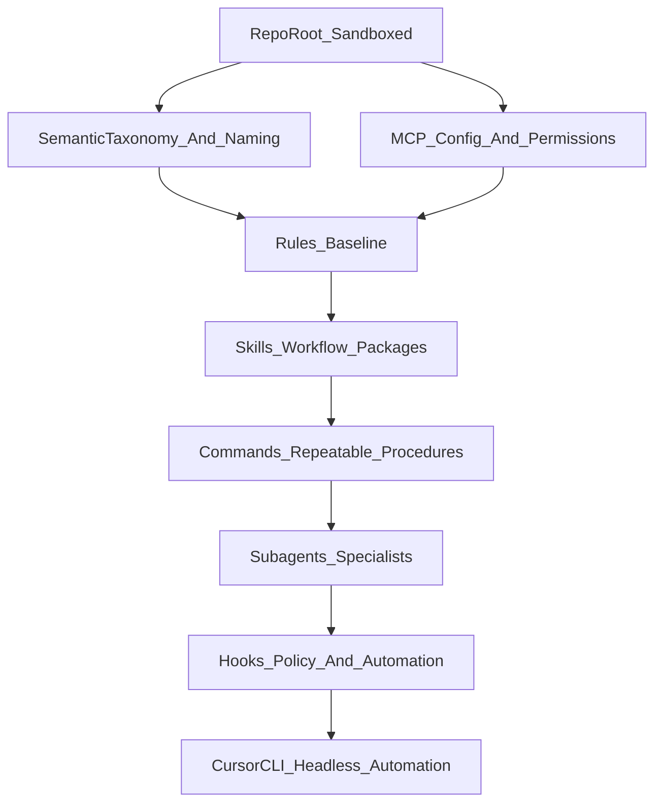

# Cursor primitives bootstrap plan

## Goals

- Make `c:\Users\harri\Documents\Coding Projects\fun\roller` a safe, self-contained project root for automation (no accidental access to `C:\Users\harri`).
- Establish a minimal, composable “primitive stack”: **rules → skills → commands → subagents → hooks → CLI automation**.
- Bake in **discoverability** (naming conventions + semantic taxonomy) so agents can find things with minimal prompting.

## Key constraints

- Keep changes scoped to this project directory.
- Prefer progressive disclosure for skills (already implemented in `[.cursor/skills/create-skill/SKILL.md](.cursor/skills/create-skill/SKILL.md)` and documented in `[docs/research/cursor-primitives/2026-01-22-agent-skills-structure.md](docs/research/cursor-primitives/2026-01-22-agent-skills-structure.md)`).
- Avoid “always apply everything”: use `globs` aggressively.

## Current baseline (what you already have)

- **Project instructions**: `[AGENTS.md](AGENTS.md)`
- **Skills**: `[.cursor/skills/create-diagram/SKILL.md](.cursor/skills/create-diagram/SKILL.md)`, `[.cursor/skills/create-skill/SKILL.md](.cursor/skills/create-skill/SKILL.md)`
- **Commands**: `[.cursor/commands/create-research-doc.md](.cursor/commands/create-research-doc.md)`, `[.cursor/commands/review-diagram.md](.cursor/commands/review-diagram.md)`
- **Rules**: `[.cursor/rules/research-documentation.mdc](.cursor/rules/research-documentation.mdc)`
- **Research corpus**: `[docs/research/INDEX.md](docs/research/INDEX.md)` and the cursor-primitives/tools docs.
- **MCP config**: `[mcp.json](mcp.json)` (filesystem + git)

## Dependency map (what must come first)

## What “done” looks like for bootstrap phase

- Running the agent in this repo never touches outside the repo root.
- There is a standard way to:
  - create/update a rule
  - create/update a skill
  - create/update a command
  - evaluate whether a rule/skill is effective
- The project has a small number of **high-leverage** rules/skills/commands (not a large pile of weak ones).

## How we’ll use subagents while executing this plan

- **Explore subagents**: inventory existing primitives, locate patterns, propose naming/taxonomy, find gaps.
- **Shell subagents**: verify git root and repo boundaries safely; fix if misconfigured.
- **General-purpose subagents**: draft new “meta” skills/commands (e.g., rule-reviewer) without bloating your main context.

## Notes on the repo-root issue (why it’s first)

Your initial status showed git rooted at `C:/Users/harri` (home directory). Since you ran `git init` already, the first step is to **confirm** the git root is now `...\fun\roller` and correct it if not, so:

- indexing/search doesn’t wander
- MCP git operations can’t accidentally target other folders
- future scripts can safely assume `$WORKSPACE == repo root`

## Candidate “bootstrap primitives” to add next (small + high leverage)

- A **rule** that enforces **naming + placement conventions** for:
  - `.cursor/skills/*/SKILL.md`
  - `.cursor/commands/*.md`
  - `.cursor/rules/*.mdc`
  - `docs/research/**`
- A **command** like `/review-rules` that audits rules for:
  - overly-broad `alwaysApply`
  - missing/too-wide `globs`
  - duplication vs `[AGENTS.md](AGENTS.md)`
- A **skill** like `bootstrap-cursor-primitives` that:
  - creates new primitives with templates
  - updates `[docs/research/INDEX.md](docs/research/INDEX.md)` when research is added
  - recommends when to use rule vs command vs skill (based on `[docs/research/cursor-primitives/2026-01-22-cursor-commands-hooks-comprehensive.md](docs/research/cursor-primitives/2026-01-22-cursor-commands-hooks-comprehensive.md)`)
- (Later) a minimal **hook policy** to block file access outside repo root.

