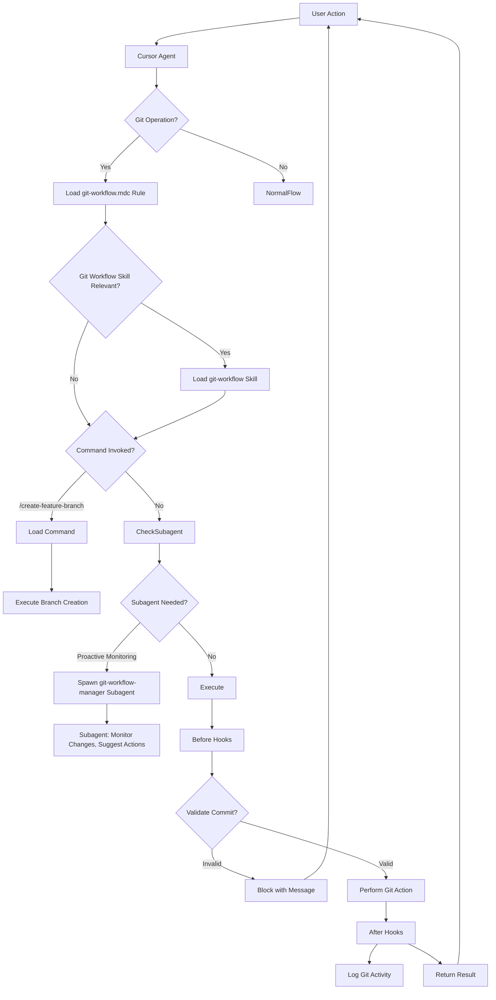
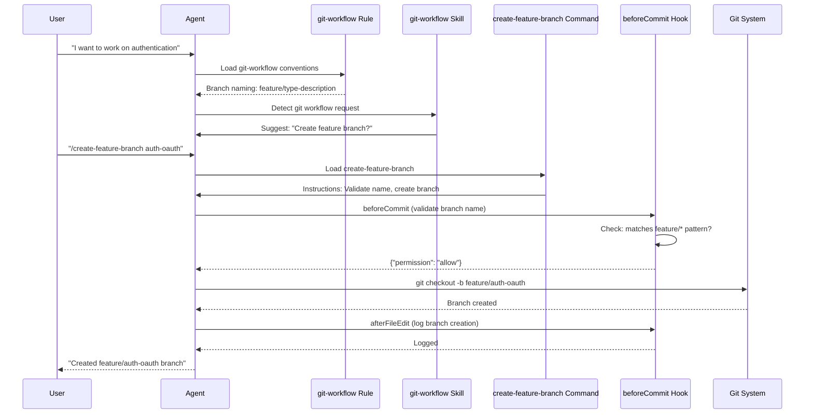

# Complete Cursor Primitives Bootstrap Plan

## Goals

1. **Update research** with Cursor 2.4 changelog findings (subagents, image generation, clarification questions)
2. **Create infrastructure files**: `.cursorignore`, `.env.example`, `.cursor/hooks.json`
3. **Set up subagents**: git-workflow-manager, verifier, debugger
4. **Design and implement git workflow management** using optimal primitive architecture
5. **Document architecture** with diagrams showing primitive orchestration

## Current State Analysis

**What exists:**

- Git initialized (`.git` confirmed)
- `.cursor/skills/` (create-diagram, create-skill, python-review, python-write)
- `.cursor/commands/` (create-research-doc, review-diagram)
- `.cursor/rules/` (research-documentation, adr, python-modern)
- `mcp.json` (filesystem, git, github)
- Research docs on primitives

**What's missing:**

- `.cursorignore` file
- `.env.example` template
- `.cursor/agents/` directory (subagents)
- `.cursor/hooks.json` (hooks configuration)
- Git workflow management system
- Updated research reflecting Cursor 2.4 features

## Cursor 2.4 Changelog Impact Analysis

### New Features to Integrate

**Subagents (Jan 22, 2026):**

- Default subagents: codebase research, terminal commands, parallel work streams
- Custom subagents: `.cursor/agents/*.md` with YAML frontmatter
- Parallel execution with isolated context
- Can use custom prompts, tool access, and models

**Clarification Questions:**

- Agents can ask questions in any conversation (not just Plan/Debug mode)
- Agent continues working while waiting for response
- Can be used in custom subagents/skills

**Image Generation:**

- Generate images via agent (Google Nano Banana Pro)
- Saved to `assets/` folder by default
- Useful for UI mockups, architecture diagrams

**Impact on our architecture:**

- Subagents should be used for specialized, parallelizable tasks
- Git workflow management is perfect for a subagent (proactive, specialized)
- Verifier and debugger are ideal subagent candidates
- Hooks can trigger subagents for validation

## Git Workflow Management Architecture Analysis

### Problem Statement

We need a system that:

- Enforces descriptive feature branch naming
- Ensures meaningful commit messages
- Validates branch/commit conventions
- Can proactively suggest when to create branches/commits
- Integrates with our development workflow

### Architecture Decision: Multi-Primitive Approach

After analyzing all primitives, the optimal solution uses **multiple primitives working together**:

**1. Rule (`.cursor/rules/git-workflow.mdc`):**

- **Purpose**: Always-on conventions and standards
- **Scope**: Applies to git operations via `globs: ["**/.git/**", "**/*.md"]` (when git context is active)
- **Content**: Branch naming conventions, commit message format, workflow patterns
- **Why Rule**: Standards should be always available, not on-demand

**2. Command (`.cursor/commands/create-feature-branch.md`):**

- **Purpose**: Manual invocation for creating feature branches
- **When**: User explicitly wants to create a branch (`/create-feature-branch feature-name`)
- **Why Command**: Simple, repeatable procedure, manual control

**3. Skill (`.cursor/skills/git-workflow/SKILL.md`):**

- **Purpose**: Orchestrates git workflow operations
- **When**: Agent detects git-related requests (commits, branches, PRs)
- **Why Skill**: Complex multi-step workflow, agent auto-selects, can invoke commands

**4. Subagent (`.cursor/agents/git-workflow-manager.md`):**

- **Purpose**: Proactive git workflow management
- **When**: Monitors changes, suggests branches/commits, validates conventions
- **Why Subagent**: Specialized expertise, can run in background, context isolation

**5. Hooks (`.cursor/hooks.json`):**

- **Purpose**: Enforce conventions automatically
- **When**: Before commits, after file edits
- **Why Hooks**: Lifecycle automation, validation, can't be bypassed

**6. AGENTS.md:**

- **Purpose**: High-level git workflow guidance
- **Why**: Simple, always-visible instructions

### Architecture Diagram



### Data Flow: Feature Branch Creation Use Case



### Why This Architecture

**Separation of Concerns:**

- **Rule**: What (standards/conventions)
- **Command**: How (manual procedure)
- **Skill**: When (orchestration logic)
- **Subagent**: Who (proactive specialist)
- **Hooks**: Enforcement (validation/auditing)

**Benefits:**

- Rules provide always-on guidance
- Commands give explicit control
- Skills enable intelligent orchestration
- Subagents add proactive monitoring
- Hooks enforce at the system level

**Token Efficiency:**

- Rule loaded only when git context active (globs)
- Skill loaded only when git workflow detected
- Command loaded only when invoked
- Subagent runs in isolated context
- Hooks execute scripts (minimal token usage)

## Implementation Plan

### Phase 1: Infrastructure Setup

**1.1 Create `.cursorignore`**

- Location: Project root
- Purpose: Exclude files from Cursor indexing/search
- Content: Large files, build artifacts, node_modules, .venv, generated files
- Reference: Semantic search best practices (exclude large content files)

**1.2 Create `.env.example`**

- Location: Project root
- Purpose: Template for environment variables
- Content: Placeholders for MCP tokens, API keys, secrets
- Security: Never commit `.env`, always commit `.env.example`

**1.3 Create `.cursor/hooks.json`**

- Location: `.cursor/hooks.json`
- Purpose: Lifecycle automation
- Initial hooks:
  - `beforeShellExecution`: Validate git commands
  - `afterFileEdit`: Log changes (optional, can add later)
  - `stop`: Cleanup/validation (optional, can add later)

### Phase 2: Research Updates

**2.1 Create Changelog Research Document**

- File: `docs/research/cursor-primitives/2026-01-22-cursor-2.4-changelog.md`
- Content: Subagents, image generation, clarification questions
- Update: `docs/research/INDEX.md` with new entry

**2.2 Update Existing Research**

- Update `2026-01-22-cursor-commands-hooks-comprehensive.md` with subagent integration patterns
- Add subagent decision matrix to primitive comparison

### Phase 3: Subagents Setup

**3.1 Create `.cursor/agents/` Directory**

- Structure: `.cursor/agents/*.md` files

**3.2 Create `git-workflow-manager.md` Subagent**

- Purpose: Proactive git workflow management
- Features:
  - Monitor uncommitted changes
  - Suggest feature branch creation
  - Validate branch/commit naming
  - Suggest commit messages
- Model: `inherit` (use parent's model)
- Description: "Proactive git workflow specialist. Use when monitoring changes, suggesting branches, or validating git conventions."

**3.3 Create `verifier.md` Subagent**

- Purpose: Validate completed work
- Features:
  - Check implementations are functional
  - Run tests
  - Look for edge cases
- Model: `fast` (quick validation)
- Description: "Validates completed work. Use after tasks are marked done to confirm implementations are functional."

**3.4 Create `debugger.md` Subagent**

- Purpose: Root cause analysis
- Features:
  - Capture error messages
  - Identify reproduction steps
  - Isolate failure location
  - Implement minimal fixes
- Model: `inherit`
- Description: "Debugging specialist for errors and test failures. Use when encountering issues."

### Phase 4: Git Workflow Management

**4.1 Create Rule: `.cursor/rules/git-workflow.mdc`**

- Globs: `["**/.git/**"]` (when git context active)
- Content:
  - Branch naming: `feature/type-description`, `fix/issue-description`, `docs/topic`
  - Commit message format: Conventional Commits style
  - Workflow: Always use feature branches, never commit directly to main
  - Reference: `AGENTS.md` for detailed patterns

**4.2 Create Command: `.cursor/commands/create-feature-branch.md`**

- Purpose: Manual feature branch creation
- Steps:

  1. Validate branch name against conventions
  2. Check current branch status
  3. Create branch: `git checkout -b feature/name`
  4. Set upstream if needed
  5. Confirm branch created

**4.3 Create Skill: `.cursor/skills/git-workflow/SKILL.md`**

- Description: "Orchestrates git workflow operations. Use when creating branches, making commits, or managing git operations."
- Content:
  - Detects git-related requests
  - Invokes appropriate commands
  - Can delegate to git-workflow-manager subagent
  - References rule for conventions
- Progressive disclosure: Move detailed patterns to `reference/`

**4.4 Update `AGENTS.md`**

- Add section on git workflow
- Document branch naming conventions
- Reference git-workflow rule and skill

### Phase 5: Hooks Configuration

**5.1 Create `.cursor/hooks.json`**

- Structure:
  ```json
  {
    "version": 1,
    "hooks": {
      "beforeShellExecution": [
        {
          "command": "node .cursor/hooks/validate-git-command.js"
        }
      ]
    }
  }
  ```


**5.2 Create Hook Script: `.cursor/hooks/validate-git-command.js`**

- Purpose: Validate git commands before execution
- Logic:
  - If `git commit`: Validate commit message format
  - If `git checkout -b`: Validate branch name
  - If `git push`: Warn if pushing to main/master
- Returns: `{"permission": "allow"}` or `{"permission": "deny", "reason": "..."}`

### Phase 6: Documentation

**6.1 Create Architecture Diagram**

- File: `docs/diagrams/git-workflow-architecture.diagram.md`
- Content: Architecture diagram showing primitive orchestration

**6.2 Create Data Flow Diagram**

- File: `docs/diagrams/git-workflow-data-flow.diagram.md`
- Content: Sequence diagram for feature branch creation

**6.3 Update `AGENTS.md`**

- Add subagents section
- Add hooks section
- Update git workflow documentation

## File Structure After Implementation

```
.cursor/
├── agents/                    # NEW: Subagents
│   ├── git-workflow-manager.md
│   ├── verifier.md
│   └── debugger.md
├── commands/
│   ├── create-research-doc.md
│   ├── review-diagram.md
│   └── create-feature-branch.md  # NEW
├── hooks/                     # NEW: Hook scripts
│   └── validate-git-command.js
├── hooks.json                 # NEW: Hooks configuration
├── rules/
│   ├── research-documentation.mdc
│   ├── adr.mdc
│   ├── python-modern.mdc
│   └── git-workflow.mdc      # NEW
├── skills/
│   ├── create-diagram/
│   ├── create-skill/
│   ├── python-review/
│   ├── python-write/
│   └── git-workflow/         # NEW
│       ├── SKILL.md
│       └── reference/
│           └── conventions.md
└── ...

.env.example                   # NEW
.cursorignore                  # NEW
docs/
├── diagrams/                  # NEW
│   ├── git-workflow-architecture.diagram.md
│   └── git-workflow-data-flow.diagram.md
└── research/
    └── cursor-primitives/
        └── 2026-01-22-cursor-2.4-changelog.md  # NEW
```

## Decision Rationale Summary

**Why Multi-Primitive for Git Workflow:**

1. **Rules** = Always-on standards (can't forget conventions)
2. **Commands** = Explicit user control (manual branch creation)
3. **Skills** = Intelligent orchestration (agent decides when to help)
4. **Subagents** = Proactive monitoring (suggests actions before asked)
5. **Hooks** = System-level enforcement (can't bypass validation)

**Alternative Considered: Single Skill**

- **Rejected because**: Skills are on-demand; we need always-on standards (rule) and system-level enforcement (hooks)

**Alternative Considered: Command Only**

- **Rejected because**: No proactive suggestions, no automatic validation, no always-on guidance

**Alternative Considered: Subagent Only**

- **Rejected because**: Subagents are for specialized tasks, not always-on standards or manual procedures

## Success Criteria

- [ ] `.cursorignore` excludes appropriate files from indexing
- [ ] `.env.example` provides clear template for secrets
- [ ] `.cursor/hooks.json` validates git operations
- [ ] Three subagents created and functional
- [ ] Git workflow rule enforces conventions
- [ ] Git workflow command creates branches correctly
- [ ] Git workflow skill orchestrates operations
- [ ] Architecture diagrams document the system
- [ ] Research updated with Cursor 2.4 findings
- [ ] `AGENTS.md` documents all new primitives

## Next Steps After This Plan

1. Test git workflow system with real feature development
2. Add more hook validations as needed
3. Create additional subagents for other specialized tasks
4. Expand git workflow skill with more patterns
5. Create commands for PR creation, commit squashing, etc.