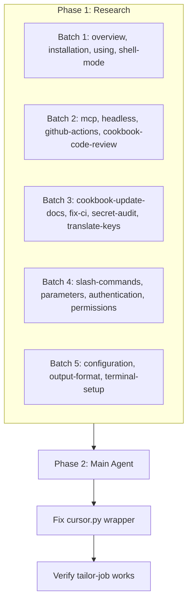

# Cursor CLI Research and Wrapper Fix

## Phase 1: Parallel Subagent Research (20 subagents)

Each subagent will:

1. Fetch the full page content from its assigned URL
2. Create a short summary file in `docs/research/tools/` using the naming convention `2026-02-22-cursor-cli-{slug}.md`
3. Return a concise summary for the main agent (2-4 bullet points of actionable facts)

### URL-to-Subagent Mapping


| #   | URL                                                                              | Research File Slug      |
| --- | -------------------------------------------------------------------------------- | ----------------------- |
| 1   | [overview](https://cursor.com/docs/cli/overview)                                 | overview                |
| 2   | [installation](https://cursor.com/docs/cli/installation)                         | installation            |
| 3   | [using](https://cursor.com/docs/cli/using)                                       | using                   |
| 4   | [shell-mode](https://cursor.com/docs/cli/shell-mode)                             | shell-mode              |
| 5   | [mcp](https://cursor.com/docs/cli/mcp)                                           | mcp                     |
| 6   | [headless](https://cursor.com/docs/cli/headless)                                 | headless                |
| 7   | [github-actions](https://cursor.com/docs/cli/github-actions)                     | github-actions          |
| 8   | [cookbook/code-review](https://cursor.com/docs/cli/cookbook/code-review)         | cookbook-code-review    |
| 9   | [cookbook/update-docs](https://cursor.com/docs/cli/cookbook/update-docs)         | cookbook-update-docs    |
| 10  | [cookbook/fix-ci](https://cursor.com/docs/cli/cookbook/fix-ci)                   | cookbook-fix-ci         |
| 11  | [cookbook/secret-audit](https://cursor.com/docs/cli/cookbook/secret-audit)       | cookbook-secret-audit   |
| 12  | [cookbook/translate-keys](https://cursor.com/docs/cli/cookbook/translate-keys)   | cookbook-translate-keys |
| 13  | [reference/slash-commands](https://cursor.com/docs/cli/reference/slash-commands) | slash-commands          |
| 14  | [reference/parameters](https://cursor.com/docs/cli/reference/parameters)         | parameters              |
| 15  | [reference/authentication](https://cursor.com/docs/cli/reference/authentication) | authentication          |
| 16  | [reference/permissions](https://cursor.com/docs/cli/reference/permissions)       | permissions             |
| 17  | [reference/configuration](https://cursor.com/docs/cli/reference/configuration)   | configuration           |
| 18  | [reference/output-format](https://cursor.com/docs/cli/reference/output-format)   | output-format           |
| 19  | [reference/terminal-setup](https://cursor.com/docs/cli/reference/terminal-setup) | terminal-setup          |


### Subagent Task Template

```
Fetch https://cursor.com/docs/cli/{path}, read the full page.
Create docs/research/tools/2026-02-22-cursor-cli-{slug}.md with:
  - Title, date, category: tools, tags: cursor, cli
  - Key findings (bullets)
  - Relevant commands/flags for roller.ai pipeline AI provider
  - Source URL
Return a 2-4 bullet summary for the main agent.
```

### Research File Location

All summaries go under [docs/research/tools/](docs/research/tools/). Existing related research: [2026-02-09-cursor-cli-comprehensive-research.md](docs/research/tools/2026-02-09-cursor-cli-comprehensive-research.md). New docs will complement, not replace.

### Execution

Launch subagents in batches of 4 to avoid rate limits. Use `mcp_task` with `subagent_type: generalPurpose` or `explore` for each URL. Each subagent runs independently.

---

## Phase 2: Main Agent — Fix Cursor CLI Wrapper

After all 20 research files exist, the main agent will:

### Current State

- **[cursor.py](src/roller/shared/ai/cursor.py)**: Self-contained `CursorProvider` with `find_agent_binary()`, `_build_print_command()`, `AgentBinaryInfo`, `AgentBinaryType`. Invokes `agent -p` or `cursor agent -p` via subprocess.
- **[cursor_sdk/client.py](src/roller/cursor_sdk/client.py)**: `CursorCliClient` with WSL handling, hooks, event logging. Uses `agent` binary only; has `run_print()` with `--print --approve-mcps`.
- **Duplication**: Binary resolution, command building, and subprocess invocation exist in both modules.
- **Windows issue**: `cursor.cmd agent -p` does not forward `-p`; only standalone `agent` works. Install: `irm 'https://cursor.com/install?win32=true' | iex` puts `agent` at `~/.cursor/bin` or `~/.local/bin`.

### Fix Strategy (Reduce Code)

1. **Single source of truth for agent invocation**
  - Use `CursorCliClient.run_print()` as the canonical path if it supports our needs.
  - Or: Keep `cursor.py` as the only implementation and remove/deprecate `CursorCliClient` usage for AI provider purposes.
  - Align flags: docs use `-p`/`--print`, `--output-format text`, `--force` for file writes, `--approve-mcps` for MCP. Our provider needs `-p` + `--output-format text` only.
2. **Simplify binary resolution**
  - Per [installation](https://cursor.com/docs/cli/installation): `agent` is installed via curl/PowerShell; verify with `agent --version`.
  - Paths: `~/.local/bin/agent`, `~/.cursor/bin/agent`; Windows may use `$env:USERPROFILE\.cursor\bin\agent.exe` or `$env:LOCALAPPDATA\...`.
  - Remove `CURSOR_MAIN` fallback entirely — `cursor agent -p` is not reliable on Windows. Single path: standalone `agent` binary only.
3. **Consolidate or remove**
  - If `CursorCliClient` is only used by pipeline/ralph_loop and not by `CursorProvider`, consider: have `CursorProvider` call `CursorCliClient.run_print()` with `enable_hooks=False` to avoid duplication.
  - If consolidation adds complexity, keep `cursor.py` minimal and remove `CursorCliClient` usage from the AI provider path.
  - Remove `AgentBinaryType`, `_cursor_main_candidates`, and all `cursor agent` fallback code.
4. **Auth**
  - Docs: `CURSOR_API_KEY` env or browser login. For headless/CI, API key is required. Our wrapper should not require it for interactive use (browser login); for scripts, document that `CURSOR_API_KEY` may be needed.
5. **GHA relevance**
  - Research from github-actions and cookbooks will inform future workflow automation. Main agent will note patterns for `docs/plans/` or a follow-up task; not in scope for this wrapper fix.

### Deliverables

- Simplified [cursor.py](src/roller/shared/ai/cursor.py): standalone `agent` only, minimal `find_agent_binary()`, single `_build_print_command()`.
- Remove dead code: `AgentBinaryType.CURSOR_MAIN`, `_cursor_main_candidates`, Windows `cursor.cmd` fallback.
- Update [factory.py](src/roller/shared/ai/factory.py) if `find_agent_binary` signature changes.
- Add/update [docs/research/tools/INDEX.md](docs/research/INDEX.md) entry for the new 2026-02-22 batch.
- Verify: `roller tailor-job <url>` succeeds when `agent` is installed.

---

## Execution Order




---

## Research Index Update

After Phase 1, add a new subsection to [docs/research/INDEX.md](docs/research/INDEX.md) under `tools/`:

```markdown
### Cursor CLI Official Docs (2026-02-22)
| Document | Source |
|----------|--------|
| Overview | cursor-cli-overview.md |
| Installation | cursor-cli-installation.md |
| ... | ... |
```

Main agent will consolidate key findings into a single "Cursor CLI Wrapper Implementation Notes" section or update the existing [2026-02-09-cursor-cli-comprehensive-research.md](docs/research/tools/2026-02-09-cursor-cli-comprehensive-research.md) with a "2026-02-22 Addendum" if appropriate.