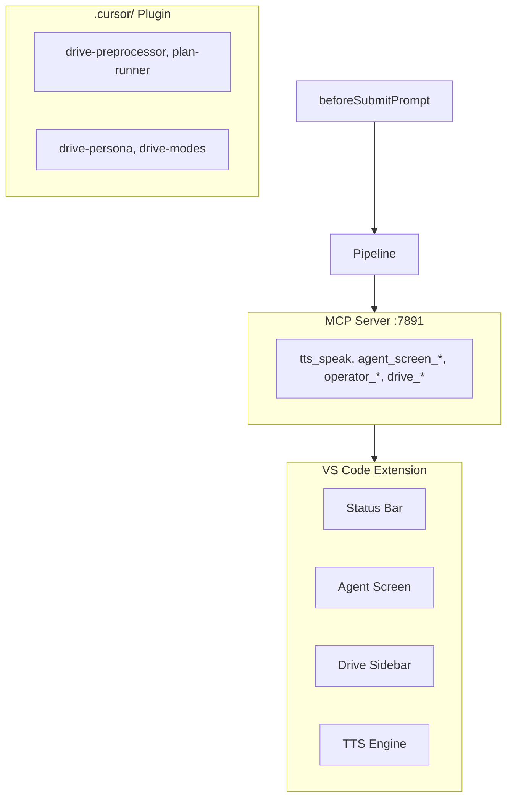

# Cursor Drive Master Plan

One consolidated plan for the full Cursor Drive extension. Aggregates features from:

- [.cursor/plans/](.cursor/plans/) (4 plans)
- [docs/plans/cursor-drive-v1-release-plan.md](docs/plans/cursor-drive-v1-release-plan.md)
- [docs/plans/traceability-matrix.md](docs/plans/traceability-matrix.md)
- [docs/plans/mob-programming-cockpit-mvp.md](docs/plans/mob-programming-cockpit-mvp.md)
- PRDs 1–5, ADRs

**Excluded:** PR merge workflow (dev tooling), plan-orchestration-spec (governance only).

---

## Architecture Summary

---

## Phase 1: Release Blockers (v1 Must-Have)

| #   | Task                                                                       | Source          | Status  |
| --- | -------------------------------------------------------------------------- | --------------- | ------- |
| 1   | Add missing config schema keys to `package.json` contributes.configuration | v1-release-plan | Pending |
| 2   | Create `src/config.ts` with zod validation                                 | v1-release-plan | Pending |
| 3   | Wire slash commands to pipeline (if Composer exposes `command`)            | v1-release-plan | Pending |
| 4   | Fix `docs/reference/config-schema.md` reference to config.ts               | v1-release-plan | Pending |
| 5   | Add `tests/config.test.ts`                                                 | v1-release-plan | Pending |
| 6   | Verify CI: npm ci, compile, test                                           | v1-release-plan | Pending |
| 7   | Verify VSIX packages (`npx vsce package`)                                  | v1-release-plan | Pending |
| 8   | Update README Status section                                               | v1-release-plan | Pending |
| 9   | Update `docs/guides/getting-started.md` Node version (20)                  | v1-release-plan | Pending |

**Config keys to add:** `approvalGates`, `agents.permissions`, `sanitizer.maxLength`, `glossary`, `agent.sessionMemory`, `agent.proactiveSteering`, `agents.commsAgent`, `modeSwitching.requireConfirmation`, `cloudAgents.apiBaseUrl`

---

## Phase 2: Agent Screen (S-AS) UX

| #   | Task                                                                   | Source                               | Status  |
| --- | ---------------------------------------------------------------------- | ------------------------------------ | ------- |
| 10  | Fix or remove `panel` displayMode (currently identical to tab; bug)    | v1-release-plan, s-as-v1-ux-proposal | Pending |
| 11  | Document `bottomLog` as terminal-first option; optionally make default | v1-release-plan                      | Pending |
| 12  | Ensure CLI `text_delta` streams to Live tab (verify existing)          | v1-release-plan                      | Verify  |
| 13  | Add hidden-panel event queue (events dropped when webview not visible) | agent-screen-discovery               | Pending |

---

## Phase 3: Voice Pipeline & Persona

| #   | Task                                                            | Source              | Status      |
| --- | --------------------------------------------------------------- | ------------------- | ----------- |
| 14  | Filler cleaner, glossary expander, sanitizer                    | PRD 1, traceability | Implemented |
| 15  | Prompt optimizer (QuickPick approve/edit)                       | PRD 1               | Implemented |
| 16  | Wake word + submit word detection                               | PRD 1               | Implemented |
| 17  | TTS (Web Speech API), interrupt                                 | PRD 1               | Implemented |
| 18  | Response formatter, session memory                              | PRD 2               | Implemented |
| 19  | Drive-persona skill                                             | PRD 2               | Implemented |
| 20  | Proactive steering (idle detection, commitment tracking, nudge) | PRD 2, traceability | Pending     |

---

## Phase 4: Multi-Operator & Sync

| #   | Task                                                                | Source                  | Status      |
| --- | ------------------------------------------------------------------- | ----------------------- | ----------- |
| 21  | OperatorRegistry, spawn/switch/merge/dismiss                        | PRD 3                   | Implemented |
| 22  | CommsAgent (batch background updates)                               | PRD 3                   | Implemented |
| 23  | Tangent keyword wiring                                              | PRD 3                   | Implemented |
| 24  | WorktreeManager, SyncLedger, StateSyncCoordinator, IntegrationQueue | mob-programming-cockpit | Implemented |
| 25  | MCP sync tools (operator_sync_*, integration_queue_*, etc.)         | mob-programming-cockpit | Implemented |
| 26  | Auto-worktree allocation on spawn                                   | mob-programming-cockpit | Deferred    |
| 27  | Advanced conflict resolution (three-way merge UI)                   | mob-programming-cockpit | Deferred    |

---

## Phase 5: Safety & Config

| #   | Task                                                          | Source          | Status      |
| --- | ------------------------------------------------------------- | --------------- | ----------- |
| 28  | Approval gates, tool allowlist                                | PRD 4           | Implemented |
| 29  | Mode switching confirmation (requireConfirmation → QuickPick) | PRD 4           | Implemented |
| 30  | Privacy defaults (no transcript persistence, redacted logs)   | PRD 4, ADR-0005 | Partial     |

---

## Phase 6: Cursor Integration & UI

| #   | Task                                                               | Source                       | Status      |
| --- | ------------------------------------------------------------------ | ---------------------------- | ----------- |
| 31  | Status bar (Drive > Mode                                           | Operator), click → QuickPick | PRD 5       |
| 32  | Agent Screen webview (Live, Activity, Files, Decisions, Sync tabs) | PRD 5                        | Implemented |
| 33  | Drive sidebar (Activity Bar panel)                                 | drive-ui-surfaces            | Implemented |
| 34  | beforeSubmitPrompt hook (drive-preprocessor.py)                    | ADR-0008                     | Implemented |
| 35  | MCP server :7891, all tools                                        | mcp-tools                    | Implemented |
| 36  | Plugin installer (installDrivePluginToWorkspace)                   | extension.ts                 | Implemented |
| 37  | MCP Apps (ui://cursor-drive/agent-screen when enableApps)          | v1-release-plan              | Optional    |
| 38  | Extension activation in dev-host                                   | traceability                 | In progress |

---

## Phase 7: Extension Reinstall Automation

| #   | Task                                                                                   | Source                         | Status  |
| --- | -------------------------------------------------------------------------------------- | ------------------------------ | ------- |
| 39  | Discovery: CLI commands (cursor --install/uninstall-extension), restart options        | extension-reinstall-automation | Pending |
| 40  | Create `scripts/reinstall-extension.mjs` (uninstall, compile, package, install, flags) | extension-reinstall-automation | Pending |
| 41  | Add package.json scripts: `reinstall`, `reinstall:serve-web`                           | extension-reinstall-automation | Pending |
| 42  | CI workflow: reinstall flow, serve-web, smoke test                                     | extension-reinstall-automation | Pending |
| 43  | Cross-platform (Node.js core logic; Windows/macOS/Linux paths)                         | extension-reinstall-automation | Pending |
| 44  | Document in `docs/guides/live-testing.md` or new guide                                 | extension-reinstall-automation | Pending |

---

## Phase 8: Cloudflare (Optional Infra)

| #   | Task                                                                                        | Source                  | Status  |
| --- | ------------------------------------------------------------------------------------------- | ----------------------- | ------- |
| 45  | Fix token logging in `scripts/create-cloudflare-token.mjs` (clipboard or instructions only) | cloudflare-setup-phases | Pending |
| 46  | Add deployment opt-in disclaimer to cloudflare-workers-mcp-cicd.md                          | cloudflare-setup-phases | Pending |
| 47  | Replace user-specific paths in mcp-user-setup.md with placeholders                          | cloudflare-setup-phases | Pending |
| 48  | Document GitHub secrets, local .env                                                         | cloudflare-setup-phases | Pending |
| 49  | (Optional) Scaffold Worker, wrangler, deploy workflow, user MCP config                      | cloudflare-setup-phases | Pending |
| 50  | (Optional) Terraform IaC for Worker + KV/D1/DNS                                             | cloudflare-setup-phases | Pending |

---

## Phase 9: Testing & Quality

| #   | Task                                                                                                                              | Source                  | Status   |
| --- | --------------------------------------------------------------------------------------------------------------------------------- | ----------------------- | -------- |
| 51  | Test coverage: extension, mcpServer, config, driveMode, statusBar, agentRegistry, commsAgent, responseFormatter, tts, shareScreen | traceability            | Pending  |
| 52  | Fix modeSwitcher vscode mock (pre-existing test failures)                                                                         | pr-merge reconciliation | Pending  |
| 53  | Manual browser smoke (serve-web + Playwright)                                                                                     | v1-release-plan         | Document |

---

## Phase 10: Code Optimization (Post-Test)

| #   | Task                                                 | Source       | Status  |
| --- | ---------------------------------------------------- | ------------ | ------- |
| 54  | Model selection dedup, config caching, regex caching | traceability | Pending |
| 55  | AgentRegistry O(1), bounded queues, HTML template    | traceability | Pending |

---

## Phase 11: Deferred / Post-v1

| #   | Task                                                                                    | Source                  |
| --- | --------------------------------------------------------------------------------------- | ----------------------- |
| 56  | ACP / cursor-sdk wiring (when Cursor CLI supports)                                      | v1-release-plan         |
| 57  | "Follow operator" for editor auto-focus                                                 | s-as-v1-ux-proposal     |
| 58  | Terminal pty displayMode                                                                | s-as-v1-ux-proposal     |
| 59  | Piper TTS (P1), ElevenLabs (P2)                                                         | PRD 1                   |
| 60  | Pixel streaming / visual snapshot feed                                                  | mob-programming-cockpit |
| 61  | MCP Apps external connectors                                                            | mob-programming-cockpit |
| 62  | Slash command wiring fallback (keyword routing only) if Composer doesn't expose command | v1-release-plan         |

---

## Execution Order for One-Shot

1. **Phase 1** (release blockers) — unblocks packaging and docs
2. **Phase 2** (S-AS) — can run parallel to Phase 3
3. **Phase 3** (voice/persona) — proactive steering is only pending item
4. **Phase 7** (reinstall automation) — supports Phase 9
5. **Phase 9** (testing) — after Phase 1–3
6. **Phase 8** (Cloudflare) — optional, can run anytime
7. **Phase 10** (optimization) — after Phase 9

---

## Key Files

| Area         | Files                                                                               |
| ------------ | ----------------------------------------------------------------------------------- |
| Config       | `package.json`, `src/config.ts` (new), `docs/reference/config-schema.md`            |
| Pipeline     | `src/pipeline.ts`                                                                   |
| Agent Screen | `src/agentScreen.ts`                                                                |
| Reinstall    | `scripts/reinstall-extension.mjs` (new), `package.json`                             |
| Cloudflare   | `scripts/create-cloudflare-token.mjs`, `docs/guides/cloudflare-workers-mcp-cicd.md` |

---

## Superseded / Do Not Implement

- **@drive chat participant** — Superseded by beforeSubmitPrompt (ADR-0009)
- **PR merge workflow** — Dev tooling, not extension feature
- **Plan orchestration spec** — Governance, not extension feature
