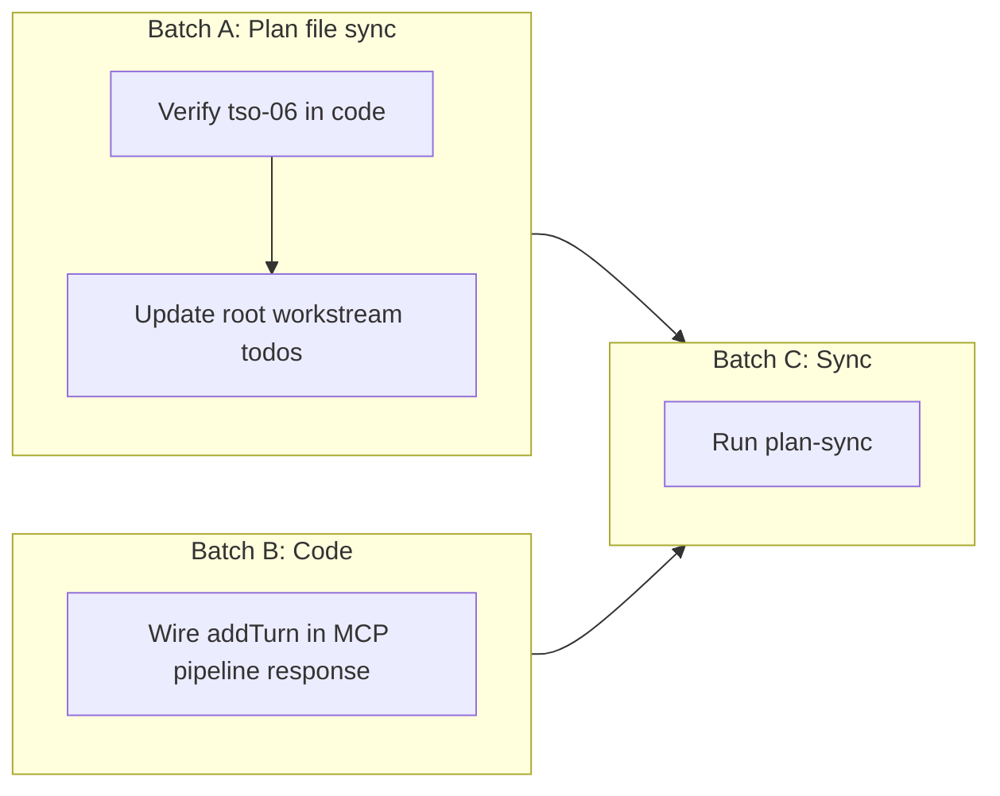

# Cursor Drive State Sync and Remainder

## Purpose

Bring plan files and codebase into sync after the bulk of plan execution. Address the one verified code gap (session memory turn recording) and update root/workstream plan status so the graph reflects reality. All work is structured for subagent execution.

## Current state (verified by subagent exploration)

- **Pipeline wiring**: [src/pipeline.ts](src/pipeline.ts) wires fillerCleaner, glossaryExpander, sanitizer, approvalGates, sessionMemory.buildContextString(), router, modelSelector; [src/promptOptimizer.ts](src/promptOptimizer.ts) exists and is used; tangent spawn and installPluginToWorkspace are implemented. [pipeline-wiring-mvp.plan.md](.cursor/plans/pipeline-wiring-mvp.plan.md) has all 8 TODOs completed.
- **Terminology**: [src/extension.ts](src/extension.ts) already uses "operator" everywhere (Drive Operators, spawnOperator, etc.); command IDs are cursorDrive.operators, cursorDrive.showAgentScreen. [terminology-sas-overhaul.plan.md](.cursor/plans/terminology-sas-overhaul.plan.md) still has **tso-06** as pending — work is done in code, plan not updated.
- **Session memory**: [SessionMemory.addTurn()](src/sessionMemory.ts) is never called from [src/](src/) or [mcpServer.ts](src/mcpServer.ts). Pipeline injects buildContextString() but no caller records turns after a response.
- **Root plan**: [cursor-drive.plan.md](.cursor/plans/cursor-drive.plan.md) has workstream-arch, workstream-hook, workstream-mode, workstream-pipeline, workstream-cleanup, workstream-quality, workstream-terminology all **pending** although the corresponding child plans are completed.

## Execution strategy (subagent batches)

- **Batch A** (one subagent): Read-only verification of extension.ts, then edit two plan files. No code changes.
- **Batch B** (one subagent): Implement addTurn in mcpServer.ts only.
- **Batch C**: Run plan-sync (main or subagent). Depends on Batch A so that root plan frontmatter is correct before sync.

**Delegation**: Spawn one subagent for Batch A (plan file updates), one for Batch B (code). After both complete, run Batch C.

## Implementation notes

### sdr-02 (addTurn wiring)

- In [src/mcpServer.ts](src/mcpServer.ts), inside the `drive_run_pipeline` tool handler, after `if (result.ok)`: call `this.opts.sessionMemory.addTurn(summary, undefined)` where `summary` is a short version of the processed prompt (e.g. first 200 characters of `result.prompt`, or a sanitized substring). This records the user turn when the pipeline runs successfully.
- Optionally do the same in the HTTP `POST /pipeline` handler (around line 581) when the pipeline result is ok, so both MCP and HTTP callers record turns.
- Do not call addTurn when the pipeline is blocked or when the result is a tangent ack (optional: still record the turn with a note). Keep the change minimal.

### sdr-03 (root plan update)

- In [.cursor/plans/cursor-drive.plan.md](.cursor/plans/cursor-drive.plan.md), in the `todos` frontmatter, set `status: completed` for: workstream-arch, workstream-hook, workstream-mode, workstream-pipeline, workstream-cleanup, workstream-quality, workstream-terminology (and workstream-agent-orch / senior-ux / browser-dev / terminology only if those child plans are fully completed; otherwise leave as-is or set per actual child state).

## Phase gate

- Before considering this plan complete: `npm run compile` and `npm test` must pass. Session memory should accumulate entries when the pipeline is invoked repeatedly (manual or test).

## References

- [execute-plans.md](.cursor/commands/execute-plans.md) — orchestrator command and subagent templates
- [plan-system-maintainer SKILL](.cursor/skills/plan-system-maintainer/SKILL.md) — plan sync and completion workflow
- [ADR-0013 mode state management](docs/architecture/adr/ADR-0013-mode-state-management.md) — state persistence context
