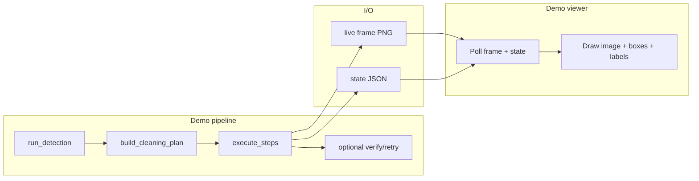

# Demo Pipeline Implementation Plan

## Current state

- **[`src/cli_commands/clean.py`](src/cli_commands/clean.py)**: `run_detection()` returns full detection (visible_watermarks with `detections` list: `type`, `location`, `recommended_removal`; `advanced_waste`; `patterns`; `findings`). `clean_image()` builds an ordered method list from that and runs: visible removal (gradient_guided) → sanitizer steps → `aggressive_lsb_cleaning`. It does not expose step-by-step; intermediate files are written then deleted.
- **[`src/cli_commands/agentic.py`](src/cli_commands/agentic.py)**: Visible-only pipeline with `_write_live_frame` and `_write_live_frame_with_boxes` (boxes baked into image). No separate overlay/state file.
- **[`src/visualization/agentic_live_viewer.py`](src/visualization/agentic_live_viewer.py)**: Polls a single image path; no state JSON, no phase/step text.

## Architecture

- Pipeline writes **frame** + **state** after each phase/step. Viewer (when `--live`) polls both and draws image + overlays + step text.

## 1. Cleaning plan as data (no UI yet)

- **Extract or mirror plan building**
  The ordered list of cleaning steps is currently implicit inside `clean_image()`. Either:
  - **Option A**: Add `build_cleaning_plan(detection: dict) -> list[tuple[str, str]]` in [`src/cli_commands/clean.py`](src/cli_commands/clean.py) that returns `[(step_label, method), ...]` using the same rules (visible first, then geometric_transformation / lsb_natural / selective_clean / etc., then aggressive_lsb), and have `clean_image()` call it; or
  - **Option B**: Implement the same logic in the new demo module and keep `clean_image()` unchanged.
  Recommendation: **Option A** so the single source of truth for “what we clean” stays in `clean.py` and the demo just iterates over the plan.

- **Define demo state schema**
  One small JSON (or dataclass) written alongside the live frame, e.g. `.demo_live.json`:
  - `phase`: `"scan" | "reveal" | "plan" | "clean" | "verify" | "done"`
  - `step_label`: string (e.g. `"Scanning…"`, `"Visible → LaMa"`, `"LSB natural"`)
  - `boxes`: list of `{x, y, w, h, label, type}` from visible detections (and optionally badges for stego/pattern/chunk findings)
  - `findings_summary`: short string or list for “Detection styles: …”
  - `plan_summary`: short string for “Cleaning plan: …”
  - Optional: `detected_styles`, `applied_steps` for the final summary block.

## 2. Demo pipeline (`run_demo_pipeline`)

- **New module** [`src/cli_commands/demo.py`](src/cli_commands/demo.py) (or under `src/pipeline/` if you prefer):
  - **Inputs**: `image_path`, `output_path`, `live_frame_path`, `state_path`, `export_dir` (optional), `quiet`, and options for verify/retry (e.g. `do_verify: bool`, `max_retries`, `clean_threshold`).
  - **Flow**:
    1. **Scan**: Run `run_detection(image_path, quick=False)`. Write initial frame (copy of image) and state `phase=scan`, `step_label="Scanning…"`.
    2. **Reveal**: Same frame; state `phase=reveal`, `boxes` from `detection["visible_watermarks"]["detections"]` (map `type`/`recommended_removal` to label), `findings_summary` from `findings` + `advanced_waste` + `patterns` (e.g. “Detection styles: visible (3), LSB, pattern:sequential_encoding, geometric_watermarks”).
    3. **Plan**: Call `build_cleaning_plan(detection)`; set state `phase=plan`, `plan_summary="Applying: visible → …, lsb_natural, …"`.
    4. **Clean**: For each `(step_label, method)` in the plan:
       - Run the corresponding step (visible removal, sanitizer method, or aggressive_lsb) on current image; write result to next temp file (or export_dir frame).
       - Update `live_frame_path` and state (`phase=clean`, `step_label=...`). If `export_dir`: write numbered frame + state copy.
    5. **Verify** (if enabled): Same as agentic: `tool_verify`; if not clean, optionally retry visible removal (agentic-style) and re-run verify; update frame/state for “Verifying…”, “Retrying…”, etc.
    6. **Done**: State `phase=done`, final `detected_styles` and `applied_steps` and result (clean score, output path). Write final frame.
  - Reuse `remove_visible_watermarks`, `SteganographySanitizer().sanitize_image`, `aggressive_lsb_cleaning` for each step; for visible step use the same method as in `clean_image` (or make configurable, e.g. `--method lama`).

- **Shared writer**: Helper that given current image path and state dict writes `live_frame_path` and `state_path` (and optionally copies to `export_dir` with a step index).

## 3. Viewer that reads frame + state

- **Extend or add viewer** in [`src/visualization/`](src/visualization/):
  - **Inputs**: `frame_path`, `state_path` (e.g. `.demo_live.png` and `.demo_live.json`), `done_event`, `title`.
  - **Loop**: Poll both paths (e.g. every 0.2–0.25 s). Load image; if state file exists, parse JSON and draw boxes (with labels) and phase/step text (e.g. as window title or overlay text).
  - **Drawing**: Tkinter canvas or PIL draw on image then display (recommendation: draw on image so scaling is consistent). Use same max display size as current agentic viewer.
  - Can be a new `demo_live_viewer.py` or an extended `agentic_live_viewer` that accepts optional state path and draws overlays when present.

## 4. CLI `demo`

- In [`src/cli.py`](src/cli.py):
  - Add subparser `demo` with args: `input`, `-o/--output`, `--live`, `--export-dir`, `--quiet`, and optionally `--no-verify`, `--method` (for visible step).
  - **Without `--live`**: Call `run_demo_pipeline(...)` with `live_frame_path=None` (or a temp path); pipeline still writes state to a temp or discard path when `--export-dir` is set). Print final “Detected / Applied / Result” block to stdout.
  - **With `--live`**: Same pattern as agentic: `done_event`, start pipeline in background thread (passing `live_frame_path` and `state_path` in output dir), run viewer in main thread; on done, print summary and exit.

## 5. Final summary block

- In `run_demo_pipeline`, build and return (and print unless `quiet`):
  - **Detected**: list of marking styles (visible types, LSB, pattern names, advanced_waste names) from detection.
  - **Applied**: ordered list of steps actually run (e.g. `visible→gradient_guided`, `lsb_natural`, `selective_clean`, `compression_cycle`, `aggressive_lsb`).
  - **Result**: clean score (if verify ran) and output path.
- Optionally include this in the “Done” state so the viewer can show it as overlay text or in the window title.

## 6. Optional: export reel

- When `--export-dir` is set, pipeline writes per-step frames and state (e.g. `step_00_scan.png`, `step_00_scan.json`, …). Defer to a later task: small script or HTML slideshow, or ffmpeg to produce `demo_reel.mp4`.

## File and dependency summary

| Item | Action |
|------|--------|
| `src/cli_commands/clean.py` | Add `build_cleaning_plan(detection)`; optionally refactor `clean_image()` to use it. |
| `src/cli_commands/demo.py` | New: `run_demo_pipeline()`, state schema, step-by-step execution, optional verify/retry. |
| `src/visualization/agentic_live_viewer.py` or `demo_live_viewer.py` | Viewer that reads frame + state path, draws boxes and step/phase text. |
| `src/cli.py` | Add `demo` command and `cmd_demo()`; wire `--live` to viewer and pipeline thread. |

## Order of work

1. **build_cleaning_plan** in `clean.py` and state schema (dataclass or dict) in `demo.py`.
2. **run_demo_pipeline** (no live): scan → reveal → plan → clean steps → optional verify → done; write frame + state to given paths (or /dev/null when not live/export).
3. **Demo viewer**: read frame + state, draw overlays and step text.
4. **CLI `demo`**: wire args, call pipeline; with `--live`, start viewer + pipeline thread.
5. **Final summary**: Detected / Applied / Result in pipeline return value and console; optionally in done state for viewer.
6. **(Later)** Export reel: script/HTML or ffmpeg from `--export-dir` frames.

## Risks / notes

- **clean.py bug**: Line 71 references `str(e)` inside a `except` that may not bind `e` (outer try is steganography); fix that when touching the file.
- Keep imports at top of file; avoid importing Tk/PIL in demo pipeline when `--live` is False (viewer imports only when `--live`).
- If state file is missing or malformed, viewer should show image only (degrade gracefully).
