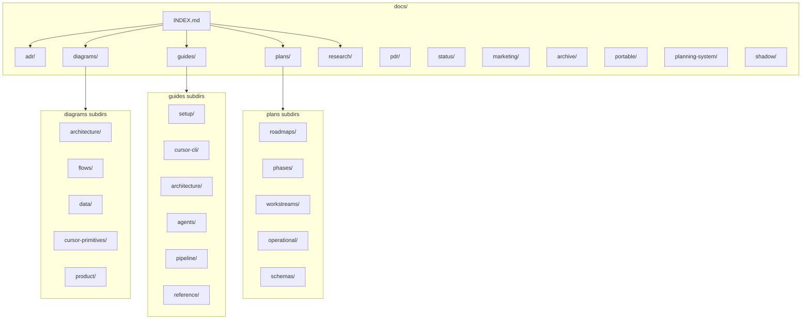

# docs/ Organization and Categorization Plan

## Current State (Pain Points)

- **guides/** — 33 flat files; audit identified duplicate groups (cursor-cli x6, setup x3); no subdirs despite logical groupings in INDEX
- **diagrams/** — ~25 flat files; create-diagram skill suggests subdirs (architecture/, flows/, data/, sequences/) but none exist
- **plans/** — Mixed content: roadmaps, phases, workstreams, operational docs; no subcategories
- **Missing from conventions** — `docs/` layout in [directory-layout-conventions.md](docs/guides/directory-layout-conventions.md) and [architecture-overview.md](docs/guides/architecture-overview.md) omits: plans, pdr, status, marketing, archive, portable, planning-system, shadow
- **No docs/INDEX.md** — No single entry point; navigation relies on AGENTS.md and per-dir INDEX files

## Proposed Taxonomy

### Top-Level (unchanged)

| Dir                | Purpose                                   | Notes                                                  |
| ------------------ | ----------------------------------------- | ------------------------------------------------------ |
| `adr/`             | Architecture Decision Records             | Keep; well-indexed                                     |
| `diagrams/`        | Mermaid diagrams                          | Add subdirs                                            |
| `guides/`          | Contributor guides                        | Add subdirs                                            |
| `plans/`           | Non-executable roadmaps, phases, strategy | Add subdirs; executable plans stay in `.cursor/plans/` |
| `research/`        | Design/research notes                     | Keep; already well-structured                          |
| `pdr/`             | Product Design Records                    | Document in conventions; add INDEX                     |
| `status/`          | Audit and inventory docs                  | Keep                                                   |
| `marketing/`       | Strategy, content, personas               | Keep                                                   |
| `archive/`         | Deprecated/superseded content             | Keep                                                   |
| `planning-system/` | Planning system docs (from portable)      | Keep; document                                         |
| `portable/`        | Distributable Cursor planning package     | Keep; document as "distribution"                       |
| `shadow/`          | Staging for shadow-deploy                 | Keep; ephemeral                                        |

### guides/ Subcategories

| Subdir          | Purpose                      | Example files                                                                                                                                     |
| --------------- | ---------------------------- | ------------------------------------------------------------------------------------------------------------------------------------------------- |
| `setup/`        | Environment, AI, Ralph       | setup-guide.md, ai-setup-final.md, ralph-setup.md                                                                                                 |
| `cursor-cli/`   | Cursor CLI usage             | cursor-cli-guide.md, cursor-cli-quickstart.md, cursor-cli-examples.md, cursor-cli-setup-python.md, cursor-cli-python.md, cursor-complete-guide.md |
| `architecture/` | System design, layout        | architecture-overview.md, architecture-review.md, directory-layout-conventions.md                                                                 |
| `agents/`       | Subagents, hooks, automation | subagents-reference.md, hooks-reference.md, agent-trace.md, autonomous-agent.md, cursor-cloud-agents-guide.md, capabilities.md                    |
| `pipeline/`     | Orchestration, workflow      | orchestration-bootstrap.md, orchestration-framework-strategy.md, primitives-only-orchestration.md, ralph-loop-guide.md, ROLE_PACKET_PIPELINE.md   |
| `reference/`    | Conventions, one-offs        | GIT_WORKFLOW_SETUP.md, dogfooding.md, repo-refactor.md, optimization-results.md, dynamic-context-optimization.md, AGENT_BASED_GENERATION.md       |

**Entry points** — Keep `dev-onboarding.md` at `guides/` root (or in `setup/`); `INDEX.md` at `guides/` root.

### diagrams/ Subcategories

Align with [create-diagram SKILL.md](.cursor/skills/create-diagram/SKILL.md) suggested structure:

| Subdir               | Purpose                           | Example files                                                                                                                                                                                                                                             |
| -------------------- | --------------------------------- | --------------------------------------------------------------------------------------------------------------------------------------------------------------------------------------------------------------------------------------------------------- |
| `architecture/`      | System structure, component views | architecture-system-component-view, architecture-module-dependencies, architecture-pipeline-state-flow, architecture-concurrent-stage-optimization, architecture-improvement-ideas, system-overview, mvp-pipeline-architecture, web-architecture-overview |
| `flows/`             | Data flows, process flows         | roller-product-data-flow, roller-dev-automation-data-flow, web-user-journey-flows, git-workflow-*, tailoring-pipeline, commit-message-automation, planning-system-lifecycle, planning-system-dependency-dag, plan-dependency-graph                        |
| `data/`              | Data models, storage              | web-data-model, storage-abstraction                                                                                                                                                                                                                       |
| `cursor-primitives/` | Cursor-specific                   | cursor-primitives-concept, cursor-primitives-implementation, cursor-primitives-architecture, agent-directory-organization                                                                                                                                 |
| `product/`           | Product/company views             | company-adapter-hub-spoke, orchestration-framework-strategy                                                                                                                                                                                               |

Create `diagrams/INDEX.md` linking to subdirs and key diagrams.

### plans/ Subcategories

| Subdir         | Purpose                | Example files                                                        |
| -------------- | ---------------------- | -------------------------------------------------------------------- |
| `roadmaps/`    | Strategy, backlog      | TAILORING_FIRST_ROADMAP.md, NEXT_STEPS.md                            |
| `phases/`      | Phase plans            | phase-0-strategy-alignment.md through phase-5-optional-extensions.md |
| `workstreams/` | Multi-task workstreams | architecture-improvements/, plan-completion-hooks/                   |
| `operational/` | Ad-hoc, merge, review  | comprehensive-todo-backlog.md, merge-plan-*.md, pr-review-*.md       |
| `schemas/`     | Schema reference       | role-packet-schema.md                                                |

Keep `plans/INDEX.md` at root; update to reflect subdirs and clarify `.cursor/plans/` vs `docs/plans/`.

## New Artifacts

1. **docs/INDEX.md** — Single entry point:
  - Quick links: guides, adr, research, plans, diagrams, status
  - Brief description of each top-level dir
  - Note on portable (distribution package) and shadow (staging)
2. **docs/pdr/INDEX.md** — PDR index (9 files: PDR-001–006, TEMPLATE, modular-*)
3. **docs/diagrams/INDEX.md** — Diagram index by subdir with key diagrams highlighted

## Updates to Existing Files

| File                                                                                       | Changes                                                                                                                                    |
| ------------------------------------------------------------------------------------------ | ------------------------------------------------------------------------------------------------------------------------------------------ |
| [docs/guides/directory-layout-conventions.md](docs/guides/directory-layout-conventions.md) | Expand docs/ table: add plans, pdr, status, marketing, archive, portable, planning-system, shadow; add subdirs for guides, diagrams, plans |
| [docs/guides/architecture-overview.md](docs/guides/architecture-overview.md)               | Update docs/ tree (lines 49–56) to include all dirs and subdirs                                                                            |
| [docs/guides/INDEX.md](docs/guides/INDEX.md)                                               | Update links for moved guides; add subdir structure                                                                                        |
| [docs/plans/INDEX.md](docs/plans/INDEX.md)                                                 | Reorganize by subdir; clarify executable vs non-executable                                                                                 |
| [AGENTS.md](AGENTS.md)                                                                     | Add link to docs/INDEX.md in Quick Reference                                                                                               |
| [.cursor/skills/create-diagram/SKILL.md](.cursor/skills/create-diagram/SKILL.md)           | Add cursor-primitives/, product/ to subcategory list if not present                                                                        |

## Migration Strategy

1. **Create subdirs** — Add empty subdirs first
2. **Move files** — Move in batches (guides, then diagrams, then plans)
3. **Update links** — Run link checker; fix internal references (docs/, .cursor/, src/, data/)
4. **Update INDEX files** — After each batch
5. **Verify** — Grep for broken paths; run any doc link checks

## Link Impact (High)

- ~100+ references to docs/ paths across repo (AGENTS.md, .cursor/, src/, data/)
- Use relative links where possible; absolute paths from repo root
- Key paths to update: `docs/guides/`, `docs/plans/`, `docs/diagrams/`

## Out of Scope

- Consolidating cursor-cli guides (audit-doc-gaps defers to separate plan)
- Moving executable plans from .cursor/plans/ to docs/
- Changing research/ structure (already well-organized)
- Renaming or merging adr/ or pdr/

## Diagram: Proposed docs/ Structure

