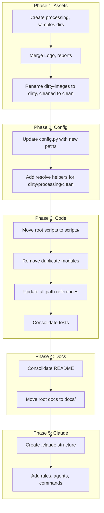

# Document Management System Refactor Plan

## Current State Summary

**Assets:** Mixed layout with legacy (`assets/dirty-images/`, `assets/cleaned/`, `assets/detection_reports/`) and new (`assets/input/`, `assets/output/`, `assets/reports/`). Root-level `cleaned/` and `Logo/` exist. Duplicate reports in two locations. `fixed_images` mentioned but not present.

**Code:** 8 root-level Python scripts, 6 in `scripts/`, 34 files in `src/`. Duplication: `simple_text_remover` (root + tests/unit), `text_watermark_remover` (root vs `src/cleaning/`). Path references scattered across 15+ files.

**Docs:** 4 root-level MD files, 4 in `docs/`. Overlap between README variants.

---

## Phase 1: Asset Directory Unification

### Target Layout

```
assets/
├── dirty/                    # Raw inputs (rename from dirty-images, input)
│   ├── cursor-drive/
│   ├── visible-dirt/
│   └── logo/                 # Merge root Logo + assets/dirty-images/Logo
├── processing/               # Intermediate outputs (new; replaces fixed_images concept)
│   └── {dataset}/
├── clean/                    # Final outputs (rename from cleaned, output)
│   └── {dataset}/
├── reports/                  # All reports (consolidate detection_reports + reports)
│   └── {dataset}/
├── battle-videos/            # Keep as-is
├── test-results/             # Test outputs (text_watermark, visible_watermark)
└── samples/                  # Root sample PNGs (copy_simple_cleaned, etc.)
```

### Migration Steps

1. Create `assets/processing/` and `assets/samples/`
2. Move root `Logo/` SVGs into `assets/dirty/logo/` (or merge with existing `assets/dirty-images/Logo/`, which has PNGs)
3. Consolidate reports: merge `assets/reports/` and `assets/detection_reports/` into `assets/reports/`
4. Merge root `cleaned/` (battle_report.txt) into `assets/battle-videos/` or `assets/reports/`
5. Move root sample PNGs into `assets/samples/` (if they exist)
6. Rename `dirty-images` → `dirty`, `cleaned` → `clean` (or keep `input`/`output` aliases; see below)
7. Remove `fixed_images` if it appears later (create as placeholder for processing)

**Decision:** Use semantic names: `dirty`, `processing`, `clean`. Update [src/config.py](src/config.py) to expose these paths.

---

## Phase 2: Code Consolidation and Refactor

### Code Changes Required

| File | Change |
|------|--------|
| [src/config.py](src/config.py) | Add `DIRTY_DIR`, `PROCESSING_DIR`, `CLEAN_DIR`; deprecate legacy names; update `resolve_*` |
| [scripts/clean_one.py](scripts/clean_one.py) | Use `config.output_path()` or `clean_dir` |
| [scripts/comprehensive_detect_and_clean.py](scripts/comprehensive_detect_and_clean.py) | Replace hardcoded `assets/dirty-images`, `assets/cleaned` |
| [src/cleaning/image_cleaner.py](src/cleaning/image_cleaner.py) | Replace `assets/dirty-images/Logo`, `assets/cleaned_advanced` |
| [simple_text_remover.py](simple_text_remover.py) | Use config; remove duplication with `src/cleaning/text_watermark_remover.py` |
| [test_text_watermarks.py](test_text_watermarks.py), [test_visible_watermarks.py](test_visible_watermarks.py) | Use config; move to `tests/` |
| [battle_visualization.py](battle_visualization.py), [clean_glass_image.py](clean_glass_image.py), [analyze_watermark.py](analyze_watermark.py) | Move to `scripts/` or `src/`; use config |

### Target Code Layout

```
decryption/
├── src/                      # Single package
│   ├── config.py             # Central paths (dirty, processing, clean)
│   ├── __main__.py           # python -m src
│   ├── core/
│   ├── detection/
│   ├── cleaning/
│   ├── models/
│   ├── visualization/
│   └── utils/
├── scripts/                  # CLI entry points only
│   ├── clean_one.py
│   ├── detect_and_clean.py
│   ├── battle_visualization.py
│   ├── analyze_watermark.py
│   └── ...
├── tests/
│   ├── unit/
│   ├── integration/
│   └── fixtures/             # Test assets (symlink or copy from assets/samples)
└── pyproject.toml / setup.py # Package install
```

### Consolidation Actions

1. **Remove duplication:** Delete root `simple_text_remover.py`, `text_watermark_remover.py`; use `src/cleaning/text_watermark_remover.py` via CLI
2. **Move root scripts:** `analyze_watermark.py`, `battle_visualization.py`, `clean_glass_image.py`, `reorganize_src.py` → `scripts/`
3. **Move root tests:** `test_text_watermarks.py`, `test_visible_watermarks.py` → `tests/integration/` (merge with existing)
4. **Remove `tests/unit/simple_text_remover.py`** if it's a copy; replace with proper unit tests importing from `src`
5. **Add `src/__main__.py`** for `python -m src` entry point
6. **Update all imports** to use `from src.` or `src.` package

---

## Phase 3: Documentation Consolidation

### Target Layout

```
docs/
├── README.md                 # Single entry; link to docs/
├── user-guide/
│   ├── quick-start.md
│   ├── installation.md
│   └── troubleshooting.md
├── technical-docs/
│   ├── detailed-plan.md
│   ├── CLEANING_METHODOLOGIES.md
│   └── REPORTS.md
├── ADDITIONAL_PATTERNS_GUIDE.md  # Move from root
└── CONTRIBUTING.md           # Optional
```

### Root-Level Docs

- **README.md:** Single canonical readme; merge useful content from `AI_ENHANCED_README.md`, `REORGANIZATION_SUMMARY.md`
- **Archive:** Move `AI_ENHANCED_README.md`, `REORGANIZATION_SUMMARY.md` to `docs/archive/` or delete
- **Root JSON/log:** `blue_bg_analysis.json`, `cleaned_metadata.json`, `ai_stegano.log` → `assets/reports/` or `assets/samples/`

---

## Phase 4: .claude Ecosystem

Create `.claude/` with hooks, agents, skills, commands, and rules for Claude Code integration.

### Structure

```
.claude/
├── settings.json             # Permissions, env, model
├── agents/                   # Subagent definitions
│   ├── watermark-detector.md
│   └── asset-organizer.md
├── commands/                 # Slash commands
│   ├── clean-image.md
│   └── run-detection.md
├── rules/                    # Rules loaded into context
│   ├── asset-paths.md
│   └── watermark-workflow.md
├── hooks/                    # Optional
│   └── hooks.json
└── .mcp.json                 # Optional MCP for image tools
```

### Artifacts to Create

| Type | Purpose |
|------|---------|
| **Rule: asset-paths** | Document `assets/dirty`, `assets/processing`, `assets/clean`; instruct Claude to use config |
| **Rule: watermark-workflow** | When editing detection/cleaning code, run tests; use fixtures from assets |
| **Agent: watermark-detector** | Subagent for running detection, interpreting results |
| **Agent: asset-organizer** | Subagent for migrating/moving assets per new layout |
| **Command: /clean-image** | Quick path to run clean_one or detect_and_clean |
| **Command: /run-detection** | Run full detection test on a directory |
| **Hook (optional): PostToolUse** | Lint or test after editing Python in src/ |

### MCP Consideration

If image analysis tools are needed (e.g., fetch image metadata, run external detectors), add `.mcp.json` with a local MCP server. Lower priority unless user has specific tools.

---

## Phase 5: Execution Order and Dependencies



---

## Parallel Subagent Task Breakdown

### Background Agent 1: Asset Migration

- **Todo 1.1:** Create `assets/processing/`, `assets/samples/`; document current contents of `dirty-images`, `cleaned`, `Logo`
- **Todo 1.2:** Merge `assets/reports/` and `assets/detection_reports/`; remove duplicates
- **Todo 1.3:** Move root `cleaned/battle_report.txt` to `assets/battle-videos/` or `assets/reports/`
- **Todo 1.4:** Merge `Logo/` (root) with `assets/dirty-images/Logo/` into `assets/dirty/logo/`
- **Acceptance:** Single `assets/` tree; no root-level asset dirs except `assets/`

### Background Agent 2: Config and Path Refactor

- **Todo 2.1:** Update `config.py` with `DIRTY_DIR`, `PROCESSING_DIR`, `CLEAN_DIR`; keep backward-compat `resolve_*` for one release
- **Todo 2.2:** Grep all `.py` for path strings; produce list of files and line numbers to update
- **Todo 2.3:** Update `clean_one.py`, `comprehensive_detect_and_clean.py`, `image_cleaner.py` to use config
- **Acceptance:** No hardcoded `assets/dirty-images`, `assets/cleaned` in production code

### Background Agent 3: Code Consolidation

- **Todo 3.1:** Move `analyze_watermark.py`, `battle_visualization.py`, `clean_glass_image.py`, `reorganize_src.py` to `scripts/`
- **Todo 3.2:** Remove root `simple_text_remover.py`, `text_watermark_remover.py`; add CLI in `scripts/` that delegates to `src/cleaning`
- **Todo 3.3:** Move `test_text_watermarks.py`, `test_visible_watermarks.py` into `tests/integration/`; deduplicate with existing
- **Todo 3.4:** Add `src/__main__.py`; verify `python -m src` works
- **Acceptance:** No root-level `.py` except `pyproject.toml`/`setup.py`; tests pass

### Background Agent 4: Documentation

- **Todo 4.1:** Merge README.md with AI_ENHANCED_README, REORGANIZATION_SUMMARY; archive or delete redundant
- **Todo 4.2:** Move `ADDITIONAL_PATTERNS_GUIDE.md` to `docs/`
- **Todo 4.3:** Move `blue_bg_analysis.json`, `cleaned_metadata.json`, `ai_stegano.log` to `assets/reports/`
- **Acceptance:** Single README; root has minimal docs; data files in assets

### Background Agent 5: .claude Setup

- **Todo 5.1:** Create `.claude/settings.json` with schema; add project context
- **Todo 5.2:** Create `rules/asset-paths.md`, `rules/watermark-workflow.md`
- **Todo 5.3:** Create `agents/watermark-detector.md`, `agents/asset-organizer.md`
- **Todo 5.4:** Create `commands/clean-image.md`, `commands/run-detection.md`
- **Acceptance:** `.claude/` loads without error; rules/agents/commands discoverable

### Background Agent 6: Claude Plugin Research (Already Done)

Research complete. Key references: [Claude Code settings](https://docs.anthropic.com/en/docs/claude-code/settings), [Hooks](https://docs.claude.com/en/docs/claude-code/hooks), [MCP](https://docs.claude.com/en/docs/claude-code/mcp).

---

## Risks and Mitigations

| Risk | Mitigation |
|------|------------|
| Breaking existing scripts | Keep `resolve_*` backward-compat; deprecation warnings |
| Missing assets | Agent 1 produces manifest before move; verify paths exist |
| Test failures | Run full test suite after each phase; fix before merge |
| .claude format drift | Use `$schema` in settings.json; validate against schema |

---

## Files Requiring Code Refactor (Summary)

- [src/config.py](src/config.py) - New path constants
- [scripts/clean_one.py](scripts/clean_one.py) - Output path
- [scripts/comprehensive_detect_and_clean.py](scripts/comprehensive_detect_and_clean.py) - Input/output paths
- [scripts/detect_and_clean_cursor_drive.py](scripts/detect_and_clean_cursor_drive.py) - Uses config (minor)
- [scripts/full_detection_test.py](scripts/full_detection_test.py) - Default dir
- [src/cleaning/image_cleaner.py](src/cleaning/image_cleaner.py) - Logo path, cleaned_advanced
- [simple_text_remover.py](simple_text_remover.py) - Remove; replace with script
- [test_text_watermarks.py](test_text_watermarks.py) - Paths; move
- [test_visible_watermarks.py](test_visible_watermarks.py) - Paths; move
- [battle_visualization.py](battle_visualization.py) - Move; optional config
- [clean_glass_image.py](clean_glass_image.py) - Move; optional config
- [analyze_watermark.py](analyze_watermark.py) - Move
- [scripts/migrate_assets.py](scripts/migrate_assets.py) - Update for new layout
