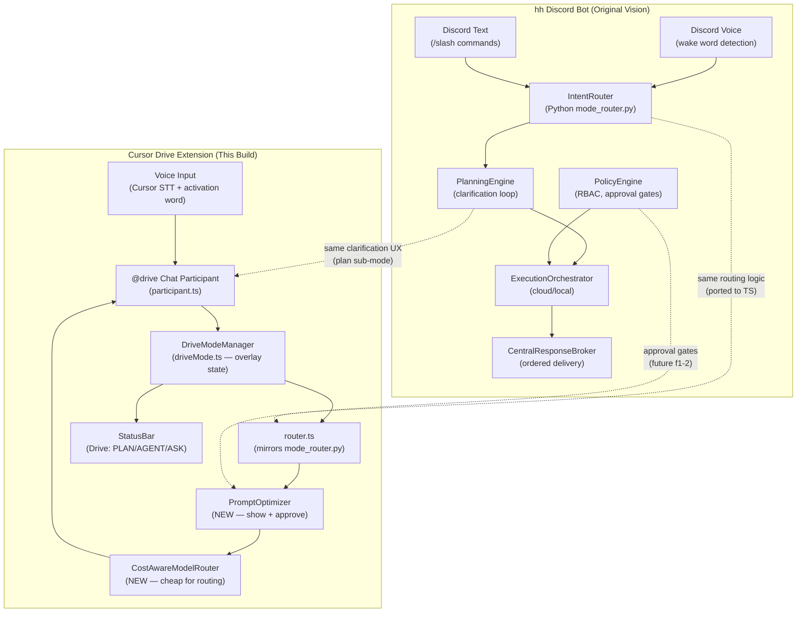
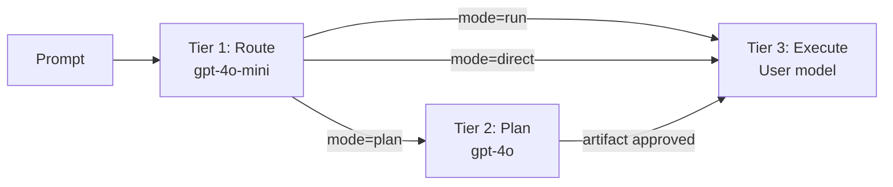

# Cursor Drive: Full Build for Anysphere Job Application

## Publishing: No Azure Required

The VS Code Marketplace PAT comes from **dev.azure.com** but only requires a free Microsoft or GitHub account — not a paid Azure subscription. However, the cleaner no-account path is **Open VSX Registry**:

```
npm install -g ovsx
ovsx create-namespace hh   # one-time, requires GitHub login at open-vsx.org
ovsx publish --pat $OVSX_PAT
```

Cursor reads Open VSX as a fallback when extensions aren't on the VS Code Marketplace. Users can also install the `.vsix` directly:
- Cursor: `Ctrl+Shift+P` → `Extensions: Install from VSIX...`
- CLI: `cursor --install-extension cursor-drive-0.1.0.vsix`

**Plan**: Publish to Open VSX (GitHub account only) AND add a GitHub Release with the `.vsix` attached. Both are gated in this plan.

---

## Architecture: How hh Discord Bot → Cursor Drive Extension

The core insight is that **hh was always an orchestration engine with two transports**: Discord (voice in / text out) and Cursor (chat in / code out). The extension realizes the original vision through the same core modules.



**Key mapping**: The extension is not a thin wrapper — it IS the hh orchestration layer, just with Cursor as the transport instead of Discord. The Python backend powers the Discord side; the TypeScript extension powers the Cursor side. The same `RouteMode`, `PlanningArtifact`, and session lifecycle live in both.

---

## New Features to Build

### Feature 1: Prompt Optimizer (highest value for job application)

Before every model call, run the raw prompt through a cheap model (`gpt-4o-mini` / `claude-haiku`) to produce an optimized, clear version. Show it to the user in the chat stream with an **Approve / Edit / Skip** flow.

```mermaid
sequenceDiagram
  participant user as User
  participant participant as @drive participant
  participant optimizer as PromptOptimizer
  participant model as LLM (cheap)
  participant router as router.ts

  user->>participant: "drive agent uhh add like a login thing idk maybe also tests"
  participant->>optimizer: rawPrompt
  optimizer->>model: optimize(rawPrompt)
  model-->>optimizer: "Add login page with session auth and unit tests for auth flow"
  optimizer->>participant: OptimizeResult{optimized, original, approved:false}
  participant->>user: stream.markdown("**Optimized prompt:**\n> Add login page...")
  participant->>user: stream.button("✓ Use this") + stream.button("✗ Use original")
  user->>participant: clicks "✓ Use this"
  participant->>router: route(optimized, driveSubMode)
```

Config: `cursorDrive.promptOptimizer.enabled` (default `true`), `cursorDrive.promptOptimizer.autoApprove` (default `false`).

Voice-specific: when prompt contains filler words ("uhh", "like", "idk", "maybe", "kinda") — **always** optimize even if `autoApprove: false`.

### Feature 2: Cost-Aware Model Routing

Don't use the same expensive model for everything. Use a 3-tier system:

- **Tier 1 (routing)**: cheapest available (`gpt-4o-mini` / `claude-haiku`) — activation word detection, route decision, prompt optimization
- **Tier 2 (planning)**: mid-tier (`gpt-4o` / `claude-sonnet`) — plan mode clarification and artifact generation
- **Tier 3 (execution)**: user's selected model — only when actually executing



Implementation: `CostAwareModelSelector` reads from `request.model` (user's selected model) but overrides it for routing/planning tiers. Uses `vscode.lm.selectChatModels()` to pick the cheapest available.

### Feature 3: Filler Word Cleaner (voice-first UX)

Regex + heuristic pass before the optimizer runs. Strips common voice artifacts from transcribed speech:
- Filler words: "uhh", "umm", "like", "you know", "kinda", "sorta", "maybe", "I don't know"
- Repetitions: "can you can you" → "can you"
- Trailing uncertainty markers: "...right?" / "...or whatever"

This runs **client-side in the extension** (no API call needed), so zero cost.

### Feature 4: Drive Mode Persona Hardening

Update system prompts across all sub-modes to encode the pair-programmer persona:
- **Leads but is easily steered**: always ends responses with a clear recommendation + explicit "Or tell me to change course"
- **Cost-aware**: in agent mode, explicitly states "I'll use the cheapest model for this step" when downtiering
- **Approval before large actions**: in agent mode, before proposing multi-file changes, asks "This affects X files — proceed?"

---

## Documentation to Produce

### Docs to write:
- `extension/README.md` (full rewrite — architecture, features, voice flow, config reference)
- `docs/design/cursor-drive-walkthrough.md` (full code walkthrough for every module)
- `docs/design/prompt-optimizer-design.md` (design doc for the new feature)
- `docs/design/model-cost-tiers.md` (model routing rationale)

### Architecture diagrams to embed:
- Full system (Discord + Cursor transports, shared core) — in README
- Voice activation flow (activation word → sub-mode → optimizer → model) — in walkthrough
- Data flow for a full "drive agent add login page" session — in walkthrough
- Module dependency graph — in walkthrough

---

## Execution Plan (Sub-Agent Waves)

### Wave 0: Pre-work (main agent, direct writes)
- Add `extension/src/promptOptimizer.ts` (new module)
- Add `extension/src/modelSelector.ts` (new module)
- Add `extension/src/fillerCleaner.ts` (new module)
- Update `extension/src/participant.ts` to use all three

### Wave 1: Documentation (parallel sub-agents)
- Agent A: Write `extension/README.md` — full architecture + usage + config reference
- Agent B: Write `docs/design/cursor-drive-walkthrough.md` — module-by-module code walkthrough
- Agent C: Write `docs/design/prompt-optimizer-design.md` + `docs/design/model-cost-tiers.md`

### Wave 2: Publishing (main agent + verification)
- Add `ovsx` to devDependencies
- Update `.vscodeignore` and add `LICENSE` file
- `npm run compile && vsce package && ovsx publish`
- Create `CHANGELOG.md`
- GitHub Release instructions

---

## Anysphere Job Application Note

Their process: email `hiring@anysphere.inc` with resume + short note about a project you're proud of. This extension demonstrates:
- **Deep Cursor/VS Code internals knowledge** (Chat Participant API, LanguageModel API, StatusBar, WorkspaceState)
- **AI orchestration architecture** (routing tiers, planning artifacts, session lifecycle)
- **Voice-first UX thinking** (activation words, filler cleaning, prompt optimization approval flow)
- **Cost awareness** (3-tier model selection built into the architecture)
- **Real product thinking** (easily steered pair programmer persona, privacy-strict defaults)

The `extension/README.md` we write here IS the project description they'd read.
