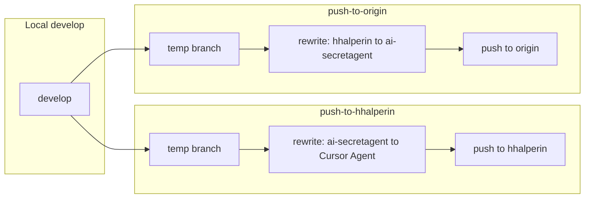

# Dual-profile push identity isolation

## Goal

- **Two profiles**: `hhalperin` (personal) and `ai-secretagent` (drive-mode org)
- **No identity leak**: Pushing to hhalperin must not expose ai-secretagent; pushing to origin must not expose hhalperin
- **Push to either (or both) separately**: Scripts to push with correct identity per remote

## Approach

Use **git filter-branch** with env-filters to rewrite author/committer before each push. Each push creates a temporary branch, rewrites it, pushes to the target remote, then deletes the temp branch. The main `develop` branch is never rewritten in place.



## Identity mapping

| Remote | Target identity | Rewrite |
|--------|-----------------|---------|
| **hhalperin** | hhalperin + Cursor Agent only | ai-secretagent, halpie, super.ai.secretagent@*, ai-secretagent@* → Cursor Agent |
| **origin** (drive-mode) | ai-secretagent only | hhalperin, halpie, harrisonhalperin@*, hhalperin@* → ai-secretagent + super.ai.secretagent@gmail.com |

## Implementation

### 1. Add `rewrite-authors-for-origin.sh`

New env-filter script for pushing to origin. Inverse of [rewrite-authors.sh](scripts/git-rewrite/rewrite-authors.sh):

- **hhalperin** → ai-secretagent
- **halpie** → ai-secretagent
- **harrisonhalperin@gmail.com**, **hhalperin@users.noreply.github.com**, **140918117+hhalperin@*** → super.ai.secretagent@gmail.com
- **Cursor Agent** → leave as-is (or map to ai-secretagent if desired; plan assumes Cursor Agent is neutral and can stay)

Co-authored-by in commit messages: normalize `Co-authored-by: hhalperin <...>` and `Co-authored-by: halpie <...>` to `Co-authored-by: ai-secretagent`. This requires `--msg-filter` in addition to `--env-filter`; git filter-branch supports both.

### 2. Add `push-to-hhalperin.sh`

```sh
# From repo root
# 1. Create temp branch from develop
# 2. Run filter-branch with rewrite-authors.sh (masks ai-secretagent)
# 3. Push temp branch to hhalperin/develop
# 4. Delete temp branch
```

Uses existing [rewrite-authors.sh](scripts/git-rewrite/rewrite-authors.sh).

### 3. Add `push-to-origin.sh`

```sh
# From repo root
# 1. Create temp branch from develop
# 2. Run filter-branch with rewrite-authors-for-origin.sh (masks hhalperin)
# 3. Push temp branch to origin/develop
# 4. Delete temp branch
```

Uses new `rewrite-authors-for-origin.sh`.

### 4. Optional: `push-to-both.sh`

Runs `push-to-hhalperin.sh` then `push-to-origin.sh` sequentially. Each push does an independent rewrite from current `develop`.

### 5. Local commit identity

**Recommendation**: Commit locally as **Cursor Agent** (`cursoragent@cursor.com`) so local history is neutral. Add to [scripts/git-rewrite/README.md](scripts/git-rewrite/README.md):

- How to set `user.name` and `user.email` for neutral commits
- Optional: `git config includeIf` so a specific worktree or path uses Cursor Agent

Example for one-off neutral commit:
```sh
git -c user.name="Cursor Agent" -c user.email="cursoragent@cursor.com" commit -m "..."
```

Or set in repo `.git/config`:
```ini
[user]
    name = Cursor Agent
    email = cursoragent@cursor.com
```

### 6. Update README

Extend [scripts/git-rewrite/README.md](scripts/git-rewrite/README.md) with:

- **Dual-profile workflow** section
- When to use `push-to-hhalperin.sh` vs `push-to-origin.sh`
- Identity isolation rules
- Local commit best practice (Cursor Agent)

## Files to create/modify

| File | Action |
|------|--------|
| `scripts/git-rewrite/rewrite-authors-for-origin.sh` | Create — env-filter for hhalperin → ai-secretagent |
| `scripts/git-rewrite/push-to-hhalperin.sh` | Create — temp branch, rewrite, push to hhalperin |
| `scripts/git-rewrite/push-to-origin.sh` | Create — temp branch, rewrite, push to origin |
| `scripts/git-rewrite/push-to-both.sh` | Create (optional) — run both push scripts |
| `scripts/git-rewrite/README.md` | Update — dual-profile workflow, identity rules |

## Co-authored-by in commit messages

`rewrite-authors-for-origin.sh` only handles env (author/committer). To fix `Co-authored-by: hhalperin <...>` in messages, add a `--msg-filter` to the filter-branch call in `push-to-origin.sh`:

```sh
git filter-branch -f \
  --env-filter ". \"$SCRIPT_DIR/rewrite-authors-for-origin.sh\"" \
  --msg-filter 'sed -e "s/Co-authored-by: hhalperin <[^>]*>/Co-authored-by: ai-secretagent/" -e "s/Co-authored-by: halpie <[^>]*>/Co-authored-by: ai-secretagent/"' \
  "$TEMP_BRANCH"
```

## Risks

- **Force push**: If the remote branch has diverged, push may require `--force`. Scripts should warn or require explicit `--force` flag.
- **Large history**: filter-branch can be slow on large repos; acceptable for occasional pushes.
