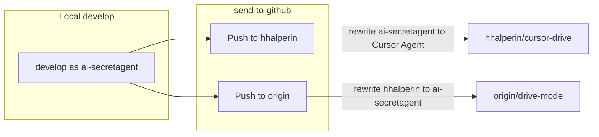

# Dual-profile push: send-to-github

## Goal

- **Single script**: `send-to-github` pushes to both remotes
- **Two profiles**: hhalperin (personal) and ai-secretagent (drive-mode)
- **No identity leak**: Each remote sees only the identity appropriate for it
- **Default local work**: ai-secretagent (user.name, user.email)

## Approach

`send-to-github` runs two pushes (sequential or parallel):

1. **Push to hhalperin**: Rewrite ai-secretagent → Cursor Agent, push via `hhalperin` remote (uses hhalperin credentials from URL)
2. **Push to origin**: Rewrite hhalperin → ai-secretagent (if any), push via `origin` remote (uses ai-secretagent credentials)

Each push uses a temp branch, rewrites with the appropriate env-filter, pushes, then deletes the temp branch. Main `develop` is never rewritten.



## Identity mapping

| Remote | Target identity | Rewrite |
|--------|-----------------|---------|
| **hhalperin** | hhalperin + Cursor Agent only | ai-secretagent, super.ai.secretagent@*, ai-secretagent@* → Cursor Agent |
| **origin** | ai-secretagent only | hhalperin, halpie, harrisonhalperin@*, hhalperin@* → ai-secretagent + super.ai.secretagent@gmail.com |

## Implementation

### 1. Add `rewrite-authors-for-origin.sh`

Env-filter for origin push: hhalperin/halpie → ai-secretagent, personal emails → super.ai.secretagent@gmail.com. ai-secretagent email is fine to show on origin.

### 2. Add `send-to-github`

Single script that:

- Accepts optional `--branch` (default: develop)
- Creates temp branch `send-hhalperin-$$` from branch
- Runs filter-branch with `rewrite-authors.sh` (masks ai-secretagent)
- Pushes temp to `hhalperin` remote, deletes temp
- Creates temp branch `send-origin-$$` from branch
- Runs filter-branch with `rewrite-authors-for-origin.sh` (masks hhalperin)
- Pushes temp to `origin` remote, deletes temp

Runs both pushes sequentially (simpler; parallel would require background jobs and careful cleanup).

Optional `--force` to allow force-push when remotes have diverged.

### 3. Repo default: ai-secretagent

Set in repo `.git/config` or document for user:

```ini
[user]
    name = ai-secretagent
    email = super.ai.secretagent@gmail.com
```

One-off override for hhalperin commit: `git -c user.name=hhalperin -c user.email=harrisonhalperin@gmail.com commit ...`

### 4. Update README

Extend [scripts/git-rewrite/README.md](scripts/git-rewrite/README.md):

- **send-to-github** section: usage, identity isolation, `--force`
- Default local identity (ai-secretagent)
- Remove or fold push-to-hhalperin / push-to-origin into this section

## Files to create/modify

| File | Action |
|------|--------|
| `scripts/git-rewrite/rewrite-authors-for-origin.sh` | Create — env-filter for hhalperin → ai-secretagent |
| `scripts/git-rewrite/send-to-github` | Create — single script: rewrite + push to both remotes |
| `scripts/git-rewrite/README.md` | Update — send-to-github workflow, default identity |

## Co-authored-by

Add `--msg-filter` in the origin push step to normalize `Co-authored-by: hhalperin <...>` and `Co-authored-by: halpie <...>` to `Co-authored-by: ai-secretagent`.

## Removed from original plan

- `push-to-hhalperin.sh`, `push-to-origin.sh`, `push-to-both.sh` — replaced by single `send-to-github`

## Note: existing scripts

[filter-callbacks.py](scripts/git-rewrite/filter-callbacks.py), [rewrite-authors.sh](scripts/git-rewrite/rewrite-authors.sh), and [rewrite-authors-env.sh](scripts/git-rewrite/rewrite-authors-env.sh) use `super.ai.secretagent@gmail.com` (replaced from `2.diss.honest@gmail.com`).
