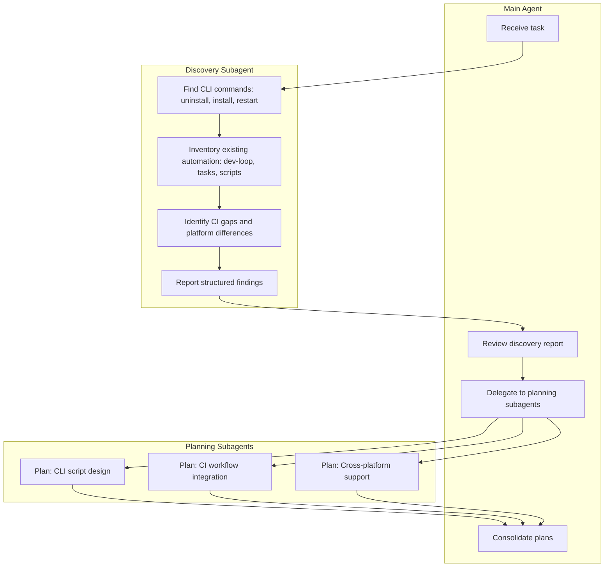

# Extension Uninstall/Reinstall/Restart Automation (Subagent-Driven)

## Subagent Flow

---

## Phase 1: Discovery Subagent

**Invoke:** `mcp_task` with `subagent_type: "explore"` (or `generalPurpose` for broader scope)

**Prompt for discovery subagent:**

> Discover and report:
>
> 1. **CLI commands** for Cursor extension management: `cursor --install-extension`, `cursor --uninstall-extension` (verify existence and syntax), any `--force` flag. Check VS Code `code` CLI parity.
> 2. **Restart/reload options**: How to reload the extension host or Cursor window via CLI (e.g. `cursor serve-web` restart, or no CLI for desktop reload).
> 3. **Existing automation** in [sandbox/dev-loop.mjs](sandbox/dev-loop.mjs), [.vscode/tasks.json](.vscode/tasks.json), [scripts/serve-web-dev.ps1](scripts/serve-web-dev.ps1), [.github/workflows/ci.yml](.github/workflows/ci.yml). Document current flow: compile → package → install (no uninstall).
> 4. **Extension IDs**: `drive-mode.cursor-drive` (package.json publisher), `hh.cursor-drive` (user fork). Both may exist; uninstall must target the correct ID(s).
> 5. **Platform differences**: Windows (PowerShell), macOS/Linux (bash). Paths: `%LOCALAPPDATA%\...\extensions` vs `~/.cursor/extensions`.

**Deliverable:** Structured report (markdown or JSON) with: commands found, gaps, platform notes, file references.

---

## Phase 2: Main Agent Reviews Report

Main agent reads the discovery report and:

- Validates `cursor --uninstall-extension` exists (Cursor forum suggests it does; may not support multiple `--uninstall-extension` in one call)
- Identifies which automation to extend vs. create new
- Decides subagent split for planning

---

## Phase 3: Planning Subagents

Spawn 2–3 planning subagents via `mcp_task` with `subagent_type: "generalPurpose"`:

### Planning Subagent A: CLI Script Design

> Design a reusable script (e.g. `scripts/reinstall-extension.mjs` or `.ps1`/`.sh`) that:
>
> - Uninstalls Drive extension by ID (support both `drive-mode.cursor-drive` and `hh.cursor-drive`)
> - Compiles and packages VSIX
> - Installs the new VSIX
> - Optionally restarts Cursor (serve-web: kill + restart; desktop: document manual reload or `cursor serve-web` flow)
> - Accepts flags: `--serve-web`, `--extension-id`, `--skip-compile`
> - Exits with non-zero on failure; idempotent where possible

### Planning Subagent B: CI Workflow Integration

> Design changes to [.github/workflows/ci.yml](.github/workflows/ci.yml) or a new workflow:
>
> - When to run reinstall flow (e.g. on PR, or manual dispatch)
> - Use `cursor serve-web` for headless testing (no display)
> - Steps: checkout → npm ci → compile → package → (uninstall if needed) → install → serve-web → smoke test (e.g. curl MCP health)
> - Artifacts: VSIX, test logs

### Planning Subagent C: Cross-Platform Support

> Design platform-specific wrappers or a single script that works on Windows (PowerShell/Node), macOS, Linux:
>
> - Use Node.js for core logic (like [sandbox/dev-loop.mjs](sandbox/dev-loop.mjs)) to avoid shell differences
> - Document OS-specific gotchas (paths, `cursor` vs `Cursor.exe`)

---

## Phase 4: Consolidation and Implementation Plan

Main agent merges planning outputs into a single implementation plan with:

- New script(s) and their locations
- package.json scripts (e.g. `reinstall`, `reinstall:serve-web`)
- CI workflow YAML changes
- Docs update ([docs/guides/live-testing.md](docs/guides/live-testing.md) or new `docs/guides/extension-reinstall-automation.md`)

---

## Key Files to Modify

| File                                    | Role                                             |
| --------------------------------------- | ------------------------------------------------ |
| `scripts/reinstall-extension.mjs` (new) | Core reinstall logic; Node.js for cross-platform |
| `package.json`                          | Add `reinstall`, `reinstall:serve-web` scripts   |
| `.github/workflows/ci.yml`              | Optional: add reinstall + serve-web smoke job    |
| `docs/guides/live-testing.md`           | Document reinstall flow and CLI commands         |
| `sandbox/dev-loop.mjs`                  | Optionally call reinstall script or share logic  |

---

## Open Questions for Discovery

1. `**cursor --uninstall-extension`**: Exact syntax and whether it accepts extension ID (`publisher.name`) or VSIX path. Cursor forum notes it may not support multiple `--uninstall-extension` in one invocation.
2. **Restart**: No CLI for "reload window" in desktop Cursor. For serve-web, kill process and restart. For desktop dev, document "Reload Window" manually.
3. **CI headless**: `cursor serve-web` runs without display; suitable for CI. May need `--without-connection-token --accept-server-license-terms`.
