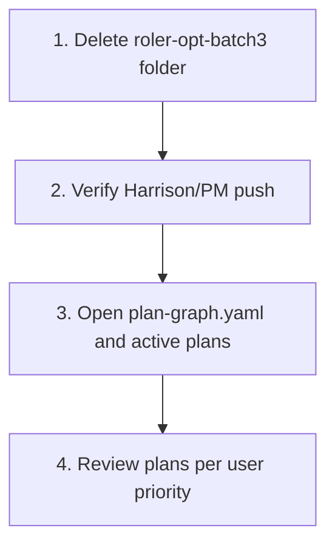

# Final Worktree Cleanup and Plan Review

## Findings

### roler-opt-batch3 Is Not a Worktree

- `**git worktree list**` shows only the main roler worktree; roler-opt-batch1 and roler-opt-batch2 were already removed.
- **roler-opt-batch3** exists as a directory at [roler_ai/roler-opt-batch3](roler_ai/roler-opt-batch3) but:
  - Has no `.git` file/dir; git commands there use the parent repo (C:/Users/harri)
  - Contains only 2 files: `.cursor/skills/python-test/SKILL.md` and `.cursor/skills/python-write/SKILL.md`
  - Is on branch `memory` (from the home repo), not `opt/batch3-token-tool-20260308`
- **opt/batch3-token-tool-20260308** was already merged into Harrison/PM (reflog confirms).

### Harrison/PM Status

- **Local:** `c825833` with all opt merges
- **Remote:** Up to date with `origin/Harrison/PM` (pushed in the prior session)
- No further push needed.

---

## Plan

### 1. Remove roler-opt-batch3

Because it is not a git worktree, use normal directory removal:

```powershell
Remove-Item -Recurse -Force "C:\Users\harri\Documents\Coding Projects\business\roler_ai\roler-opt-batch3"
```

**Safety:** The 2 skill files are copies of roler content; the canonical versions live in [roler](roler).

### 2. Confirm Harrison/PM Push (No-Op)

```powershell
cd roler
git status   # Should show "up to date with 'origin/Harrison/PM'"
```

If it shows ahead, run `git push origin Harrison/PM`.

### 3. Review Plans in roler/.cursor/plans/

Plans to review (from [plan-graph.yaml](roler/.cursor/plans/plan-graph.yaml)):


| Plan                    | State       | File                                                                                                                     |
| ----------------------- | ----------- | ------------------------------------------------------------------------------------------------------------------------ |
| Production Readiness    | in_progress | [production-readiness-and-maintainability.plan.md](roler/.cursor/plans/production-readiness-and-maintainability.plan.md) |
| Plan Completion Hooks   | in_progress | [plan-completion-hooks-implementation.plan.md](roler/.cursor/plans/plan-completion-hooks-implementation.plan.md)         |
| Implement               | —           | [implement.plan.md](roler/.cursor/plans/implement.plan.md)                                                               |
| Data Architecture       | —           | [data_architecture_plan_7a797912.plan.md](roler/.cursor/plans/data_architecture_plan_7a797912.plan.md)                   |
| PM Automation Bootstrap | —           | [pm_automation_bootstrap_80d97c54.plan.md](roler/.cursor/plans/pm_automation_bootstrap_80d97c54.plan.md)                 |


---

## Execution Order


