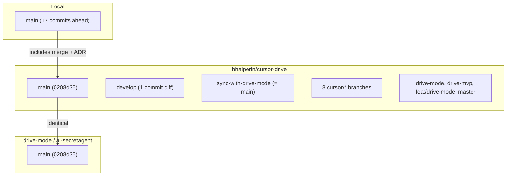

# Fork branch review and merge plan

## Current state

- **Local main**: 17 commits ahead of hhalperin/main (merge of cursor-agentic-framework-review-288f, ADR-0024, create-plan skill, etc.).
- **hhalperin/main** and **origin/main**: Both at 0208d35; identical.
- **Branches on hhalperin**: 14 total; most have unrelated Git history (no common ancestor with main).

---

## Phase 1: Sync and baseline

1. **Fetch all remotes**
  - `git fetch hhalperin`
  - `git fetch origin`
2. **Establish baseline main**
  - Decide: use **local main** (17 commits ahead) or **hhalperin/main** (0208d35) as the merge target.
  - Recommendation: Use **local main** as baseline (it already has the cursor-agentic-framework-review-288f merge). Push it to hhalperin first so hhalperin/main becomes the canonical merge target for the rest of the work.
3. **Push local main to hhalperin** (optional, before branch merges)
  - `git push hhalperin main`
  - This updates hhalperin/main to include the 17 local commits. All subsequent merges target this updated main.

---

## Phase 2: develop (shared history)

**Relationship**: develop shares history with main. develop has 1 unique commit (merge de1a818); main has 2 commits develop lacks (05beb4b, 0208d35). Main has more content (README redesign, readme-redesign plan, etc.).

**Decision**: Do **not** merge develop into main. Main is ahead and more complete.

**Action**: Update develop from main so it stays in sync:

- `git checkout develop`
- `git merge main` (or `git reset --hard main` if develop should mirror main exactly)
- `git push hhalperin develop`

---

## Phase 3: sync-with-drive-mode

**Relationship**: 0 ahead, 0 behind main. Identical.

**Decision**: Skip. No merge needed.

---

## Phase 4: Critical review of unrelated branches

Each branch below has **unrelated history**. Merging requires `git merge <branch> --allow-unrelated-histories` and conflict resolution (keep main's version for conflicts per ADR-0024).

### 4.1 cursor/cursor-agentic-framework-review-288f

**Status**: Already merged into local main (not yet pushed to hhalperin).

**Action**: Skip. Will be on hhalperin/main after Phase 1 push.

---

### 4.2 cursor/autonomous-project-governance-c6fc

| Metric  | Value                                                                  |
| ------- | ---------------------------------------------------------------------- |
| Commits | 73                                                                     |
| Tip     | e463bbc — Add executable plan for governance entropy control           |
| Notable | Governance scan, MCP commands, Tier-1 AI summary, entropy control plan |

**Review**: Governance-focused work (plans, MCP, guards). Likely overlaps with existing plan system and dep-auditor. Check if any unique governance features (e.g. entropy control plan) are desired.

**Recommendation**: Review commit-by-commit or diff key files. If unique value: merge with `--allow-unrelated-histories`, resolve by keeping main. If superseded: skip.

---

### 4.3 cursor/development-environment-setup-55ba

| Metric  | Value                                                                 |
| ------- | --------------------------------------------------------------------- |
| Commits | 52                                                                    |
| Tip     | cced7b7 — test: add A2A SSE streaming, role parsing, agent card tests |

**Review**: Dev environment and A2A tests. May overlap with sandbox/, playwright, existing tests.

**Recommendation**: Diff against main for `sandbox/`, `tests/`, `.vscode/`. Merge only if it adds tests or setup not already present.

---

### 4.4 cursor/development-environment-setup-8cce

| Metric      | Value                       |
| ----------- | --------------------------- |
| Commits     | (subset of 55ba or related) |
| Merged into | feat/drive-mode (PR #7)     |

**Review**: Likely duplicate or subset of 55ba. feat/drive-mode already merged it.

**Recommendation**: Skip (redundant with feat/drive-mode).

---

### 4.5 cursor/extension-codebase-health-bfce

| Metric  | Value                                                     |
| ------- | --------------------------------------------------------- |
| Commits | 58                                                        |
| Tip     | d9a888e — Fix MCP transport lifecycle and expand coverage |

**Review**: MCP transport, test coverage. Current main has extensive MCP and tests.

**Recommendation**: Diff `src/mcpServer.ts`, `tests/`. Merge only if it adds coverage or fixes not in main.

---

### 4.6 cursor/mob-programming-cockpit-mvp-c801

| Metric  | Value                                         |
| ------- | --------------------------------------------- |
| Commits | 71                                            |
| Tip     | 8c9a6cd — chore: add **pycache** to gitignore |

**Review**: Mob programming cockpit (ADR-0022). Check if ADR-0022 or related work is already in main.

**Recommendation**: Check docs/architecture/adr/ for ADR-0022. If main already has it: skip. If not: assess whether to merge for doc/plan content.

---

### 4.7 cursor/new-cloud-agent-5837

| Metric  | Value                                                               |
| ------- | ------------------------------------------------------------------- |
| Commits | 13                                                                  |
| Tip     | e8b5518 — feat: tiered model routing — Tier 1 dep triage + ADR-0010 |

**Review**: Tiered model routing, ADR-0010, modelSelector. These are already in main (ADR-0010, modelSelector.ts, dep-auditor).

**Recommendation**: Skip. Superseded by main.

---

### 4.8 cursor/project-src-directory-8de5

| Metric  | Value                                      |
| ------- | ------------------------------------------ |
| Commits | 14                                         |
| Tip     | a347fe4 — ci: use master as default branch |

**Review**: CI and branch config. Main uses main; origin uses main.

**Recommendation**: Skip. Branch/config changes likely obsolete.

---

### 4.9 drive-mode

| Metric  | Value                                           |
| ------- | ----------------------------------------------- |
| Commits | 14                                              |
| Tip     | 126b086 — Merge PR #1 from new-cloud-agent-5837 |

**Review**: Merges new-cloud-agent-5837 (tiered routing). That work is in main.

**Recommendation**: Skip. Superseded.

---

### 4.10 drive-mvp

| Metric  | Value                                                           |
| ------- | --------------------------------------------------------------- |
| Commits | 68                                                              |
| Tip     | 6b6ffe3 — feat: add agent-browser Electron skill for UI testing |

**Review**: MVP features, agent-browser skill. May have early implementations since folded into main.

**Recommendation**: Diff key files. Merge only if unique skills or tests.

---

### 4.11 feat/drive-mode

| Metric  | Value                                                         |
| ------- | ------------------------------------------------------------- |
| Commits | 78                                                            |
| Tip     | 889abda — Merge PR #7 from development-environment-setup-8cce |

**Review**: Consolidation branch; merged development-environment-setup-8cce. Likely overlaps heavily with main.

**Recommendation**: Diff against main. If main already subsumes it: skip. If it has unique work: merge with conflict resolution.

---

### 4.12 master

| Metric  | Value                                                          |
| ------- | -------------------------------------------------------------- |
| Commits | 15                                                             |
| Tip     | 8821525 — feat: consolidate Cursor Drive architecture and docs |

**Review**: Old default branch; "consolidate architecture and docs". Main has moved past this.

**Recommendation**: Skip. Superseded by main.

---

## Phase 5: Merge procedure (for branches chosen to merge)

For each branch selected in Phase 4:

1. **Checkout main** (local, or hhalperin/main after push)
  - `git checkout main`
  - `git pull hhalperin main` (if working from shared clone)
2. **Merge with unrelated histories**
  - `git merge hhalperin/<branch> --allow-unrelated-histories -m "merge: integrate <branch> (drive-mode canonical)"`
3. **Resolve conflicts**
  - For each conflicted file: `git checkout --ours -- <path>` then `git add <path>`
  - Keep main's version (ours) per ADR-0024
4. **Verify**
  - `npm run compile`
  - `npm test`
5. **Commit** (if merge stopped at conflicts)
  - `git add .`
  - `git commit -m "merge: integrate <branch> (drive-mode canonical)"`
6. **Document** (optional)
  - Add a line to ADR-0024 or a merge log listing branches merged and resolution approach.

---

## Phase 6: Comparison — hhalperin/main vs origin (ai-secretagent)

After all merges and push:

1. **Fetch**
  - `git fetch hhalperin`
  - `git fetch origin`
2. **Commit diff**
  - `git log origin/main..hhalperin/main --oneline` — commits on hhalperin not on origin
  - `git log hhalperin/main..origin/main --oneline` — commits on origin not on hhalperin
3. **File diff**
  - `git diff origin/main..hhalperin/main --stat` — summary
  - `git diff origin/main..hhalperin/main` — full diff (for PR or review)
4. **Output**
  - Write summary to a file (e.g. `docs/guides/fork-vs-upstream-diff.md`) or include in PR description when opening drive-mode PR.

---

## Phase 7: Push and optional PR to drive-mode

1. **Push hhalperin**
  - `git push hhalperin main`
  - `git push hhalperin develop` (if updated)
2. **Open PR to drive-mode** (if desired)
  - Base: `drive-mode/cursor-drive:main`
  - Compare: `hhalperin/cursor-drive:main`
  - Include Phase 6 comparison summary in PR description.

---

## Summary: branch merge matrix

| Branch                               | Action             | Reason                                             |
| ------------------------------------ | ------------------ | -------------------------------------------------- |
| develop                              | Update from main   | Main is ahead; keep develop in sync                |
| sync-with-drive-mode                 | Skip               | Identical to main                                  |
| cursor-agentic-framework-review-288f | Skip               | Already in local main                              |
| new-cloud-agent-5837                 | Skip               | Tiered routing already in main                     |
| project-src-directory-8de5           | Skip               | CI/branch config obsolete                          |
| drive-mode                           | Skip               | Superseded by main                                 |
| master                               | Skip               | Old default, superseded                            |
| development-environment-setup-8cce   | Skip               | Redundant with feat/drive-mode                     |
| autonomous-project-governance-c6fc   | Review then decide | 73 commits; governance plans may have unique value |
| development-environment-setup-55ba   | Review then decide | 52 commits; A2A tests                              |
| extension-codebase-health-bfce       | Review then decide | 58 commits; MCP coverage                           |
| mob-programming-cockpit-mvp-c801     | Review then decide | 71 commits; ADR-0022                               |
| drive-mvp                            | Review then decide | 68 commits; agent-browser skill                    |
| feat/drive-mode                      | Review then decide | 78 commits; consolidation                          |

---

## Execution order

1. Phase 1: Fetch, push local main to hhalperin
2. Phase 2: Update develop from main
3. Phase 4: Critical review of "Review then decide" branches (diff key files, decide merge or skip)
4. Phase 5: Merge each chosen branch (one at a time, verify after each)
5. Phase 6: Run comparison (hhalperin/main vs origin/main)
6. Phase 7: Push, optionally open PR to drive-mode
