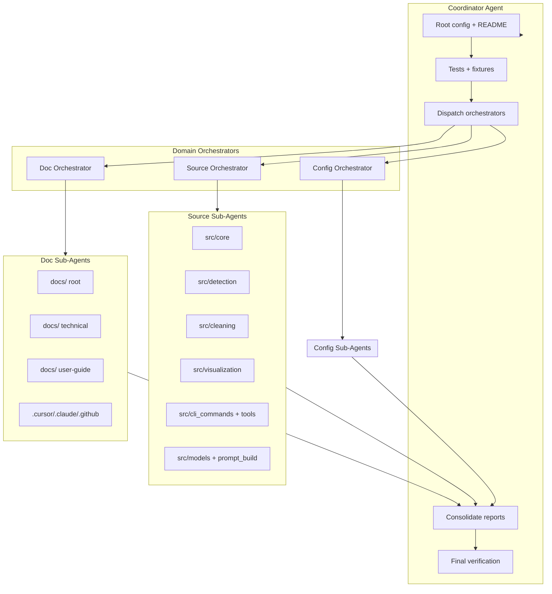

# Full Documentation and Deslop Review

## Architecture: Coordinator → Orchestrator → Sub-Agents

## Phase 1: Coordinator Setup

**Create manifest and domain map** (single coordinator session):

1. **File manifest** — Enumerate all reviewable files (exclude per `.cursorignore`: assets, venv, models, logs, etc.)
2. **Domain boundaries** — Assign each file to a domain for parallel sub-agent dispatch
3. **Cross-reference table** — Doc ↔ code links (e.g. `AGENTS.md` ↔ CLI, `docs/decryption_guidelines.md` ↔ `src/detection/`)

**Known issues to track** (from exploration):
- [README.md](README.md): Stale `decryption/` directory structure (lines 72–116); `scripts/` referenced but moved to `src/tools/`
- [docs/README.md](docs/README.md): Incomplete index — missing `analyze_commands.md`, `steganography_detection.md`, `decryption_guidelines.md`, `DEMO_PLAN.md`, `PIPELINE_STRATEGY.md`, `PIPELINE_REVIEW.md`, `ADR-001-agentic-pipeline.md`, `PROMPT_BUILD_ORCHESTRATION.md`, `AI_DETECTION_LOOP.md`
- [.claude/rules/asset-paths.md](.claude/rules/asset-paths.md): References `resolve_input_dir`, `resolve_output_dir`, `ensure_dirs()` — verify against [src/config.py](src/config.py)

## Phase 2: Documentation Orchestrator

**Sub-agents** (one per domain; parallel):

| Sub-agent | Scope | Tasks |
|-----------|-------|-------|
| **Docs root** | `docs/*.md` (root level), `docs/archive/` | Update accuracy, completeness, remove slop; fix cross-links |
| **Docs technical** | `docs/technical-docs/`, `docs/ADDITIONAL_PATTERNS_GUIDE.md`, `docs/CLEANING_METHODOLOGIES.md`, `docs/REPORTS.md` | Align with current code; remove filler |
| **Docs user** | `docs/user-guide/`, `docs/AI_DETECTION_LOOP.md`, `docs/DEMO_PLAN.md`, `docs/PIPELINE_*.md`, `docs/ADR-*` | User-facing accuracy; trim verbosity |
| **Agent config** | `.cursor/`, `.claude/`, `.github/` (commands, rules, skills, personas, templates) | Consistency with AGENTS.md; remove duplication; fix globs/paths |

**Per-file checklist** (each sub-agent):
- Content matches current code/behavior
- No redundant or filler prose
- Links and paths valid
- Consistent terminology (e.g. "wm" vs "CLI", "dirty" vs "input")

## Phase 3: Source Code Orchestrator

**Sub-agents** (one per domain; parallel):

| Sub-agent | Scope | Files (approx) |
|-----------|-------|----------------|
| **Core** | `src/core/` | png_analyzer, watermark_analyzer, ai_enhanced_analyzer, expert_router |
| **Detection** | `src/detection/` | chunk_analyzer, steganography, unicode_scanner, pattern_identifier, text/visible watermark detectors |
| **Cleaning** | `src/cleaning/` | image_cleaner, watermark_inpaintor, text/visible/simple removers, steganography_sanitizer |
| **Visualization** | `src/visualization/` | engine, battle_engine, battle_state_machine, dashboard, frame_capture, video_generator, metaphors, demo/agentic live viewers |
| **CLI + tools** | `src/cli.py`, `src/cli_commands/`, `src/tools/` | All CLI commands, tools, scripts |
| **Models + prompts** | `src/models/`, `src/prompt_build/`, `src/config.py`, `src/advanced_waste_detector.py` | AI models, registry, config |

**Deslop checklist** (per [deslop skill](C:\Users\harri\.cursor\plugins\cache\cursor-public\cursor-team-kit\e2a9918787654e001453044ea742eed826287064\skills\deslop\SKILL.md)):
- Remove unnecessary or inconsistent comments
- Remove defensive checks/try-catch in trusted paths
- Remove casts to `any` used only to bypass types
- Simplify deeply nested code with early returns
- Align style with surrounding codebase

## Phase 4: Config and Root Orchestrator

**Sub-agents**:

| Sub-agent | Scope | Tasks |
|-----------|-------|-------|
| **Root** | `README.md`, `AGENTS.md`, `pyproject.toml`, `requirements*.txt`, `LICENSE` | Fix README structure (remove `decryption/`, `scripts/`); ensure AGENTS.md is single source; trim slop |
| **Tests** | `tests/`, `conftest.py`, `tests/fixtures/README.md` | Docstrings and comments; no slop; fixtures README accurate |

## Phase 5: Consolidation and Verification

**Coordinator** (after all sub-agents return):

1. **Conflict check** — Sub-agents that touched overlapping files (e.g. README + docs)
2. **Cross-reference audit** — All doc→code and code→doc links valid
3. **Index update** — [docs/README.md](docs/README.md) lists every doc in `docs/`
4. **Final deslop pass** — Spot-check high-churn files for missed slop

## File Count Summary

| Domain | Approx files |
|--------|--------------|
| docs/ | 16 |
| .cursor/ | 21 |
| .claude/ | 18 |
| .github/ | 8 |
| src/ | ~55 (excluding __init__) |
| tests/ | ~15 |
| Root | 6 |

**Total reviewable:** ~130 files (excluding assets, venv, generated, etc.)

## Execution Model

- **Coordinator**: Single agent; creates manifest, dispatches, consolidates
- **Orchestrators**: One per domain (Doc, Source, Config); each receives manifest slice
- **Sub-agents**: Use `mcp_task` with `subagent_type: generalPurpose` or `explore`; each gets:
  - Explicit file list
  - Checklist (doc update vs deslop)
  - Constraints (no behavior change for deslop; minimal diff)
- **Parallelism**: Doc sub-agents in parallel; Source sub-agents in parallel; Config in parallel with Doc/Source
- **Sequential**: Coordinator before/after; conflict resolution before final verification

## Deliverables

1. **Updated docs** — Accurate, complete, no slop
2. **Deslopped code** — Per deslop skill; behavior unchanged
3. **docs/README.md** — Complete index of all docs
4. **README.md** — Correct project structure (no `decryption/`, no `scripts/`)
5. **Consolidation report** — List of changes by file; any deferred items
