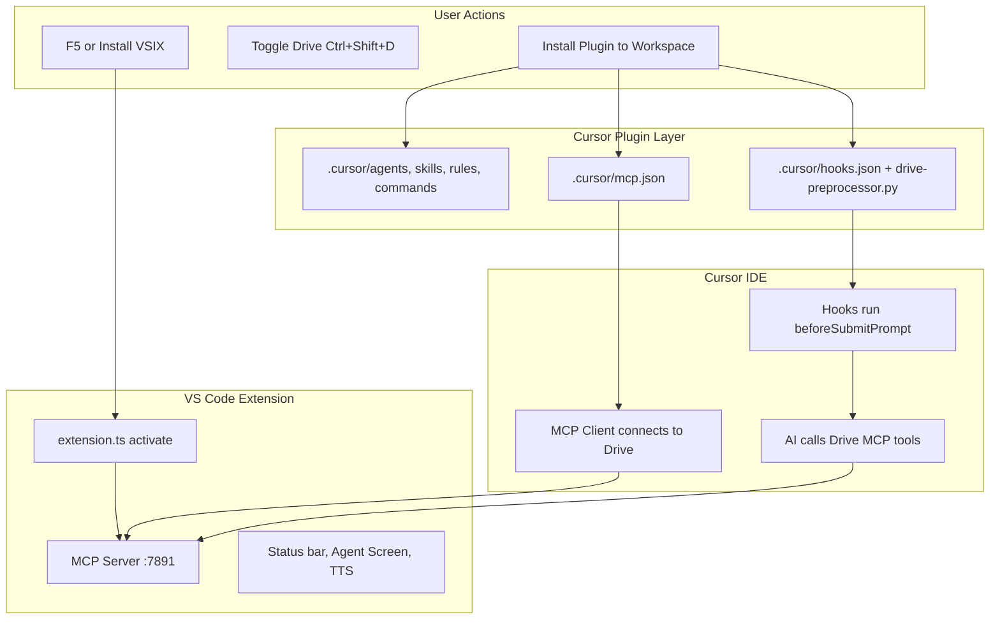

# Get Cursor Drive Extension Working

## Architecture (what must work together)




---

## Phase 1: Verify build and extension activation

**Goal:** Extension loads without errors in the Extension Development Host.


| Step | Action                                              | Success signal                               |
| ---- | --------------------------------------------------- | -------------------------------------------- |
| 1.1  | `npm ci`                                            | No errors                                    |
| 1.2  | `npm run compile`                                   | `Found 0 errors`                             |
| 1.3  | Press **F5** → select **"Dev: Drive in repo root"** | New Cursor window opens                      |
| 1.4  | In dev-host: **Output** → select **"Cursor Drive"** | Log shows `[Drive] activate() complete`      |
| 1.5  | Command Palette → **"Drive: Diagnose Drive APIs"**  | Modal shows LM models, MCP port, Drive state |


**Common failures:**

- **"Cannot find module" for cursor-socket / cursor-resolver-helper** — Launch config already disables these. If it happens in the *main* window, use F5 (dev-host) or disable those extensions manually. See [dev-host-disabled-extensions.md](docs/guides/dev-host-disabled-extensions.md).
- `**out/extension.js` missing** — Run `npm run compile` before F5.
- **preLaunchTask "watch" fails** — Ensure `.vscode/tasks.json` has a `watch` task that runs `tsc -watch`. If missing, run `npm run watch` in a separate terminal before F5.

---

## Phase 2: MCP server and registration

**Goal:** MCP server listens and Cursor can reach it.


| Step | Action                                                                                                                                         | Success signal                                      |
| ---- | ---------------------------------------------------------------------------------------------------------------------------------------------- | --------------------------------------------------- |
| 2.1  | In dev-host terminal: `curl http://127.0.0.1:7891/health` (PowerShell: `Invoke-WebRequest -Uri http://127.0.0.1:7891/health -UseBasicParsing`) | `{"status":"ok","name":"cursor-drive","port":7891}` |
| 2.2  | Check **Cursor Drive** output channel                                                                                                          | Line: `MCP server: listening on port 7891`          |


**If port 7891 is in use:**

- Extension auto-tries 7892, 7893, … (up to 15 attempts).
- Update `.cursor/mcp.json` to match the actual port shown in the output channel.

**MCP registration options:**

1. **Extension API** — If Cursor exposes `vscode.cursor.mcp.registerServer`, Drive auto-registers. Output shows `MCP server registered via Extension API`.
2. **Manual** — Add to workspace `.cursor/mcp.json`:

```json
   { "mcpServers": { "drive": { "url": "http://127.0.0.1:7891/mcp" } } }


```

1. **Plugin installer** — Run **"Drive: Install Drive Plugin to Workspace"**; it merges the Drive server into `.cursor/mcp.json`.
2. **Deep link** — On first run, Drive may prompt to register via `cursor://` deep link.

---

## Phase 3: Plugin layer (skills, hooks, MCP config)

**Goal:** AI can use Drive tools and hooks run.


| Step | Action                                                                                                                | Success signal                                    |
| ---- | --------------------------------------------------------------------------------------------------------------------- | ------------------------------------------------- |
| 3.1  | Command Palette → **"Drive: Install Drive Plugin to Workspace"**                                                      | Toast: "Drive plugin installed to …"              |
| 3.2  | Verify workspace `.cursor/` contains: `agents/`, `commands/`, `rules/`, `skills/`, `hooks/`, `hooks.json`, `mcp.json` | All present                                       |
| 3.3  | In Agent chat: ask to call `share_screen_activity` with message "MCP smoke test"                                      | Agent Screen shows the entry                      |
| 3.4  | Type `/` in chat                                                                                                      | Commands like `tangent`, `switch`, `merge` appear |


**Hook verification (optional):**

```powershell
echo '{"prompt":"uhh like plan the refactor"}' | python .cursor/hooks/drive-preprocessor.py beforeSubmitPrompt
# Expected: JSON with decision, drive_cleaned_prompt, etc.
```

**Hook requirements:** Python in PATH; `pip install pyyaml` for full `plan-runner.py` behavior.

---

## Phase 4: Sandbox-specific setup (if using "Dev: Drive in sandbox")

**Goal:** Sandbox workspace uses port 7892 to avoid conflict with main Cursor on 7891.


| Step | Action                                         | Success signal                                                         |
| ---- | ---------------------------------------------- | ---------------------------------------------------------------------- |
| 4.1  | Run `.\sandbox\setup-drive-dev.ps1` once       | Junctions created, `sandbox/.cursor/mcp.json` has port 7892            |
| 4.2  | Set `cursorDrive.mcp.port` to 7892 for sandbox | Add to `sandbox/.vscode/settings.json`: `"cursorDrive.mcp.port": 7892` |
| 4.3  | F5 → **"Dev: Drive in sandbox"**               | Dev-host opens sandbox; MCP on 7892                                    |
| 4.4  | `curl http://127.0.0.1:7892/health`            | `{"status":"ok"}`                                                      |


**Gotcha:** `setup-drive-dev.ps1` creates `mcp.json` with 7892, but the extension defaults to 7891. You must set `cursorDrive.mcp.port` in `sandbox/.vscode/settings.json` so the server and MCP client use the same port. The `npm run reinstall:dev-sandbox` script handles this automatically.

---

## Phase 5: Smoke test checklist

From [live-testing.md](docs/guides/live-testing.md):

- **Drive: Diagnose Drive APIs** — LM models, MCP port, Drive active
- **Ctrl+Shift+D** — Status bar shows `Drive > Agent`
- **Ctrl+Shift+S** — Agent Screen webview opens
- `curl http://127.0.0.1:7891/health` — `{"status":"ok"}`
- MCP tool `share_screen_activity` — visible in Agent Screen
- `/tangent research X` — spawns operator, status bar updates

---

## Quick reference: key files


| Purpose                | Location                                                   |
| ---------------------- | ---------------------------------------------------------- |
| Extension entry        | [src/extension.ts](src/extension.ts)                       |
| MCP server             | [src/mcpServer.ts](src/mcpServer.ts)                       |
| Plugin installer       | [src/pluginInstaller.ts](src/pluginInstaller.ts)           |
| Hooks config           | [.cursor/hooks.json](.cursor/hooks.json)                   |
| MCP config (workspace) | `.cursor/mcp.json`                                         |
| Launch configs         | [.vscode/launch.json](.vscode/launch.json)                 |
| Live testing guide     | [docs/guides/live-testing.md](docs/guides/live-testing.md) |


---

## If still broken: diagnostic sequence

1. **Capture Cursor Drive output** — Full log from activation to first failure.
2. **Run Diagnose** — Note which checks pass/fail (LM, MCP port, etc.).
3. **Check port** — `netstat -ano | findstr 7891` (Windows) to see if something else uses it.
4. **Verify Python** — `python --version`; hooks require Python.
5. **Try repo root first** — Use "Dev: Drive in repo root" before sandbox to isolate sandbox-specific issues.
6. **Clean reinstall** — `npm run reinstall:dev-sandbox` for a full reset (uninstall, compile, package, install, launch).
