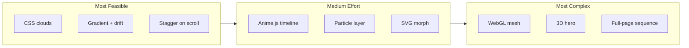

# Landing Page Clouds Fix and Animation Ideas

## 1. Why the Clouds Are Not Working

Subagent investigation identified several likely causes:

| Cause | Likelihood | Fix |
|-------|------------|-----|
| **Positioning mismatch** | High | `SkyGradient` uses `fixed inset-0 -z-10`; `CloudLayer` uses `absolute inset-0`. Make CloudLayer `fixed` so it stays in viewport like the sky. |
| **External Unsplash images** | High | Ad blockers, CORS, or network failures can block `images.unsplash.com`. Use local assets or inline SVG clouds instead. |
| **Z-index stacking** | Medium | CloudLayer has no z-index; add `z-0` or `z-[1]` so stacking is explicit above SkyGradient (-10). |
| **Reduced motion** | Low | If user has `prefers-reduced-motion: reduce`, drift stops but clouds should still be visible. |

**Critical insight:** The current design uses **real cloud photos** from Unsplash. These are heavy (800px), external, and fragile. SVG or CSS-based clouds are more reliable and lighter.

---

## 2. Immediate Fixes (Minimal Effort)

1. **CloudLayer positioning:** Change outer div from `absolute inset-0` to `fixed inset-0 -z-[1]` (or `z-0`) so it matches SkyGradient and stays visible on scroll.
2. **Replace external images:** Use inline SVG cloud shapes or a small local PNG/SVG asset. No external network dependency.
3. **Add `pointer-events-none` to outer CloudLayer** if it blocks clicks on hero CTA (or ensure hero content has higher z-index).

---

## 3. Landing Page Ideas — Feasibility Spectrum

---

## 4. Most Feasible Ideas (Low Effort, High Impact)

| Idea | Technique | Effort | Notes |
|------|-----------|--------|-------|
| **SVG cloud layer** | Replace Unsplash `` with 3–5 inline SVG paths (soft ellipses) | Low | No external deps; works offline; ad-blocker proof. |
| **CSS-only drift** | Keep current `@keyframes cloud-drift`; apply to SVG groups | Low | Already implemented; just swap image for SVG. |
| **Hero text stagger** | `splitText`-style reveal (chars/words fade in with delay) | Low–Medium | Add `animejs`; ~5KB modular import. See [animejs-animations-plan.md](roler_ui/docs/research/animejs-animations-plan.md). |
| **Scroll-triggered section fade** | IntersectionObserver (already in `ScrollRevealSection`) | Done | Already present; tune threshold/offset. |
| **Gradient mesh (CSS)** | Animated `background-position` or `hue-rotate` on gradient | Low | Simpler than WebGL; subtle movement. |

**Recommendation:** Start with SVG clouds + `fixed` positioning. Zero new deps, fixes both visibility and reliability.

---

## 5. Most Complex Ideas (High Effort, Premium Feel)

| Idea | Technique | Effort | Notes |
|------|-----------|--------|-------|
| **WebGL mesh gradient** | Stripe/Vercel/Linear-style animated blobs | High | ~10KB; requires Three.js or custom WebGL; GPU-accelerated. |
| **3D hero scene** | Three.js or React Three Fiber | High | Full 3D clouds, camera motion; heavy bundle. |
| **Full-page scroll sequence** | GSAP ScrollTrigger + timeline | High | Each scroll section drives a timeline; complex orchestration. |
| **Particle system (Canvas/WebGL)** | Hundreds of particles with physics | Medium–High | Canvas sufficient for moderate count; WebGL for 1k+. |
| **SVG morph + motion path** | Anime.js `svg.morphTo`, `createMotionPath` | Medium | Logo/icon morphing; decorative paths. |

**Critical analysis:** WebGL mesh gradients deliver the “premium” look (Stripe, Vercel) but add ~50KB+ and shader maintenance. Only pursue if brand demands that tier. Three.js is overkill for a job-search landing page.

---

## 6. Critical Thinking — Trade-offs

| Approach | Pros | Cons |
|----------|------|------|
| **SVG clouds** | Reliable, small, no network, a11y-friendly | Less photorealistic than photos |
| **External images** | Photorealistic | Blocked by ad blockers; CORS; slow; brittle |
| **WebGL mesh** | Premium, distinctive | Bundle size; complexity; device variance |
| **Anime.js** | Lightweight, modular, `onScroll` built-in | New dependency; learning curve |
| **Motion (ex-Framer)** | React-native, gestures | ~45KB; may be overkill for hero only |
| **GSAP** | Best for complex timelines | Heavier; ScrollTrigger is a plugin |

**Verdict:** For roler_ui, the best ROI is **SVG clouds + fixed positioning** (fix) plus **Anime.js for hero text stagger** (enhancement). Defer WebGL until product-market fit justifies the polish.

---

## 7. Implementation Order

1. **Fix clouds** — `fixed` + SVG clouds (or local assets); remove Unsplash.
2. **Optional:** Add Anime.js for hero headline stagger (per [animejs-animations-plan.md](roler_ui/docs/research/animejs-animations-plan.md)).
3. **Optional:** Refine `ScrollRevealSection` timing.
4. **Defer:** WebGL mesh, 3D, full-page sequences.

---

## 8. References

- [CloudLayer.tsx](roler_ui/src/components/landing/CloudLayer.tsx) — current implementation
- [SkyGradient.tsx](roler_ui/src/components/landing/SkyGradient.tsx) — reference for `fixed` pattern
- [landing-page-animations-2024-2025.md](roler_ui/docs/research/landing-page-animations-2024-2025.md) — full research
- [animejs-animations-plan.md](roler_ui/docs/research/animejs-animations-plan.md) — Anime.js mapping
