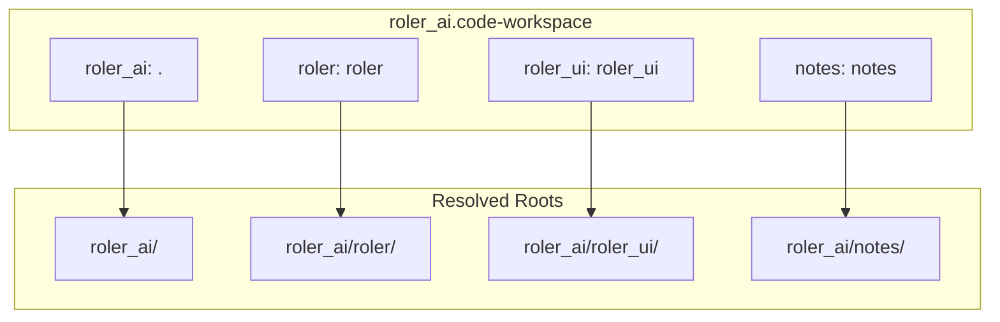

# Multi-Root Workspace Configuration Plan

## Documentation Summary

**VS Code (base)** — Cursor inherits the [VS Code multi-root workspace format](https://code.visualstudio.com/docs/editor/multi-root-workspaces):

- `.code-workspace` JSON with a `folders` array; each entry has `path` (required) and optional `name`
- Paths: relative (to workspace file location) or absolute; relative preferred for portability
- Add folders: `File > Add Folder to Workspace...` or drag-and-drop
- Settings: `settings` in workspace file applies to all roots; each root can have `.vscode/settings.json`
- Debug: `launch.json` per folder; workspace-level `launch` in workspace file for compound configs
- Tasks: `tasks.json` per folder; workspace-level `tasks` in workspace file

**Cursor-specific** (from forum):

- Indexes all folders; `.cursor/rules` supported across roots
- **Bug**: Cursor may use the folder `name` as a path prefix when applying edits instead of the actual `path` → can create files in wrong locations
- **Workaround**: Use folder names that match the path segment, or omit `name` entirely
- **Context**: Cursor defaults to the first root; `@diff` and `@branch` may only work with the first repo
- **Tip**: Open via `File > Open Workspace from File` (not “Open Folder”) so the workspace file is used

---

## Current Workspace Layout

[roler_ai.code-workspace](roler_ai.code-workspace) at `roler_ai/roler_ai.code-workspace`:

```json
{
  "folders": [
    { "name": "roler_ai", "path": "." },
    { "name": "roler", "path": "roler" },
    { "name": "roler_ui", "path": "roler_ui" },
    { "name": "notes", "path": "notes" }
  ],
  "settings": {}
}
```

Physical layout: `roler_ai/` contains `roler/`, `roler_ui/`, `notes/`, and `hh/`. Relative paths resolve relative to the workspace file location.

---

## Recommendations

### 1. Folder Names (Cursor Path Bug Mitigation)

Your folder names already match `path` segments (`roler`, `roler_ui`, `notes`), which reduces risk. For the root `"."`, the name `roler_ai` matches the parent directory. This is a safe configuration.

**Optional**: If you prefer to avoid any path confusion, remove `name` from all entries and rely on path-based display:

```json
{ "path": "." },
{ "path": "roler" },
{ "path": "roler_ui" },
{ "path": "notes" }
```

### 2. Folder Order

If `roler` is the main repo you work in, consider moving it first so Cursor’s default context and `@diff`/`@branch` align with it. Otherwise keep `roler_ai` first if it’s the primary root.

### 3. Add `hh` Folder?

If `hh` should be part of the workspace, add:

```json
{ "name": "hh", "path": "hh" }
```

### 4. Optional Workspace Settings

Add shared settings in `settings`:

```json
"settings": {
  "workbench.editor.labelFormat": "medium"
}
```

`"medium"` shows folder names in tab labels, which helps disambiguate files across roots.

### 5. Optional: Extension Recommendations

Add extensions for the workspace:

```json
"extensions": {
  "recommendations": ["dbaeumer.vscode-eslint", "esbenp.prettier-vscode"]
}
```

### 6. Opening the Workspace

Always open via `File > Open Workspace from File...` and select `roler_ai.code-workspace`, not “Open Folder” on `roler_ai/`.

---

## Summary Diagram




---

## Next Steps

1. Confirm: keep current folder order or move `roler` first?
2. Add `hh` folder or leave it out?
3. Apply minimal edits (e.g. `workbench.editor.labelFormat`) or keep `settings` empty?
4. Add extension recommendations or skip?
