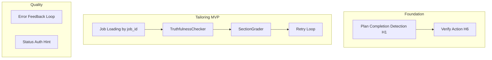

# MVP Implementation Project Plan

**Goal:** Ship roller.ai MVP by implementing the highest-leverage items from Cursor Learn takeaways, comprehensive todo backlog, and production-readiness plan. This plan references and coordinates other plans.

---

## Scope

This is a **meta-plan** that includes and sequences work from:

- [plan-completion-hooks-implementation.plan.md](docs/plans/plan-completion-hooks-implementation.plan.md) (Sub-plans 1, 6)
- [phase-1-tailoring-product.md](docs/plans/phase-1-tailoring-product.md) (T1.5, T1.1–T1.4)
- [comprehensive-todo-backlog.md](docs/plans/comprehensive-todo-backlog.md) (P1.1, P3.4, F7)
- [mvp-pipeline-strategy](docs/research/architecture/2026-02-12-mvp-pipeline-strategy.md) (TruthfulnessChecker, SectionGrader)
- [production-readiness-and-maintainability.plan.md](docs/plans/production-readiness-and-maintainability.plan.md) (Phase 1, 2)

---

## Dependency Graph

---

## Track 1: Verification Gate (Cursor Learn Guardrail)

**Source:** [plan-completion-hooks/01-detection.md](docs/plans/plan-completion-hooks/01-detection.md), [06-verify-prompt.md](docs/plans/plan-completion-hooks/06-verify-prompt.md)

**Deliverable:** When a plan file has all todos completed, a hook spawns the verifier subagent to run tests. Aligns with Cursor Learn: "Require passing tests before merge."

### Tasks

1. **Implement Sub-plan 1 (Detection Hook)**
   - Create [src/roller/hooks/plan_utils.py](src/roller/hooks/plan_utils.py): `is_plan_complete(plan_path) -> tuple[bool, str | None]`
   - Add `PlanCompletionHook` in [src/roller/hooks/intelligence.py](src/roller/hooks/intelligence.py) or new `plan_completion.py`
   - Create [.cursor/hooks/plan-completion-config.json](.cursor/hooks/plan-completion-config.json) with `summary`, `commit`, `verify` enabled
   - Register in [src/roller/hooks/handler.py](src/roller/hooks/handler.py) and [.cursor/hooks.json](.cursor/hooks.json)
   - Add [tests/unit/hooks/test_plan_completion.py](tests/unit/hooks/test_plan_completion.py)

2. **Enable Verify Action (Sub-plan 6)**
   - Ensure `verify` in config has `enabled: true` and uses `subagent: "verifier"`
   - Prompt: "Plan {{planName}} is complete. Run tests for affected files and report any failures. Use pytest. Keep output concise."

**Reference:** [plan-completion-hooks-implementation.plan.md](docs/plans/plan-completion-hooks-implementation.plan.md) shared context (plan schema, config schema, detection logic).

---

## Track 2: Job Loading by job_id (Tailoring Unblock)

**Source:** [comprehensive-todo-backlog.md](docs/plans/comprehensive-todo-backlog.md) T1.5, [tailoring/generator.py](src/roller/tailoring/generator.py) line 259

**Deliverable:** `TailoringRequest` with `job_id` loads the job from storage; tailoring runs without requiring a full `job_posting` in memory.

### Tasks

1. **Storage interface**
   - Add `get_job(job_id: str) -> JobPosting | None` to [roller.core.storage](src/roller/core/storage/) protocol and [shared/storage/local.py](src/roller/shared/storage/local.py) implementation
   - Jobs are stored under `data/roles/<org>/<date>_<role>/job.json` or a jobs index; define canonical location per [role-packet-schema.md](docs/plans/role-packet-schema.md)

2. **Generator integration**
   - In [tailoring/generator.py](src/roller/tailoring/generator.py) `generate()`, when `request.job_id` is set and `request.job_posting` is None:
     - Call `storage.get_job(request.job_id)` (or equivalent)
     - Raise `ValidationError` only if job not found
   - Pass storage (or job loader) into `ResumeGenerator` if not already available

3. **CLI path**
   - Ensure `roller tailor-job` (or equivalent) can accept job_id and trigger tailoring
   - Add test: fixture job in storage, tailor by job_id, assert packet output

**Reference:** [phase-1-tailoring-product.md](docs/plans/phase-1-tailoring-product.md) Job Ingestion Plan.

---

## Track 3: Error Feedback Loop (Hallucination Mitigation)

**Source:** [learn-cursor/2026-02-12-hallucination-limitations.md](docs/research/learn-cursor/2026-02-12-hallucination-limitations.md)

**Deliverable:** When agent/CLI run fails, the error output is explicitly included in the next prompt so the model can fix it.

### Current State

- [ralph_loop.py](src/roller/pipeline/ralph_loop.py): On `returncode != 0`, stderr goes to `append_failure()` and `append_progress()`. `build_prompt()` includes last 1000 chars of `progress.md` in "Progress So Far."
- **Gap:** Failures may be truncated or buried in long progress. No explicit "Previous failure" section.

### Tasks

1. **Ralph loop enhancement**
   - In `build_prompt()`, when `failures_file` exists and has content: add section `# Previous Iteration Failure (fix this)` with last failure text (e.g. last 2000 chars of failures.md or last failure block)
   - Ensure this appears above "Progress So Far" so the model sees it first

2. **Agent flows**
   - Audit other agent invocation points (e.g. [autonomous_agent.py](src/roller/pipeline/autonomous_agent.py), Cursor CLI calls): ensure stderr is captured and passed to follow-up prompts where applicable

**Reference:** Cursor Learn: "Verify in docs or codebase; provide the error back to the model."

---

## Track 4: Status Auth Hint (Already Implemented)

**Source:** [NEXT_STEPS.md](docs/plans/NEXT_STEPS.md), [comprehensive-todo-backlog.md](docs/plans/comprehensive-todo-backlog.md) P3.4

**Status:** [cli/commands/status.py](src/roller/cli/commands/status.py) already checks `progress.md` for "authentication required" or "cursor_api_key" and prints auth hint. **No work required** unless we want to broaden detection (e.g. "CURSOR_API_KEY" in different case).

---

## Track 5: TruthfulnessChecker (Tailoring Quality)

**Source:** [mvp-pipeline-strategy](docs/research/architecture/2026-02-12-mvp-pipeline-strategy.md) Step 4.0

**Deliverable:** Compare tailored sections to master resume; flag fabrications. Enables retry loop when grade fails.

### Tasks

1. **TruthfulnessChecker module**
   - Create `src/roller/tailoring/truthfulness.py` (or under `pipeline/agents/`)
   - `TruthfulnessChecker.check(section: str, master_sections: dict[str, str]) -> TruthfulnessResult`
   - Logic: diff/similarity check; or LLM prompt "Does every claim in this section trace back to the master? List any fabrications."
   - Return: `passed: bool`, `fabrications: list[str]`, `confidence: float`

2. **Integration point**
   - Wire into tailoring pipeline after section generation, before final output
   - [ReconciliationAgent](src/roller/pipeline/agents/reconciler.py) exists; extend or call TruthfulnessChecker from it

3. **Retry loop (simplified)**
   - If TruthfulnessChecker fails: re-run tailoring for that section with prompt "Previous attempt fabricated X. Only use content from master."
   - Max 1–2 retries to avoid loops

**Reference:** MVP strategy rubric: Truthfulness 30% weight. SectionGrader (T2.2) can come later; TruthfulnessChecker is the MVP-critical piece.

---

## Track 6: Test Coverage (Phase 1 Baseline)

**Source:** [production-readiness](docs/plans/production-readiness-and-maintainability.plan.md) 1.1, [comprehensive-todo-backlog](docs/plans/comprehensive-todo-backlog.md) TC1–TC4

**Deliverable:** Every `src/roller/*` package with non-trivial logic has at least one test file.

### Gaps

- `cli/` — no dedicated tests
- `outreach/` — no tests
- `recon/` — no tests
- `refactor/` — no tests

### Tasks

1. Add `tests/unit/cli/test_status.py` (or minimal smoke test for status command)
2. Add `tests/unit/outreach/test_templates.py` or `test_service.py` (mock SMTP)
3. Add `tests/unit/recon/test_email_finder.py` or `test_service.py`
4. Add `tests/unit/refactor/test_inventory.py` or `test_planner.py` (pure logic)

**Note:** Can be done incrementally; prioritize packages touched by Tracks 1–5.

---

## Sub-Plans Index (Included Plans)

| Plan | Tracks | Status |
|------|--------|--------|
| [plan-completion-hooks/01-detection.md](docs/plans/plan-completion-hooks/01-detection.md) | Track 1 | Pending |
| [plan-completion-hooks/06-verify-prompt.md](docs/plans/plan-completion-hooks/06-verify-prompt.md) | Track 1 | Pending |
| [phase-1-tailoring-product.md](docs/plans/phase-1-tailoring-product.md) | Track 2 | Partial |
| [comprehensive-todo-backlog.md](docs/plans/comprehensive-todo-backlog.md) | Tracks 2, 3, 6 | Reference |
| [mvp-pipeline-strategy](docs/research/architecture/2026-02-12-mvp-pipeline-strategy.md) | Track 5 | Reference |

---

## Execution Order

1. **Track 1** (Verification gate) — Small config + hook work; enables Cursor Learn guardrail.
2. **Track 2** (Job loading) — Unblocks tailoring from stored jobs; required for Phase 1.
3. **Track 3** (Error feedback) — Improves agent reliability; low risk.
4. **Track 5** (TruthfulnessChecker) — Critical for resume quality; depends on Track 2 for full flow.
5. **Track 6** (Test coverage) — Incremental; do alongside Tracks 1–5.

---

## Success Criteria

- Plan completion triggers verifier to run tests.
- `roller tailor-job <job_id>` (or equivalent) produces a role packet.
- Ralph loop includes explicit "Previous failure" when last iteration failed.
- TruthfulnessChecker flags fabrications; retry loop reduces them.
- `cli`, `outreach`, `recon`, `refactor` have at least one test file each.

---

## References

- [TAILORING_FIRST_ROADMAP.md](docs/plans/TAILORING_FIRST_ROADMAP.md)
- [docs/research/learn-cursor/INDEX.md](docs/research/learn-cursor/INDEX.md)
- [role-packet-schema.md](docs/plans/role-packet-schema.md)
