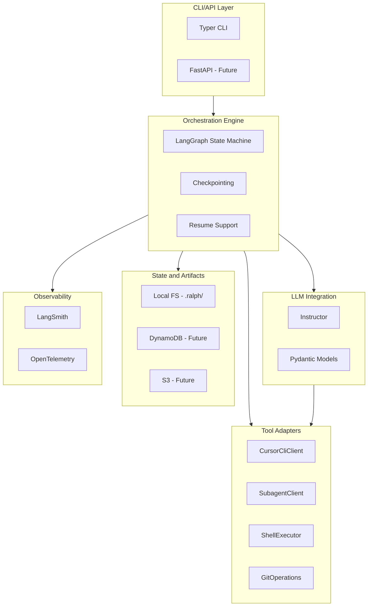

# Orchestration Framework Documentation and Research Plan

## Phase 1: Create Framework Strategy Guide

Create [docs/guides/orchestration-framework-strategy.md](docs/guides/orchestration-framework-strategy.md) documenting:

- **Purpose**: Decision framework for choosing orchestration tools
- **Architecture diagram**: Shows layers (CLI/API, Orchestration Engine, Tool Adapters, State/Artifacts)
- **Framework candidates by layer**: LangGraph, Instructor, Step Functions, etc.
- **Now vs Later priorities**: What to adopt for local dev vs AWS migration
- **Integration points**: How frameworks connect to existing Cursor CLI, SubagentClient, and pipeline code

Reference existing code:

- [src/roller/pipeline/repo_refactor.py](src/roller/pipeline/repo_refactor.py) - current state machine implementation to be replaced
- [src/roller/pipeline/autonomous_agent.py](src/roller/pipeline/autonomous_agent.py) - runner dispatch pattern
- [modular-framework.md](modular-framework.md) - existing design concepts

## Phase 2: Create Research Documents

Create research docs in `docs/research/libraries/` for each framework candidate:

| Research Topic     | File                                         | Purpose                                       |
| ------------------ | -------------------------------------------- | --------------------------------------------- |
| LangGraph          | `2026-02-02-langgraph-orchestration.md`      | State machines, checkpointing, agent handoffs |
| Instructor         | `2026-02-02-instructor-structured-output.md` | Pydantic-based LLM extraction                 |
| LangSmith          | `2026-02-02-langsmith-observability.md`      | Tracing, evaluation, prompt versioning        |
| Pydantic Settings  | `2026-02-02-pydantic-settings.md`            | Type-safe config management                   |
| AWS Step Functions | `2026-02-02-aws-step-functions.md`           | Serverless workflow orchestration             |
| Temporal           | `2026-02-02-temporal-workflows.md`           | Durable execution alternative                 |
| OpenTelemetry      | `2026-02-02-opentelemetry-tracing.md`        | Vendor-neutral observability                  |

Each research doc follows the standard template:

- Context (why we're evaluating)
- Key findings
- Code examples showing integration with roller.ai
- Comparison with current implementation
- Action items for adoption

## Phase 3: Identify Additional Research Topics

After initial research, identify gaps in these areas:

- **LLM Providers**: Anthropic SDK, OpenAI SDK, provider abstraction patterns
- **Testing**: Pytest fixtures for LLM mocks, VCR-style recording
- **Caching**: Response caching strategies for LLM calls
- **Rate Limiting**: Token bucket, circuit breaker patterns
- **Security**: Secret management, credential rotation

## Deliverables

1. `docs/guides/orchestration-framework-strategy.md` - Decision guide with architecture diagram
2. 7+ research documents in `docs/research/libraries/`
3. Updated `docs/research/INDEX.md` with new research entries
4. List of additional research topics for follow-up

## Architecture Diagram (for guide)

