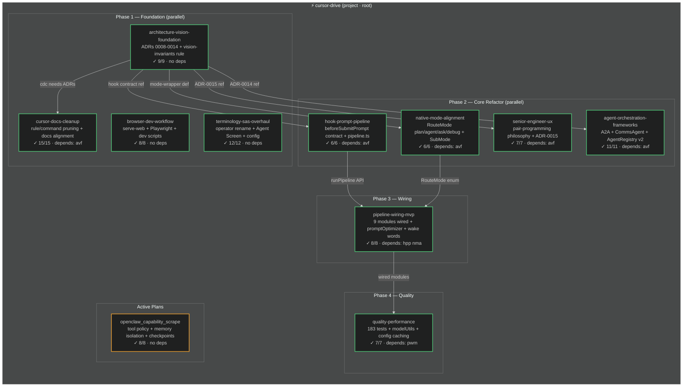
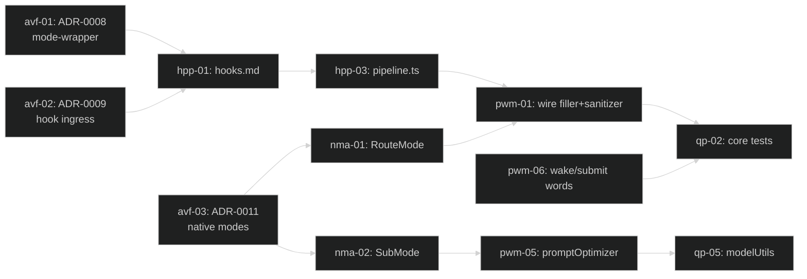

<!-- Managed by plan-governor agent. Regenerate: python .cursor/hooks/plan-runner.py sync-registry -->
<!-- Also see: task-graph.yaml (TODO-level), agent-graph.md (spawn hierarchy) -->

# Plan Master Diagram

> Last verified: 2026-02-25 · 11 plans · 97/97 TODOs completed · 183 tests passing
> Theme: **dark** — change `"dark"` to `"default"` in `%%{init}%%` to switch

---

## Graph index

| File | Scope |
|------|-------|
| `plan-master.diagram.md` (this file) | Plan-level dependency DAG with phase grouping |
| `task-graph.yaml` | All 97 TODOs aggregated across plans with inter-plan ordering |
| `agent-graph.md` | Orchestrator → plan-agent → TODO-subagent spawn hierarchy |

---

## Plan dependency DAG

---

## Phase gates (all passed)

| Gate | Condition | Status |
|------|-----------|--------|
| Phase 1 → 2 | ADR-0008–0014 exist; vision-invariants.mdc; dead .cursor/ files removed | ✓ |
| Phase 2 → 3 | hooks.md with hook contract; router uses plan/agent/ask/debug | ✓ |
| Phase 3 → 4 | All 9 orphaned modules wired; end-to-end pipeline runs | ✓ |
| Phase 4 done | 183 tests pass; npm run compile clean; docs reflect architecture | ✓ |

---

## Cross-plan dependency detail

---

## Archived plans

| Plan | Phase | TODOs | ADRs / evidence |
|------|-------|-------|-----------------|
| architecture-vision-foundation | 1 | 9/9 ✓ | ADR-0008–0014, vision-invariants.mdc |
| cursor-docs-cleanup | 1 | 15/15 ✓ | plan-governance.mdc, dead files removed |
| browser-dev-workflow | 1 | 8/8 ✓ | scripts/serve-web-dev.ps1, tests/browser/ |
| terminology-sas-overhaul | 1 | 12/12 ✓ | src/operatorRegistry.ts, src/agentScreen.ts, ADR-0016 |
| hook-prompt-pipeline | 2 | 6/6 ✓ | src/pipeline.ts, docs/reference/hooks.md |
| native-mode-alignment | 2 | 6/6 ✓ | src/router.ts (plan/agent/ask/debug), src/driveMode.ts |
| senior-engineer-ux | 2 | 7/7 ✓ | docs/design/philosophy/senior-engineer-pair-programming.md, ADR-0015 |
| agent-orchestration-frameworks | 2 | 11/11 ✓ | src/commsAgent.ts, A2A endpoints, ADR-0014 |
| pipeline-wiring-mvp | 3 | 8/8 ✓ | src/promptOptimizer.ts, pipeline wired |
| quality-performance | 4 | 7/7 ✓ | 183 tests, src/modelUtils.ts |
| subagent-plan-execution | meta | 8/8 ✓ | .cursor/skills/execute-plans/SKILL.md |
| docs-overhaul | legacy | 9/9 ✓ | docs/ restructured |
| hh-migration-followup | legacy | 4/4 ✓ | ADR-0005, ADR-0006 |
| drive-mode-installable-ui | legacy | 6/6 ✓ | VSIX packaging |

## Superseded plans

| Plan | Superseded by |
|------|---------------|
| mvp-gaps | pipeline-wiring-mvp |
| test-coverage | quality-performance |
| code-optimization | quality-performance |
| fix-extension-activation | quality-performance (qp-01) |

---

*Legend: ✓ completed (green) · ⚡ in_progress (blue) · ○ pending (grey dashed)*
