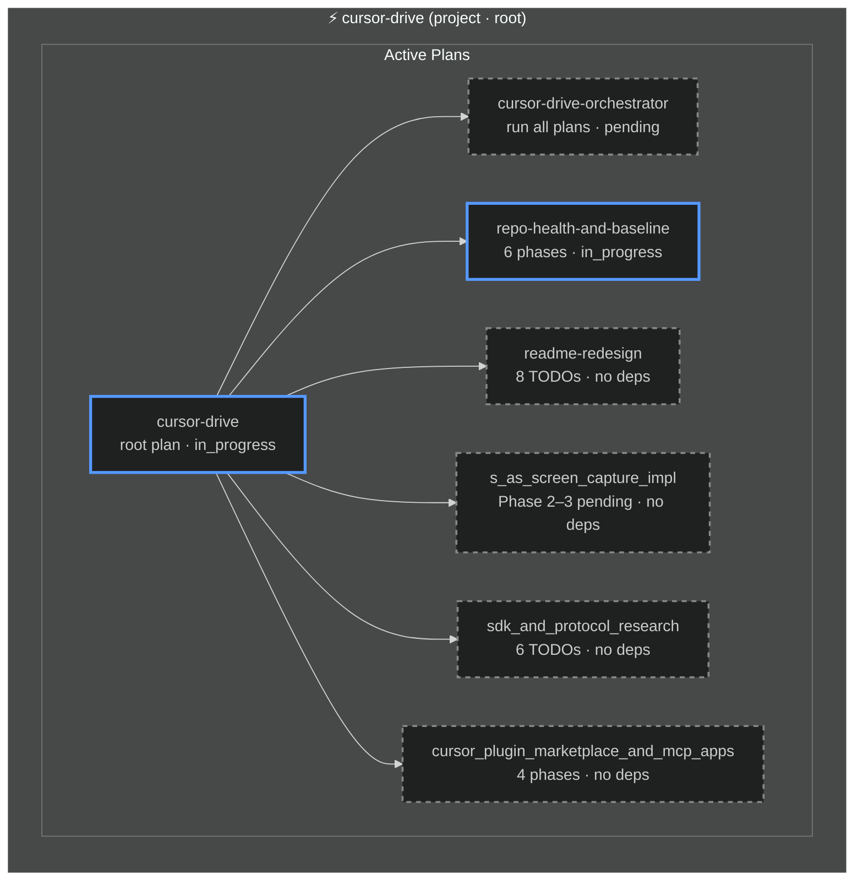

<!-- Managed by plan-governor agent. Regenerate: python .cursor/hooks/plan-runner.py sync-registry -->
<!-- Also see: task-graph.yaml (TODO-level), agent-graph.md (spawn hierarchy) -->

# Plan Master Diagram

> Last verified: 2026-03-04 · 9 active plans
> Theme: **dark** — change `"dark"` to `"default"` in `%%{init}%%` to switch

---

## Graph index

| File | Scope |
|------|-------|
| `plan-master.diagram.md` (this file) | Plan-level dependency DAG with phase grouping |
| `task-graph.yaml` | All TODOs aggregated across plans with inter-plan ordering |
| `agent-graph.md` | Orchestrator → plan-agent → TODO-subagent spawn hierarchy |

---

## Plan dependency DAG

---

## Archived plans

### cursor-drive (archive/cursor-drive/)

| Plan | TODOs | Evidence |
|------|-------|----------|
| cursor_drive_state_sync_95317c89 | ✓ | Plan sync, session memory |
| openclaw_capability_scrape_8fa228d1 | ✓ | Tool policy, memory isolation |
| wire_and_fix_drive_886a9ffa | ✓ | Drive wiring |
| drive_ux_polish_and_auto-mcp_deb68d21 | ✓ | UX polish, auto-MCP |
| voice_user_journey_storyboard_59290404 | ✓ | Voice journey |
| cursor_native_commands_wire_4b8e2c17 | ✓ | Native commands |
| governance_entropy_control_1d0c8c2e | ✓ | Governance |
| mcp_apps_implementation_cc604304 | ✓ | MCP apps |
| composer_ui_constraints_and_extension_tab_strategy_5cd16ec2 | ✓ | Composer UI constraints |
| mob-programming-cockpit-mvp | ✓ | S-AS Sync tab, worktrees, IntegrationQueue |
| mcp_install_link_and_extension_api | ✓ | README install link, Extension API |
| project_cleanup_and_reset_11e351b6 | superseded | → repo-health-and-baseline |
| fork_upstream_sync_and_branch_cleanup_82fad582 | superseded | → repo-health-and-baseline |
| repo_review_and_bugfix_plan_9f907bcf | superseded | → repo-health-and-baseline |

### cursor-drive (archive/ root — legacy)

| Plan | Phase | TODOs | ADRs / evidence |
|------|-------|-------|-----------------|
| architecture-vision-foundation | 1 | 9/9 ✓ | ADR-0008–0014, vision-invariants.mdc |
| cursor-docs-cleanup | 1 | 15/15 ✓ | plan-governance.mdc, dead files removed |
| browser-dev-workflow | 1 | 8/8 ✓ | scripts/serve-web-dev.ps1, tests/browser/ |
| terminology-sas-overhaul | 1 | 12/12 ✓ | src/operatorRegistry.ts, src/agentScreen.ts, ADR-0016 |
| hook-prompt-pipeline | 2 | 6/6 ✓ | src/pipeline.ts, docs/reference/hooks.md |
| native-mode-alignment | 2 | 6/6 ✓ | src/router.ts (plan/agent/ask/debug), src/driveMode.ts |
| senior-engineer-ux | 2 | 7/7 ✓ | docs/design/philosophy/senior-engineer-pair-programming.md, ADR-0015 |
| agent-orchestration-frameworks | 2 | 11/11 ✓ | src/commsAgent.ts, A2A endpoints, ADR-0014 |
| pipeline-wiring-mvp | 3 | 8/8 ✓ | src/promptOptimizer.ts, pipeline wired |
| quality-performance | 4 | 7/7 ✓ | 183 tests, src/modelUtils.ts |
| subagent-plan-execution | meta | 8/8 ✓ | .cursor/skills/execute-plans/SKILL.md |
| docs-overhaul | legacy | 9/9 ✓ | docs/ restructured |
| hh-migration-followup | legacy | 4/4 ✓ | ADR-0005, ADR-0006 |
| drive-mode-installable-ui | legacy | 6/6 ✓ | VSIX packaging |

## Superseded plans

| Plan | Superseded by |
|------|---------------|
| mvp-gaps | pipeline-wiring-mvp |
| test-coverage | quality-performance |
| code-optimization | quality-performance |
| fix-extension-activation | quality-performance (qp-01) |

---

*Legend: ✓ completed (green) · ⚡ in_progress (blue) · ○ pending (grey dashed)*
