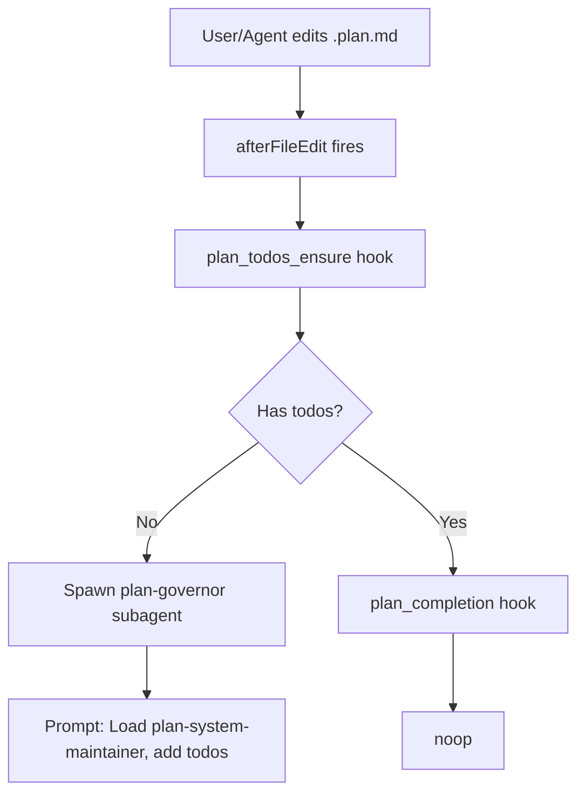

# Plan Todos Ensure Hook

## Goal

When a `.plan.md` file is saved, ensure it always has a `todos` array in frontmatter. If missing or empty, run a prompt that invokes the plan-system-maintainer skill to add them.

## Current State

- **plan_completion** hook ([src/roler/hooks/plan_completion.py](c:\Users\harri\Documents\Coding Projects\business\roler_ai\roler\src\roler\hooks\plan_completion.py)) runs on `afterFileEdit` for all files; internally filters to `.plan.md` and only acts when **all** todos are complete (spawns summary/commit/docs/verify subagents).
- **plan-system-maintainer** skill ([.cursor/skills/plan-system-maintainer/SKILL.md](c:\Users\harri\Documents\Coding Projects\business\roler_ai\rolercursor\skills\plan-system-maintainer\SKILL.md)) maintains plan graph and ensures plans have `planType`, `planId`, `parentPlanId`, and aligned `todos`.
- **plan-todos.mdc** ([.cursor/rules/plan-todos.mdc](c:\Users\harri\Documents\Coding Projects\business\roler_ai\rolercursor\rules\plan-todos.mdc)) defines the todos schema: `id`, `content`, `status`; at least one per phase.

## Approach

Add a new hook **plan_todos_ensure** that runs on `afterFileEdit` for plan files. When a plan has no `todos` or empty `todos`, spawn a subagent with a prompt that instructs loading the plan-system-maintainer skill and adding todos.

## Implementation

### 1. New hook: PlanTodosEnsureHook

**File:** [src/roler/hooks/plan_todos_ensure.py](c:\Users\harri\Documents\Coding Projects\business\roler_ai\roler\src\roler\hooks\plan_todos_ensure.py) (new)

- Parse payload for `file_path` (same pattern as plan_completion: `filePath`, `path`, `file`, `target.path`).
- If path does not end with `.plan.md` → return `noop()`.
- Read plan file, parse YAML frontmatter.
- If `todos` exists and is a non-empty list → return `noop()`.
- Otherwise: spawn subagent with prompt (see below).
- Reuse `_resolve_agent_binary`, `_spawn_detached` from [roler.hooks.intelligence](c:\Users\harri\Documents\Coding Projects\business\roler_ai\roler\src\roler\hooks\intelligence.py).
- Subagent: `plan-governor` (or `generalPurpose`) with `mode: agent` so it can edit the file.
- Throttle: reuse pattern from plan_completion (e.g. 60s per plan path) to avoid repeated spawns.

**Prompt template:**

```
Load the plan-system-maintainer skill from .cursor/skills/plan-system-maintainer/SKILL.md.
The plan at {{path}} has no todos (or an empty todos array) in frontmatter.
Per .cursor/rules/plan-todos.mdc, add a detailed todos array with at least one todo per logical phase or deliverable.
Each todo needs: id (kebab-case), content (actionable, specific), status (pending).
Edit the plan file directly to add the todos.
```

### 2. Config

**Option A:** Extend [.cursor/hooks/plan-completion-config.json](c:\Users\harri\Documents\Coding Projects\business\roler_ai\rolercursor\hooks\plan-completion-config.json):

```json
"ensureTodos": {
  "enabled": true,
  "subagent": "plan-governor",
  "throttleSeconds": 60
}
```

**Option B:** New file `.cursor/hooks/plan-todos-ensure-config.json` for separation of concerns.

Recommend **Option A** to keep plan-related hook config in one place.

### 3. Register hook

**File:** [src/roler/hooks/handler.py](c:\Users\harri\Documents\Coding Projects\business\roler_ai\roler\src\roler\hooks\handler.py)

- Import `PlanTodosEnsureHook`.
- Add to `_HOOK_REGISTRY`: `"plan_todos_ensure": PlanTodosEnsureHook()`.

### 4. Add to hooks.json

**File:** [.cursor/hooks.json](c:\Users\harri\Documents\Coding Projects\business\roler_ai\rolercursor\hooks.json)

Add to `afterFileEdit` array (before `plan_completion` so it runs first):

```json
{
  "command": "python .cursor/hooks/run_hook.py plan_todos_ensure",
  "matcher": "\\.plan\\.md$"
}
```

Use `matcher` to scope to plan files only (per Cursor docs, afterFileEdit matcher can filter by path).

### 5. Plan utils

Reuse or add a small helper in [src/roler/hooks/plan_utils.py](c:\Users\harri\Documents\Coding Projects\business\roler_ai\roler\src\roler\hooks\plan_utils.py):

- `has_todos(path: Path) -> bool` — parse frontmatter, return True if `todos` exists and is a non-empty list.

## Flow




## Verification

- Create a minimal `.plan.md` without `todos`; edit and save → hook should spawn subagent.
- Plan with existing todos → hook should noop.
- Throttle: rapid edits to same plan → only first spawn within throttle window.

## References

- [cursor-hooks SKILL](c:\Users\harri\Documents\Coding Projects\business\roler_ai\rolercursor\skills\cursor-hooks\SKILL.md) — JSON stdio, matchers, fail-open
- [plan-system-maintainer SKILL](c:\Users\harri\Documents\Coding Projects\business\roler_ai\rolercursor\skills\plan-system-maintainer\SKILL.md)
- [plan-todos.mdc](c:\Users\harri\Documents\Coding Projects\business\roler_ai\rolercursor\rules\plan-todos.mdc)
