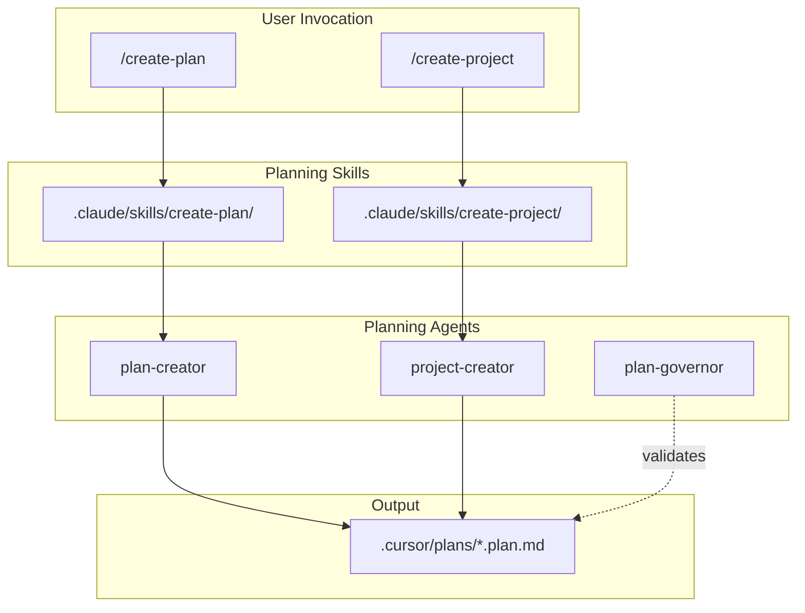

# Planning System Simplification Implementation Plan

Implements recommendations from [docs/research/architecture/2026-03-01-planning-system-simplification-design.md](docs/research/architecture/2026-03-01-planning-system-simplification-design.md) and [docs/research/cursor-primitives/2026-03-01-claude-code-skills-commands-structure.md](docs/research/cursor-primitives/2026-03-01-claude-code-skills-commands-structure.md).

---

## Target Architecture



---

## Phase 1: Planning Skills and Agents

### 1.1 Create planning agents

Create agents in both `.claude/agents/` and `.cursor/agents/` for tool/IDE agnosticism. Reference existing pattern in [.cursor/agents/plan-governor.md](.cursor/agents/plan-governor.md).

**plan-creator** (`.claude/agents/plan-creator.md` and `.cursor/agents/plan-creator.md`):
- Mission: Create a single `.plan.md` from objective + scope
- Input: objective, scope, optional `parentPlanId`
- Output: One file in `.cursor/plans/` with valid frontmatter and populated `todos[]`
- Use subagent for research when scope is ambiguous (delegate to `documentation-writer` or `generalPurpose` for context gathering)
- Reference: [plan-todos-guide](docs/planning-system/plan-todos-guide.md) for delegatable todo design

**project-creator** (`.claude/agents/project-creator.md` and `.cursor/agents/project-creator.md`):
- Mission: Create a project plan + N child plans from objective + workstream breakdown
- Input: project objective, workstream names/descriptions
- Output: 1 project `.plan.md` + N child `.plan.md` files
- Use subagent for workstream decomposition when complex (delegate to `coordinator` or `generalPurpose` for multi-subsystem analysis)
- Project plan: `isProject: true`, `childPlanIds`, coordination todos
- Children: `parentPlanId`, implementation todos

**plan-verifier** (optional, for create-project workflow):
- Mission: Validate created plans have valid frontmatter, populated todos, correct parent-child links
- Can be invoked by create-project skill before returning

### 1.2 Create create-plan skill

**Location:** `.claude/skills/create-plan/` (and `.cursor/skills/create-plan/` for Cursor)

**Structure:**
```
create-plan/
├── SKILL.md           # Main instructions, frontmatter
├── reference/
│   └── plan-schema.md # Minimal frontmatter schema
└── templates/
    └── plan-template.md  # Optional: base template
```

**SKILL.md frontmatter:**
- `name: create-plan`
- `description: Create a single executable plan. Use when user says "create plan", "new plan", or needs one .plan.md for a workstream/task.`
- `disable-model-invocation: true` (user-initiated only)
- `argument-hint: [objective] [scope]` or similar

**Workflow:**
1. Parse user input: objective, scope, optional parent
2. If scope ambiguous: spawn subagent (`plan-creator` or `generalPurpose`) to gather context
3. Generate `{slug}.plan.md` with frontmatter (`planId`, `planType`, `todos[]`, `parentPlanId` if given)
4. If `parentPlanId`: update parent's `childPlanIds` in its frontmatter
5. Return file path, planId, todo count

### 1.3 Create create-project skill

**Location:** `.claude/skills/create-project/` (and `.cursor/skills/create-project/`)

**Structure:**
```
create-project/
├── SKILL.md
├── reference/
│   ├── project-schema.md
│   └── workstream-pattern.md  # How to break down workstreams
└── templates/
    └── project-template.md
```

**SKILL.md frontmatter:**
- `name: create-project`
- `description: Create a project (1 + N plans). Use when user says "create project", "new project", or needs coordinated multi-plan effort.`
- `disable-model-invocation: true`
- `argument-hint: [project-objective] [workstream1, workstream2, ...]`

**Workflow:**
1. Parse: project objective, workstream breakdown
2. If workstreams unclear: spawn subagent (`project-creator` or `coordinator`) to decompose
3. Create project plan with `childPlanIds`
4. Create N child plans with `parentPlanId`
5. Optionally: spawn `plan-verifier` subagent to validate
6. Return project path, child paths, planIds

---

## Phase 2: Config Layout and Migration

### 2.1 Establish .claude/ structure

Currently [.claude/settings.json](.claude/settings.json) exists with plugin config. Add:

```
.claude/
├── settings.json       # existing
├── skills/
│   ├── create-plan/
│   └── create-project/
├── commands/           # flat .md for prod commands if any
└── agents/
    ├── plan-creator.md
    ├── project-creator.md
    └── plan-verifier.md  # optional
```

### 2.2 Mirror to .cursor/ for Cursor IDE

Cursor reads from `.cursor/`. Add equivalent skills and agents to `.cursor/skills/` and `.cursor/agents/` so both platforms work. Options:
- **A:** Duplicate files (simplest, some drift risk)
- **B:** Symlinks from .cursor/ to .claude/ (if supported)
- **C:** Build script that syncs .claude/ → .cursor/ for planning assets

Recommend **A** for Phase 1; consolidate later if drift becomes an issue.

### 2.3 Simplify plan-graph.yaml

**Option A (minimal):** Drop plan-graph.yaml; infer hierarchy from `.plan.md` frontmatter (`parentPlanId`, `childPlanIds`).

**Option B (retain index):** Strip to optional index for discovery/ordering:
- Remove: `states`, `workflows`, `completion_criteria`, `evidence`, `required_checks`
- Keep: `plans` with `id`, `file`, `parent_plan_id`, `child_plan_ids` only
- Rename to `.cursor/plans/index.yaml` or keep as `plan-graph.yaml` with minimal schema

**Recommendation:** Option B for backward compatibility; plan-runner and tooling can still resolve plan files. Migrate to Option A in a later phase if index proves unnecessary.

### 2.4 Simplify plan-runner

- Keep [.cursor/hooks/plan-runner.py](.cursor/hooks/plan-runner.py) for dev
- Reduce validation: frontmatter structure, `todos` list shape only
- Remove dependency on full plan-graph (or read minimal index if Option B)
- Mark as dev-only in Phase 4

---

## Phase 3: Deprecate and Relocate Dev-Only Artifacts

### 3.1 Relocate orchestrate and plan lifecycle commands

Move to `.claude-dev/` or `.cursor/` (dev overlay):

| Artifact | Action |
|----------|--------|
| [.cursor/commands/orchestrate.md](.cursor/commands/orchestrate.md) | Move to dev overlay; document deprecation |
| [.cursor/commands/plan-start.md](.cursor/commands/plan-start.md) | Move to dev overlay |
| [.cursor/commands/plan-complete.md](.cursor/commands/plan-complete.md) | Move to dev overlay |
| [.cursor/commands/plan-next.md](.cursor/commands/plan-next.md) | Move to dev overlay |
| [.cursor/skills/orchestrate-parallel-work/](.cursor/skills/orchestrate-parallel-work/) | Move to dev overlay; keep for advanced users |

**Deprecation note:** Add to orchestrate skill: "Prefer /create-plan and /create-project for new work. This skill remains for existing multi-phase orchestration."

### 3.2 Update plan-governor agent

[.cursor/agents/plan-governor.md](.cursor/agents/plan-governor.md) already exists. Update to:
- Reference create-plan/create-project as primary creation path
- Validate plans against minimal schema (planId, planType, todos, parentPlanId, childPlanIds)
- Sync with optional index if retained

### 3.3 Update skill-usage rule

[.cursor/rules/skill-usage.mdc](.cursor/rules/skill-usage.mdc): Add create-plan and create-project to the skill loading table. Adjust orchestrate-parallel-work to "dev-only, advanced".

---

## Phase 4: Dev vs Production Config Separation

### 4.1 Define exclusion list

Create `docs/planning-system/DEPLOYMENT-EXCLUSIONS.md` (or similar) listing paths excluded when packaging roler for production:

```
# Dev-only (exclude from prod package)
.cursor/commands/orchestrate.md
.cursor/commands/plan-start.md
.cursor/commands/plan-complete.md
.cursor/commands/plan-next.md
.cursor/skills/orchestrate-parallel-work/
.cursor/hooks/plan-runner.py
# plan_completion hook - keep in src/roler/hooks/ but gate by env
```

### 4.2 Add ROLER_DEV_MODE env handling

- `ROLER_DEV_MODE=true`: load full config including planning hooks, orchestrate, plan-runner
- `ROLER_DEV_MODE=false` or unset: production mode; planning hooks no-op or not registered

**Implementation:** In [src/roler/hooks/handler.py](src/roler/hooks/handler.py) or hook invocation, check `os.environ.get("ROLER_DEV_MODE", "false").lower() == "true"` before running plan-runner, plan_completion. Alternatively: deployment build excludes these hooks entirely.

### 4.3 Deployment-time filtering

Add to build/packaging (e.g. `pyproject.toml` `[tool.setuptools]` exclude, or a `scripts/package-roler.sh`):
- Exclude `.claude-dev/` if used
- Exclude dev-only paths from any bundled config
- Prod package: `.claude/skills/create-plan/`, `create-project/`, `.claude/agents/` (planning agents), no orchestrate, no plan-runner

---

## Subagent Usage Summary

| Task | Subagent | When |
|------|----------|------|
| Scope research for create-plan | `plan-creator`, `generalPurpose`, or `documentation-writer` | User objective is vague or spans multiple areas |
| Workstream decomposition for create-project | `project-creator`, `coordinator`, or `generalPurpose` | Project has many subsystems; need parallel analysis |
| Plan validation after create-project | `plan-verifier` or `plan-governor` | Before returning created plans |
| Migration of plan-graph | `plan-governor` (readonly) | Validate simplified schema |
| Documentation updates | `documentation-writer` | README, planning-system docs, DEPLOYMENT-EXCLUSIONS |

---

## Execution Order

1. **Phase 1.1** — Create plan-creator, project-creator, plan-verifier agents
2. **Phase 1.2** — Create create-plan skill
3. **Phase 1.3** — Create create-project skill
4. **Phase 2.1–2.2** — Establish .claude/ structure, mirror to .cursor/
5. **Phase 2.3–2.4** — Simplify plan-graph, plan-runner
6. **Phase 3** — Relocate dev-only artifacts, update plan-governor and skill-usage
7. **Phase 4** — Dev/prod separation (exclusion list, ROLER_DEV_MODE, deployment filtering)

---

## Files to Create

| Path | Purpose |
|------|---------|
| `.claude/skills/create-plan/SKILL.md` | create-plan skill |
| `.claude/skills/create-plan/reference/plan-schema.md` | Frontmatter schema |
| `.claude/skills/create-project/SKILL.md` | create-project skill |
| `.claude/skills/create-project/reference/project-schema.md` | Project + child schema |
| `.claude/agents/plan-creator.md` | Plan creation agent |
| `.claude/agents/project-creator.md` | Project creation agent |
| `.claude/agents/plan-verifier.md` | Optional validation agent |
| `.cursor/skills/create-plan/` | Mirror for Cursor |
| `.cursor/skills/create-project/` | Mirror for Cursor |
| `.cursor/agents/plan-creator.md` | Mirror |
| `.cursor/agents/project-creator.md` | Mirror |
| `docs/planning-system/DEPLOYMENT-EXCLUSIONS.md` | Exclusion list |

## Files to Modify

| Path | Change |
|------|--------|
| `.cursor/plans/plan-graph.yaml` | Simplify to minimal index (Option B) |
| `.cursor/hooks/plan-runner.py` | Reduce validation; optional plan-graph |
| `.cursor/agents/plan-governor.md` | Reference create-plan/create-project |
| `.cursor/rules/skill-usage.mdc` | Add create-plan, create-project |
| `src/roler/hooks/handler.py` | Optional: ROLER_DEV_MODE gate for plan hooks |
| `pyproject.toml` or build script | Deployment exclusion config |

## Files to Relocate (Phase 3)

| From | To |
|------|-----|
| `.cursor/commands/orchestrate.md` | `.claude-dev/commands/` or keep with deprecation note |
| `.cursor/commands/plan-start.md` | `.claude-dev/commands/` |
| `.cursor/commands/plan-complete.md` | `.claude-dev/commands/` |
| `.cursor/commands/plan-next.md` | `.claude-dev/commands/` |
| `.cursor/skills/orchestrate-parallel-work/` | `.claude-dev/skills/` or keep with "advanced" label |

---

## Open Decisions

1. **plan-graph retention:** Option A (drop) vs Option B (minimal index) — recommend B for Phase 1.
2. **orchestrate-parallel-work:** Retire vs keep as advanced — recommend keep in dev overlay for power users.
3. **.claude-dev/ vs .cursor/:** Use `.cursor/` for dev overlay (Cursor already uses it) or create `.claude-dev/` — recommend `.cursor/` since plan-runner, hooks live there; document dev-only paths in DEPLOYMENT-EXCLUSIONS.
