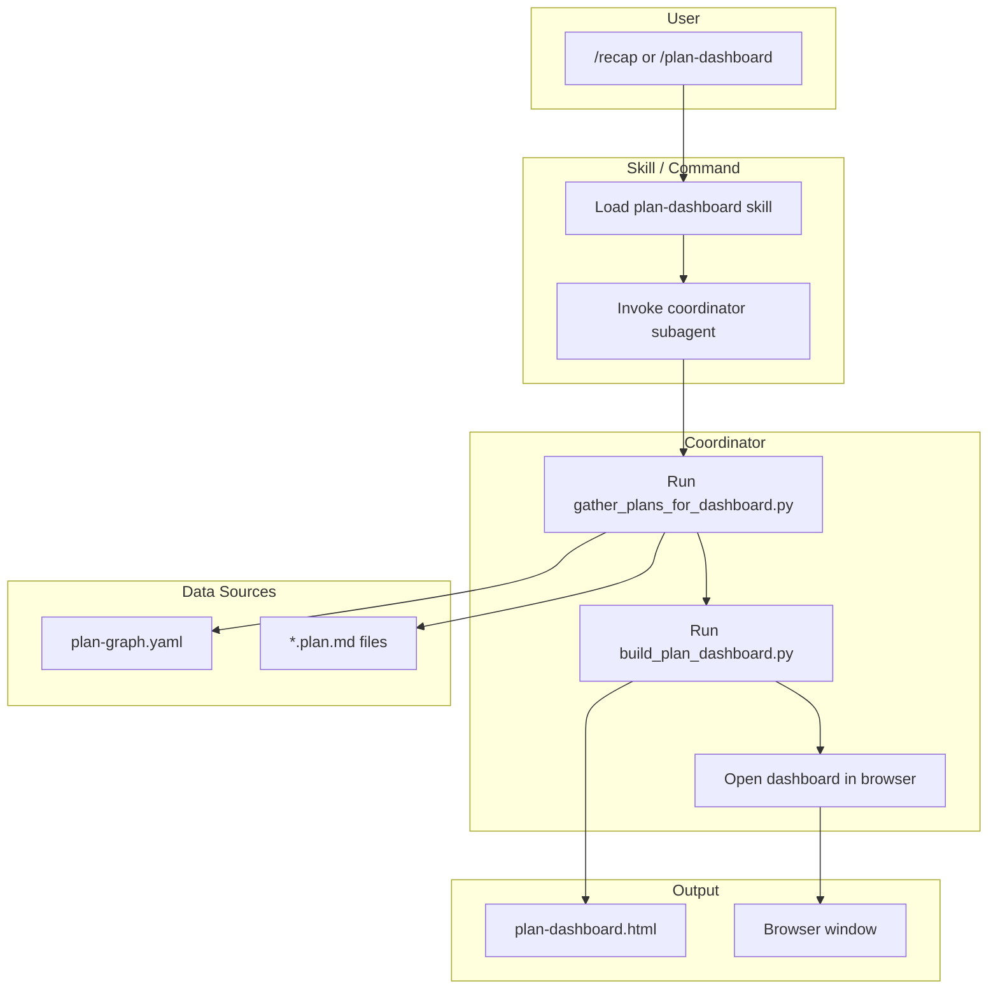

# Plans Recap Dashboard

## Goal

Create a `/recap` skill (or `/plan-dashboard` command) that:
1. Recaps all plans in `.cursor/plans/` and recently completed plans
2. Uses the **coordinator** subagent to orchestrate
3. Generates an **interactive HTML dashboard** that opens in the browser, showing:
   - Tasks left (pending todos per plan)
   - Each project with its child plans
   - Tasks completed (by plan, by project)
   - Pie charts (state distribution, priority, plan_type)
   - Dependency graph (plans and their `depends_on` / `child_plan_ids`)
   - Cursor IDE–style dark theme, monospace accents

---

## Architecture

---

## Part 1: Data Gathering Script

**New script:** `scripts/gather_plans_for_dashboard.py` (or `.cursor/scripts/`)

- **Input:** `plan-graph.yaml` + scan `.cursor/plans/**/*.plan.md` (including `archive/`)
- **Output:** JSON with:
  - `plans`: list of `{id, title, state, plan_type, priority, tags, depends_on, child_plan_ids, parent_plan_id, file, todos_total, todos_completed, todos_pending}`
  - `summary`: `{total_plans, completed_count, in_progress_count, pending_count, total_todos, completed_todos}`
  - `recently_completed`: plans with `state: completed` (optionally filter by archive mtime or last N)
- **Reuse:** [gather_plan_state.py](.cursor/scripts/gather_plan_state.py) — `_load_graph`, `_frontmatter_todos`, plan file resolution
- **Extend:** Add `--output=json` mode; scan all plan files for todos

---

## Part 2: Dashboard Builder Script

**New script:** `scripts/build_plan_dashboard.py`

- **Input:** JSON from gather script (or run gather inline)
- **Output:** Single-file HTML at `docs/recaps/plan-dashboard.html` (or `.cursor/logs/plan-dashboard.html`)
- **Tech stack (no build):**
  - **Charts:** Chart.js (CDN) — pie charts for state, priority, plan_type
  - **Dependency graph:** Mermaid.js (CDN) or vis-network — render `depends_on` and `child_plan_ids` as nodes/edges
  - **Styling:** Dark theme, Cursor-like colors (e.g. `#1e1e1e` bg, `#d4d4d4` text, accent `#007acc`), monospace for IDs
- **Sections:**
  1. **Summary cards:** Total plans, completed, in progress, pending; total todos, completed todos
  2. **Tasks left:** Table or list of plans with pending todos; expandable per-plan todo list
  3. **Projects:** Group by `parent_plan_id` or `plan_type: project`; show child plans and their todo progress
  4. **Tasks completed:** Plans with `state: completed`; optionally "recently completed" (e.g. last 7 days by file mtime)
  5. **Pie charts:** State distribution; priority distribution; plan_type distribution
  6. **Dependency graph:** Interactive graph (click to focus); nodes = plans, edges = `depends_on` / parent-child
- **Interactivity:** Collapsible sections; filter by state/tag; click plan in graph to scroll to detail

---

## Part 3: Skill and Command

**New skill:** `.cursor/skills/plan-dashboard/SKILL.md`

- **When to use:** User says "recap plans", "plan dashboard", "show plan status", `/recap`, `/plan-dashboard`
- **Workflow:**
  1. Load this skill
  2. Invoke **coordinator** subagent with prompt: "Gather plan state from plan-graph.yaml and all .plan.md files; run scripts/gather_plans_for_dashboard.py and scripts/build_plan_dashboard.py; open the generated HTML in the default browser."
  3. Coordinator delegates: run gather → run build → run open command
  4. Return summary: "Dashboard generated at X; opened in browser."

**New command:** `.cursor/commands/plan-dashboard.md` (or `/recap` if we want to overload)

- **Description:** Recap all plans and open interactive dashboard
- **Arguments:** Optional `--no-open` to skip opening browser
- **Steps:** Same as skill; ensure scripts are run from repo root

---

## Part 4: Coordinator Integration

- **Coordinator prompt:** Include handoff protocol; ask coordinator to:
  1. Run `python scripts/gather_plans_for_dashboard.py --output=json > .cursor/logs/plan-dashboard-data.json`
  2. Run `python scripts/build_plan_dashboard.py --input .cursor/logs/plan-dashboard-data.json --output docs/recaps/plan-dashboard.html`
  3. Run platform-specific open: `start docs/recaps/plan-dashboard.html` (Windows), `open` (macOS), `xdg-open` (Linux)
- **Alternative:** Single script `scripts/plan_dashboard.py` that does gather + build + open in one go; coordinator just runs it.

---

## Part 5: Cursor IDE Styling

- **Colors:** Match Cursor/VSCode dark theme:
  - Background: `#1e1e1e`
  - Surface: `#252526`
  - Text: `#d4d4d4`
  - Accent: `#007acc`
  - Success (completed): `#4ec9b0`
  - Warning (in progress): `#dcdcaa`
  - Muted: `#6e6e6e`
- **Font:** System UI + `JetBrains Mono` or `Fira Code` for plan IDs (fallback: monospace)
- **Layout:** Sidebar or tabs for sections; main content area; responsive

---

## Files to Add or Change

| File | Action |
|------|--------|
| `scripts/gather_plans_for_dashboard.py` | New: load graph + scan plans, output JSON |
| `scripts/build_plan_dashboard.py` | New: JSON → HTML with Chart.js, Mermaid/vis, dark theme |
| `.cursor/skills/plan-dashboard/SKILL.md` | New: skill definition, coordinator invocation |
| `.cursor/commands/plan-dashboard.md` | New: command definition |
| `.cursor/commands/README.md` | Add `/plan-dashboard` entry |
| `docs/recaps/.gitignore` or `plan-dashboard.html` | Optional: gitignore generated dashboard if desired |

---

## Implementation Order

1. **gather_plans_for_dashboard.py** — Extend gather_plan_state logic; add JSON output with todos per plan
2. **build_plan_dashboard.py** — HTML template with Chart.js, Mermaid, dark theme; read JSON, emit HTML
3. **plan-dashboard skill** — SKILL.md with coordinator delegation
4. **plan-dashboard command** — Command file, wire to skill
5. **Test** — Run `/plan-dashboard`; verify dashboard opens and displays correctly

---

## Completion Criteria

- `/plan-dashboard` (or `/recap`) runs and opens an HTML dashboard
- Dashboard shows: summary cards, tasks left, projects, tasks completed, pie charts, dependency graph
- Styling matches Cursor IDE dark theme
- Coordinator is used to orchestrate the workflow
- Dashboard is interactive (collapse, filter, click-to-focus)
