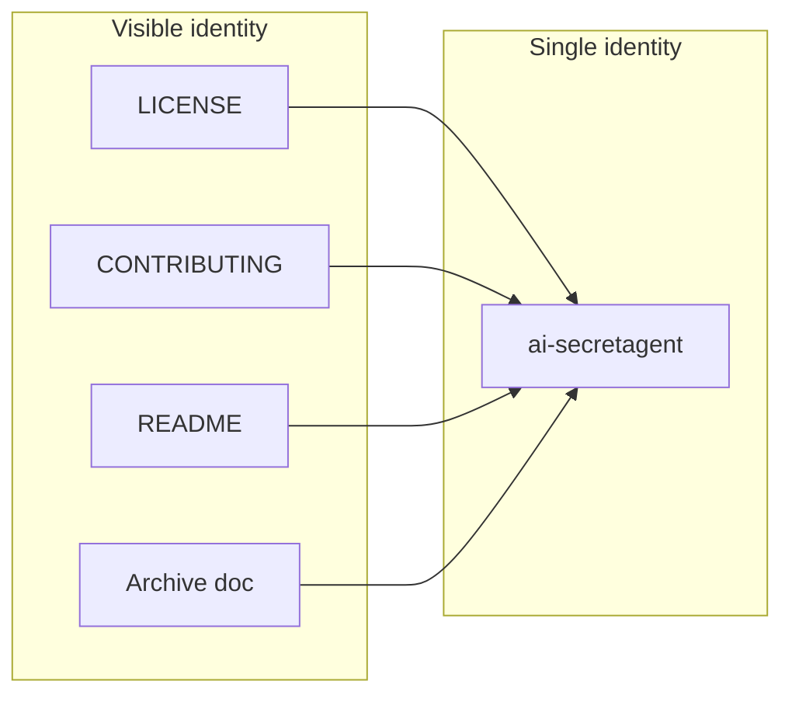

# Public GitHub Repo Readiness and Identity Anonymity

## Current state

- **Identity:** No real names, emails, or "harri" in tracked code. Only generic/placeholder text; [docs/archive/AI_ENHANCED_README.md](docs/archive/AI_ENHANCED_README.md) has placeholders: `Your Name`, `https://github.com/user/repo`, `support@ai-stegano.com`.
- **License / contributor:** No `LICENSE`, `CONTRIBUTING`, `CODE_OF_CONDUCT`, or `SECURITY`; README has a short Contributing section and Legal notice.
- **Metadata:** [pyproject.toml](pyproject.toml) has no `author` or `license`; project name is `decryption`.
- **CI:** No `.github/` directory.

---

## 1. Add MIT license and set identity to ai-secretagent

- **Add `LICENSE`**
  Standard MIT text. Copyright line: **Copyright (c) ai-secretagent**. No year or real name.

- **Optional in `pyproject.toml`:**
  Add `license = "MIT"` and, if you want a visible maintainer, `authors = [{ name = "ai-secretagent" }]`. Leaving `authors` empty is also fine for anonymity.

---

## 2. Contributor and community files

- **`CONTRIBUTING.md`**
  - How to open issues / PRs (link to `https://github.com/ai-secretagent/<repo>/issues` once repo exists).
  - Development setup (clone, venv, `pip install -r requirements.txt`, run tests).
  - Code/style: point to existing Black/mypy in pyproject.toml.
  - Keep tone neutral; no personal identity.

- **`CODE_OF_CONDUCT.md`**
  Use [Contributor Covenant](https://www.contributor-covenant.org/) (or similar); enforcement contact: generic (e.g. "Open an issue" or "ai-secretagent" as project, no private email).

- **`SECURITY.md`**
  Short policy: how to report vulnerabilities (e.g. open a GitHub Security Advisory or a private draft issue), no personal contact.

---

## 3. Identity sweep: ai-secretagent only

- **Archive doc** [docs/archive/AI_ENHANCED_README.md](docs/archive/AI_ENHANCED_README.md):
  Replace placeholders so nothing implies a real person or org:
  - `author={Your Name}` → `author={ai-secretagent}` (or "The ai-secretagent contributors").
  - `https://github.com/user/repo` → `https://github.com/ai-secretagent/<repo-name>` (use actual repo name when known).
  - `support@ai-stegano.com` and Discord → either remove the "Getting Help" block or make it generic (e.g. "GitHub Issues only") so no traceable contact.

- **README** (optional):
  Add a one-line "By ai-secretagent" or "Maintained by ai-secretagent" in the intro or footer if you want the name visible; otherwise leave as-is.

- **Demo metadata** [src/examples.py](src/examples.py) line 69:
  `metadata.add_text("Author", "PNG Analyzer Demo")` is example PNG metadata, not a person. Optional: change to `"ai-secretagent"` for consistency; low priority.

---

## 4. .github (optional but helpful)

- **` .github/ISSUE_TEMPLATE/`**
  Single generic issue template (e.g. bug report / feature request) with no personal contact.

- **`.github/PULL_REQUEST_TEMPLATE.md`**
  Short checklist (e.g. tests run, docs updated) and link to CONTRIBUTING.

- **`.github/dependabot.yml`** (optional)
  Basic config for Python dependency updates.

Do not add workflow files that expose local paths, real usernames, or secrets.

---

## 5. Final checks before publish

- **Grep** for any remaining identity: real names, "harri", personal emails, `user/repo`, `Your Name`, `ai-stegano.com`.
- **`.gitignore`**
  Ensure no sensitive paths are tracked (e.g. `.env`, keys, local config with names). If in doubt, list `.gitignore` contents in the implementation step and add entries as needed.
- **Git history (optional)**
  If the repo was ever pushed with real name/email, history will still show it. To fully anonymize you’d need to rewrite history (e.g. `git filter-repo` / `git filter-branch`) and force-push; document this as an optional step if you choose to do it later.

---

## 6. Suggested file order

| Order | Action |
|-------|--------|
| 1 | Add `LICENSE` (MIT, Copyright (c) ai-secretagent). |
| 2 | Add `CONTRIBUTING.md` (setup, PR flow, link to repo as ai-secretagent). |
| 3 | Add `CODE_OF_CONDUCT.md` and `SECURITY.md`. |
| 4 | Update `docs/archive/AI_ENHANCED_README.md` placeholders to ai-secretagent / generic. |
| 5 | Optionally update `pyproject.toml` (license, authors) and README/intro. |
| 6 | Add `.github/` templates (and optionally dependabot). |
| 7 | Run identity grep and .gitignore check. |

---

## Diagram (identity flow)

No other names or contacts should appear in these files.
