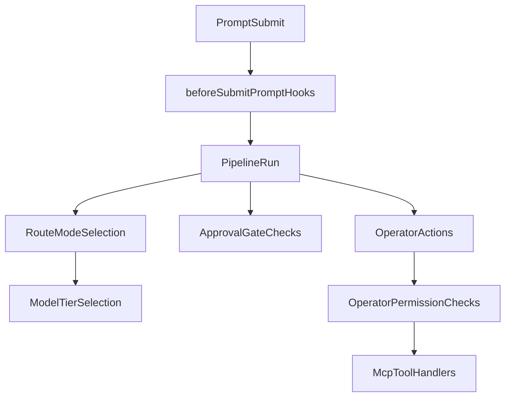

# Full-Repo Review + Bugfix Plan (Plan-Only)

## Assumptions
- Scope is the entire repository.
- This pass is planning-only; no code edits until plan approval.
- Priority is correctness/safety regressions first, then reliability, then docs/tests alignment.

## How the codebase works (to anchor the fixes)
- Extension startup and service wiring are centered in [`C:/Users/harri/Documents/Coding Projects/fun/cursor-drive/src/extension.ts`](C:/Users/harri/Documents/Coding%20Projects/fun/cursor-drive/src/extension.ts).
- Prompt interception begins at `beforeSubmitPrompt` hooks in [`C:/Users/harri/Documents/Coding Projects/fun/cursor-drive/.cursor/hooks/drive-preprocessor.py`](C:/Users/harri/Documents/Coding%20Projects/fun/cursor-drive/.cursor/hooks/drive-preprocessor.py) and [`C:/Users/harri/Documents/Coding Projects/fun/cursor-drive/.cursor/hooks/plan-runner.py`](C:/Users/harri/Documents/Coding%20Projects/fun/cursor-drive/.cursor/hooks/plan-runner.py), then flows through [`C:/Users/harri/Documents/Coding Projects/fun/cursor-drive/src/pipeline.ts`](C:/Users/harri/Documents/Coding%20Projects/fun/cursor-drive/src/pipeline.ts).
- Drive mode mapping and routing are handled by [`C:/Users/harri/Documents/Coding Projects/fun/cursor-drive/src/driveMode.ts`](C:/Users/harri/Documents/Coding%20Projects/fun/cursor-drive/src/driveMode.ts), [`C:/Users/harri/Documents/Coding Projects/fun/cursor-drive/src/router.ts`](C:/Users/harri/Documents/Coding%20Projects/fun/cursor-drive/src/router.ts), and tier selection in [`C:/Users/harri/Documents/Coding Projects/fun/cursor-drive/src/modelSelector.ts`](C:/Users/harri/Documents/Coding%20Projects/fun/cursor-drive/src/modelSelector.ts).
- Operator lifecycle and permissions are split between [`C:/Users/harri/Documents/Coding Projects/fun/cursor-drive/src/operatorRegistry.ts`](C:/Users/harri/Documents/Coding%20Projects/fun/cursor-drive/src/operatorRegistry.ts), [`C:/Users/harri/Documents/Coding Projects/fun/cursor-drive/src/toolAllowlist.ts`](C:/Users/harri/Documents/Coding%20Projects/fun/cursor-drive/src/toolAllowlist.ts), approval checks in [`C:/Users/harri/Documents/Coding Projects/fun/cursor-drive/src/approvalGates.ts`](C:/Users/harri/Documents/Coding%20Projects/fun/cursor-drive/src/approvalGates.ts), and MCP execution paths in [`C:/Users/harri/Documents/Coding Projects/fun/cursor-drive/src/mcpServer.ts`](C:/Users/harri/Documents/Coding%20Projects/fun/cursor-drive/src/mcpServer.ts).

## Targeted bug-fix sequence (implementation order once approved)
- Fix permission precedence bug in [`C:/Users/harri/Documents/Coding Projects/fun/cursor-drive/src/toolAllowlist.ts`](C:/Users/harri/Documents/Coding%20Projects/fun/cursor-drive/src/toolAllowlist.ts) so config overrides can only restrict (deny-wins).
- Enforce capability checks inside MCP handlers in [`C:/Users/harri/Documents/Coding Projects/fun/cursor-drive/src/mcpServer.ts`](C:/Users/harri/Documents/Coding%20Projects/fun/cursor-drive/src/mcpServer.ts) using `checkPermissionForOperator()` before terminal/file/git/web actions.
- Harden parent-child spawn validation in [`C:/Users/harri/Documents/Coding Projects/fun/cursor-drive/src/operatorRegistry.ts`](C:/Users/harri/Documents/Coding%20Projects/fun/cursor-drive/src/operatorRegistry.ts) for invalid `parentId` and case-insensitive name collisions.
- Close approval-gate and pipeline consistency gaps in [`C:/Users/harri/Documents/Coding Projects/fun/cursor-drive/src/approvalGates.ts`](C:/Users/harri/Documents/Coding%20Projects/fun/cursor-drive/src/approvalGates.ts) and [`C:/Users/harri/Documents/Coding Projects/fun/cursor-drive/src/pipeline.ts`](C:/Users/harri/Documents/Coding%20Projects/fun/cursor-drive/src/pipeline.ts) (disabled-state behavior, operator-scoped stats handoff).
- Add/expand tests in [`C:/Users/harri/Documents/Coding Projects/fun/cursor-drive/tests`](C:/Users/harri/Documents/Coding%20Projects/fun/cursor-drive/tests) for permission cascade, MCP permission denial, spawn edge cases, and approval-gate edge paths.

## Verification gates (after each fix batch)
- Run compile/type gate: `npm run compile`.
- Run targeted tests first, then full suite: `npm test`.
- Confirm no invariant regressions against:
  - [`C:/Users/harri/Documents/Coding Projects/fun/cursor-drive/.cursor/rules/vision-invariants.mdc`](C:/Users/harri/Documents/Coding%20Projects/fun/cursor-drive/.cursor/rules/vision-invariants.mdc)
  - [`C:/Users/harri/Documents/Coding Projects/fun/cursor-drive/.cursor/rules/operator-hierarchy.mdc`](C:/Users/harri/Documents/Coding%20Projects/fun/cursor-drive/.cursor/rules/operator-hierarchy.mdc)
  - [`C:/Users/harri/Documents/Coding Projects/fun/cursor-drive/.cursor/rules/tiered-model-routing.mdc`](C:/Users/harri/Documents/Coding%20Projects/fun/cursor-drive/.cursor/rules/tiered-model-routing.mdc)

## Risks and controls
- Risk: touching permission paths can unintentionally over-restrict operator flows. Control: introduce focused negative/positive permission tests before broader refactors.
- Risk: MCP handler hardening can break tool compatibility. Control: keep minimal diffs and add explicit denied-action response assertions.
- Risk: plan/governance docs drift from implementation. Control: update affected docs only after behavior is validated by tests.