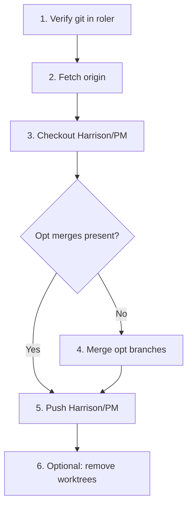

# Roler Git Recovery and Consolidation Plan

## Key Finding: Harrison/PM Is Not Lost

The `Harrison/PM` branch **exists locally** and is intact. Evidence from [roler/.git/logs/refs/heads/Harrison/PM](roler/.git/logs/refs/heads/Harrison/PM) and [roler/.git/refs/heads/Harrison/PM](roler/.git/refs/heads/Harrison/PM):

- **Local tip:** `c825833436038df850eb8baf850f8b4e069a00ba`
- **Reflog shows:** All three opt branches were already merged into Harrison/PM (batch1 fast-forward, batch2 and batch3 merge commits)
- **Main worktree (roler):** HEAD points to `refs/heads/Harrison/PM`

**Gap:** `origin/Harrison/PM` on GitHub only has 3 commits (tip `d0fcd8ac`). The merge commits were never pushed.

---

## Current State


| Location                             | Branch                         | Status                                                 |
| ------------------------------------ | ------------------------------ | ------------------------------------------------------ |
| [roler](roler) (main worktree)       | Harrison/PM                    | Has all opt merges; not pushed                         |
| [roler-opt-batch1](roler-opt-batch1) | opt/batch1-token-tool-20260308 | Worktree linked to main repo                           |
| [roler-opt-batch2](roler-opt-batch2) | opt/batch2-token-tool-20260308 | Worktree linked to main repo                           |
| roler-opt-batch3                     | —                              | No worktree found; branch exists locally and on origin |


---

## Plan

### 1. Git Init in roler (Safety Check)

The [roler](roler) directory already has `.git` and `origin` pointing to `https://github.com/rolefinder/roler.git`. No action needed unless `.git` is missing or corrupted.

**If `.git` is missing:** Run from `roler_ai/roler`:

```bash
git init
git remote add origin https://github.com/rolefinder/roler.git
git fetch origin
```

### 2. Restore Harrison/PM in Main Worktree

From [roler](roler):

```bash
cd roler
git fetch origin
git checkout Harrison/PM
```

The branch already exists locally at `c8258334`. If you ever switched away, this restores it.

### 3. Consolidate Opt Branches onto Harrison/PM

**Already done locally.** Reflog confirms:

- opt/batch1-token-tool-20260308 → merged (fast-forward)
- opt/batch2-token-tool-20260308 → merged
- opt/batch3-token-tool-20260308 → merged

If you need to re-merge (e.g. after a fresh clone), use the existing skill:

```bash
python .cursor/skills/merge-optimization-worktrees/scripts/merge_branch.py opt/batch1-token-tool-20260308
python .cursor/skills/merge-optimization-worktrees/scripts/merge_branch.py opt/batch2-token-tool-20260308
python .cursor/skills/merge-optimization-worktrees/scripts/merge_branch.py opt/batch3-token-tool-20260308
```

### 4. Pull Opt Branches from Origin (If Needed)

To ensure local opt branches match origin before any re-merge:

```bash
git fetch origin
git branch -f opt/batch1-token-tool-20260308 origin/opt/batch1-token-tool-20260308
git branch -f opt/batch2-token-tool-20260308 origin/opt/batch2-token-tool-20260308
git branch -f opt/batch3-token-tool-20260308 origin/opt/batch3-token-tool-20260308
```

### 5. Push Harrison/PM to Origin

This backs up your consolidated work:

```bash
git push origin Harrison/PM
```

### 6. Optional: Clean Up Worktrees

If you no longer need the opt worktrees:

```bash
git worktree remove roler-opt-batch1   # from roler_ai/
git worktree remove roler-opt-batch2
```

Use `--force` only if worktrees have uncommitted changes you are discarding.

---

## Cache/Log Locations Checked

- **Reflog:** [roler/.git/logs/refs/heads/Harrison/PM](roler/.git/logs/refs/heads/Harrison/PM) — full history
- **Remote reflog:** [roler/.git/logs/refs/remotes/origin/Harrison/PM](roler/.git/logs/refs/remotes/origin/Harrison/PM) — last push at `d0fcd8ac`
- **Worktree refs:** [roler/.git/worktrees/roler-opt-batch1](roler/.git/worktrees/roler-opt-batch1), [roler/.git/worktrees/roler-opt-batch2](roler/.git/worktrees/roler-opt-batch2)
- **Agent transcripts:** [a725d321-f55d-4cdc-8d89-021393b114b6](agent-transcripts/a725d321-f55d-4cdc-8d89-021393b114b6) — prior merge-optimization-worktrees session

No additional cache or logs were needed; the branch state is in the git reflog.

---

## Execution Order




---

## Risks

- **Push overwrites remote:** `git push origin Harrison/PM` will update `origin/Harrison/PM`. If others use it, coordinate first.
- **Worktree removal:** Only remove worktrees after confirming merges and that you no longer need them.
