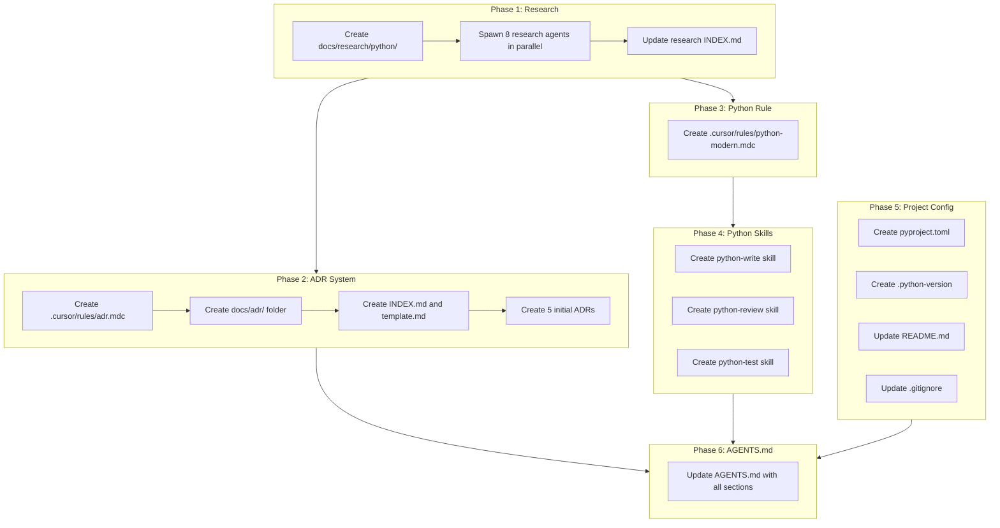

# Roller.ai Foundation Setup

## Overview

This plan establishes the foundational infrastructure for roller.ai including:
- Architecture Decision Records (ADR) system
- Python 3.14 research, rules, and skills (write/review/test)
- Project configuration (pyproject.toml, venv)
- Updated AGENTS.md with all new sections

---

## Phase 1: Python Research

Spawn parallel research agents to investigate Python 3.14 features and modern primitives. Each produces a research document following existing conventions in [docs/research/](docs/research/).

### 1.1 Create `docs/research/python/` category folder

### 1.2 Research Documents (parallel agents)

| Document | Research Focus |
|----------|----------------|
| `2026-01-22-python-version-selection.md` | Python 3.14 features, why 3.14 over 3.13, release schedule, EOL dates |
| `2026-01-22-type-hints-modern.md` | typing module, TypeVar, Generic, ParamSpec, TypeGuard, Self, Unpack |
| `2026-01-22-pattern-matching.md` | match/case syntax, guard clauses, structural patterns, best practices |
| `2026-01-22-dataclasses-modern.md` | dataclasses, attrs, Pydantic v2, slots, frozen, field factories |
| `2026-01-22-async-patterns.md` | asyncio, async/await, TaskGroups, async context managers, aiohttp patterns |
| `2026-01-22-context-managers.md` | contextlib, ExitStack, async context managers, resource management |
| `2026-01-22-functional-primitives.md` | itertools, functools, generators, comprehensions, map/filter alternatives |
| `2026-01-22-modern-syntax.md` | walrus operator, f-strings, pathlib, exception groups, tomllib |

### 1.3 Update `docs/research/INDEX.md`
Add python category with all 8 research documents.

---

## Phase 2: ADR System

### 2.1 Create ADR Rule: `.cursor/rules/adr.mdc`

```yaml
---
description: Enforce Architecture Decision Record standards. Auto-applies when creating, editing, or reviewing ADRs in docs/adr/.
globs: 
  - "docs/adr/**/*.md"
alwaysApply: false
tags: ["adr", "architecture", "decisions", "documentation"]
---
```

**Rule content will include:**
- ADR template format (Status, Context, Decision, Consequences, Alternatives)
- Naming convention: `NNNN-title-slug.md` (4-digit zero-padded)
- Status lifecycle: `proposed` -> `accepted` -> `deprecated` | `superseded by ADR-XXXX`
- Guidelines: when to create, update, deprecate, supersede
- Cross-referencing pattern for superseded ADRs
- Index maintenance requirements

### 2.2 Create `docs/adr/` folder structure

```
docs/adr/
├── INDEX.md      # Master index of all ADRs
└── template.md   # Copy-paste template
```

### 2.3 Create `docs/adr/INDEX.md`

Following pattern from [docs/research/INDEX.md](docs/research/INDEX.md):
- Statistics (total, by status)
- ADR table (number, title, date, status)
- Quick links to template and rule
- Maintenance log

### 2.4 Create `docs/adr/template.md`

Standard ADR template with sections:
- Title line with ADR number
- Metadata (date, status, tags)
- Context
- Decision
- Consequences (positive, negative, neutral)
- Alternatives Considered
- Related ADRs

### 2.5 Create Initial ADRs (all `proposed` status)

| ADR | Title | Key Points |
|-----|-------|------------|
| `0001-python-as-primary-language.md` | Python 3.14 as Primary Language | Why Python, version choice, type hints required |
| `0002-aws-for-cloud-infrastructure.md` | AWS for Cloud Infrastructure | Why AWS, target services (Lambda, ECS, S3, etc.) |
| `0003-terraform-for-infrastructure-as-code.md` | Terraform for IaC | Why Terraform over CDK/Pulumi, state management |
| `0004-unix-philosophy-and-solid-principles.md` | Unix Philosophy and SOLID | Design principles, modularity, single responsibility |
| `0005-github-actions-for-cicd.md` | GitHub Actions for CI/CD | Why GHA, workflow patterns, deployment strategy |

---

## Phase 3: Python Rule

### 3.1 Create `.cursor/rules/python-modern.mdc`

```yaml
---
description: Enforce modern Python 3.14 patterns and primitives. Auto-applies to all Python files.
globs: 
  - "**/*.py"
alwaysApply: false
tags: ["python", "coding-standards", "modern-python"]
---
```

**Rule content will enforce:**
- Python 3.14+ syntax (walrus operator, pattern matching, exception groups)
- Type hints required on all public functions/methods
- Use `pathlib.Path` over `os.path`
- Use f-strings over `.format()` or `%`
- Use dataclasses/Pydantic for data structures
- Use `contextlib` for resource management
- Use `asyncio.TaskGroup` for concurrent tasks
- Use comprehensions over `map()`/`filter()` where readable
- Avoid bare `except:`, use specific exceptions
- Cross-reference to Python skill for detailed guidance

---

## Phase 4: Python Skills (3 separate skills)

### 4.1 Create `python-write` skill

**Location:** `.cursor/skills/python-write/`

```
python-write/
├── SKILL.md
├── reference/
│   ├── type-hints-guide.md
│   ├── async-patterns.md
│   ├── dataclass-patterns.md
│   └── error-handling.md
└── examples/
    ├── README.md
    ├── service-class.py
    └── async-handler.py
```

**SKILL.md frontmatter:**
```yaml
---
name: python-write
description: Write Python code following modern 3.14 patterns. Use when creating new Python files, functions, classes, or modules. Enforces type hints, dataclasses, async patterns, and project conventions.
---
```

**Core instructions:**
- File structure conventions (src/roller/, tests/)
- Import ordering (stdlib, third-party, local)
- Type hints patterns
- Dataclass vs Pydantic decision tree
- Async vs sync decision tree
- Error handling patterns
- Logging conventions

### 4.2 Create `python-review` skill

**Location:** `.cursor/skills/python-review/`

```
python-review/
├── SKILL.md
├── reference/
│   ├── checklist.md
│   ├── common-issues.md
│   └── security-checks.md
└── examples/
    └── review-output.md
```

**SKILL.md frontmatter:**
```yaml
---
name: python-review
description: Review Python code for quality, security, and modern patterns. Use when reviewing pull requests, code changes, or when user asks for code review. Provides actionable feedback following project standards.
---
```

**Core instructions:**
- Review checklist (type hints, error handling, security, performance)
- Common issues to flag
- Security vulnerability patterns
- Performance anti-patterns
- Output format for reviews

### 4.3 Create `python-test` skill

**Location:** `.cursor/skills/python-test/`

```
python-test/
├── SKILL.md
├── reference/
│   ├── pytest-patterns.md
│   ├── fixtures-guide.md
│   └── mocking-guide.md
└── examples/
    ├── README.md
    ├── unit-test.py
    └── integration-test.py
```

**SKILL.md frontmatter:**
```yaml
---
name: python-test
description: Write Python tests using pytest following project standards. Use when creating tests, test fixtures, or mocking. Covers unit, integration, and async testing patterns.
---
```

**Core instructions:**
- pytest conventions
- Test file naming (`test_*.py`)
- Fixture patterns
- Mocking with `unittest.mock` and `pytest-mock`
- Async test patterns
- Coverage requirements

---

## Phase 5: Project Configuration

### 5.1 Create `pyproject.toml`

```toml
[project]
name = "roller"
version = "0.1.0"
description = "AI-powered job application automation"
requires-python = ">=3.14"
# ... dependencies added as needed

[tool.pytest.ini_options]
testpaths = ["tests"]
asyncio_mode = "auto"

[tool.ruff]
target-version = "py314"
line-length = 88

[tool.mypy]
python_version = "3.14"
strict = true
```

### 5.2 Create `.python-version`

```
3.14.2
```

### 5.3 Add venv instructions to README

Create/update `README.md` with:
- Project overview (roller.ai purpose)
- Prerequisites (Python 3.14.2)
- Setup instructions:
  ```bash
  python -m venv .venv
  .venv\Scripts\activate  # Windows
  pip install -e ".[dev]"
  ```
- Quick start guide
- Link to docs/

### 5.4 Update `.gitignore`

Add if not present:
```
.venv/
__pycache__/
*.pyc
.mypy_cache/
.pytest_cache/
.ruff_cache/
```

---

## Phase 6: Update AGENTS.md

Update [AGENTS.md](AGENTS.md) with new sections:

### 6.1 Add Python Standards section
- Python version requirement (3.14+)
- Link to python-modern rule
- Link to python-write, python-review, python-test skills

### 6.2 Add Architecture Decision Records section
- Location: `docs/adr/`
- Link to ADR rule
- Link to ADR index
- When to create ADRs

### 6.3 Update Skills list
- Add python-write
- Add python-review
- Add python-test

### 6.4 Add Project Setup section
- Python version
- Venv location (`.venv/`)
- Package management (pip, pyproject.toml)

---

## Execution Order



**Parallelization opportunities:**
- Phase 1 research agents run in parallel (8 simultaneous)
- Phase 2 and Phase 3 can run in parallel after Phase 1
- Phase 4 skills (S1, S2, S3) can be created in parallel
- Phase 5 files can be created in parallel
- Phase 6 runs last after all others complete

---

## File Summary

**New files to create: 35+**

| Category | Count | Files |
|----------|-------|-------|
| Research docs | 8 | `docs/research/python/*.md` |
| ADR system | 8 | Rule + INDEX + template + 5 ADRs |
| Python rule | 1 | `.cursor/rules/python-modern.mdc` |
| Python skills | 15+ | 3 skills with SKILL.md + reference/ + examples/ |
| Project config | 4 | pyproject.toml, .python-version, README.md, .gitignore |
| Updates | 2 | AGENTS.md, research INDEX.md |

---

## Validation Checklist

After execution, verify:
- [ ] All 8 Python research documents created with correct format
- [ ] Research INDEX.md updated with python category
- [ ] ADR rule applies to `docs/adr/**/*.md`
- [ ] ADR template is copy-paste ready
- [ ] All 5 initial ADRs have `proposed` status
- [ ] Python rule applies to `**/*.py`
- [ ] All 3 Python skills have correct frontmatter for discovery
- [ ] pyproject.toml specifies Python 3.14
- [ ] README.md has venv setup instructions
- [ ] AGENTS.md references all new components
