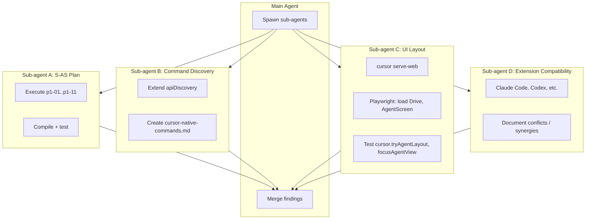
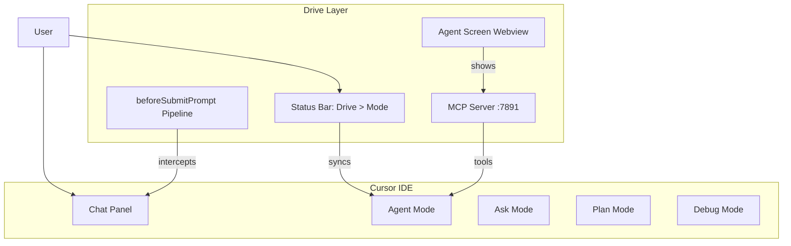

# S-AS Execution, Command Discovery, and UI Integration Strategy

## Part 1: Execute S-AS Screen Capture Plan via Sub-Agent

The remaining pending plan is [s_as_screen_capture_impl.plan.md](.cursor/plans/s_as_screen_capture_impl.plan.md). Phase 1 (p1-01 through p1-11) is the immediate scope.

### Sub-agent delegation

Spawn a **generalPurpose** or **shell** sub-agent with this prompt:

```
Execute the S-AS Screen Capture Implementation plan Phase 1 (p1-01 through p1-11) in the cursor-drive repo.

Context:
- Plan file: .cursor/plans/s_as_screen_capture_impl.plan.md
- p0-01 and p0-02 are already completed
- Implement in order: p1-01 (NdjsonParser) -> p1-02 (tests) -> p1-03 (runCursorCliStreaming) -> p1-04 (tests) -> p1-05 (ActivityEvent) -> p1-06 (webview) -> p1-07 (MCP tool) -> p1-08 (test) -> p1-09 (POST /run SSE) -> p1-10 (test) -> p1-11 (compile + test gate)

Key files:
- src/ndjsonParser.ts (new)
- src/cursorCliRunner.ts (add runCursorCliStreaming)
- src/agentScreen.ts (extend ActivityEvent, add cliStream case in buildHtml)
- src/mcpServer.ts (register cursor_cli_run_streaming, upgrade POST /run)
- tests/ndjsonParser.test.ts, tests/cursorCliRunner.test.ts, tests/mcpServer.test.ts

Run `npm run compile` and `npm test` after each logical batch. Mark plan todos as completed as you go.
```

### Execution order (plan constraints)

```mermaid
flowchart LR
    p101[NdjsonParser] --> p102[ndjson tests]
    p102 --> p103[Streaming runner]
    p103 --> p104[runner tests]
    p104 --> p105[ActivityEvent]
    p105 --> p106[webview cliStream]
    p106 --> p107[MCP tool]
    p107 --> p108[MCP test]
    p108 --> p109[POST SSE]
    p109 --> p110[SSE test]
    p110 --> p111[compile+test]
```



---

## Part 2: Comprehensive Cursor Native Commands Discovery (Parallel Sub-Agent)

### Current state

- [apiDiscovery.ts](src/apiDiscovery.ts) uses `vscode.commands.getCommands(false)` and filters for `cursor.*` and `cursorDrive.*` only
- Output is written to `.cursor/drive-api-discovery.json` and an OutputChannel
- **Gap:** No descriptions, no `workbench.*`, `composer.*`, `glass.*`, `developer.*`, etc. The VS Code API does not expose command titles/descriptions at runtime

### Approach for comprehensive list

1. **Extend apiDiscovery** (or add `cursorDrive.discoverAllCommands`) to:
   - Enumerate ALL commands (remove the `cursor.*` filter)
   - Group by prefix: `cursor.`, `composer.`, `workbench.`, `glass.`, `developer.`, `cursorai.`, `cursorAuth.`, `mcp.`, etc.
   - Write full list to `docs/reference/cursor-native-commands.json` (or `.cursor/cursor-commands-full.json`)

2. **Sub-agent task** — Run discovery in a live Cursor instance:
   - Launch Cursor with Drive extension loaded
   - Run `cursorDrive.discoverAPIs` (or new command)
   - Capture the JSON output
   - For commands we care about, try `executeCommand(id)` with no args — document which succeed/fail
   - Optionally: run `agent --help` (CLI) and document CLI flags; cross-reference with extension commands

3. **Manual enrichment** — Create [docs/reference/cursor-native-commands.md](docs/reference/cursor-native-commands.md):
   - Table: Command ID | Prefix | Purpose (inferred or documented) | Used by Drive?
   - Source: discovery JSON + prior analysis (from the long command list in the earlier conversation)
   - Include "how to use": e.g. `vscode.commands.executeCommand("composerMode.plan")` from extension code

### Sub-agent prompt for command discovery

```
In the cursor-drive repo:

1. Extend src/apiDiscovery.ts to add a "full commands" mode: when discoverAPIs runs, also enumerate ALL commands (not just cursor.*) and write to .cursor/cursor-commands-full.json with structure: { total, byPrefix: { "cursor.": [...], "composer.": [...], "workbench.": [...] } }.

2. Add a command cursorDrive.discoverAllCommands that runs this and opens the JSON file.

3. Create docs/reference/cursor-native-commands.md with a table of the most relevant commands for Drive (from the existing analysis: composerMode.*, workbench.action.*, cursor.browserView.*, etc.). For each: ID, purpose, usage example, whether Drive uses it.

4. Document how to validate: run cursorDrive.discoverAllCommands in Cursor, inspect the JSON. Run agent --help in terminal and document CLI options.
```

---

## Part 3: Parallel Sub-Agents for UI Exploration and Testing

### Architecture



### Sub-agent C: UI layout exploration

**Prerequisites:** [scripts/serve-web-dev.ps1](scripts/serve-web-dev.ps1) (or equivalent), Playwright, MCP server on :7891

**Prompt:**

```
In cursor-drive:

1. Run the browser dev workflow: compile, package, install extension, cursor serve-web. Ensure MCP server is running (or document that it must be started separately).

2. Create tests/browser/drive-ui-integration.spec.ts:
   - Navigate to localhost:8000
   - Trigger cursorDrive.toggle (via keyboard or command palette simulation)
   - Verify status bar shows "Drive > Agent"
   - Trigger cursorDrive.showAgentScreen
   - Verify AgentScreen panel is visible
   - Trigger cursorDrive.focusAgentView (Ctrl+Shift+A)
   - Document which layout elements appear (Agents panel, chat, etc.)
   - Take screenshots for baseline

3. Document in docs/design/ux/drive-layout-integration.md:
   - Where Drive's status bar appears (left side, standard VS Code slot)
   - Where AgentScreen opens (tab beside editor, or panel)
   - How cursor.tryAgentLayout affects the workspace
   - Recommended user layout: "Drive works best when Agents panel is visible; use focusAgentView to dock it"
```

### Sub-agent D: Extension compatibility

**Prompt:**

```
Research and document in docs/design/ux/extension-compatibility.md:

1. Claude Code (Anthropic): How it integrates with Cursor. Does it register its own commands? Does it conflict with Drive's keybindings or status bar? Does it use MCP? Recommendation: run both, or avoid?

2. Codex: If Codex is a Cursor extension or CLI tool, document its commands and any overlap with Drive.

3. Other popular Cursor extensions from forum/marketplace: List top 5-10. For each, note: command prefix, keybindings, whether it uses status bar or side panels. Identify conflicts with cursorDrive.* commands or Ctrl+Shift+D/S/A/M.

4. Factor-in summary: "Drive should avoid keybinding conflicts with X, Y. When extension Z is installed, recommend user to..."
```

---

## Part 4: Drive as a Layer on Top of Cursor

### Conceptual model

Drive is a **behavioral layer** that wraps Cursor's native modes. It does not replace the UI; it augments it.



### How Drive fits into existing layouts

| Cursor element | Drive integration |
|----------------|-------------------|
| **Status bar** | Drive uses one slot: "Drive > Agent \| Alpha". Click opens mode picker. |
| **Chat/Composer** | Drive's pipeline runs on submit. No separate UI; uses native chat. |
| **Mode selector** | Drive syncs via `composerMode.*` when `syncNativeMode` is true. User can pick Plan/Agent/Ask/Debug natively; Drive's status bar reflects it. |
| **Agents panel** | `cursorDrive.focusAgentView` opens it and runs `cursor.tryAgentLayout`. Drive's operators appear in Agent Screen (custom webview), not in Cursor's native Agents panel. |
| **Sidebar** | Drive does not add a sidebar view. Agent Screen is a webview tab/panel. |
| **Keybindings** | Ctrl+Shift+D (toggle), Ctrl+Shift+S (Agent Screen), Ctrl+Shift+A (focus Agents), Ctrl+Shift+M (voice). User can override in keybindings.json. |

### Configurations users can set

- `cursorDrive.agentScreen.displayMode`: tab | panel | bottomLog — where Agent Screen appears
- `cursorDrive.syncNativeMode`: whether Drive calls `composerMode.*` when changing sub-mode
- `cursorDrive.voice.autoActivateMicOnToggle`: whether mic starts on Drive ON
- Standard VS Code: `workbench.sideBar.location`, `workbench.panel.defaultLocation` — Drive respects these

### Documentation output

Create or update [docs/design/ux/drive-layout-integration.md](docs/design/ux/drive-layout-integration.md) with:
- Diagram of Drive's UI surfaces
- "Recommended layout" section
- Keybinding conflict matrix (vs common extensions)
- How to use parallel sub-agents for ongoing UI testing (Playwright + serve-web)

---

## Part 5: Popular Extensions to Factor In

| Extension | Impact on Drive | Recommendation |
|-----------|-----------------|----------------|
| **Claude Code** | Registers its own commands; may use chat/agent surfaces. Users report it as a "complement" to Cursor. | No direct conflict expected. Document that both can run. If Claude Code uses similar keybindings, user should customize. |
| **Codex** | Less prominent in 2024-2025 Cursor discussions. If installed, check for command/keybinding overlap. | Audit if user has Codex; document in extension-compatibility.md. |
| **MCP servers** | Drive runs its own MCP at :7891. Other MCPs (e.g. filesystem, fetch) can coexist. | Document in mcp-user-setup: Drive MCP is one of many; register in .cursor/mcp.json. |
| **Git extensions** | Standard. Drive does not override git commands. | No factor-in. |
| **Theme/layout extensions** | May change sidebar/panel positions. Drive's webview and status bar follow VS Code layout. | No factor-in. |

**Action:** Sub-agent D produces `docs/design/ux/extension-compatibility.md` with this table and any additional findings.

---

## Summary: Sub-Agent Execution Plan

| Sub-agent | Task | Output |
|-----------|------|--------|
| **A** | Execute S-AS Phase 1 (p1-01..p1-11) | Working CLI streaming, MCP tool, SSE endpoint; plan todos completed |
| **B** | Extend apiDiscovery, create cursor-native-commands.md | Comprehensive command list with usage |
| **C** | Playwright UI tests, drive-layout-integration.md | Browser tests, layout documentation |
| **D** | Extension compatibility research | extension-compatibility.md |

**Parallelization:** A, B, C, D can run concurrently. A and B are code-heavy; C and D are research/doc-heavy. Merge results into the codebase and update plans.
