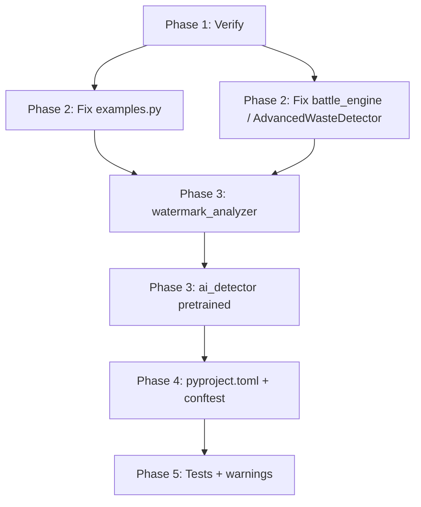

# Search and Solve Codebase Problems

## Problem Summary


| Category    | Issue                                                                                                   | Severity |
| ----------- | ------------------------------------------------------------------------------------------------------- | -------- |
| Imports     | `examples.py` uses wrong module paths                                                                   | High     |
| Imports     | `battle_engine.py` imports `AdvancedWasteDetector` from wrong location; falls back to stub              | High     |
| Missing     | `watermark_analyzer.py` referenced in docs but absent                                                   | Medium   |
| Deprecation | `ai_detector.py` uses `pretrained=True` (deprecated in torchvision 0.13+)                               | Medium   |
| Config      | No `pyproject.toml`, `conftest.py`, or tool configs                                                     | Low      |
| Tests       | Limited coverage; no fixtures                                                                           | Low      |
| Warnings    | Numpy overflow in detection (noted in [docs/CLEANING_METHODOLOGIES.md](docs/CLEANING_METHODOLOGIES.md)) | Low      |


---

## Phase 1: Verify Current State

**Run diagnostics before any fixes:**

1. **Run tests** – `pytest tests/ -v` to establish baseline pass/fail
2. **Run examples** – `python src/examples.py` (or `python -m src.examples` from project root) to confirm import failures
3. **Check linter** – Run `mypy src/` and `black --check src/` if available

---

## Phase 2: Fix Broken Imports

### 2.1 Fix [src/examples.py](src/examples.py)

Current (broken):

```python
sys.path.insert(0, 'src')
from png_analyzer import PNGForensicsAnalyzer
from chunk_analyzer import PNGChunkAnalyzer, analyze_png_chunks
from unicode_scanner import scan_unicode_in_text
from steganography import analyze_steganography
```

Actual module locations (from grep):

- `PNGForensicsAnalyzer` → `core.png_analyzer`
- `PNGChunkAnalyzer`, `analyze_png_chunks` → `detection.chunk_analyzer`
- `scan_unicode_in_text` → `detection.unicode_scanner`
- `analyze_steganography` → `detection.steganography`

**Fix:** Use package-relative imports and run as module:

- `sys.path.insert(0, str(project_root))` so `src` is a package
- Replace with: `from src.core.png_analyzer import PNGForensicsAnalyzer`, etc.
- Or run as `python -m src.examples` from project root with `sys.path` including project root

### 2.2 Fix [src/visualization/battle_engine.py](src/visualization/battle_engine.py)

Current: `from detection.advanced_waste_detector import AdvancedWasteDetector` → fails; stub used.

`AdvancedWasteDetector` lives in [src/advanced_waste_detector.py](src/advanced_waste_detector.py), not `src/detection/`.

**Option A (recommended):** Move `advanced_waste_detector.py` into `src/detection/` to align with architecture. Update scripts that import it:

- [scripts/full_detection_test.py](scripts/full_detection_test.py), [scripts/detect_and_clean_cursor_drive.py](scripts/detect_and_clean_cursor_drive.py), etc. use `from advanced_waste_detector import analyze_advanced_waste` with `sys.path.insert(0, project_root / "src")`. After move: `from detection.advanced_waste_detector import ...` or adjust path.

**Option B:** Change battle_engine import to `from advanced_waste_detector import AdvancedWasteDetector` (requires `src/` in path; battle_engine already adds parent of `visualization` = `src/`, so this would work).

---

## Phase 3: Resolve Missing / Deprecated Code

### 3.1 watermark_analyzer

Referenced in [README.md](README.md) and [docs/technical-docs/detailed-plan.md](docs/technical-docs/detailed-plan.md). Two choices:

- **Create stub** – Minimal `watermark_analyzer.py` in `src/core/` that delegates to existing analyzers (e.g. `png_analyzer`, `ai_enhanced_analyzer`)
- **Remove references** – Update docs to remove mentions

Recommendation: Create a thin facade that wraps existing analyzers to avoid breaking doc expectations.

### 3.2 ai_detector pretrained deprecation

In [src/models/ai_detector.py](src/models/ai_detector.py) lines 43, 47:

```python
self.backbone = resnet50(pretrained=True)
self.backbone = efficientnet_b0(pretrained=True)
```

Torchvision 0.13+ uses `weights=`:

```python
from torchvision.models import ResNet50_Weights, EfficientNet_B0_Weights
self.backbone = resnet50(weights=ResNet50_Weights.IMAGENET1K_V1)
self.backbone = efficientnet_b0(weights=EfficientNet_B0_Weights.IMAGENET1K_V1)
```

Add version check or `try/except` for older torchvision if backward compatibility is needed.

---

## Phase 4: Add Tool Configuration

1. **pyproject.toml** – Centralize pytest, black, mypy:
  - `[tool.pytest.ini_options]` – `testpaths = ["tests"]`
  - `[tool.black]` – `line-length = 88`, `target-version = ['py38']`
  - `[tool.mypy]` – `python_version = "3.8"`, `ignore_missing_imports = true` (for optional deps)
2. **conftest.py** – In `tests/`:
  - Add project root to `sys.path`
  - Optional: shared fixtures for sample images, temp dirs

---

## Phase 5: Test Expansion and Warnings (Lower Priority)

- Add unit tests for `chunk_analyzer`, `steganography`, `unicode_scanner` (currently only `simple_text_remover` has unit tests)
- Add `tests/fixtures/` with small sample PNGs for integration tests
- Investigate numpy overflow warnings in detection modules; add `np.errstate` or fix operations if needed

---

## Execution Order




---

## Verification Checklist

After each phase:

- `pytest tests/ -v` passes
- `python -m src.examples` runs (or chosen example entry point)
- `python scripts/full_detection_test.py` (or similar) runs
- No new mypy/black errors on touched files
