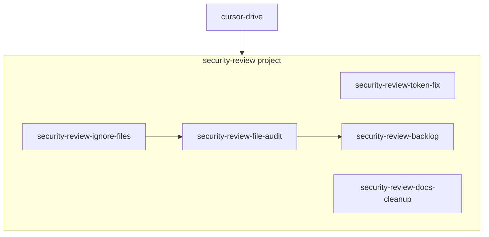

# Security Review Plan Structure

## Approach

Create **one project plan** (`security-review`) that orchestrates **five child plans**. Each child has clear scope, TODOs, and dependencies. The project integrates into the existing plan graph under `cursor-drive`.

## Plan Files to Create

### 1. Project: [.cursor/plans/security-review.plan.md](.cursor/plans/security-review.plan.md)

- `planId`: security-review
- `planType`: project
- `parentPlanId`: cursor-drive
- `childPlanIds`: [security-review-token-fix, security-review-ignore-files, security-review-file-audit, security-review-docs-cleanup, security-review-backlog]
- `dependsOn`: []
- Body: Overview of security review scope, phases, and completion criteria

### 2. Task: [.cursor/plans/security-review-token-fix.plan.md](.cursor/plans/security-review-token-fix.plan.md)

- Fix HIGH-severity token logging in [scripts/create-cloudflare-token.mjs](scripts/create-cloudflare-token.mjs) (lines 143-144)
- Replace `console.log(secret)` with instructions to copy from secure prompt or clipboard; never log the token
- `dependsOn`: []
- Todos: fix token logging, verify no other secret logging in scripts

### 3. Task: [.cursor/plans/security-review-ignore-files.plan.md](.cursor/plans/security-review-ignore-files.plan.md)

- Add [.cursorignore](.cursorignore) at repo root
- Add [.cursorindexingignore](.cursorindexingignore) if indexing-specific exclusions needed
- Content: `.env`, `.env.*`, `*.auth-state.json`, `.cursor/debug-*.log`, `.cursor/plans/.orchestrator-state.json`
- `dependsOn`: []
- Todos: create .cursorignore, optionally .cursorindexingignore, verify .gitignore coverage

### 4. Task: [.cursor/plans/security-review-file-audit.plan.md](.cursor/plans/security-review-file-audit.plan.md)

- File-by-file review of `src/`, `scripts/`, `.cursor/hooks/` for logs that could expose secrets or PII
- Verify approvalGates and mcpServer logging are safe
- `dependsOn`: [security-review-ignore-files]
- Todos: audit src/, audit scripts/, audit hooks/, document findings

### 5. Task: [.cursor/plans/security-review-docs-cleanup.plan.md](.cursor/plans/security-review-docs-cleanup.plan.md)

- Replace user-specific paths in docs (e.g. `C:\Users\harri\` in [docs/reference/mcp-user-setup.md](docs/reference/mcp-user-setup.md)) with `%USERPROFILE%` or `$HOME`
- Add deployment disclaimer to infra docs ([docs/guides/cloudflare-workers-mcp-cicd.md](docs/guides/cloudflare-workers-mcp-cicd.md))
- Remove or generalize deployment-specific comments in code
- `dependsOn`: []
- Todos: fix mcp-user-setup paths, add infra disclaimer, review code comments

### 6. Task: [.cursor/plans/security-review-backlog.plan.md](.cursor/plans/security-review-backlog.plan.md)

- Create `docs/SECURITY-BACKLOG.md` (or `.cursor/plans/security-review/backlog.md`) with prioritized vulnerability list
- Populate from audit findings and pre-identified issues (token fix, ignore files, etc.)
- `dependsOn`: [security-review-file-audit]
- Todos: create backlog doc, populate from findings, add CONTRIBUTING security section reference

## Integration Steps

1. Add `security-review` to [.cursor/plans/cursor-drive.plan.md](.cursor/plans/cursor-drive.plan.md) `childPlanIds`
2. Run `python .cursor/hooks/plan-runner.py sync-registry` (or `/plan-sync`) to register all plans
3. Verify `plan-graph.yaml` and `plan-master.diagram.md` include the new plans

## Execution Order (by dependency)

| Wave | Plans                                                                                 |
| ---- | ------------------------------------------------------------------------------------- |
| 1    | security-review-token-fix, security-review-ignore-files, security-review-docs-cleanup |
| 2    | security-review-file-audit (after ignore-files)                                       |
| 3    | security-review-backlog (after file-audit)                                            |

## Deliverables

- 6 plan files in `.cursor/plans/`
- `docs/SECURITY-BACKLOG.md` (created by backlog plan)
- `.cursorignore` (created by ignore-files plan)
- Fixed [scripts/create-cloudflare-token.mjs](scripts/create-cloudflare-token.mjs)
- Updated docs with generic paths and disclaimers
