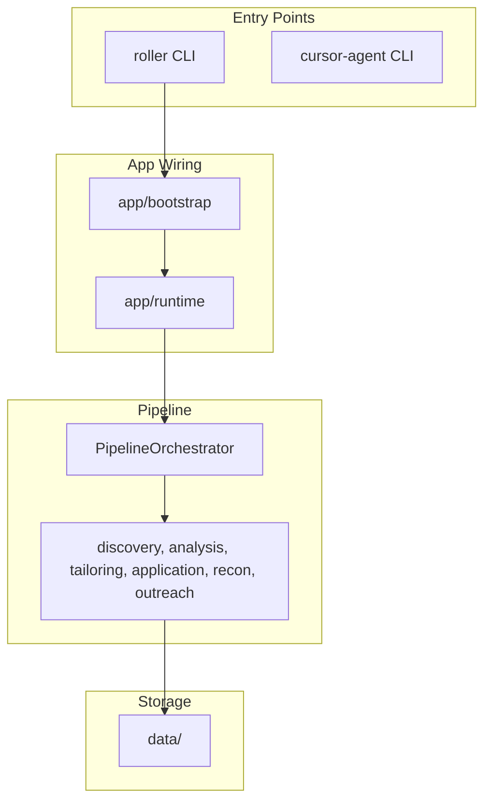

# src/ Directory Analysis and Refactoring Plan

## Part 1: How the Application Works

### Entry Points

- `**roller**` CLI (`[roller.cli:main](src/roller/cli/main.py)`) - Typer app with subcommands
- `**cursor-agent**` CLI (`[roller.cli.cursor_agent:main](src/roller/cli/cursor_agent.py)`) - Wrapper for Cursor CLI operations

### Runtime Flow

### Module Responsibilities

| Module             | Purpose                                                                                                                    |
| ------------------ | -------------------------------------------------------------------------------------------------------------------------- |
| **app/**           | Bootstrap, paths, runtime - wires config, storage, AI, browser, pipeline hooks                                             |
| **cli/**           | Typer commands; delegates to tools, pipeline, discovery, tailoring, etc.                                                   |
| **pipeline/**      | Orchestrator, stages, state, lifecycle/approval hooks; includes `refactor/` (repo refactor workflow) and `agents/` (swarm) |
| **discovery/**     | Job sources (demo, greenhouse, lever), scrapers, parsers; produces `JobPosting`                                            |
| **tailoring/**     | Analyzer, generator, assembler, formatter; produces tailored resumes/cover letters                                         |
| **application/**   | Form mapping, apply automation; uses browser                                                                               |
| **recon/**         | Recruiter/contact discovery                                                                                                |
| **outreach/**      | Templates and messaging                                                                                                    |
| **core/**          | Re-exports from shared (config, exceptions, ai, browser, storage, env) - stable API                                        |
| **shared/**        | Concrete implementations (config, ai, browser, storage, models, prompts, observability, trace)                             |
| **models/**        | Re-exports from shared.models                                                                                              |
| **orchestration/** | Manifest registry, validation for orchestration configs (config/metadata, not execution)                                   |
| **hooks/**         | Cursor hook handlers (validation, logging, trace recording)                                                                |
| **cursor_sdk/**    | Cursor CLI client                                                                                                          |
| **tools/**         | CLI-invokable utilities (populate_role_packet, seed_job, import_resume, etc.)                                              |

### Data Flow (High Level)

1. CLI loads config from `data/configs/`, workspace resolved via `app.paths`
2. `build_runtime()` in `app.bootstrap` wires storage, AI, browser, pipeline hooks
3. `PipelineOrchestrator.run()` executes stages in order; each stage reads/writes `data/roles/`, `data/resumes/`, etc.
4. Optional AI and browser plug in via `roller.core` interfaces

### Import Layering

- **Canonical imports**: `roller.core`, `roller.models` (callers should use these)
- **Implementation details**: `roller.shared.`* (used by core/models re-exports and some internal modules)
- Migration is ongoing: core/models are thin re-export layers; implementations live in shared

---

## Part 2: Consolidation Opportunities and Refactoring Plan

### 1. Complete core/shared Migration (High Impact)

**Current state**: `core` and `models` are re-export facades. Implementations live in `shared`. Callers import from both.

**Options**:

- **A) Finish migration**: Move implementations from `shared` into `core` (and `models`). Delete `shared` and collapse into a single `core` + `models` layout.
- **B) Collapse core into shared**: Remove `core`; make `shared` the canonical location. Update all imports to `roller.shared.`*.

**Recommendation**: Option A — aligns with architecture docs (core = stable interfaces). Move `shared/config.py`, `shared/env.py`, `shared/exceptions.py` into `core/`; move `shared/models/`* into `models/`; move `shared/ai`, `shared/browser`, `shared/storage` into `core/`. Keep `shared` only for truly cross-cutting utilities (naming, observability, prompts, skills, tool_policy, trace) and rename to something like `roller.infra` or keep as `shared` with a narrowed scope.

### 2. Agent Trace Naming (Low Impact)

**Current state**: Two modules with "agent_trace" in the name:

- `hooks/agent_trace.py` — session/trace recording for Cursor hook logging (JSON files, hashing)
- `shared/trace/agent_trace.py` — Trace schema (TraceRecord, TraceRange, TraceContext) used by pipeline and tailoring

**Recommendation**: Rename `hooks/agent_trace.py` to `hooks/trace_recorder.py` (or `session_trace.py`) to distinguish from the schema in `shared.trace`. Avoids confusion when both are in context.

### 3. pipeline/refactor Placement (Medium Impact)

**Current state**: `pipeline/refactor/` contains repo-refactor orchestration (inventory, planner, executor). Conceptually separate from the product pipeline (discover → tailor → apply).

**Recommendation**: Extract to `roller.refactor` as a top-level package. It is dev-automation tooling, not product workflow. Aligns with separation in [REFACTOR_DIRECTORY_MAP](docs/archive/REFACTOR_DIRECTORY_MAP.md).

### 4. orchestration vs pipeline Naming (Low Impact)

**Current state**: `orchestration` = config manifests and registry; `pipeline` = execution. Name overlap can confuse.

**Recommendation**: Rename `orchestration` to `orchestration_registry` or `manifest_registry` to clarify it deals with config/metadata, not execution. Or document the distinction clearly in module READMEs.

### 5. tools/ Organization (Medium Impact)

**Current state**: Six flat scripts (agent_directory_structure, import_resume, populate_role_packet, seed_job, trim_resume, validate_role_packet, validate_section_budgets).

**Recommendation**: Group by domain per [REFACTOR_DIRECTORY_MAP](docs/archive/REFACTOR_DIRECTORY_MAP.md):

- `tools/role_packets/` — populate_role_packet, validate_role_packet, validate_section_budgets
- `tools/resume/` — import_resume, trim_resume
- `tools/discovery/` — seed_job
- `tools/repo/` — agent_directory_structure

Or keep flat if tool count stays small; add subpackages only when each group grows.

### 6. CursorAgent Placement (Low Impact)

**Current state**: `cli/cursor_agent.py` defines `CursorAgent` wrapping `CursorCliClient` from `cursor_sdk`. Entry point is `cursor-agent` script.

**Recommendation**: Move `CursorAgent` into `cursor_sdk/` (e.g. `cursor_sdk/agent.py`). CLI stays as thin adapter that imports and invokes. Keeps SDK cohesive.

### 7. shared Scope After Migration (Depends on #1)

**Post-migration shared**: If Option A for #1, `shared` (or `infra`) would contain:

- naming, skills, tool_policy
- observability (events, writer)
- prompts (registry, templates)
- trace (schema + helpers)

These are cross-cutting utilities with no single domain owner. Keeping them in `shared` or renaming to `infra` is reasonable.

### 8. Module-Specific Models (Low Impact)

**Current state**: `tailoring/models.py`, `discovery/models.py` — domain-specific DTOs.

**Recommendation**: Keep as-is. They are scoped to their modules and do not belong in `roller.models`. No consolidation needed.

---

## Refactoring Execution Order

1. **Phase 1 — Naming and placement**: Agent trace rename (#2), CursorAgent move (#6), orchestration rename (#4). Low risk.
2. **Phase 2 — Extract pipeline.refactor**: Move to `roller.refactor` (#3). Update imports and CLI references.
3. **Phase 3 — tools subpackages** (optional): Add `tools/role_packets/` etc. if tool count justifies it (#5).
4. **Phase 4 — core/shared migration**: Complete the migration (#1). Highest impact; requires careful import updates and test runs.

---

## Files to Update (Phase 1–2)

- Import updates across `src/roller/` and `tests/`
- `pyproject.toml` scripts if entry points change
- `.cursor/hooks.json` if hook handlers reference moved modules
- Module READMEs and `docs/guides/architecture-overview.md`

---

## Out of Scope (Defer)

- `tailoring/models.py`, `discovery/models.py` — intentionally module-local
- Pipeline stage ordering or contracts — stable per ADR-0008
- Test layout (mirroring src) — separate refactor

## Reconciliation

Archived: Duplicate of src_directory_analysis_and_refactor_c1c3cd0d.plan.md (canonical).